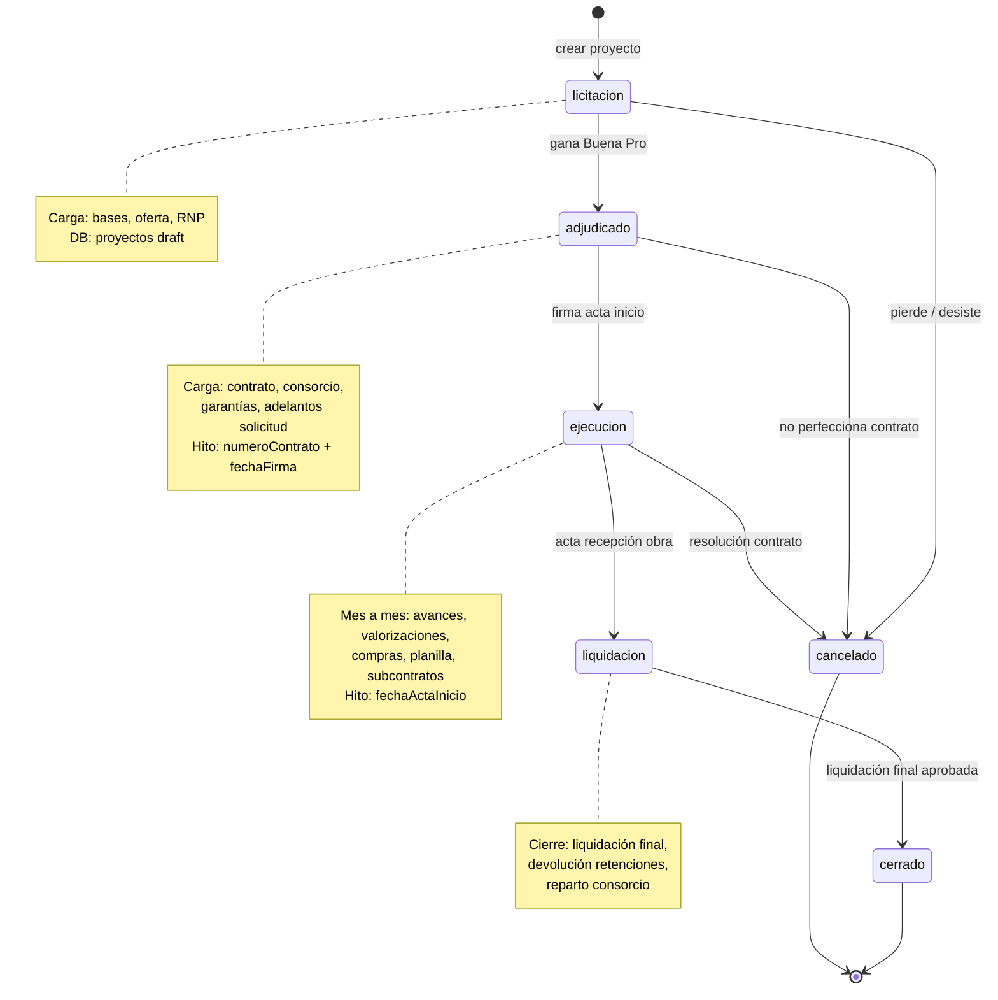

# 01 · Ciclo de vida proyecto

Estados `proyectos.status` + eventos que disparan transición.

## State machine



## Documentos por estado

| Estado | Docs entrada | Docs salida |
|---|---|---|
| **licitacion** | Bases, RNP, oferta económica | — |
| **adjudicado** | Acta Buena Pro, contrato firmado, contrato consorcio, cartas fianza | Acta inicio (próximo estado) |
| **ejecucion** | Valorizaciones mensuales, OCs, facturas, planilla, cuaderno obra | Acta recepción |
| **liquidacion** | Acta recepción, conciliaciones | Acta liquidación final |
| **cerrado** | — | — |

## Reglas transición

```
licitacion → adjudicado:
  REQUIERE: numeroContrato, fechaFirmaContrato, montoContractual
  AUDIT: log evento "buena_pro"

adjudicado → ejecucion:
  REQUIERE: fechaActaInicio, garantías vigentes (FC o retención)
  AUDIT: log evento "acta_inicio"

ejecucion → liquidacion:
  REQUIERE: avance físico = 100% O acta recepción
  BLOQUEA: nuevas valorizaciones
  AUDIT: log evento "recepcion_obra"

liquidacion → cerrado:
  REQUIERE: liquidación aprobada por entidad
  TRIGGER: devolución retenciones, reparto utility consorcio
```
