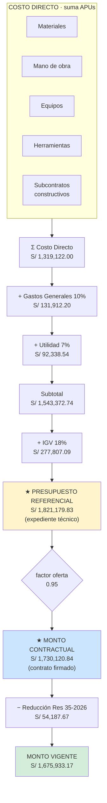
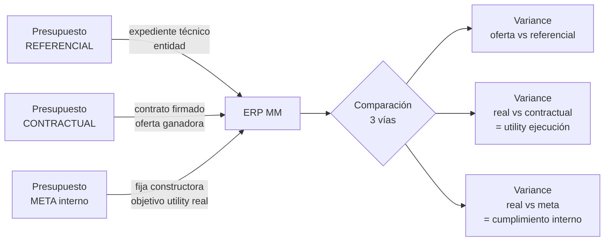

# 02 · Estructura económica obra

Cómo se forma el monto contractual desde el costo directo.

## Composición monto



## Tres montos a manejar simultáneo



## Schema impacto

```sql
proyectos
  costo_directo               -- CD referencial
  pct_gg, pct_utilidad        -- factores referenciales
  monto_referencial           -- 1,821,179.83
  monto_contractual           -- 1,730,120.84  ← cobranza
  factor_oferta               -- 0.95
  monto_vigente               -- 1,675,933.17 (post modifs)
  presupuesto_meta            -- objetivo interno

partidas
  precio_unitario_referencial -- del expediente
  precio_unitario_contractual -- × factor 0.95
  costo_meta_unitario         -- objetivo interno
  presupuesto                 -- referencial × cantidad
  presupuesto_contractual     -- contractual × cantidad
```

## Regla cálculos

```
SIEMPRE referencial × factor_oferta = contractual

Cobranza valorización  → usa contractual
Análisis variance      → usa referencial
Control interno        → usa meta
```
