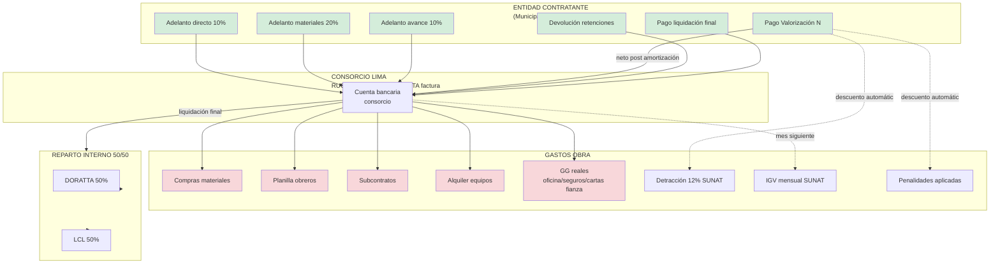
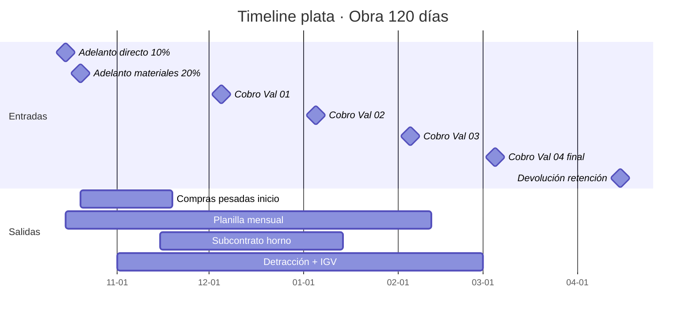
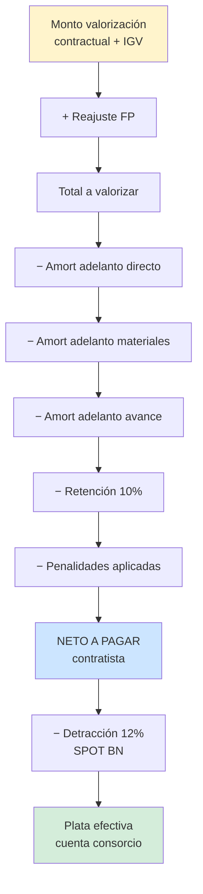

# 03 · Flujo dinero global

Vista 360° de cómo entra y sale plata durante la obra.

## Flujo entradas / salidas



## Timeline movimientos típicos



## Cálculo neto valorización



## Costo financiero oculto

ERP debe trackear lo que NO se ve en presupuesto:

```
Carta fianza FC retención    0% (sustituida por retención)
Carta fianza adelanto dir.   3-5% anual × 173,012 × duración
Carta fianza adelanto mat.   3-5% anual × 346,024 × duración
Capital inmovilizado retenc. costo oportunidad × 173,012 × 60 días
Detracción SPOT              12% inmovilizado en BN hasta libre disposición
```

Sin trackear → utility ERP infla el verdadero margen.
