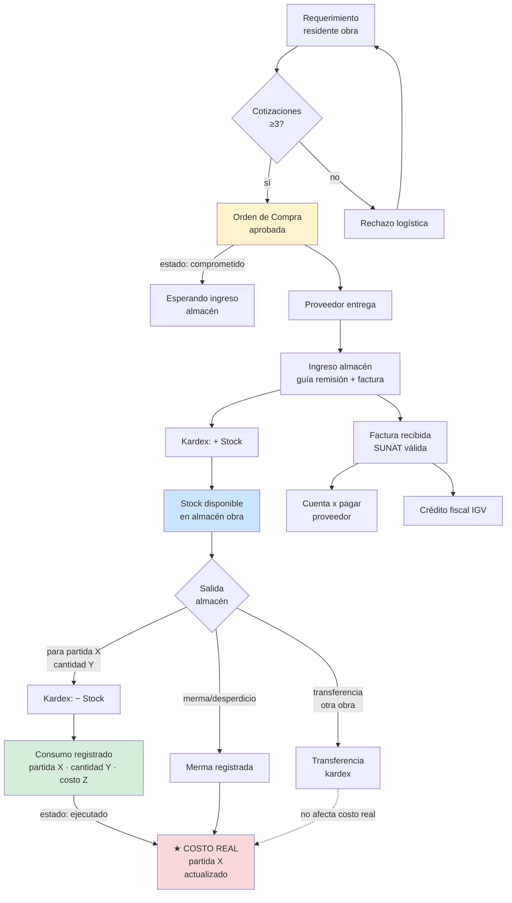
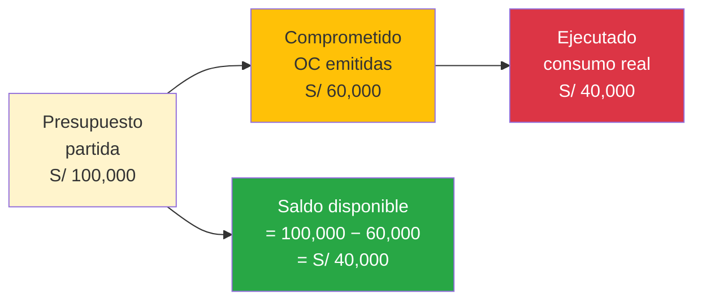
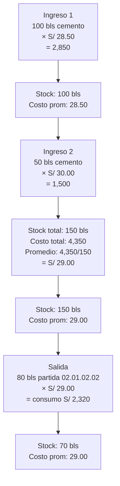

# 04 · Compra → Almacén → Consumo → Costo real

Cómo se llega del requerimiento al costo real partida.

## Flujo completo



## 4 niveles control financiero



| Nivel | Significado | Cuándo cambia |
|---|---|---|
| Presupuesto | Plata asignada partida | Carga inicial · adicional aprobado |
| Comprometido | OC emitida (aún no llegó) | Aprobación OC |
| Ejecutado | Consumo real almacén → partida | Salida almacén con destino partida |
| Saldo | Presupuesto − comprometido | Recalc en cada OC |

**Regla**: solo `ejecutado` cuenta para utility real. `comprometido` cuenta para alertas (¿voy a sobregirar?).

## Valuación kardex · promedio ponderado



Cada salida usa el **costo promedio ponderado** del stock al momento.

## Diferencia OC vs factura

| Doc | Significado | Estado contable |
|---|---|---|
| OC | Compromiso compra | Comprometido (no contabiliza aún) |
| Guía remisión | Confirma entrega física | Ingreso almacén · stock + |
| Factura | Documento tributario | CxP + crédito fiscal IGV |
| Pago | Salida efectivo | CxP − · Caja − |

ERP debe permitir:
- OC sin factura (esperando entrega)
- Factura sin OC (compras menores · caja chica)
- Factura con detracción / retención IGV calculada auto

## Schema relevante

```sql
ordenes_compra (
  id, proyecto_id, numero, proveedor_ruc, proveedor_razon,
  fecha_emision, fecha_entrega_esperada, status, monto_total
)

oc_lineas (
  id, oc_id, recurso_id, partida_id,    -- vinculo partida
  cantidad, precio_unitario, parcial,
  cantidad_recibida                      -- delta = pendiente
)

facturas_recibidas (
  id, oc_id, serie, numero, fecha_emision,
  subtotal, igv, total,
  detraccion_pct, detraccion_monto,      -- 12% construcción
  retencion_igv_monto                    -- 3% si aplica
)

almacen_movimientos (
  id, proyecto_id, fecha,
  tipo,  -- ingreso | salida | merma | transferencia | ajuste
  recurso_id, cantidad, costo_unitario_promedio,
  partida_id,        -- solo si salida con destino partida
  oc_id,             -- solo si ingreso desde OC
  factura_id,        -- solo si ingreso con factura
  destino_obra_id,   -- solo si transferencia
  responsable_user_id
)

consumos_obra (
  id, partida_id, fecha,
  recurso_id, cantidad, costo_unitario, parcial,
  movimiento_id REFERENCES almacen_movimientos,
  residente_user_id
)
```

## Reportes que esto habilita

1. **Stock actual por almacén/obra** · `select * from kardex group by recurso`
2. **Costo real por partida** · `sum(consumos_obra.parcial) where partida = X`
3. **OC vs factura pendiente** · OCs sin factura completa
4. **Merma por partida** · % desperdicio real vs APU
5. **Variance precio** · costo real promedio vs APU referencial
