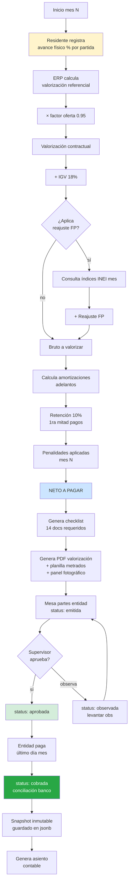
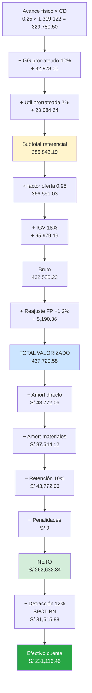
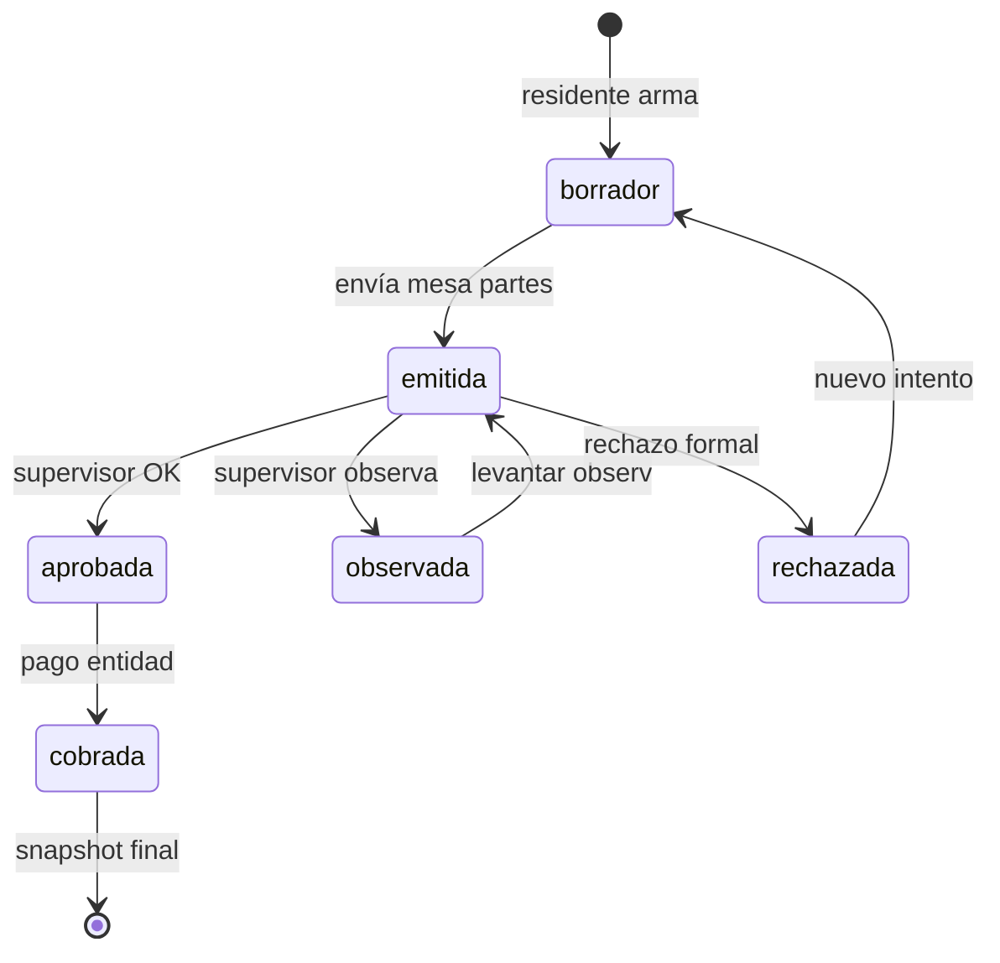

# 05 · Valorización mensual

Mecanismo cobranza obra pública. Mensual. Source of truth `valorizaciones`.

## Flujo completo



## Cálculo paso a paso · ejemplo VALO 01 (25% avance)



## Estados valorización



## Checklist 14 documentos (cláusula 5 contrato)

| # | Doc | Tabla `valorizacion_checklist.item` |
|---|---|---|
| 1 | Descripción trabajos ejecutados | `descripcion_trabajos` |
| 2 | Ocurrencias + protocolos calidad | `protocolos_calidad` |
| 3 | Estado situacional | `estado_situacional` |
| 4 | Avance físico/financiero | `avance_fisico_financiero` |
| 5 | Ampliaciones/adicionales | `modificaciones` |
| 6 | Amortización adelantos | `amortizaciones` |
| 7 | Reajustes FP | `reajustes` |
| 8 | Curva S programado vs ejecutado | `curva_s` |
| 9 | Cuadro programado vs ejecutado | `cuadro_comparativo` |
| 10 | Panel fotográfico ≥10 fotos | `panel_fotografico` |
| 11 | Planilla metrados | `planilla_metrados` |
| 12 | Cuaderno incidencias digital | `cuaderno_obra` |
| 13 | Voucher CONAFOVISER mes anterior | `conafoviser` |
| 14 | Voucher SENCICO mes anterior | `sencico` |
| 15 | Constancia SCTR + póliza CAR | `sctr_car` |

Si checklist incompleto → no se emite valorización.

## Schema impacto

```sql
valorizaciones (
  ... existentes
  monto_referencial decimal(14,2),
  factor_oferta decimal(7,6),
  monto_contractual_pre_igv decimal(14,2),
  monto_igv decimal(14,2),
  monto_reajuste decimal(14,2),
  amortizacion_directo decimal(14,2),
  amortizacion_materiales decimal(14,2),
  amortizacion_avance decimal(14,2),
  retencion decimal(14,2),
  penalidades_aplicadas decimal(14,2),
  monto_neto decimal(14,2),
  detraccion decimal(14,2),
  efectivo_caja decimal(14,2),
  fecha_envio_mesa_partes date,
  fecha_aprobacion date,
  fecha_pago date,
  fecha_cobranza_real date,
  observaciones_supervisor text
)

valorizacion_partidas (   -- snapshot avance × partida × valorización
  valorizacion_id, partida_id,
  avance_acumulado_pct,    -- 25.00
  avance_periodo_pct,      -- 25 - 0 = 25 si es V01
  metrado_acumulado decimal(14,4),
  monto_referencial decimal(14,2),
  monto_contractual decimal(14,2)
)
```

## Reglas críticas

1. **Inmutable post cobro**: `cobrada` → snapshot guardado, no editable
2. **Numeración secuencial**: Val 01, 02, 03... sin huecos
3. **Avance acumulado siempre crece**: V03 ≥ V02 ≥ V01
4. **Σ valorizaciones = monto contractual** al final (más reajustes y modifs)
5. **Retención solo primera mitad**: si proyecto = 4 valoriz, retiene en V01 y V02
