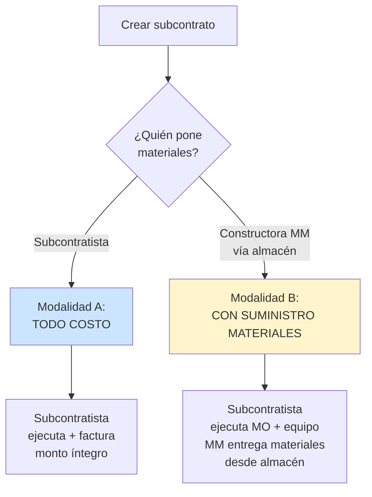
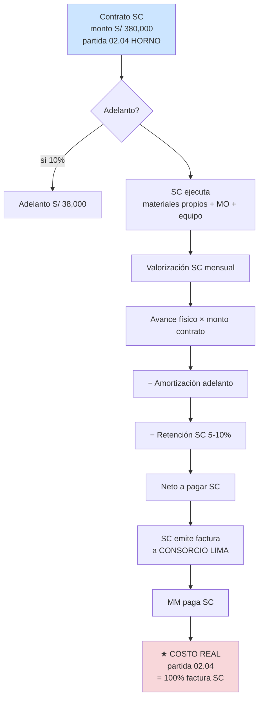
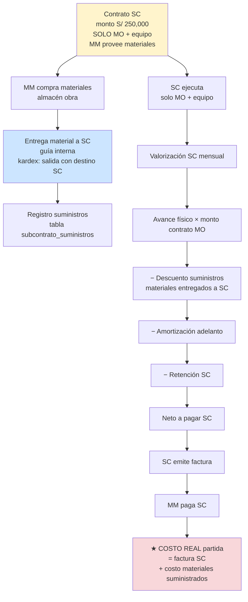

# 06 · Subcontratos · 2 modalidades

Manejo subcontratistas (terceros que ejecutan partidas).

## Decisión modalidad al firmar contrato



## Modalidad A · Todo costo



## Modalidad B · Con suministro materiales



## Comparativa rápida

| Aspecto | Modalidad A · Todo costo | Modalidad B · Con suministro |
|---|---|---|
| **Materiales** | SC compra | MM compra · entrega a SC |
| **Kardex SC** | No aplica | Salidas almacén → SC |
| **Factura SC** | 100% del contrato | Solo MO + equipo |
| **Descuentos valorización SC** | Adelanto + retención | Adelanto + retención + suministros |
| **Costo real partida** | = factura SC | = factura SC + materiales suministrados |
| **Riesgo MM** | Bajo (precio cerrado) | Alto (control compras) |
| **Margen MM** | Mayor (compra al por mayor) | Menor (compra spot) |
| **Ejemplo PG0005** | SC HORNO CREMACION | Subcontrato albañilería |

## Schema

```sql
subcontratos (
  id, proyecto_id, partida_id,           -- alcance contractual
  numero_contrato, proveedor_ruc, proveedor_razon,
  modalidad ENUM ('todo_costo','con_suministro_materiales'),
  monto_contratado decimal(14,2),
  fecha_inicio, fecha_fin,
  pct_adelanto decimal(5,4),
  pct_retencion decimal(5,4),
  status,                                 -- borrador|firmado|ejecucion|liquidado
  archivo_contrato_nas text                -- PDF NAS
)

subcontrato_valorizaciones (
  id, subcontrato_id, numero,
  fecha_desde, fecha_hasta,
  avance_pct decimal(5,2),
  monto_bruto decimal(14,2),
  amortizacion_adelanto decimal(14,2),
  retencion decimal(14,2),
  descuento_suministros decimal(14,2),     -- modalidad B
  monto_neto decimal(14,2),
  status                                    -- borrador|aprobada|pagada
)

subcontrato_suministros (                   -- modalidad B
  id, subcontrato_id, valorizacion_id,
  movimiento_almacen_id,                    -- vincula kardex
  recurso_id, cantidad, costo_unitario, parcial,
  fecha_entrega
)

subcontrato_pagos (
  id, subcontrato_valorizacion_id,
  fecha_pago, monto, banco, referencia,
  factura_serie, factura_numero
)
```

## Cálculo costo real con SC

```sql
-- Modalidad A: solo factura SC
SELECT SUM(scp.monto)
FROM subcontrato_pagos scp
JOIN subcontrato_valorizaciones sv ON sv.id = scp.valorizacion_id
JOIN subcontratos s ON s.id = sv.subcontrato_id
WHERE s.partida_id = X AND s.modalidad = 'todo_costo'

-- Modalidad B: factura SC + suministros
SELECT SUM(scp.monto) + SUM(ss.parcial)
FROM subcontratos s
LEFT JOIN subcontrato_pagos scp ON scp.valorizacion_id = sv.id
LEFT JOIN subcontrato_suministros ss ON ss.subcontrato_id = s.id
WHERE s.partida_id = X AND s.modalidad = 'con_suministro_materiales'
```

## Clasificación contable

| Tipo SC | Cuenta | Tratamiento |
|---|---|---|
| SC constructivo (mano obra obra) | 622 Subcontratos | Costo directo |
| SC suministro horno (equipamiento) | 622 / 25 mat | Costo directo · activo? |
| Servicio admin tercerizado | 632 Servicios | Gasto general |
| Asesoría legal/contable | 632 Servicios | Gasto general |
