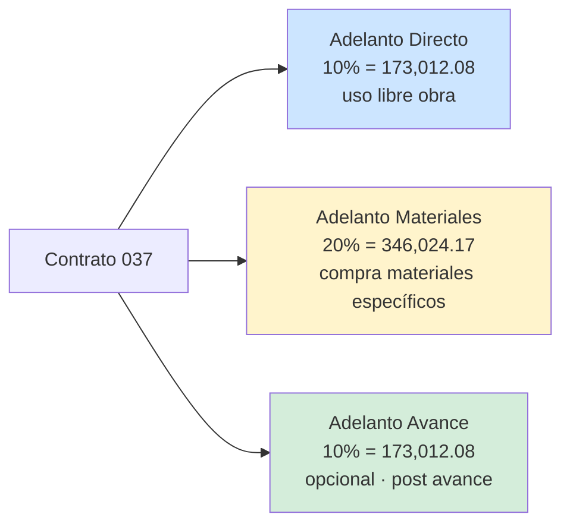
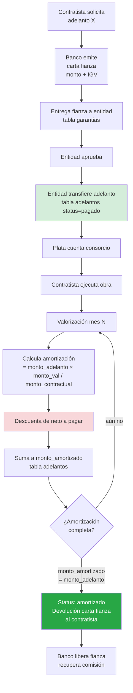
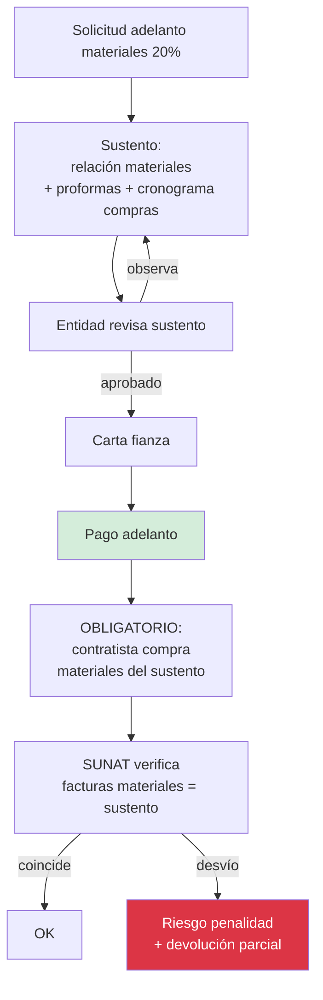
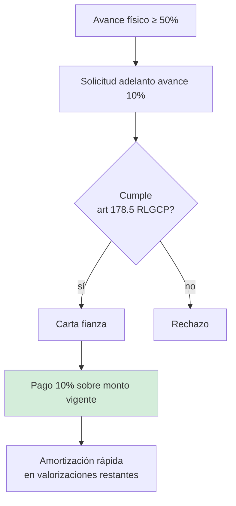

# 07 · Adelantos + amortización

Plata que entidad da al contratista ANTES de ejecutar. Se devuelve descontando cada valorización.

## Tipos en este contrato



## Flujo solicitud → cobro → amortización



## Fórmula amortización

```
Para cada adelanto y cada valorización:

amortización = (monto_adelanto / monto_contractual) × monto_valorizacion

donde:
  monto_valorizacion = bruto pre-descuentos (incluye IGV + reajuste)
```

## Ejemplo numérico PG0005

Adelanto directo 10% = S/ 173,012.08 sobre contrato S/ 1,730,120.84.

**Tasa amortización fija** = 173,012.08 / 1,730,120.84 = **10%**

| Val | Monto val (bruto) | Amort directo (10%) | Amort acumulada |
|---|---|---|---|
| V01 | 437,720.58 | 43,772.06 | 43,772.06 |
| V02 | 510,500.00 | 51,050.00 | 94,822.06 |
| V03 | 480,200.00 | 48,020.00 | 142,842.06 |
| V04 | 301,700.00 | 30,170.00 | **173,012.06** ✓ |

V04 cierra la amortización (saldo casi cero por redondeos).

**Si entidad para de pagar** después de V01 con S/ 43,772.06 amortizado, banco devuelve solo (173,012.08 − 43,772.06) = **129,240.02** vía carta fianza ejecutada.

## Adelanto materiales · regla extra

A diferencia del directo, el de materiales requiere **sustento previo**:



## Adelanto avance 10% · opcional + condicional



Suele NO usarse en obras cortas (< 6 meses). En PG0005 (120 días) probablemente no aplique.

## Garantías relacionadas

Cada adelanto requiere su carta fianza:

| Adelanto | Monto adelanto | Monto fianza | Vigencia |
|---|---|---|---|
| Directo | 173,012.08 | 173,012.08 + IGV | hasta amortización completa |
| Materiales | 346,024.17 | 346,024.17 + IGV | hasta amortización completa |
| Avance (si) | 173,012.08 | 173,012.08 + IGV | hasta amortización completa |

Costo banco: 3-6% anual sobre monto fianza × tiempo. Ej:
```
Carta fianza adelanto materiales:
  346,024.17 × 4% × (4 meses / 12) = S/ 4,613.66 comisión banco
```

★ Esto es **costo financiero real** que NO está en presupuesto pero pega utility.

## Schema impacto

```sql
adelantos (
  ... existente
  carta_fianza_garantia_id REFERENCES garantias,
  fecha_solicitud, fecha_aprobacion, fecha_pago,
  monto_solicitado, monto_aprobado, monto_amortizado,
  saldo_pendiente GENERATED AS (monto_aprobado - monto_amortizado),
  costo_financiero_estimado decimal(14,2)  -- comisión banco
)

amortizaciones_movimientos (              -- vincula valoriz × adelanto
  id, adelanto_id, valorizacion_id,
  monto_amortizado decimal(14,2),
  fecha
)
```

## Reglas críticas

1. **Tasa amortización = constante** = monto_adelanto / monto_contractual
2. **Aplica a bruto valorización** (post IGV, post reajuste FP)
3. **Suma amortizaciones = monto_adelanto** al final (cuadre exacto)
4. **Carta fianza vigente hasta amortización 100%**
5. **Costo banco** se aprovisiona al solicitar, se devenga mensual
