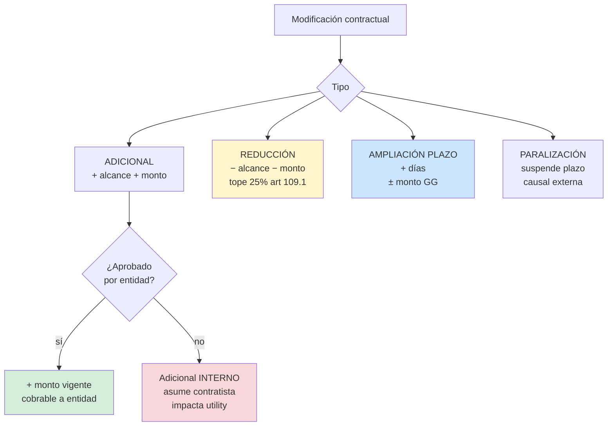
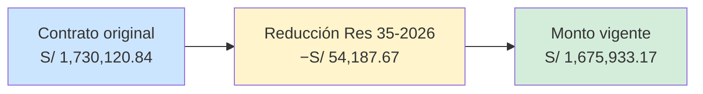
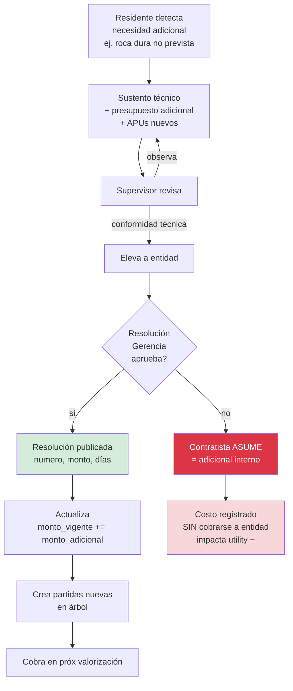
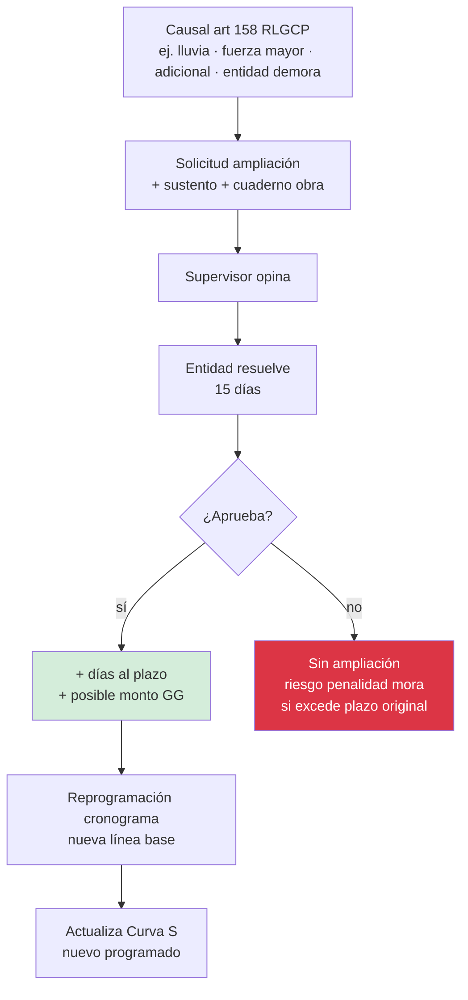
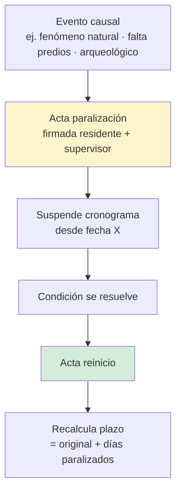

# 08 · Modificaciones contractuales

Cambios al contrato firmado: monto y/o plazo. Ley 32069 art 63 + 109.

## Tipos



## Caso PG0005 · ResoluAción Gerencial 35-2026



Reducción 3.13% del contrato. Dentro del 25% legal. 6 partidas suprimidas:

| Ítem | Descripción | Monto |
|---|---|---|
| 02.02.06.01 | Listones división ambientes | 6,403.11 |
| 03.01.01.07.05 | Escalera de gato | 1,670.76 |
| 03.01.01.11.01.01 | Tanque GLP | 31,071.96 |
| 03.01.01.03.02 | Bloqueta vidrio | 259.28 |
| 03.01.01.10.05 | Celosía divisora | 2,296.35 |
| 03.01.03.03.01.01 | Pintura látex muros 2 manos | 1,216.06 |
| | **CD reducción** | **42,917.52** |
| | + Utilidad 7% | 3,004.23 |
| | Subtotal | 45,921.75 |
| | + IGV 18% | 8,265.92 |
| | **Total reducción** | **54,187.67** |

## Flujo aprobación adicional



## Flujo ampliación de plazo



## Flujo paralización



## Schema

```sql
modificaciones_contractuales (
  id, proyecto_id,
  tipo ENUM ('adicional','reduccion','ampliacion_plazo','paralizacion','adicional_interno'),
  numero,                          -- correlativo MOD-001
  numero_resolucion text,          -- "Res 35-2026-GAF-MSS"
  fecha_solicitud date,
  fecha_resolucion date,
  status ENUM ('solicitada','aprobada','rechazada','aplicada'),
  monto_delta decimal(14,2),       -- + adicional, − reducción, 0 amp.plazo
  dias_delta integer,              -- + amp.plazo, 0 otros
  motivo text,
  sustento_tecnico_nas text,
  resolucion_pdf_nas text,
  causal_legal text,               -- art 63 ley 32069 · art 158 RLGCP · etc
  created_at, created_by
)

modificaciones_partidas (          -- partidas afectadas
  id, modificacion_id, partida_id,
  tipo ('agregar' | 'eliminar' | 'modificar_metrado' | 'modificar_pu'),
  metrado_anterior, metrado_nuevo,
  pu_anterior, pu_nuevo,
  monto_delta
)
```

## Tope legal modificaciones

```
Adicionales acumulados ≤ 50% monto contrato (art 109.2 RLGCP)
Reducciones acumuladas ≤ 25% monto contrato (art 109.1)
Ampliación plazo: sin tope, requiere causal válida
```

## Recálculo monto vigente

```sql
monto_vigente = monto_contractual
              + Σ adicionales_aprobados
              − Σ reducciones_aprobadas
              + Σ ajuste_GG_ampliaciones_plazo
```

ERP recalcula `proyectos.monto_vigente` cada vez que `modificacion.status = aplicada`.

## Impacto en utility

| Tipo | Impacto utility |
|---|---|
| Adicional aprobado | +utility (cobra extra) |
| Adicional interno | −utility (asume contratista) |
| Reducción | neutro a +utility (libera trabajo, libera GG fijos) |
| Amp.plazo sin GG | −utility (más tiempo · más GG fijos) |
| Amp.plazo con GG | neutro |
| Paralización | depende causa (imputable o no) |
