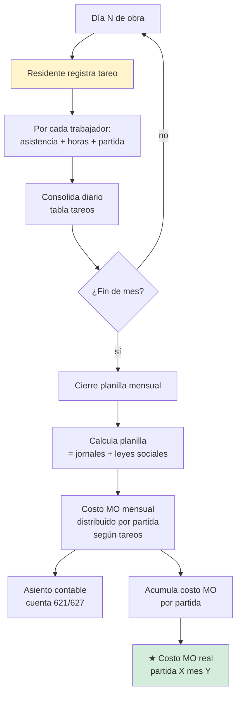
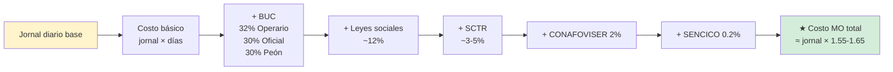
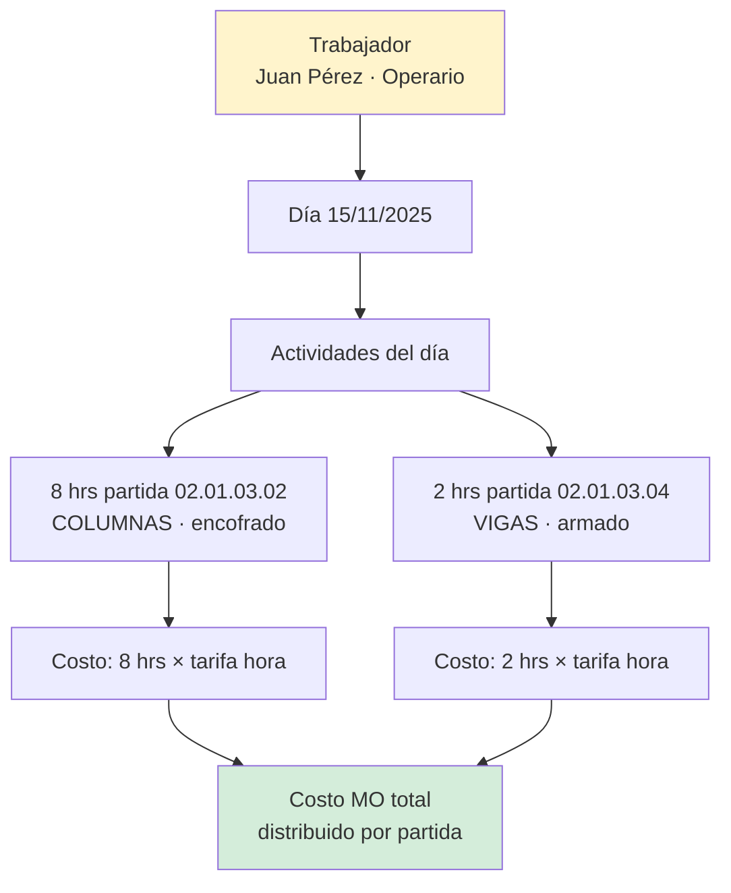

# 09 · Planilla + tareo · MO propia → costo partida

Mano obra propia · CAPECO. Cómo se llega del jornal al costo real de partida.

## Flujo diario → mensual



## Composición costo MO real (CAPECO)



Ejemplo trabajador Operario jornal S/ 88.10:
```
Costo real día = 88.10 × 1.62 ≈ S/ 142.72
```
Eso va al costo real, NO el jornal puro.

## Tareo diario · estructura



Permite:
- Partir el día de un peón entre 2-3 partidas
- Medir productividad: m³ vaciado / hh peón
- Variance vs APU: APU dice 0.8 hh peón / m³, real = 1.2 hh peón / m³ → +50% sobre

## Categorías CAPECO

```
Capataz   = ~1.45 × Operario
Operario  = base
Oficial   = ~0.85 × Operario
Peón      = ~0.75 × Operario
```

Tarifas CAPECO se actualizan cada año (junio). ERP debe importarlas anuales.

## Schema

```sql
planilla_periodos (
  id, proyecto_id, anio, mes,
  fecha_inicio, fecha_fin,
  status ENUM ('abierto','en_proceso','cerrado'),
  fecha_cierre, cerrado_por_user_id
)

tareos (
  id, periodo_id, trabajador_id, fecha,
  partida_id,                          -- a qué partida cargó horas
  horas_normales decimal(4,2),
  horas_extras decimal(4,2),           -- 25% o 35% recargo
  hizo_jornal_completo boolean,        -- pagó jornal completo o proporcional
  observaciones,
  registrado_por_user_id
)

planilla_calculos (                     -- snapshot al cerrar período
  id, periodo_id, trabajador_id,
  dias_trabajados, horas_totales,
  jornal_base, monto_jornales,
  buc_pct, monto_buc,
  leyes_sociales_pct, monto_ls,
  sctr_pct, monto_sctr,
  conafoviser_pct, monto_conafoviser,
  sencico_pct, monto_sencico,
  total_bruto, descuentos, neto_pagar
)

costo_mo_partidas (                     -- vista materializada o tabla
  partida_id, periodo_id,
  horas_totales decimal(8,2),
  costo_mo_total decimal(14,2),         -- prorrateado según tareos
  trabajadores_distintos integer
)
```

## Cálculo costo MO por partida

```sql
-- Para una partida X en mes Y:
SELECT
  t.partida_id,
  SUM(t.horas_normales + t.horas_extras) as total_horas,
  SUM(
    (t.horas_normales + t.horas_extras × 1.25)
    × (pc.total_bruto / pc.horas_totales)
  ) as costo_mo
FROM tareos t
JOIN planilla_calculos pc ON pc.trabajador_id = t.trabajador_id
                          AND pc.periodo_id = t.periodo_id
WHERE t.partida_id = X
  AND pc.periodo_id = Y
GROUP BY t.partida_id
```

## Productividad · ratio clave

```
Productividad partida = metrado_ejecutado / horas_hombre_invertidas

Comparar vs APU:
  APU: 0.8 hh peón / m³ concreto
  Real: 1.2 hh peón / m³
  → Productividad real = 0.83 m³/hh
  → Variance: −33% (se demora más de lo presupuestado)
```

Reporte ERP: variance productividad por partida × período. Detecta partidas que se están demorando más de lo APU.

## Plantel técnico vs obreros · separación

| Tipo | Pago | Cómo se contabiliza |
|---|---|---|
| **Plantel clave** (Residente, Asistente, Esp.) | Contrato fijo mensual | GG · gasto general |
| **Plantel apoyo** (capataces, almacenero) | Contrato fijo | GG · gasto general |
| **Obreros directos** (operario·oficial·peón) | Jornal × días | CD · costo directo · partida |

Tabla `trabajadores` ya separa por `categoria` enum. Falta diferenciar `plantel_clave` boolean.
