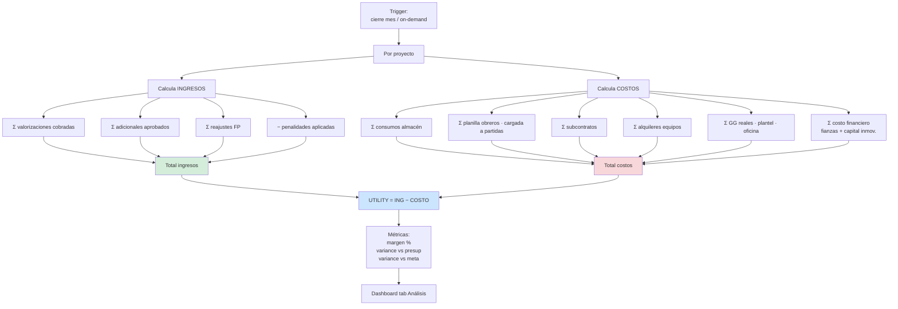
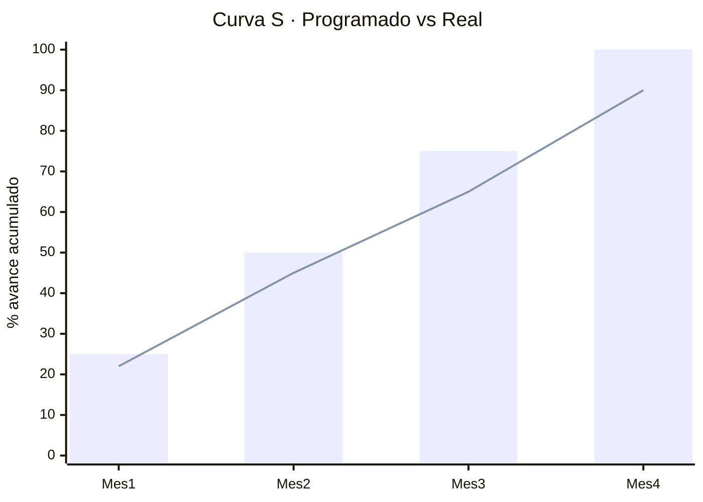

# 10 · Análisis utility real

Cómo el ERP calcula utility real mes a mes y al cierre obra.

## Fórmula maestra

```
UTILITY REAL = INGRESOS − COSTOS REALES

donde:
INGRESOS  = Σ valorizaciones aprobadas
          + Σ adicionales aprobados
          + Σ reajustes FP cobrados
          − Σ penalidades aplicadas

COSTOS    = Σ consumos materiales (kardex)
          + Σ planilla MO obreros
          + Σ subcontratos pagados (factura SC + suministros)
          + Σ alquileres equipos
          + Σ gastos generales reales (oficina · plantel · seguros)
          + Σ costos financieros (cartas fianza · capital inmovilizado)
          + Σ adicionales internos asumidos
```

## Flujo cálculo ERP



## Reporte 1 · Utility a la fecha (snapshot)

```
PROYECTO PG0005 CREMATORIO SURCO · Mes 3 (Diciembre 2025)
═════════════════════════════════════════════════════════════

INGRESOS
  Val 01 cobrada (Nov)              S/   437,720.58
  Val 02 cobrada (Dic)              S/   480,200.00
  Val 03 emitida (Ene · pendiente)  S/   320,000.00  *
  Reducción Res 35-2026             S/   −54,187.67
  ─────────────────────────────────────────────────
  TOTAL INGRESOS                    S/ 1,183,732.91

COSTOS REALES
  Materiales consumidos kardex      S/   420,500.00
  MO obreros (planilla 3 meses)     S/   285,000.00
  SC HORNO (3 valorizaciones)       S/   190,000.00
  Alquiler equipos                  S/    65,000.00
  GG reales (plantel·oficina)       S/   120,000.00
  Costo financiero fianzas          S/    18,500.00
  ─────────────────────────────────────────────────
  TOTAL COSTOS                      S/ 1,099,000.00

═════════════════════════════════════════════════════════════
UTILITY A LA FECHA                  S/    84,732.91
MARGEN ACTUAL                            7.16 %
MARGEN PRESUPUESTADO                     7.00 %
MARGEN META INTERNO                     12.00 %

* Val 03 = comprometida no cobrada (si se quiere proyección)
```

## Reporte 2 · Por partida (drill-down)

```
PARTIDA 02.01.03.02 COLUMNAS CREMATORIO
═════════════════════════════════════════════════════════════

PRESUPUESTADO
  Costo Directo referencial         S/    34,367.47
  + Factor oferta 0.95              S/    32,649.10
  + GG (10%)                        S/     3,264.91
  + Util (7%)                       S/     2,285.44
  TOTAL PRESUPUESTADO               S/    38,199.45

EJECUTADO (avance físico 80%)
  Materiales consumidos             S/    18,200.00
  MO (tareos · 145 hh)              S/     6,800.00
  Equipos (mezcladora · vibrador)   S/     1,500.00
  GG prorrateado                    S/     2,650.00
  ─────────────────────────────────────────────────
  TOTAL EJECUTADO                   S/    29,150.00

VALORIZADO contractual (80%)        S/    26,119.28

═════════════════════════════════════════════════════════════
MARGEN PARTIDA                      S/    −3,030.72
                                         −11.6 %    ⚠️
```

★ Esto detecta: COLUMNAS está perdiendo plata. Causas posibles:
- Materiales más caros que APU
- Más hh peón que APU (mala productividad)
- Encofrado consumió más madera de lo planeado

Drill-down hasta nivel insumo (vs APU) → "muro K.K. 18H usó 11% más cemento que APU".

## Reporte 3 · Curva S real vs programada



Lectura:
```
Mes 3 programado: 75%
Mes 3 real:       65%
Atraso:           10 puntos → riesgo penalidad mora
                              + ampliación plazo posible
```

## Reporte 4 · Cash flow

```
CASH FLOW PG0005 · acumulado al cierre Dic 2025
═════════════════════════════════════════════════════════════

ENTRADAS                            S/
  Adelanto directo                     173,012.08
  Adelanto materiales                  346,024.17
  Cobro Val 01 (neto)                  262,632.34
  Cobro Val 02 (neto)                  291,840.00
  ────────────────────────────────────────────────
  TOTAL ENTRADAS                     1,073,508.59

SALIDAS
  Pagos materiales                    −420,500.00
  Pagos planilla obreros              −285,000.00
  Pagos SC HORNO                      −190,000.00
  Pagos alquileres                     −65,000.00
  Pagos GG (plantel·oficina)          −120,000.00
  Comisión bancaria fianzas            −18,500.00
  ────────────────────────────────────────────────
  TOTAL SALIDAS                     −1,099,000.00

═════════════════════════════════════════════════════════════
SALDO CAJA                            −25,491.41   ⚠️ negativo
```

★ Esto detecta: caja negativa. Necesita inyección dueños o préstamo. Antes que tarjetas reboten.

## Reporte 5 · Predicción cierre

Extrapolación lineal o ML simple sobre trend actual:

```
A la fecha: 65% avance · margen 7.16%

Proyección al 100%:
  Costo extrapolado:        S/ 1,520,000  (1,099,000 / 0.65 × 0.90)
  Ingreso al 100%:          S/ 1,675,933  (monto vigente post-reducción)
  ─────────────────────────────────────
  Utility final estimada:   S/   155,933  (9.31%)
  Utility presupuestada:    S/    92,338  (7.00%)

Mejora vs presupuesto:      +S/  63,594   ✓
```

Si trend es negativo:
```
Costo extrapolado:        S/ 1,750,000  (mal control compras)
Ingreso al 100%:          S/ 1,675,933
─────────────────────────────────────
Utility final estimada:   S/   −74,067  (PÉRDIDA)
                                         ⚠️ ALERTA TIER 1
```

## Schema vista materializada

```sql
CREATE MATERIALIZED VIEW v_utility_proyecto AS
SELECT
  p.id, p.codigo, p.nombre,
  p.monto_vigente as ingreso_total_esperado,

  -- Ingresos cobrados
  COALESCE((SELECT SUM(monto_total) FROM valorizaciones
            WHERE proyecto_id = p.id AND status = 'cobrada'), 0)
    as ingreso_cobrado,

  -- Costos consumos materiales
  COALESCE((SELECT SUM(c.cantidad × c.costo_unitario)
            FROM consumos_obra c JOIN partidas pa ON pa.id = c.partida_id
            WHERE pa.proyecto_id = p.id), 0)
    as costo_materiales,

  -- Costos MO
  COALESCE((SELECT SUM(costo_mo_total) FROM costo_mo_partidas
            JOIN partidas pa ON pa.id = costo_mo_partidas.partida_id
            WHERE pa.proyecto_id = p.id), 0)
    as costo_mo,

  -- Costos SC
  COALESCE((SELECT SUM(monto) FROM subcontrato_pagos sp
            JOIN subcontrato_valorizaciones sv ON sv.id = sp.subcontrato_valorizacion_id
            JOIN subcontratos s ON s.id = sv.subcontrato_id
            WHERE s.proyecto_id = p.id), 0)
    as costo_subcontratos,

  -- Suma costos
  costo_materiales + costo_mo + costo_subcontratos as costo_total,

  -- Utility
  ingreso_cobrado - costo_total as utility_a_la_fecha,
  CASE WHEN ingreso_cobrado > 0
       THEN (ingreso_cobrado - costo_total) / ingreso_cobrado
       ELSE 0 END as margen_pct

FROM proyectos p;

REFRESH MATERIALIZED VIEW v_utility_proyecto;  -- nightly cron
```

## Métricas KPI por proyecto

| KPI | Fórmula | Alerta |
|---|---|---|
| Margen actual | utility / ingreso | < 5% rojo |
| Avance físico % | Σ(metrado_real)/Σ(metrado_planeado) | atraso > 10pp |
| Avance financiero % | ingreso_cobrado / monto_vigente | atraso vs físico |
| SPI (Schedule Perf Index) | EV / PV | < 0.95 alerta |
| CPI (Cost Perf Index) | EV / AC | < 0.95 alerta |
| Días penalidad acumulada | Σ días retraso × penalidad/día | > 5% monto |
| Caja proyecto | entradas − salidas | negativo crítico |

EVM (Earned Value Management) opcional fase 2.

## Drilldowns navegación dashboard

```
Dashboard proyecto
  └─ Por título (01·02·03·04·05)
     └─ Por subtítulo
        └─ Por partida (hoja)
           └─ Por insumo (vs APU)
              └─ Movimientos kardex / tareos / OCs
                 └─ Doc origen NAS (PDF firmado)
```

Llegar de "estoy ganando 9%" hasta "esta partida específica perdió por este insumo específico" en 5 clicks.
