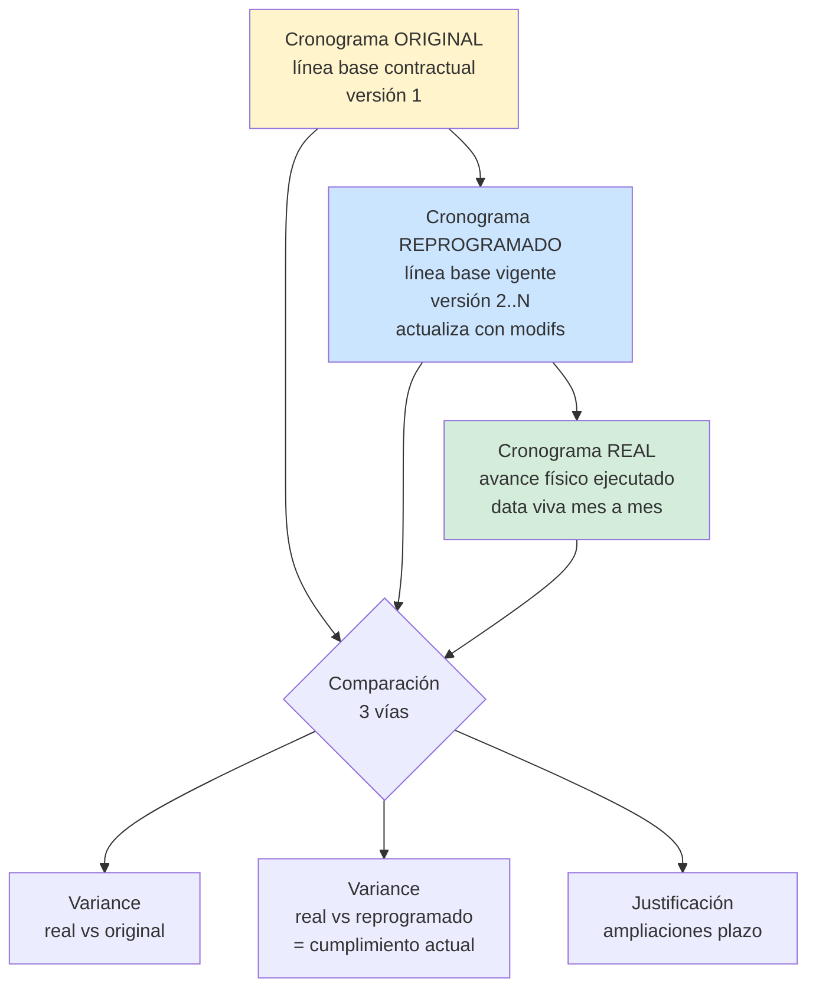
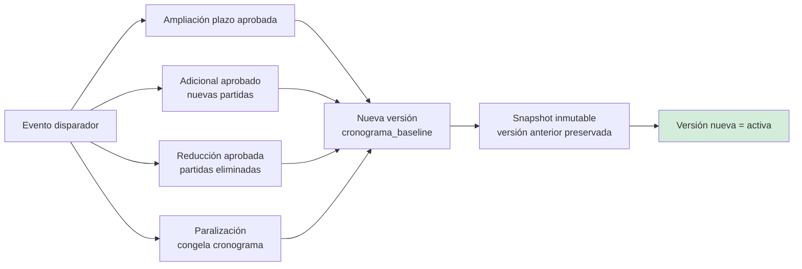
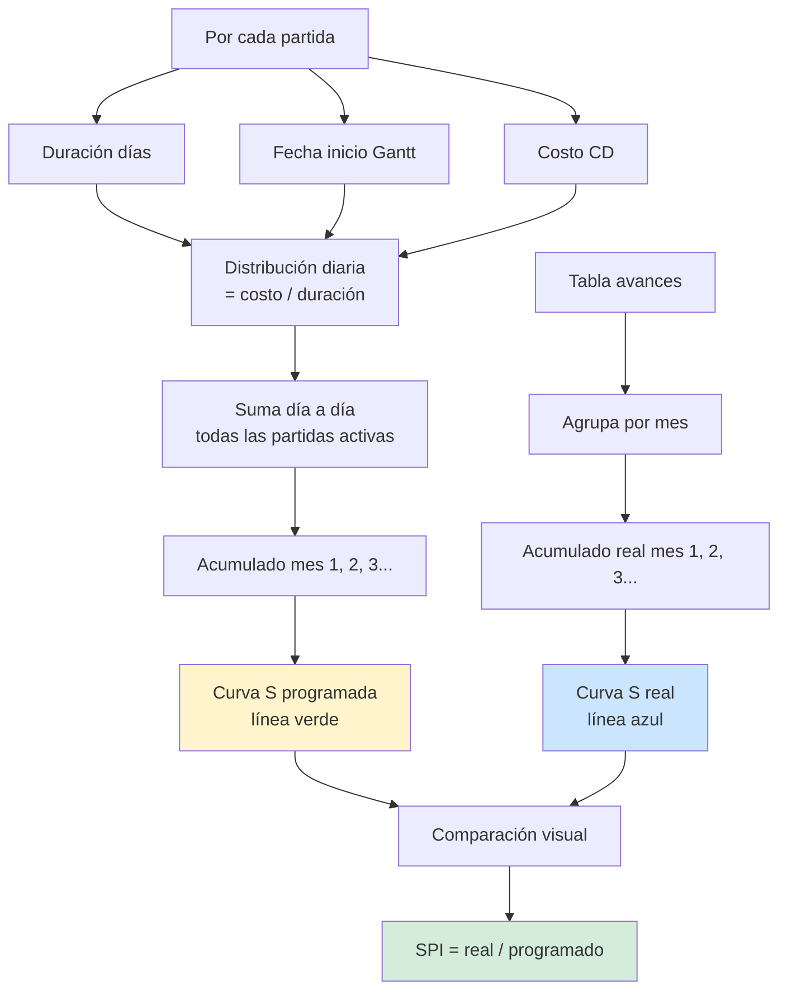
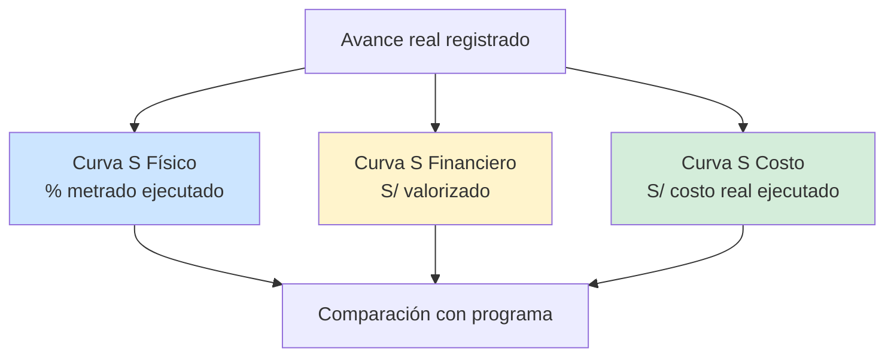

# 11 · Cronograma + Curva S · Programado vs Real

3 cronogramas distintos que viven simultáneo en el ERP.

## 3 cronogramas a manejar



## Cuándo se reprograma



## Generación Curva S

Curva S = avance acumulado en el tiempo.



## Ejemplo numérico Curva S programada PG0005

```
Total CD: S/ 1,319,122.00 · Plazo 120 días

Distribución acumulada según Gantt (estimada):
                 % programado    Monto programado acum
Mes 1 (30 d)          18%        S/   237,442
Mes 2 (60 d)          42%        S/   554,031
Mes 3 (90 d)          70%        S/   923,385
Mes 4 (120 d)        100%        S/ 1,319,122
```

Fórmula clásica curva S = sigmoide. Distribución típica obras públicas:
```
Mes 1: ~15-20%  (preliminares + estructuras inicio)
Mes 2: ~40-45%  (estructuras + arquitectura inicio · pico productivo)
Mes 3: ~70-75%  (arquitectura + IISS + IIEE)
Mes 4: 100%     (acabados + entregables)
```

## Curva S real · 3 variantes



| Variante | Mide | Útil para |
|---|---|---|
| Físico | % metrado real / metrado total | Entidad supervisión |
| Financiero | S/ valorizado / S/ contractual | Cobranza / cash flow |
| Costo | S/ costo real / S/ presupuesto | Utility análisis |

## Indicadores EVM (Earned Value)

```
PV (Planned Value)      = costo programado al fecha de corte
EV (Earned Value)       = costo presupuestado del trabajo realizado
AC (Actual Cost)        = costo real del trabajo realizado

SPI = EV / PV            (Schedule Performance Index)
  > 1: adelantado
  = 1: en tiempo
  < 1: atrasado

CPI = EV / AC            (Cost Performance Index)
  > 1: bajo presupuesto
  = 1: en presupuesto
  < 1: sobre presupuesto

ETC (Estimate To Complete) = (Total presupuesto − EV) / CPI
EAC (Estimate At Completion) = AC + ETC
```

## Schema cronograma + Curva S

```sql
cronograma_baseline (                      -- líneas base versionadas
  id, proyecto_id,
  version integer,                         -- 1=original, 2..N=reprog
  fecha_corte date,                        -- desde cuando aplica
  motivo text,                              -- "Adicional 01" / "Amp.plazo 30d"
  status ENUM ('historica','vigente'),
  modificacion_id REFERENCES modificaciones_contractuales,
  created_at, created_by
)

cronograma_partidas (                      -- snapshot por versión × partida
  id, baseline_id, partida_id,
  duracion_dias integer,
  fecha_inicio date,
  fecha_fin date,
  predecesoras text[],                     -- ["01.01.01","01.01.02"]
  costo_planificado decimal(14,2),
  is_critical boolean,
  is_milestone boolean
)

curva_s_planificada (                      -- agregado mensual programado
  id, baseline_id,
  anio, mes,
  monto_periodo decimal(14,2),
  monto_acumulado decimal(14,2),
  pct_acumulado decimal(5,2)
)

curva_s_real (                              -- agregado mensual ejecutado
  id, proyecto_id,
  anio, mes,
  fisico_acumulado_pct decimal(5,2),
  financiero_acumulado_monto decimal(14,2),
  costo_real_acumulado decimal(14,2)
)
```

## Reglas críticas

1. **Solo 1 baseline vigente** por proyecto en un momento dado
2. **Snapshots inmutables** de baselines anteriores (no editables)
3. **Reprogramación requiere modificación contractual** asociada (excepto reprogramación interna sin cambio de plazo)
4. **Curva S real** se actualiza al cierre de cada valorización (no diario)
5. **Σ mensual programado = monto contractual CD** (1,319,122 en PG0005)

## Herramientas/visualización

```
Tab Cronograma (proyecto detail)
  ├─ Vista Gantt (diagrama barras + dependencias)
  ├─ Vista lista jerárquica (EDT)
  ├─ Vista Curva S (línea programada vs real)
  ├─ Versionado: dropdown selector baseline
  └─ Export: MS Project XML / Excel / PDF
```

Librerías candidatas:
- **frappe-gantt** o **dhtmlx-gantt** (web)
- **vis-timeline** (timeline simple)
- **recharts** o **echarts** (curva S)
