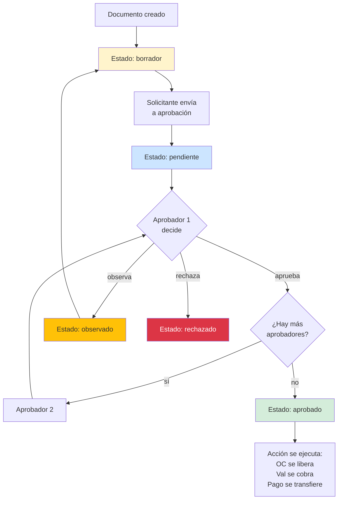
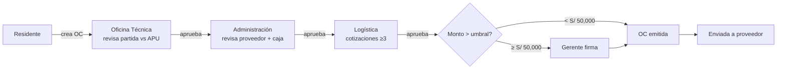
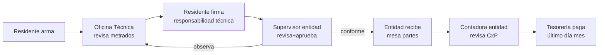
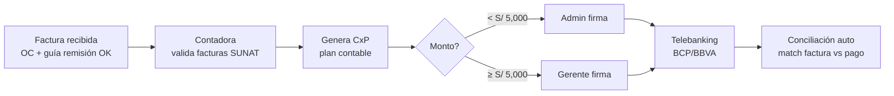

# 12 · Workflow aprobaciones

Flujo genérico aprobación entidad ERP. Aplica a OC, SC, Valorización, Pago, Modif.

## Modelo genérico



## Workflow OC (Orden de Compra)



## Workflow Valorización



## Workflow Pago Proveedor



## Schema aprobaciones genéricas

```sql
aprobacion_workflows (                     -- definición plantillas
  id, nombre,                              -- "Aprobación OC"
  entity_type varchar,                     -- "ordenes_compra"
  pasos jsonb,                              -- [{paso:1, rol:"OT"}, {paso:2, rol:"admin"}]
  condicion_monto_minimo decimal(14,2)     -- umbral activación
)

aprobaciones (                             -- instancia × documento
  id,
  workflow_id,
  entity_type varchar,                     -- "ordenes_compra"
  entity_id uuid,
  paso_actual integer,
  status ENUM ('pendiente','en_proceso','aprobado','observado','rechazado'),
  created_at, completed_at
)

aprobacion_pasos (                         -- audit trail decisiones
  id,
  aprobacion_id,
  paso integer,
  rol_requerido varchar,
  user_id_aprobador uuid,
  decision ENUM ('aprobado','observado','rechazado'),
  comentario text,
  fecha timestamp,
  ip varchar
)
```

## Notificaciones

```mermaid
flowchart TB
    EVT[Evento aprobación pendiente] --> NOTIF[Sistema notificaciones]
    NOTIF --> CHAN1[Email]
    NOTIF --> CHAN2[Push web app]
    NOTIF --> CHAN3[WhatsApp opcional]
    NOTIF --> BAD[Badge in-app<br/>"3 pendientes"]
```

## Reglas seguridad

```
Solo el rol asignado al paso puede aprobar
Aprobador no puede ser el solicitante (4-eyes principle)
Cada decisión queda en audit_log inmutable
Aprobaciones no se "deshacen" → si error, se REVOCA con nueva acción
Timeout opcional: si no aprueba en X días, escala automático
```

## Niveles aprobación por monto · sugerencia inicial

| Documento | Hasta | Aprobador final |
|---|---|---|
| OC menor | S/ 5,000 | Residente |
| OC media | S/ 50,000 | Administración |
| OC mayor | > S/ 50,000 | Gerente |
| Subcontrato | < 100,000 | Administración |
| Subcontrato | > 100,000 | Gerente |
| Valorización entidad | cualquier | Supervisor + Entidad (externo) |
| Pago proveedor | < 5,000 | Admin |
| Pago proveedor | > 5,000 | Gerente |
| Modificación contractual | cualquier | Gerente + Entidad |
| Caja chica rendición | mensual | Admin |

## UI sugerida

```
Inbox aprobaciones (top-right badge)
  ├─ Pendientes mías (5)
  │   ├─ OC-2026-0023 · S/ 12,500 · cemento
  │   ├─ Val 03 · S/ 437,720
  │   └─ ...
  ├─ Pendientes esperan otros
  └─ Histórico mis aprobaciones
```
