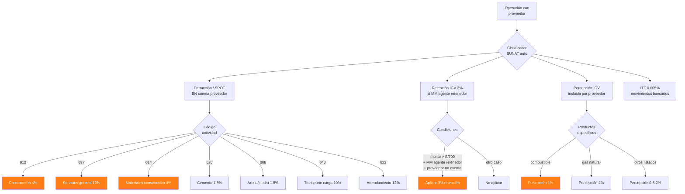
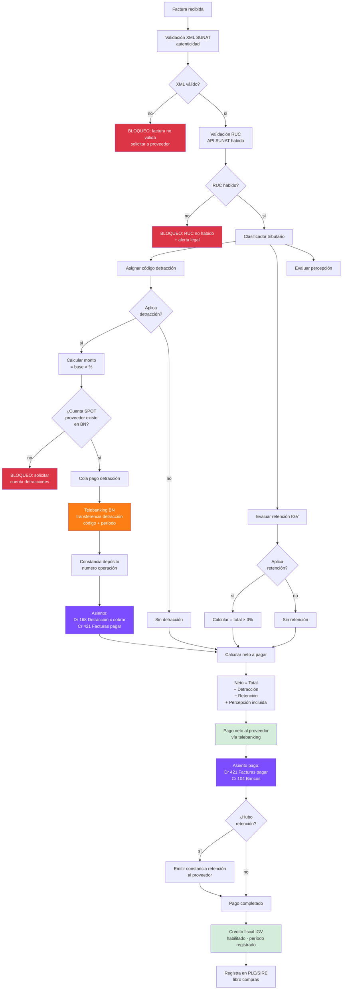
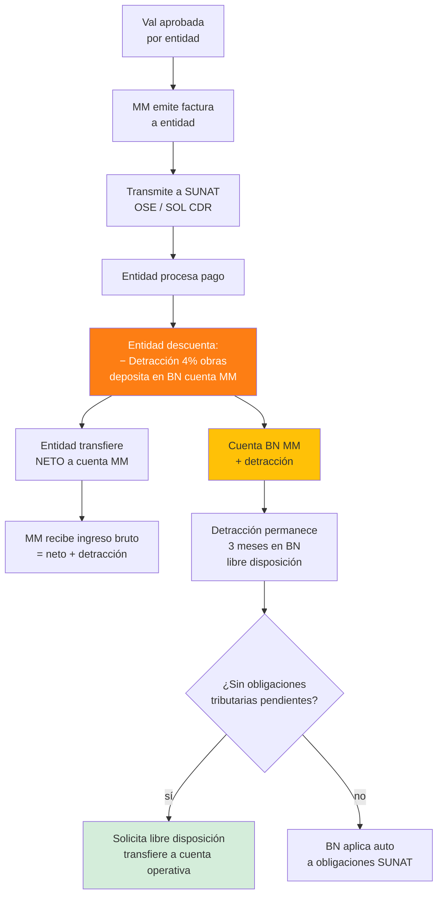

# 13 · Detracción + Retención + Percepción + SPOT

Flujo tributario peruano completo aplicado al pago a proveedores y cobranza entidad.

## Convención colores

```
Azul claro   = doc/factura SUNAT
Naranja      = obligación tributaria
Verde        = OK / habilitado crédito fiscal
Rojo         = bloqueo / multa SUNAT
Amarillo     = pendiente regularizar
Morado       = asiento contable
```

## Mapa tributos peruanos aplicables



## Flujo completo pago factura proveedor



## Flujo cobranza entidad · detracción al revés



## Validación pre-pago · checks SUNAT

```sql
CREATE OR REPLACE FUNCTION validar_factura_pagable(p_factura_id uuid)
RETURNS TABLE (
  pagable boolean,
  bloqueos jsonb,
  alertas jsonb
) AS $$
DECLARE
  v_bloqueos jsonb := '[]';
  v_alertas jsonb := '[]';
  v_factura record;
BEGIN
  SELECT * INTO v_factura FROM facturas_recibidas WHERE id = p_factura_id;

  -- 1. Validación XML SUNAT
  IF NOT v_factura.xml_validado THEN
    v_bloqueos := v_bloqueos || jsonb_build_object('codigo','XML_NOT_VALIDATED',
      'mensaje','Factura no validada con SUNAT (XML CDR pendiente)');
  END IF;

  -- 2. RUC habido
  IF NOT proveedor_habido_sunat(v_factura.proveedor_ruc) THEN
    v_bloqueos := v_bloqueos || jsonb_build_object('codigo','RUC_NO_HABIDO',
      'mensaje','RUC proveedor no habido en SUNAT');
  END IF;

  -- 3. Detracción si aplica
  IF v_factura.detraccion_aplica AND NOT v_factura.detraccion_pagada THEN
    v_bloqueos := v_bloqueos || jsonb_build_object('codigo','DETRACCION_PENDIENTE',
      'mensaje','Detracción pendiente de pago a BN');
  END IF;

  -- 4. Cuenta SPOT proveedor
  IF v_factura.detraccion_aplica AND v_factura.cuenta_spot_proveedor IS NULL THEN
    v_bloqueos := v_bloqueos || jsonb_build_object('codigo','CTA_SPOT_FALTA',
      'mensaje','Cuenta SPOT del proveedor no registrada');
  END IF;

  -- 5. Bancarización si > S/3500
  IF v_factura.total > 3500 AND v_factura.medio_pago = 'efectivo' THEN
    v_bloqueos := v_bloqueos || jsonb_build_object('codigo','SIN_BANCARIZACION',
      'mensaje','Operación > S/3500 requiere bancarización');
  END IF;

  -- 6. Alerta si tipo de cambio diferente al día
  IF v_factura.moneda != 'PEN' AND
     ABS(v_factura.tipo_cambio_factura - tipo_cambio_actual()) > 0.05 THEN
    v_alertas := v_alertas || jsonb_build_object('codigo','TC_DESACTUALIZADO',
      'mensaje','TC factura difiere significativamente del día');
  END IF;

  RETURN QUERY SELECT
    jsonb_array_length(v_bloqueos) = 0,
    v_bloqueos,
    v_alertas;
END $$ LANGUAGE plpgsql;
```

## Schema SUNAT enterprise

```sql
sunat_codigos_detraccion (
  codigo varchar(3) PRIMARY KEY,
  descripcion text,
  porcentaje decimal(5,4),
  monto_minimo decimal(14,2) DEFAULT 700.00,
  vigencia_desde date,
  vigencia_hasta date,
  base_legal text                              -- "RS 183-2004/SUNAT"
)

-- Datos seed (parcial)
INSERT INTO sunat_codigos_detraccion VALUES
  ('012','Contratos construcción',0.04,700,'2014-11-01',NULL,'RS 183-2004'),
  ('037','Demás servicios gravados',0.12,700,'2014-11-01',NULL,'RS 183-2004'),
  ('014','Carnes y despojos',0.04,700,'2014-11-01',NULL,'RS 183-2004'),
  ('020','Cemento',0.015,700,'2014-11-01',NULL,'RS 183-2004'),
  ('008','Bienes secundarios',0.015,700,'2014-11-01',NULL,'RS 183-2004'),
  ('040','Transporte de carga',0.10,400,'2014-11-01',NULL,'RS 183-2004'),
  ('022','Arrendamiento de muebles',0.10,700,'2014-11-01',NULL,'RS 183-2004'),
  ('008','Subcontratos servicios',0.12,700,'2014-11-01',NULL,'RS 183-2004');

empresas (
  ... existente
  + es_agente_retencion_igv boolean DEFAULT false,
  + es_agente_percepcion_igv boolean DEFAULT false,
  + cuenta_detracciones_propia varchar(20),
  + ruc_validado_sunat_at timestamp
)

proveedores (
  id, ruc varchar(11) UNIQUE,
  razon_social,
  cuenta_detracciones_spot varchar(20),
  spot_validada_at timestamp,
  estado_sunat varchar,                        -- 'HABIDO','NO HABIDO','BAJA OFICIO'
  estado_sunat_consultado_at timestamp,
  es_buen_contribuyente boolean,
  regimen_tributario varchar,                  -- 'general','mype','rer'
  exento_retencion_igv boolean DEFAULT false
)

facturas_recibidas (
  ... existente
  + xml_archivo_path text,
  + xml_validado boolean DEFAULT false,
  + xml_cdr_recibido_at timestamp,

  + detraccion_codigo varchar(3) REFERENCES sunat_codigos_detraccion,
  + detraccion_pct decimal(5,4),
  + detraccion_base decimal(14,2),
  + detraccion_monto decimal(14,2),
  + detraccion_pagada boolean DEFAULT false,
  + detraccion_constancia_numero varchar,
  + detraccion_fecha_pago date,
  + detraccion_periodo char(7),

  + retencion_igv_aplica boolean,
  + retencion_igv_monto decimal(14,2),
  + retencion_igv_constancia_numero varchar,

  + percepcion_igv_monto decimal(14,2) DEFAULT 0,

  + medio_pago varchar,
  + tipo_cambio_factura decimal(7,4),

  + bloqueo_pago boolean DEFAULT false,
  + bloqueos_codigo text[],
  + bloqueos_observados_at timestamp,
  + alertas text[]
)

detracciones_pagos (
  id uuid PRIMARY KEY,
  factura_id uuid REFERENCES facturas_recibidas,
  fecha_pago date,
  monto decimal(14,2),
  banco_destino varchar DEFAULT 'BN',
  numero_operacion varchar,
  numero_constancia varchar,
  periodo_tributario char(7),
  archivo_constancia_pdf_nas text,
  registrado_en_pdt boolean DEFAULT false,
  pdt_periodo char(7)
)

retenciones_emitidas (
  id uuid PRIMARY KEY,
  factura_id uuid REFERENCES facturas_recibidas,
  fecha date,
  monto decimal(14,2),
  numero_constancia varchar,
  comprobante_serie varchar,
  comprobante_numero varchar,
  archivo_constancia_pdf_nas text,
  reportado_pdt boolean DEFAULT false
)

-- Libros electrónicos PLE/SIRE
ple_libros_compras (
  id, periodo char(7),
  factura_id uuid,
  archivo_txt_path text,
  enviado_at timestamp,
  cdr_sunat varchar,
  estado ENUM ('pendiente','enviado','aceptado','rechazado'),
  motivo_rechazo text
)
```

## Eventos contables completos

```
Recepción factura comercial S/ 11,800 (10,000 + 1,800 IGV) · construcción 4%:

1. Registro factura:
   Dr 60 Compras suministros           10,000.00
   Dr 401 IGV crédito fiscal            1,800.00
   Cr 421 Facturas por pagar           11,800.00
   (registrado al recibir factura · NIA OK)

2. Detracción depositada en BN:
   Dr 168 Cuentas por cobrar diversas      400.00  (4% × 10,000)
   Cr 104 Bancos                            400.00
   (depósito BN cuenta SPOT proveedor)

3. Aplicación detracción contra factura:
   Dr 421 Facturas por pagar               400.00
   Cr 168 Cuentas por cobrar diversas      400.00
   (compensa factura con detracción)

4. Pago neto a proveedor:
   Dr 421 Facturas por pagar           11,400.00
   Cr 104 Bancos                       11,400.00
   (transferencia neta · 11,800 − 400)
```

## KPIs SUNAT

| KPI | Fórmula | Alerta |
|---|---|---|
| Detracciones pagadas/total | pagadas / aplicables | < 95% rojo |
| RUCs proveedores no habidos | count where !habido | > 0 alerta |
| Crédito fiscal en riesgo | facturas sin detracción | rojo |
| Ratio ITF mes | ITF / movimientos bancarios | monitoreo |
| Multas SUNAT acumuladas | Σ multas año | objetivo S/ 0 |
| Saldo libre disposición BN | balance cuenta SPOT propia | trimestral |

## Cron jobs SUNAT

```
00:00 diario  · Validar todos RUCs proveedores activos
01:00 diario  · Re-validar XMLs facturas pendientes CDR
02:00 diario  · Generar PLE compras del día anterior
06:00 mensual día 5 · Subir PLE/SIRE a SUNAT
06:00 mensual día 12 · Declarar detracciones PDT
06:00 mensual día 16 · Pagar IGV mensual
```

## Prioridad: **CRÍTICA**
