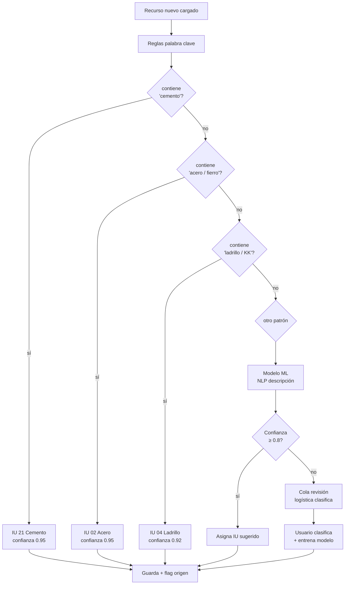
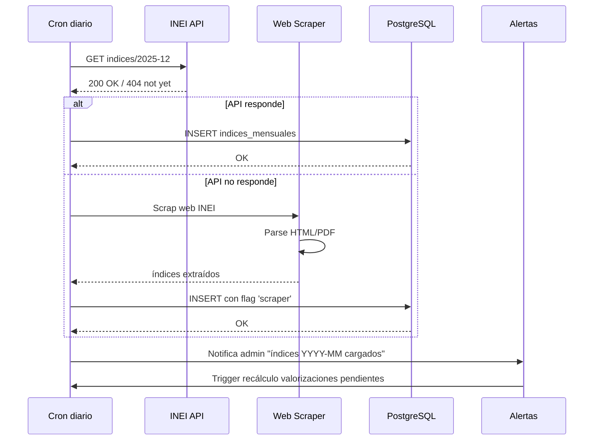

# 14 · Reajuste por Fórmula Polinómica + Índices Unificados (IU)

Mecanismo cobro por inflación obras públicas. Sin esto pierdes 5-15% utility en obras > 6 meses.

## Conceptos base

```
Fórmula polinómica (FP) = expresión matemática que ajusta monto valorización
                          según variación índices INEI

K = a×(Mr/Mo) + b×(MOr/MOo) + c×(Cr/Co) + d×(Er/Eo) + e×(Ir/Io)

donde:
  a, b, c, d, e        = coeficientes (Σ = 1.0000) · fijados en bases licitación
  Mr/Mo               = razón índice Materiales (mes ejecución / mes base)
  MOr/MOo             = razón índice Mano Obra
  Cr/Co               = razón índice Combustibles
  Er/Eo               = razón índice Equipos
  Ir/Io               = razón índice Otros (varios)

Reajuste S/  = (K − 1) × Valorización_pre_reajuste
```

INEI publica mensualmente. Resoluciones jefaturales con números de cada IU.

## Índices Unificados típicos (Resolución INEI)

```
01 Cemento Portland tipo I
02 Aceros corrugados
03 Acero estructural
04 Albañilería · ladrillo de arcilla
05 Aluminio
07 Aparatos sanitarios
13 Ascensores
14 Asfalto
15 Block de concreto
17 Cable NYY
21 Cemento Portland tipo I (alt)
30 Dólar más inflación EEUU
32 Flete terrestre
38 Hormigón
39 Indice general construcción
43 Madera nacional
44 Maquinaria nacional
45 Maquinaria importada
47 Mano de obra
48 Maquinaria de obras (alquiler)
49 Madera importada
51 Perfiles aluminio
54 Pintura latex
56 Plancha de acero LAC
65 Tubería PVC
72 Vidrio incoloro nacional
77 Combustible Diesel
78 Petróleo industrial 6
80 Yeso
```

Cada IU tiene precio publicado mensualmente por área geográfica (1=Lima, 2=Norte, 3=Centro, 4=Sur, etc).

## Estructura monomio típica obra construcción

```
Coeficientes ejemplo PG0005 hipotético:
  a = 0.4500  Materiales · monomio compuesto
              IU 21 (cemento) peso 0.30
              IU 02 (acero) peso 0.25
              IU 04 (ladrillo) peso 0.15
              IU 38 (hormigón) peso 0.30
  b = 0.3500  Mano de obra · monomio simple
              IU 47 (mano obra) peso 1.00
  c = 0.0500  Combustibles
              IU 77 (diesel) peso 1.00
  d = 0.1000  Equipos
              IU 48 (alquiler maq) peso 1.00
  e = 0.0500  Otros
              IU 39 (índice general) peso 1.00

  Σ = 1.0000  ✓ verificación
```

## Flujo cálculo reajuste mensual

```mermaid
flowchart TB
    INI[Fin de mes ejecución obra] --> CRON[Cron batch nocturno]

    CRON --> FETCH[Fetch índices INEI<br/>API o scraper<br/>publicados día 5 mes siguiente]
    FETCH --> Q_PUB{Indices del<br/>mes publicados?}
    Q_PUB -->|no| ESPERA[Esperar 24h<br/>retry]
    Q_PUB -->|sí| LOAD[Carga indices_mensuales<br/>período YYYY-MM]
    ESPERA --> CRON

    LOAD --> CALC_K[Calcula K para cada<br/>proyecto activo]

    CALC_K --> ITER[Por cada monomio]
    ITER --> SUM_IU[Suma ponderada<br/>IUs del monomio]
    SUM_IU --> RAZON[Calcula razón<br/>actual / base]
    RAZON --> COEF[× coeficiente monomio]
    COEF --> ACUM[Acumula contribución]

    ACUM --> NEXT{¿Más<br/>monomios?}
    NEXT -->|sí| ITER
    NEXT -->|no| K_FINAL[K factor final]

    K_FINAL --> APP_VAL[Aplica K a<br/>valorización mes]
    APP_VAL --> REAJ[Monto reajuste<br/>= (K - 1) × val_pre_reajuste]

    REAJ --> Q_SIGN{¿K positivo?}
    Q_SIGN -->|+ MM cobra| REAJ_MAS[Reajuste positivo<br/>+ S/ a la valorización]
    Q_SIGN -->|− MM debe| REAJ_MENOS[Reajuste negativo<br/>se descuenta]

    REAJ_MAS --> CONC[Reconciliación<br/>con costo real compras]
    REAJ_MENOS --> CONC

    CONC --> CALC_REAL[Costo real<br/>variación compras<br/>vs base]
    CALC_REAL --> GAP[Gap = costo real − reajuste cobrado]
    GAP --> Q_GAP{Gap > umbral<br/>arbitrable?}
    Q_GAP -->|sí| FLAG[Flag arbitraje<br/>+ alerta gerencia]
    Q_GAP -->|no| OK_REAJ[Conciliación OK]

    style FETCH fill:#cce5ff
    style FLAG fill:#dc3545,color:#fff
    style OK_REAJ fill:#d4edda
    style REAJ_MAS fill:#d4edda
    style REAJ_MENOS fill:#ffc107
```

## Ejemplo numérico cálculo K · diciembre 2025

```
Mes base contrato: junio 2025
Mes ejecución:     diciembre 2025

Índices (hipotéticos):
  IU                Jun 2025  Dic 2025  Razón
  21 Cemento        128.50    142.30    1.1074
  02 Acero          145.20    158.40    1.0909
  04 Ladrillo       115.80    122.50    1.0578
  38 Hormigón       138.40    149.20    1.0780
  47 Mano obra      162.50    175.30    1.0788
  77 Diesel         189.40    195.80    1.0338
  48 Maquinaria     142.10    151.20    1.0640
  39 Índice general 135.60    144.80    1.0679

Cálculo monomio "a" Materiales:
  IU 21: 0.30 × 1.1074 = 0.3322
  IU 02: 0.25 × 1.0909 = 0.2727
  IU 04: 0.15 × 1.0578 = 0.1587
  IU 38: 0.30 × 1.0780 = 0.3234
  Σ monomio a = 1.0870
  Aporte a × 0.45 = 0.4892

Monomio "b" Mano obra:
  Aporte b × 0.35 = 1.0788 × 0.35 = 0.3776

Monomio "c" Combustibles:
  Aporte c × 0.05 = 1.0338 × 0.05 = 0.0517

Monomio "d" Equipos:
  Aporte d × 0.10 = 1.0640 × 0.10 = 0.1064

Monomio "e" Otros:
  Aporte e × 0.05 = 1.0679 × 0.05 = 0.0534

K = 0.4892 + 0.3776 + 0.0517 + 0.1064 + 0.0534 = 1.0783

Reajuste = (1.0783 - 1) × Val pre-reajuste
        = 0.0783 × Val pre-reajuste
        = 7.83% sobre valorización
```

## Schema completo

```sql
-- Catálogo INEI Índices Unificados
indices_unificados (
  codigo varchar(3) PRIMARY KEY,           -- "21"
  descripcion text,                         -- "Cemento Portland tipo I"
  categoria varchar(50),                    -- "Materiales · Cemento"
  unidad_medida varchar(20),
  vigente boolean DEFAULT true,
  base_legal text                           -- "RJ 200-2024-INEI"
)

-- Índices mensuales por área
indices_mensuales (
  iu_codigo varchar(3) REFERENCES indices_unificados,
  area varchar(20),                         -- "lima","norte","centro","sur","oriente"
  anio_mes char(7),                         -- "2025-12"
  valor decimal(10,4),
  resolucion_jefatural varchar,             -- "RJ 245-2025-INEI"
  fecha_publicacion date,
  cargado_at timestamp,
  cargado_por varchar,                      -- 'api_inei' | 'manual' | 'scraper'
  PRIMARY KEY (iu_codigo, area, anio_mes)
)

-- Fórmulas polinómicas por proyecto
formulas_polinomicas (
  id uuid PRIMARY KEY,
  proyecto_id uuid,
  fecha_base date NOT NULL,                 -- presupuesto base "2025-06-07"
  area_geografica varchar(20),              -- "lima"
  validado boolean DEFAULT false,
  validado_at timestamp,
  archivo_pdf_bases_nas text
)

formula_monomios (
  id uuid PRIMARY KEY,
  formula_id uuid REFERENCES formulas_polinomicas,
  letra char(1) NOT NULL,                   -- 'a','b','c','d','e'
  coeficiente decimal(5,4) NOT NULL,        -- 0.4500
  descripcion text,                          -- "Materiales construcción"
  CONSTRAINT coef_check CHECK (coeficiente BETWEEN 0 AND 1)
)

-- Validación coeficientes suman 1
CREATE FUNCTION validar_formula_coeficientes()
RETURNS trigger AS $$
DECLARE total decimal(10,8);
BEGIN
  SELECT SUM(coeficiente) INTO total
  FROM formula_monomios WHERE formula_id = NEW.formula_id;

  IF ABS(total - 1.0) > 0.0001 THEN
    RAISE EXCEPTION 'Σ coeficientes debe ser 1.0000, encontrado: %', total;
  END IF;
  RETURN NEW;
END $$ LANGUAGE plpgsql;

-- IUs por monomio (composición)
formula_monomio_ius (
  monomio_id uuid REFERENCES formula_monomios,
  iu_codigo varchar(3) REFERENCES indices_unificados,
  peso decimal(5,4),                        -- ponderación interna · Σ pesos = 1.0
  PRIMARY KEY (monomio_id, iu_codigo),
  CONSTRAINT peso_check CHECK (peso BETWEEN 0 AND 1)
)

-- Asociación recursos → IU para clasificación compras
recursos (
  ... existente
  + iu_codigo varchar(3) REFERENCES indices_unificados,
  + iu_clasificacion_origen varchar(20),    -- 'manual'|'auto_ml'|'reglas'
  + iu_confianza decimal(3,2),               -- 0.00..1.00
  + iu_revisado_por varchar
)

-- Cálculo reajuste por valorización
reajuste_calculos (
  id uuid PRIMARY KEY,
  valorizacion_id uuid REFERENCES valorizaciones,
  formula_id uuid REFERENCES formulas_polinomicas,
  periodo_calculo char(7),                  -- mes de ejecución
  k_factor decimal(7,6),                    -- 1.0783
  monto_pre_reajuste decimal(14,2),
  monto_reajuste decimal(14,2),
  monto_post_reajuste decimal(14,2),
  detalle_calculo jsonb,                    -- breakdown completo cada monomio/IU
  calculado_at timestamp,
  validado_supervisor_at timestamp
)

-- Reconciliación reajuste vs costo real
reajuste_conciliaciones (
  id uuid PRIMARY KEY,
  proyecto_id uuid,
  periodo char(7),

  -- Reajuste cobrado
  k_polinomico decimal(7,6),
  monto_reajuste_cobrado decimal(14,2),

  -- Costo real
  variacion_costo_compras_pct decimal(7,4),
  monto_extra_costo_real decimal(14,2),

  -- Gap
  gap_monto decimal(14,2),
  gap_pct decimal(7,4),
  riesgo_arbitrable boolean,
  umbral_arbitraje decimal(7,4) DEFAULT 0.05,  -- 5% gap = flag

  generado_at timestamp,
  revisado_por varchar,
  acciones_tomadas text
)
```

## Clasificación auto recursos → IU



## Ingesta INEI · API + scraper



## Validaciones críticas

```
1. Coeficientes monomio Σ = 1.0000 exacto
2. Pesos IU dentro monomio Σ = 1.0000 exacto
3. K calculado dentro rango razonable [0.85, 1.30] · sospechoso fuera
4. IU base del mes contrato debe existir antes calcular
5. Indices del mes ejecución deben existir antes calcular
6. Reajuste no puede exceder 30% en un solo mes (alerta operativa)
7. Si IU desactivado, sustituir por equivalente vigente
```

## Reportes

```
Reporte 1: Reajuste acumulado proyecto
  Σ reajustes por mes
  K trayectoria
  Ratio reajuste / costo total proyecto

Reporte 2: Conciliación cobertura
  Reajuste cobrado / variación costo real
  100% = cobertura perfecta
  < 100% = pierdes plata
  > 100% = sobrecobertura (rare · usually mal índice)

Reporte 3: Riesgo arbitrabilidad
  Casos con gap > 5%
  Sustento documental
  Plazos caducidad reclamo
```

## Prioridad: **CRÍTICA**
