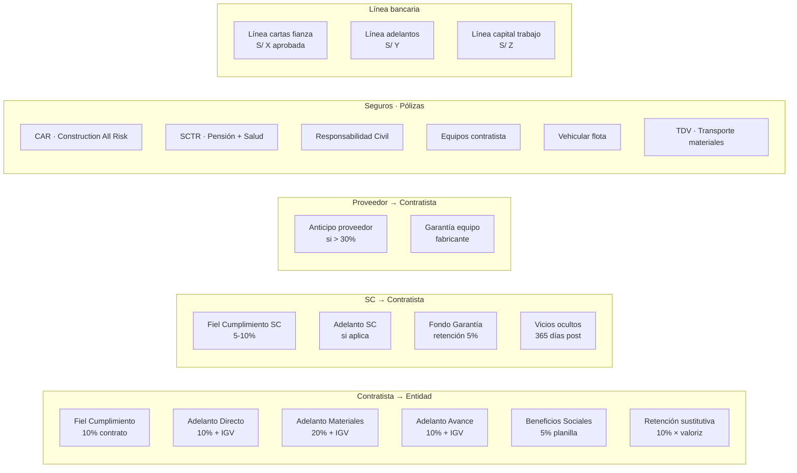
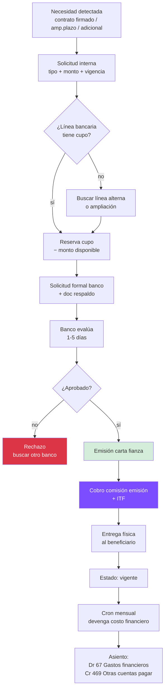
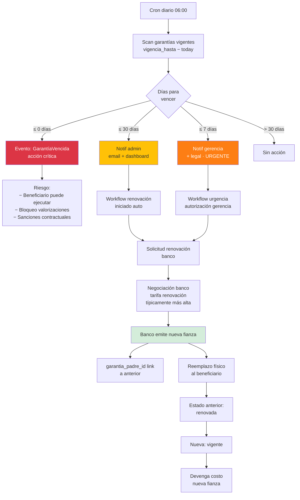
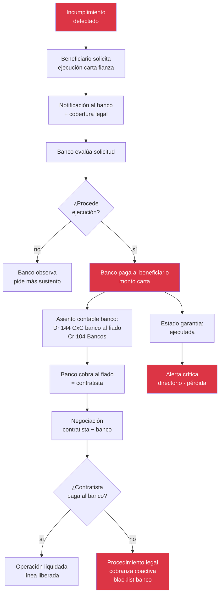
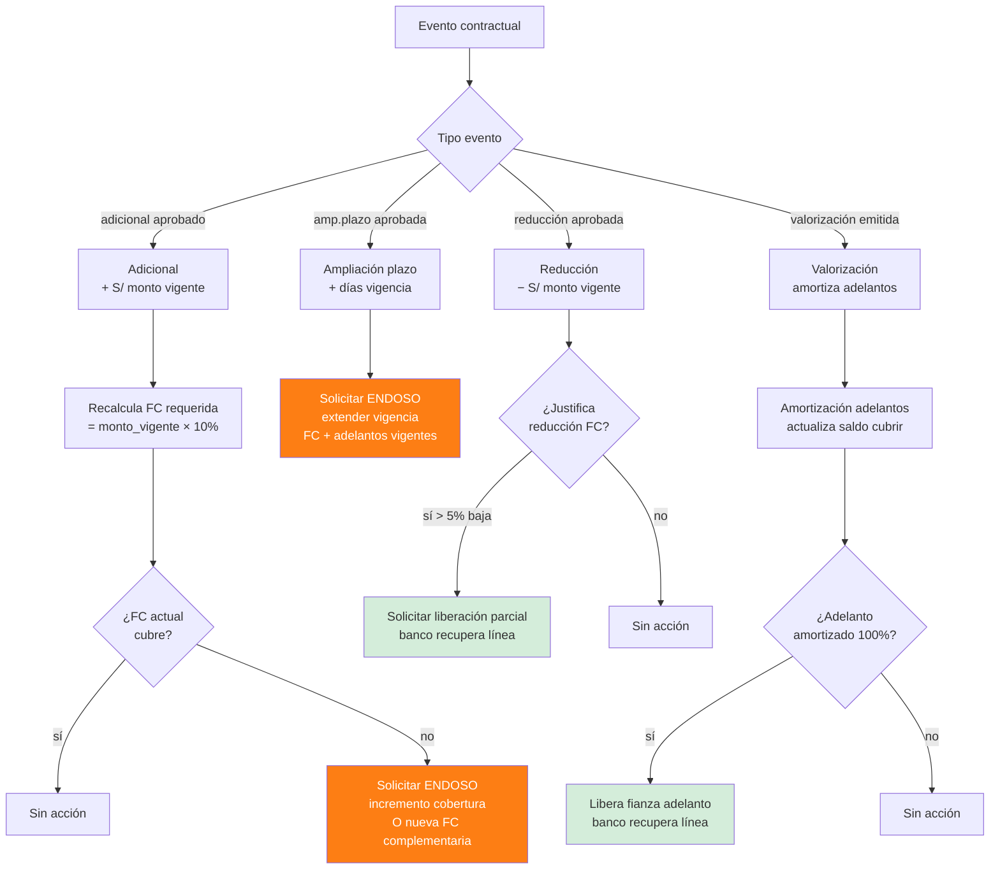

# 15 · Garantías + Pólizas + Línea Bancaria · Diseño completo

Sistema garantías enterprise. Cubre fianzas, pólizas, renovaciones, ejecuciones, costo financiero.

## Universo garantías obra pública



## Schema enterprise garantías

```sql
-- ENUM tipos garantía
CREATE TYPE garantia_tipo AS ENUM (
  'fiel_cumplimiento',
  'adelanto_directo',
  'adelanto_materiales',
  'adelanto_avance',
  'beneficios_sociales',
  'retencion_sustitutiva',
  'sc_fiel_cumplimiento',
  'sc_adelanto',
  'sc_fondo_garantia',
  'sc_vicios_ocultos',
  'proveedor_anticipo',
  'proveedor_equipo'
);

CREATE TYPE emisor_relacion AS ENUM (
  'contratista_a_entidad',
  'sc_a_contratista',
  'proveedor_a_contratista'
);

CREATE TYPE garantia_estado AS ENUM (
  'borrador',
  'solicitada',
  'emitida',
  'vigente',
  'por_vencer_30d',
  'por_vencer_7d',
  'vencida',
  'renovada',
  'ejecutada',
  'devuelta',
  'cancelada'
);

garantias (
  id uuid PRIMARY KEY,
  proyecto_id uuid,

  -- Tipo + relación
  tipo garantia_tipo,
  emisor_relacion emisor_relacion,

  -- Partes
  emisor_ruc varchar(11),                    -- quien emite (si SC/proveedor)
  emisor_razon varchar,
  beneficiario_ruc varchar(11),
  beneficiario_razon varchar,

  -- Documento
  numero_carta varchar UNIQUE,
  banco_emisor varchar,
  numero_operacion_banco varchar,
  archivo_pdf_nas text,
  archivo_endoso_pdf_nas text,

  -- Montos
  monto decimal(14,2) NOT NULL,
  monto_cobertura decimal(14,2),             -- algunos cubren más
  moneda char(3) DEFAULT 'PEN',
  tipo_cambio_emision decimal(7,4),

  -- Vigencia
  fecha_solicitud date,
  fecha_emision date,
  vigencia_desde date,
  vigencia_hasta date,
  dias_renovacion_alerta integer DEFAULT 30,
  dias_renovacion_critico integer DEFAULT 7,

  -- Estado
  estado garantia_estado DEFAULT 'borrador',
  fecha_estado_actual timestamp,

  -- Renovaciones / encadenamiento
  garantia_padre_id uuid REFERENCES garantias,
  numero_renovacion integer DEFAULT 0,

  -- Ejecución
  ejecutada_at timestamp,
  monto_ejecutado decimal(14,2),
  motivo_ejecucion text,

  -- Devolución
  devuelta_at timestamp,
  acta_devolucion_nas text,

  -- Costo financiero
  comision_emision decimal(14,2),
  tasa_comision_anual decimal(5,4),          -- 0.04 = 4% anual
  costo_total_financiero decimal(14,2),      -- proyectado

  -- Línea bancaria
  linea_bancaria_id uuid,
  consume_linea boolean DEFAULT true,

  -- Triggers contractuales
  modificacion_contractual_id uuid,
  evento_disparador varchar,

  -- Adelanto/garantía relacionado
  adelanto_id uuid,                          -- si garantiza adelanto
  subcontrato_id uuid,                       -- si garantía SC

  -- Audit
  created_at, updated_at,
  created_by, updated_by
)

CREATE INDEX ON garantias (proyecto_id, estado);
CREATE INDEX ON garantias (vigencia_hasta) WHERE estado = 'vigente';
CREATE INDEX ON garantias (linea_bancaria_id);

-- Pólizas seguros (similar pero independiente)
polizas (
  id uuid PRIMARY KEY,
  proyecto_id uuid,

  tipo varchar,                               -- 'CAR','SCTR_pension','SCTR_salud','RC','equipos','vehicular','tdv'

  aseguradora varchar,
  numero_poliza varchar,

  -- Cobertura
  prima decimal(14,2),
  prima_anual decimal(14,2),
  pagos_realizados integer DEFAULT 0,
  pagos_totales integer,
  cobertura_total decimal(14,2),
  deducible decimal(14,2),

  vigencia_desde date,
  vigencia_hasta date,

  archivo_poliza_nas text,
  endosos jsonb DEFAULT '[]',

  estado varchar,                             -- 'vigente','por_vencer','vencida','siniestrada','renovada'
  beneficiarios jsonb,                        -- ente, MM, SC, etc

  created_at, updated_at
)

-- Línea bancaria
lineas_bancarias (
  id uuid PRIMARY KEY,
  empresa_id uuid,
  banco varchar,
  ruc_titular varchar(11),
  tipo varchar,                               -- 'cartas_fianza','adelantos','capital_trabajo'

  monto_aprobado decimal(14,2),
  monto_consumido decimal(14,2) DEFAULT 0,
  monto_disponible decimal(14,2)
    GENERATED ALWAYS AS (monto_aprobado - monto_consumido) STORED,

  fecha_aprobacion date,
  fecha_renovacion date,                      -- línea típicamente anual
  tasa_comision_anual decimal(5,4),
  contrato_linea_pdf_nas text,

  estado varchar DEFAULT 'vigente'            -- 'vigente','en_renovacion','suspendida','cancelada'
)

linea_bancaria_movimientos (
  id uuid PRIMARY KEY,
  linea_id uuid REFERENCES lineas_bancarias,
  fecha date,
  tipo varchar,                               -- 'emision_carta','liberacion','renovacion','ejecucion','ajuste'
  garantia_id uuid REFERENCES garantias,
  monto decimal(14,2),                        -- + consume, − libera
  monto_disponible_post decimal(14,2),
  observaciones text,
  user_id uuid
)

-- Costo financiero devengado mensual
costo_financiero_devengado (
  id uuid PRIMARY KEY,
  garantia_id uuid REFERENCES garantias,
  poliza_id uuid REFERENCES polizas,
  periodo_mes char(7),
  monto_devengado decimal(14,2),
  asiento_id uuid,
  generado_at timestamp
)
```

## Flujo emisión garantía



## Flujo renovación automática



## Flujo ejecución garantía



## Triggers automáticos



## Devengo mensual costo financiero

```sql
-- Cron 1ro de cada mes
CREATE FUNCTION devengar_costos_financieros_mes(p_periodo char(7))
RETURNS void AS $$
BEGIN
  -- Garantías vigentes
  INSERT INTO costo_financiero_devengado (garantia_id, periodo_mes, monto_devengado, generado_at)
  SELECT
    g.id,
    p_periodo,
    -- Costo proporcional al mes
    (g.monto * g.tasa_comision_anual / 12),
    now()
  FROM garantias g
  WHERE g.estado = 'vigente'
    AND p_periodo >= to_char(g.vigencia_desde,'YYYY-MM')
    AND p_periodo <= to_char(g.vigencia_hasta,'YYYY-MM');

  -- Pólizas vigentes
  INSERT INTO costo_financiero_devengado (poliza_id, periodo_mes, monto_devengado, generado_at)
  SELECT
    p.id,
    p_periodo,
    (p.prima_anual / 12),
    now()
  FROM polizas p
  WHERE p.estado = 'vigente'
    AND p_periodo BETWEEN to_char(p.vigencia_desde,'YYYY-MM') AND to_char(p.vigencia_hasta,'YYYY-MM');

  -- Generar asientos
  PERFORM generar_asientos_costo_financiero(p_periodo);
END $$ LANGUAGE plpgsql;
```

## KPIs garantías

| KPI | Fórmula | Alerta |
|---|---|---|
| Línea bancaria utilizada | consumido / aprobado | > 80% solicitar ampliación |
| Garantías por vencer 30d | count | dashboard alerta |
| Garantías ejecutadas YTD | count | objetivo 0 |
| Costo financiero / utility | costo_fin / utility_proyecto | < 3% saludable |
| Ratio cobertura adelantos | Σ fianzas adelantos / Σ adelantos pagados | = 100% obligatorio |
| Pólizas vencidas | count vigencia < today | objetivo 0 |
| Tiempo emisión promedio | días desde solicitud hasta entrega | < 5 días |

## Reportes operativos

```
1. Calendario vencimientos
   Vista calendario Gantt con todas vigencias
   Color: verde/amarillo/rojo por proximidad

2. Línea bancaria status
   Por banco: aprobado, consumido, disponible
   Histórico utilización

3. Costo financiero proyecto
   Σ garantías + pólizas devengadas
   Vs presupuestado en GG

4. Riesgo ejecución
   Garantías con incumplimientos contractuales potenciales
   Probabilidad ejecución × monto = riesgo S/

5. Histórico ejecuciones
   Casos pasados todas obras
   Lecciones aprendidas
```

## Prioridad: **CRÍTICA**
