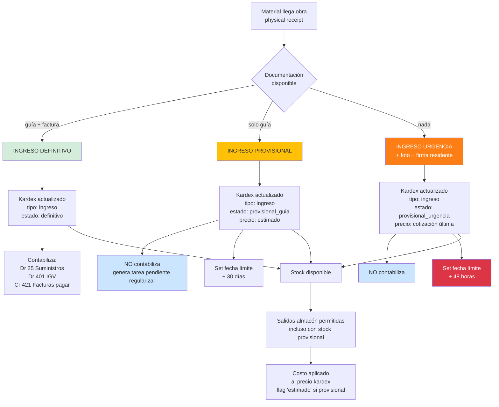
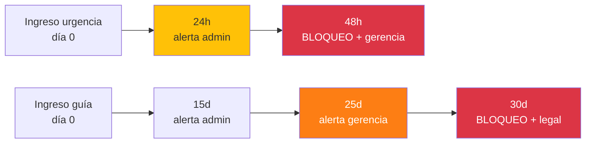

# 16 · Ingreso provisional almacén · Regularización

Realidad obra: material llega antes que documentos. Sin diseño = ERP queda fuera de la operación.

## 3 escenarios reales obra

```
Escenario A · Ideal (raro)
  Material llega + guía remisión + factura simultáneo
  → Ingreso DEFINITIVO · contabiliza directo

Escenario B · Frecuente (60% casos)
  Material llega + guía remisión
  Factura llega 5-15 días después
  → Ingreso PROVISIONAL · stock disponible · sin contabilizar

Escenario C · Urgencia (20% casos)
  Material llega · sin guía · sin factura
  Necesidad inmediata frente trabajo
  → Ingreso URGENCIA · documentar < 48h
```

## Flujo decisión recepción



## Flujo regularización

```mermaid
flowchart TB
    PEND[Movimiento provisional<br/>esperando regularizar] --> CRON_DAILY[Cron diario<br/>scan pendientes]

    CRON_DAILY --> Q_ARRIV{¿Llegó factura?}
    Q_ARRIV -->|no| Q_DAYS{Días desde<br/>ingreso}
    Q_ARRIV -->|sí| MATCH[Match factura ↔ ingreso provisional]

    Q_DAYS -->|<15d urgencia<br/>o <30d guía| OK_WAIT[OK · esperando]
    Q_DAYS -->|=15d guía| ALERT1[Alerta admin<br/>contactar proveedor]
    Q_DAYS -->|=25d guía| ALERT2[Alerta gerencia<br/>escalamiento]
    Q_DAYS -->|>30d| BLOQ[BLOQUEO<br/>+ alerta legal<br/>+ no más OC mismo proveedor]

    MATCH --> CALC_DIF[Calcula diferencias:<br/>− cantidad guía vs factura<br/>− precio estimado vs real]
    CALC_DIF --> Q_DIF{¿Hay<br/>diferencias?}

    Q_DIF -->|no diferencias| REG_OK[Regulariza directo:<br/>− ingreso provisional<br/>+ ingreso definitivo<br/>= mismo monto]
    Q_DIF -->|cantidad menor factura| REG_AJ_C[Regulariza:<br/>+ ingreso definitivo (cantidad factura)<br/>− ajuste merma diferencia]
    Q_DIF -->|cantidad mayor factura| REG_AJ_C2[Regulariza:<br/>+ definitivo<br/>+ ingreso adicional sin OC<br/>(requiere validación)]
    Q_DIF -->|precio diferente| REG_AJ_P[Regulariza:<br/>+ definitivo<br/>+ ajuste valuación kardex<br/>recalcula promedio ponderado<br/>retroactivo a salidas]

    REG_OK --> CONT_REG[Asiento contable:<br/>Dr 25 Suministros<br/>Dr 401 IGV<br/>Cr 421 CxP]
    REG_AJ_C --> CONT_REG
    REG_AJ_C2 --> CONT_REG
    REG_AJ_P --> CONT_REG

    CONT_REG --> RECON[Reconciliación costo partidas<br/>impactadas]
    RECON --> RECALC[Recalcula costo real<br/>partidas con consumos previos]

    style BLOQ fill:#dc3545,color:#fff
    style ALERT2 fill:#fd7e14,color:#fff
    style ALERT1 fill:#ffc107
    style REG_OK fill:#d4edda
    style REG_AJ_P fill:#cce5ff
```

## Caso especial · ajuste retroactivo precio

```
Día 1: Ingreso provisional 100 bls cemento · estimado S/ 28.50
       Stock 100 × 28.50 = S/ 2,850

Día 5: Salida 60 bls a partida 02.01.03.02
       Costo aplicado partida: 60 × 28.50 = S/ 1,710
       Stock 40 × 28.50 = S/ 1,140

Día 12: Llega factura · precio real S/ 31.20

Acción regularización:
  1. Recalcular valuación stock:
     − stock provisional 40 × 28.50 = -1,140
     + stock definitivo 100 × 31.20 = +3,120
     − consumido 60 × 31.20 = -1,872
     = stock final 40 × 31.20 = 1,248

  2. Ajustar costo retroactivo partida 02.01.03.02:
     ajuste = 60 × (31.20 − 28.50) = 60 × 2.70 = +S/ 162
     Asiento: Dr 92 Costo partida   162
              Cr 25 Suministros      162

  3. Reportar variance precio:
     +9.5% sobre estimado (alertar gerencia si > 5%)
```

## Schema

```sql
-- Extiende almacen_movimientos
ALTER TABLE almacen_movimientos ADD COLUMN
  estado_documental varchar DEFAULT 'definitivo';

-- Estados:
--   'definitivo'           = guía + factura registrados
--   'provisional_guia'     = solo guía remisión
--   'provisional_urgencia' = sin documento
--   'regularizado'         = era provisional, ya con factura

ALTER TABLE almacen_movimientos ADD COLUMN
  precio_estimado decimal(14,4),
  precio_real decimal(14,4),
  variance_precio decimal(14,2),
  fecha_limite_regularizacion date,
  guia_remision_serie varchar,
  guia_remision_numero varchar,
  guia_archivo_pdf_nas text,
  factura_id uuid REFERENCES facturas_recibidas,
  foto_recepcion_nas text,           -- urgencia requiere foto
  firma_residente_id uuid,
  firma_supervisor_id uuid;

CREATE INDEX ON almacen_movimientos (estado_documental)
  WHERE estado_documental != 'definitivo';
CREATE INDEX ON almacen_movimientos (fecha_limite_regularizacion)
  WHERE estado_documental != 'definitivo';

-- Regularizaciones
regularizaciones (
  id uuid PRIMARY KEY,
  movimiento_provisional_id uuid REFERENCES almacen_movimientos,
  movimiento_regularizado_id uuid REFERENCES almacen_movimientos,
  fecha_regularizacion date,
  factura_id uuid REFERENCES facturas_recibidas,

  diferencia_cantidad decimal(14,4),
  diferencia_precio decimal(14,2),

  recalculo_partidas_afectadas jsonb,    -- log partidas con costo recalculado

  asiento_ajuste_id uuid,
  user_id_regularizo uuid,
  observaciones text
)

-- Ajustes precio retroactivo en partidas
ajustes_costo_partida (
  id uuid PRIMARY KEY,
  partida_id uuid,
  movimiento_origen_id uuid,             -- ingreso original provisional
  movimiento_regularizado_id uuid,
  fecha_ajuste date,
  monto_ajuste decimal(14,2),
  motivo varchar,                         -- 'variance_precio_regularizacion'
  asiento_id uuid
)
```

## Reglas de negocio

```sql
-- Validaciones automáticas

-- 1. Ingreso urgencia requiere foto + firma
CREATE FUNCTION validar_ingreso_urgencia()
RETURNS trigger AS $$
BEGIN
  IF NEW.estado_documental = 'provisional_urgencia' THEN
    IF NEW.foto_recepcion_nas IS NULL THEN
      RAISE EXCEPTION 'Ingreso urgencia requiere foto recepción';
    END IF;
    IF NEW.firma_residente_id IS NULL THEN
      RAISE EXCEPTION 'Ingreso urgencia requiere firma residente';
    END IF;
    NEW.fecha_limite_regularizacion := CURRENT_DATE + INTERVAL '2 days';
  ELSIF NEW.estado_documental = 'provisional_guia' THEN
    NEW.fecha_limite_regularizacion := CURRENT_DATE + INTERVAL '30 days';
  END IF;

  RETURN NEW;
END $$;

-- 2. Bloqueo OC mismo proveedor si tiene > 3 ingresos sin regularizar
CREATE FUNCTION puede_emitir_oc_proveedor(p_proveedor_ruc varchar)
RETURNS boolean AS $$
DECLARE pendientes int;
BEGIN
  SELECT COUNT(*) INTO pendientes
  FROM almacen_movimientos m
  JOIN ordenes_compra oc ON oc.id = m.oc_id
  WHERE oc.proveedor_ruc = p_proveedor_ruc
    AND m.estado_documental IN ('provisional_guia','provisional_urgencia')
    AND m.fecha_limite_regularizacion < CURRENT_DATE;

  RETURN pendientes <= 3;
END $$;
```

## Alertas progresivas



## Reportes

```
1. Pendientes regularizar
   Lista movimientos provisionales activos
   Días restantes · alerta visual
   Total S/ stock provisional vs definitivo

2. Variance precios regularizaciones
   Avg variance % por proveedor
   Top proveedores con +variance
   Impacto total utility

3. Ratio provisional/definitivo
   % stock en estado provisional
   Tendencia mes a mes
   Por almacén/obra

4. Auditoría regularizaciones
   Quién regularizó cuándo
   Diferencias significativas
   Aprobaciones gerencia
```

## KPIs

| KPI | Fórmula | Target |
|---|---|---|
| % ingresos provisionales | provisional / total | < 30% saludable |
| Tiempo medio regularización | avg días | < 10 días |
| Movimientos vencidos | count > fecha_limite | = 0 ideal |
| Variance precio promedio | avg(real − estimado)/estimado | < 3% |
| Stock provisional / total | $ provisional / $ total | < 15% |

## Prioridad: **CRÍTICA**
