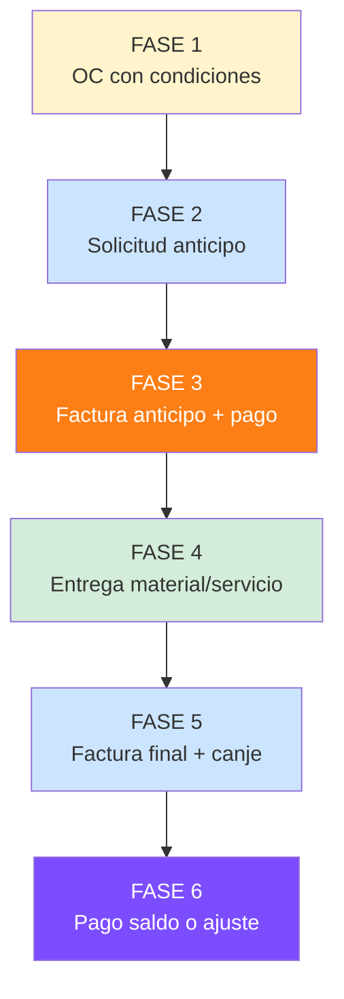
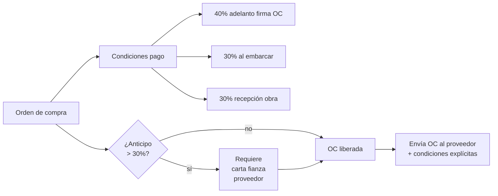
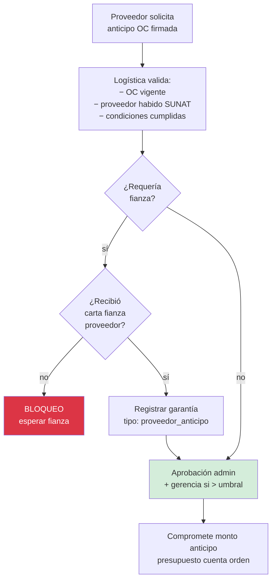
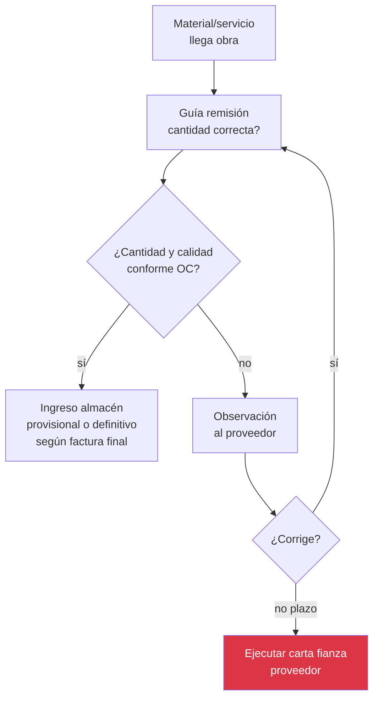
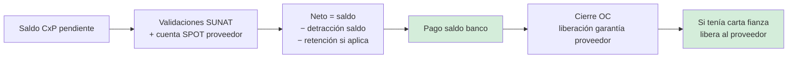

# 17 · Adelanto a proveedor · Anticipo · Canje

Flujo crítico construcción. Concreto premezclado, acero, equipos especiales requieren adelanto.

## Casos típicos

```
Concreto premezclado UNICON/MIXERCON:
  50% adelanto al ordenar · 50% contra entrega

Acero SIDERPERU/Aceros Arequipa:
  70% adelanto pedido · 30% al embarcar

Horno cremación importado:
  40% adelanto fabricación · 30% embarque · 30% entrega obra

Equipos especiales:
  50% al firmar OC · 50% recepción funcional
```

## Flujo completo · 6 fases



### Fase 1 · OC con condiciones de pago



### Fase 2 · Solicitud anticipo



### Fase 3 · Factura anticipo + pago

```mermaid
flowchart TB
    FAC_AD[Proveedor emite<br/>factura ADELANTO<br/>SUNAT tipo 01<br/>+ glosa "ANTICIPO"] --> VAL_FAC[Validación<br/>XML SUNAT]

    VAL_FAC --> CONT_REG[Asiento contable:<br/>Dr 422 Anticipos otorgados<br/>Dr 401 IGV crédito fiscal<br/>Cr 421 Facturas pagar]

    CONT_REG --> APL_DET[Aplicar detracción<br/>si corresponde]
    APL_DET --> PAGO_AD[Pago vía banco<br/>− detracción<br/>− retención si aplica]

    PAGO_AD --> CONT_PAG[Asiento pago:<br/>Dr 421 Facturas pagar<br/>Cr 104 Bancos]
    CONT_PAG --> NOTIF_PROV[Notificar proveedor<br/>pago realizado]

    NOTIF_PROV --> ESPERA[Espera entrega]

    style FAC_AD fill:#cce5ff
    style CONT_REG fill:#7c4dff,color:#fff
    style PAGO_AD fill:#fd7e14,color:#fff
```

### Fase 4 · Entrega material



### Fase 5 · Factura final + canje

```mermaid
flowchart TB
    FAC_FIN[Proveedor emite<br/>factura FINAL<br/>monto total OC] --> CHK[Sistema match:<br/>OC + anticipos previos]

    CHK --> CALC_SALDO[Calcular saldo:<br/>= total OC<br/>− anticipos pagados]

    CALC_SALDO --> CANJE[CANJE contable<br/>asiento crítico]

    CANJE --> AS_CANJE[Asiento canje:<br/>Dr 60 Compras suministros (TOTAL OC)<br/>Cr 422 Anticipos otorgados (anticipos)<br/>Cr 421 Facturas pagar (saldo)<br/>Dr/Cr 401 IGV ajuste]

    AS_CANJE --> Q_SALDO{¿Saldo > 0?}
    Q_SALDO -->|sí| FASE6[Pasa a fase 6<br/>pago saldo]
    Q_SALDO -->|= 0| CIERRE_OC[OC cerrada<br/>todo liquidado en anticipos]
    Q_SALDO -->|< 0 sobrepago| NOTA_CR[Solicitar NOTA CRÉDITO<br/>al proveedor]

    NOTA_CR --> AS_NC[Asiento NC:<br/>Dr 421 Facturas pagar<br/>Cr 60 Compras<br/>Cr 401 IGV]

    AS_NC --> DEV[Devolución proveedor<br/>o aplica próxima OC]

    style CANJE fill:#7c4dff,color:#fff
    style AS_CANJE fill:#7c4dff,color:#fff
    style NOTA_CR fill:#ffc107
```

### Fase 6 · Pago saldo



## Schema completo

```sql
-- Anticipos a proveedores
anticipos_proveedores (
  id uuid PRIMARY KEY,
  oc_id uuid REFERENCES ordenes_compra,
  proveedor_ruc varchar(11),
  proveedor_razon varchar,

  -- Monto
  monto_anticipo decimal(14,2),
  pct_anticipo decimal(5,4),                 -- 0.40 = 40%
  monto_oc_total decimal(14,2),              -- snapshot
  moneda char(3) DEFAULT 'PEN',
  tipo_cambio decimal(7,4),

  -- Fechas
  fecha_solicitud date,
  fecha_aprobacion date,
  fecha_pago date,
  fecha_canje_completo date,

  -- Documentos
  factura_anticipo_id uuid REFERENCES facturas_recibidas,
  factura_canje_id uuid REFERENCES facturas_recibidas,

  -- Garantía si aplica
  carta_fianza_proveedor_id uuid REFERENCES garantias,

  -- Estado
  estado ENUM (
    'borrador',
    'solicitado',
    'aprobado',
    'pagado',
    'parcialmente_canjeado',
    'totalmente_canjeado',
    'reclamo_devolucion',                    -- proveedor no entregó
    'cancelado'
  ),

  -- Tributario
  detraccion_codigo varchar(3),
  detraccion_monto decimal(14,2),
  detraccion_pagada boolean,

  -- Audit
  created_at, updated_at,
  aprobado_por uuid,
  observaciones text
)

-- Movimientos canje
canjes_anticipo (
  id uuid PRIMARY KEY,
  anticipo_id uuid REFERENCES anticipos_proveedores,
  factura_canje_id uuid REFERENCES facturas_recibidas,
  fecha_canje date,
  monto_canjeado decimal(14,2),
  saldo_post_canje decimal(14,2),
  asiento_canje_id uuid
)

-- Tipos factura SUNAT extendido
ALTER TABLE facturas_recibidas ADD COLUMN
  tipo_factura ENUM (
    'comercial',
    'adelanto',
    'saldo_canje',
    'nota_credito',
    'nota_debito'
  ) DEFAULT 'comercial',
  factura_relacionada_id uuid REFERENCES facturas_recibidas,
  anticipo_id uuid REFERENCES anticipos_proveedores;
```

## Reglas críticas

```sql
-- Reglas de negocio
CREATE FUNCTION validar_anticipo_proveedor(p_anticipo_id uuid)
RETURNS TABLE (puede boolean, motivos text[]) AS $$
DECLARE motivos text[] := '{}';
BEGIN
  -- 1. Anticipo > 30% requiere carta fianza proveedor
  IF (anticipo.pct_anticipo > 0.30) AND (anticipo.carta_fianza_proveedor_id IS NULL) THEN
    motivos := array_append(motivos, 'Anticipo > 30% requiere carta fianza');
  END IF;

  -- 2. OC vigente
  IF NOT (oc.estado IN ('aprobada','en_ejecucion')) THEN
    motivos := array_append(motivos, 'OC no vigente');
  END IF;

  -- 3. Proveedor habido SUNAT
  IF NOT proveedor_habido_sunat(anticipo.proveedor_ruc) THEN
    motivos := array_append(motivos, 'Proveedor no habido SUNAT');
  END IF;

  -- 4. Sumatoria anticipos no excede 100% OC
  IF (SUM(anticipos_pagados) + nuevo_monto > monto_oc) THEN
    motivos := array_append(motivos, 'Σ anticipos > monto OC');
  END IF;

  RETURN QUERY SELECT array_length(motivos,1) IS NULL, motivos;
END $$;
```

## Alertas tiempo

```
Anticipo pagado · sin entrega:
  +30 días → alerta admin
  +60 días → alerta gerencia
  +90 días → ESCALAMIENTO LEGAL · ejecución carta fianza
```

## Reportes

```
1. Anticipos vigentes
   Lista anticipos pagados sin canjear
   Días desde pago
   Riesgo (no entrega)

2. Top proveedores con anticipos
   Volumen, % default, días promedio entrega

3. Costo financiero anticipos
   Capital inmovilizado × tiempo
   Costo oportunidad

4. Variance OC final vs anticipos
   Cuántos casos requirieron NC
   Sobrepagos detectados
```

## KPIs

| KPI | Fórmula | Target |
|---|---|---|
| Anticipos pendientes canje | count anticipos pagados sin canje completo | dashboard |
| Tiempo medio entrega | avg(fecha_entrega − fecha_pago_anticipo) | < 30 días |
| % anticipos con fianza | with_fianza / total >30% | 100% |
| Capital inmovilizado | Σ anticipos pendientes × días | < S/ 200K mes |
| Default rate proveedores | proveedores que no entregaron / total | < 2% |

## Prioridad: **ALTA**
