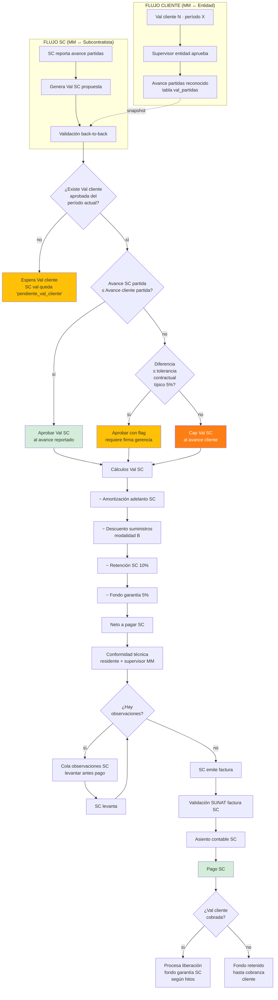
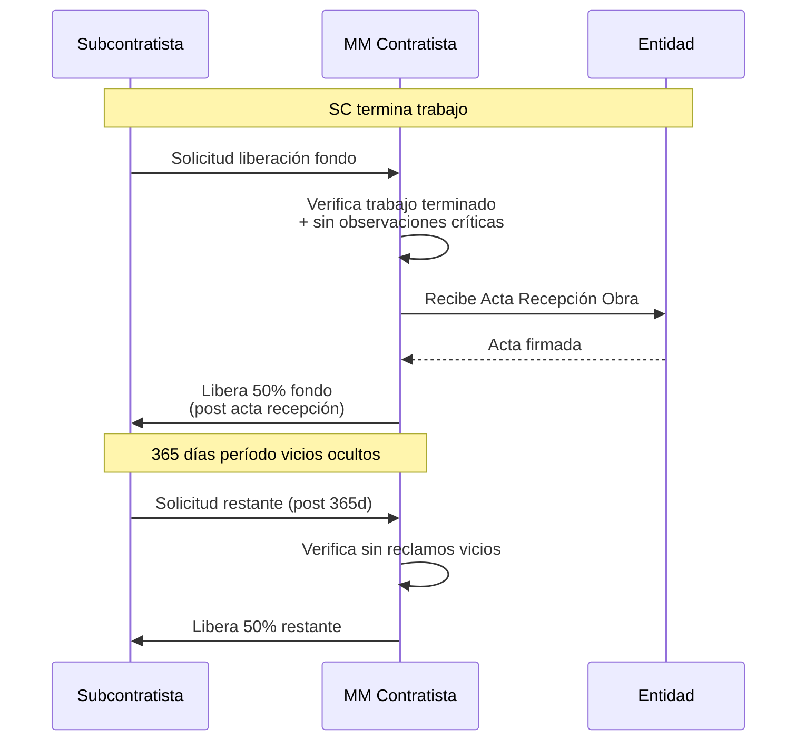

# 18 · Back-to-back Subcontratos

Reemplaza diseño SC anterior. Avance SC limitado a avance entidad.

## Principio

```
Avance SC ≤ Avance Cliente (entidad reconoció a contratista)

Si SC reporta 70% pero entidad solo aprobó 50% al contratista:
  → SC NO se le paga 70%
  → SC se limita a 50% (con tolerancia config)
  → Diferencia queda como "comprometido" hasta entidad apruebe
```

## Flujo back-to-back completo



## Comparación detallada partida × partida

```mermaid
flowchart TB
    BASE[Por cada partida en alcance SC] --> CMP[Comparación]

    CMP --> M_CLI[Metrado aprobado cliente<br/>(snapshot Val cliente)]
    CMP --> M_SC[Metrado reportado SC<br/>(parte diario SC)]

    M_CLI --> TBL[Tabla comparativa]
    M_SC --> TBL

    TBL --> RESUL{Resultado}
    RESUL -->|m_sc ≤ m_cli| OK1[Pago al m_sc real]
    RESUL -->|m_sc > m_cli<br/>diff ≤ tolerancia| OK2[Pago con flag<br/>+ comentario]
    RESUL -->|m_sc > m_cli<br/>diff > tolerancia| LIMIT[Pago = m_cli<br/>diferencia queda<br/>'pendiente Val cliente futura']

    style LIMIT fill:#fd7e14,color:#fff
```

## Ejemplo numérico

```
Caso: SC HORNO CREMACION · partida 02.04
  Avance SC reporta:           70%
  Avance Val cliente aprobado: 60%
  Tolerancia contractual:      5%

Diff = 70% − 60% = 10% > tolerancia 5% → LIMITAR

Acción:
  Pago SC limitado a 60%
  10% restante queda como "comprometido pendiente"
  Cuando Val cliente reconozca > 60%, libera

Cálculo Val SC limitada:
  Monto contrato SC:           S/ 380,000
  Avance SC:                   60% (limitado)
  Monto bruto:                 60% × 380,000 = 228,000
  − Amort adelanto SC 10%:     -22,800
  − Retención 10%:             -22,800
  − Fondo garantía 5%:         -11,400
  + IGV 18%:                   +41,040
  ─────────────────────────────────────
  Neto a pagar SC:             212,040
```

## Schema completo

```sql
-- Tipos modalidad SC
CREATE TYPE sc_modalidad AS ENUM (
  'todo_costo',                      -- SC pone todo
  'con_suministro_materiales'        -- MM provee materiales
);

CREATE TYPE sc_modalidad_pago AS ENUM (
  'back_to_back',                    -- limitado a avance cliente
  'financiado_propio'                -- MM paga independiente
);

CREATE TYPE sc_status_val AS ENUM (
  'pendiente_val_cliente',
  'limitado_a_cliente',
  'aprobado_con_tolerancia',
  'aprobado_sin_restricciones',
  'observado',
  'pagado'
);

subcontratos (
  ... existente
  + modalidad_pago sc_modalidad_pago DEFAULT 'back_to_back',
  + tolerancia_avance_pp decimal(5,2) DEFAULT 5.00,
  + pct_fondo_garantia decimal(5,4) DEFAULT 0.05,
  + dias_liberacion_fondo integer DEFAULT 365,
  + carta_fianza_sc_id uuid REFERENCES garantias,
  + adelanto_sc_id uuid                              -- si MM dio adelanto al SC
)

subcontrato_alcance_partidas (                       -- partidas que cubre SC
  id uuid PRIMARY KEY,
  subcontrato_id uuid,
  partida_id uuid,
  metrado_total decimal(14,4),
  pu_contractual decimal(14,4),                      -- precio que MM paga al SC
  monto_partida decimal(14,2)
)

subcontrato_valorizaciones (
  id uuid PRIMARY KEY,
  subcontrato_id uuid,
  numero integer,                                     -- correlativo SC
  fecha_desde date,
  fecha_hasta date,

  -- Vinculación back-to-back
  valorizacion_cliente_id uuid REFERENCES valorizaciones,  -- ★ KEY
  status_back_to_back sc_status_val,
  diferencia_avance_pp decimal(5,2),

  -- Cálculos
  monto_bruto_pre_amort decimal(14,2),
  amortizacion_adelanto decimal(14,2),
  retencion decimal(14,2),
  fondo_garantia_retenido decimal(14,2),
  descuento_suministros decimal(14,2),               -- modalidad B
  igv decimal(14,2),
  monto_neto decimal(14,2),

  status varchar,                                     -- 'borrador','aprobada','pagada'
  archivo_pdf_nas text
)

subcontrato_val_partidas (                           -- detalle por partida
  id uuid PRIMARY KEY,
  val_sc_id uuid REFERENCES subcontrato_valorizaciones,
  partida_id uuid,

  -- Avance SC reportado
  metrado_sc decimal(14,4),
  avance_sc_pct decimal(5,2),

  -- Snapshot avance cliente
  metrado_cliente decimal(14,4),
  avance_cliente_pct decimal(5,2),

  -- Resultado
  metrado_aprobado_pago decimal(14,4),               -- el menor
  diferencia_metrado decimal(14,4),
  diferencia_pct decimal(5,2),
  status varchar,                                     -- 'ok','limitado','con_tolerancia'
  monto_partida decimal(14,2)
)

-- Fondo garantía
fondo_garantia_movimientos (
  id uuid PRIMARY KEY,
  subcontrato_id uuid,
  val_sc_id uuid,
  tipo ENUM ('retencion','liberacion_50','liberacion_50_post_vicios','ejecucion'),
  fecha date,
  monto decimal(14,2),
  motivo text,
  asiento_id uuid
)

-- Observaciones
sc_observaciones (
  id uuid PRIMARY KEY,
  subcontrato_id uuid,
  val_sc_id uuid,
  origen ENUM ('mm_residente','mm_supervisor','entidad','tecnico'),
  partida_id uuid,
  descripcion text,
  metrado_observado decimal(14,4),
  monto_observado decimal(14,2),
  status ENUM ('pendiente','levantada','rechazada','cerrada'),
  fecha_apertura, fecha_levantamiento,
  evidencia_nas text,
  responsable_levantar uuid
)
```

## Función validación

```sql
CREATE FUNCTION validar_val_sc_back_to_back(p_val_sc_id uuid)
RETURNS TABLE (puede_aprobar boolean, ajustes jsonb, motivos text[]) AS $$
DECLARE
  v_motivos text[] := '{}';
  v_ajustes jsonb := '[]';
  v_val_sc record;
  v_val_cli record;
  v_partida record;
BEGIN
  SELECT * INTO v_val_sc FROM subcontrato_valorizaciones WHERE id = p_val_sc_id;

  -- 1. Existe val cliente del período
  IF v_val_sc.modalidad_pago = 'back_to_back' THEN
    SELECT * INTO v_val_cli FROM valorizaciones
    WHERE proyecto_id = (SELECT proyecto_id FROM subcontratos WHERE id = v_val_sc.subcontrato_id)
      AND status = 'aprobada'
      AND fecha_desde <= v_val_sc.fecha_hasta
      AND fecha_hasta >= v_val_sc.fecha_desde
    ORDER BY numero DESC LIMIT 1;

    IF v_val_cli IS NULL THEN
      v_motivos := array_append(v_motivos, 'No hay Val cliente aprobada del período');
      RETURN QUERY SELECT false, v_ajustes, v_motivos;
      RETURN;
    END IF;
  END IF;

  -- 2. Por cada partida del alcance: comparar avance
  FOR v_partida IN
    SELECT svp.*, vp.avance_acumulado_pct AS avance_cli
    FROM subcontrato_val_partidas svp
    LEFT JOIN valorizacion_partidas vp ON vp.partida_id = svp.partida_id
                                       AND vp.valorizacion_id = v_val_cli.id
    WHERE svp.val_sc_id = p_val_sc_id
  LOOP
    IF v_partida.avance_sc_pct > (v_partida.avance_cli + tolerancia) THEN
      -- Ajustar a avance cliente
      v_ajustes := v_ajustes || jsonb_build_object(
        'partida_id', v_partida.partida_id,
        'avance_reportado', v_partida.avance_sc_pct,
        'avance_aprobable', v_partida.avance_cli,
        'accion', 'limitado_a_cliente'
      );
    END IF;
  END LOOP;

  -- 3. Observaciones críticas pendientes
  IF EXISTS (
    SELECT 1 FROM sc_observaciones
    WHERE subcontrato_id = v_val_sc.subcontrato_id
      AND status = 'pendiente'
  ) THEN
    v_motivos := array_append(v_motivos, 'Observaciones pendientes de levantar');
  END IF;

  RETURN QUERY SELECT
    array_length(v_motivos,1) IS NULL,
    v_ajustes,
    v_motivos;
END $$ LANGUAGE plpgsql;
```

## Liberación fondo garantía



## Reportes

```
1. Avance SC vs Cliente
   Por SC, por partida
   Diff actual y proyectado
   Riesgo limitación pagos

2. Cola observaciones SC
   Pendientes levantar
   Días abiertos
   Impacto monetario

3. Fondo garantía retenido
   Por SC
   Días para liberación
   Trigger automático libera 50%

4. Capital atrapado
   Σ pagos SC adelantados sin Val cliente
   Riesgo recuperación
```

## KPIs

| KPI | Fórmula | Target |
|---|---|---|
| Avance SC > Cliente | count casos | < 5% |
| Capital atrapado | Σ pagado SC sin val cliente | minimizar |
| Tiempo levantar observaciones | avg días | < 7 días |
| Default SC | SCs que abandonaron | 0 |
| Liberación fondo a tiempo | en plazo / total | 100% |

## Prioridad: **CRÍTICA**
