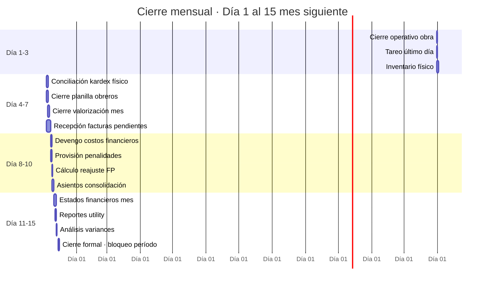
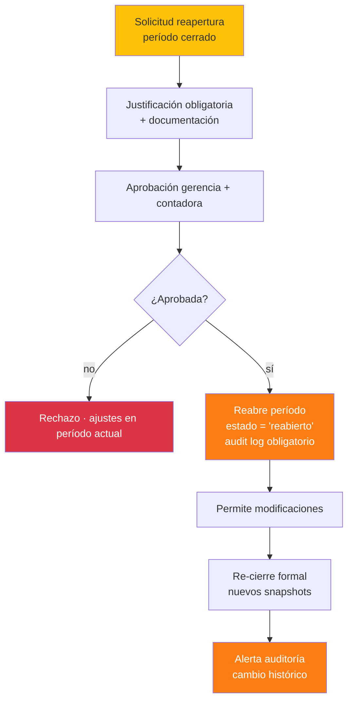

# 19 · Cierre mensual contable obra

Proceso batch de fin de mes que reconcilia, valida y bloquea período.

## Calendario tipo cierre mensual



## Flujo cierre mensual completo

```mermaid
flowchart TB
    INI[1ro día mes siguiente] --> FASE1[FASE 1<br/>Cierre operativo]

    FASE1 --> OP1[Cierra tareos último día mes anterior]
    OP1 --> OP2[Bloquea registro nuevo<br/>en período cerrado]
    OP2 --> OP3[Genera reporte productividad mes]

    OP3 --> FASE2[FASE 2<br/>Conciliación física]

    FASE2 --> CONC1[Inventario físico almacén]
    CONC1 --> CONC2[Compara stock físico vs kardex]
    CONC2 --> Q_DIF{¿Hay diferencias?}
    Q_DIF -->|sí mermas| AJ_M[Ajuste por merma<br/>Dr 65 Cr 25]
    Q_DIF -->|sí sobrante| AJ_S[Ajuste por sobrante<br/>Dr 25 Cr 75]
    Q_DIF -->|no| OK_INV[Inventario cuadrado]
    AJ_M --> OK_INV
    AJ_S --> OK_INV

    OK_INV --> FASE3[FASE 3<br/>Documentos pendientes]

    FASE3 --> DOC1[Recepción facturas pendientes<br/>cutoff fecha]
    DOC1 --> DOC2[Regulariza ingresos provisionales]
    DOC2 --> DOC3[Provisión facturas no recibidas<br/>servicios devengados<br/>Dr 65 Cr 469]

    DOC3 --> FASE4[FASE 4<br/>Cálculos financieros]

    FASE4 --> FIN1[Devengo costo cartas fianza<br/>Dr 67 Cr 469]
    FIN1 --> FIN2[Devengo prima pólizas<br/>Dr 65 Cr 469]
    FIN2 --> FIN3[Cálculo reajuste FP del mes<br/>aplica K a valorización]
    FIN3 --> FIN4[Provisión penalidades<br/>si hay supuestos<br/>Dr 65 Cr 469]
    FIN4 --> FIN5[Devengo planilla<br/>+ leyes sociales<br/>Dr 62 Cr 411]

    FIN5 --> FASE5[FASE 5<br/>Costos a partidas]

    FASE5 --> COS1[Distribuye consumos almacén<br/>por partida → cuenta 92]
    COS1 --> COS2[Distribuye MO planilla<br/>por partida según tareos]
    COS2 --> COS3[Asigna SC pagados a partidas]
    COS3 --> COS4[Prorratea GG a partidas]

    COS4 --> FASE6[FASE 6<br/>Asientos consolidación]

    FASE6 --> ASI1[Generar asientos detallados<br/>todos los movimientos]
    ASI1 --> ASI2[Verificar Σ Debe = Σ Haber<br/>por asiento]
    ASI2 --> ASI3[Verificar cuadre cuentas centrales]

    ASI3 --> FASE7[FASE 7<br/>Reportes mes]

    FASE7 --> REP1[Estados financieros mes]
    REP1 --> REP2[Utility a la fecha]
    REP2 --> REP3[Análisis variance APU vs real]
    REP3 --> REP4[EVM snapshot SPI/CPI]
    REP4 --> REP5[Cashflow proyección 90d]

    REP5 --> FASE8[FASE 8<br/>Validación gerencia]

    FASE8 --> VAL1[Gerente revisa reportes]
    VAL1 --> Q_OK{¿Aprueba<br/>cierre?}
    Q_OK -->|no| AJ_PEND[Ajustes pendientes<br/>volver a fase relevante]
    Q_OK -->|sí| BLOQ[BLOQUEO PERÍODO<br/>período = cerrado]

    AJ_PEND --> FASE3

    BLOQ --> POST[Estado período: cerrado<br/>solo lectura<br/>requiere reapertura formal<br/>para modificar]

    POST --> NEXT[Inicia mes siguiente]

    style FASE1 fill:#fff4cc
    style FASE2 fill:#cce5ff
    style FASE3 fill:#cce5ff
    style FASE4 fill:#fd7e14,color:#fff
    style FASE5 fill:#7c4dff,color:#fff
    style FASE6 fill:#7c4dff,color:#fff
    style FASE7 fill:#cce5ff
    style FASE8 fill:#d4edda
    style BLOQ fill:#dc3545,color:#fff
```



## Asientos contables consolidación típicos

```
Mes Diciembre 2025 · cierre

1. Devengo planilla obreros
   Dr 622 Sueldos y salarios obra       180,000
   Dr 627 Cargas seguridad social        25,000
       Cr 411 Remuneraciones por pagar  205,000

2. Distribución MO a partidas (analítica)
   Dr 92 Costo producción
       partida 02.01.03.02 COLUMNAS     65,000
       partida 02.01.03.04 VIGAS        50,000
       ...
       Cr 79 Cargas imputables           180,000

3. Devengo cartas fianza
   Dr 6792 Otros gastos financieros      18,500
       Cr 469 Otras CxP diversas         18,500

4. Devengo planilla plantel técnico (GG)
   Dr 632 Asesoría · servicios          45,000
       Cr 411 Remuneraciones             45,000

5. Provisión SC trabajo ejecutado pero no facturado
   Dr 632 Subcontratos                  120,000
       Cr 469 Provisiones diversas      120,000

6. Reajuste FP cobrar entidad (devengado)
   Dr 121 Facturas por cobrar             5,200
       Cr 70 Ventas obra                  5,200

7. Cierre análitico costos partidas
   Dr 91 Centros de costo (partidas)
       Cr 92 Costo producción
   (resumen por partida total mes)
```

## Schema cierre

```sql
-- Períodos contables
periodos_contables (
  id uuid PRIMARY KEY,
  proyecto_id uuid,
  anio integer,
  mes integer,
  fecha_inicio date,
  fecha_fin date,
  estado ENUM ('abierto','en_cierre','cerrado','bloqueado','reabierto'),
  fecha_cierre timestamp,
  cerrado_por uuid,
  reabierto_por uuid,
  motivo_reapertura text,
  fecha_reapertura timestamp
)

-- Asientos
ALTER TABLE asientos ADD COLUMN periodo_id uuid REFERENCES periodos_contables;

-- Validación: solo crear/modificar asientos en período abierto
CREATE FUNCTION validar_periodo_abierto()
RETURNS trigger AS $$
DECLARE
  v_estado varchar;
BEGIN
  SELECT estado INTO v_estado
  FROM periodos_contables WHERE id = NEW.periodo_id;

  IF v_estado IN ('cerrado','bloqueado') THEN
    RAISE EXCEPTION 'Período %s cerrado · no permite modificaciones', v_estado;
  END IF;

  RETURN NEW;
END $$;

CREATE TRIGGER tr_asientos_periodo
  BEFORE INSERT OR UPDATE ON asientos
  FOR EACH ROW EXECUTE FUNCTION validar_periodo_abierto();

-- Tareas cierre
cierre_mensual_tareas (
  id uuid PRIMARY KEY,
  periodo_id uuid REFERENCES periodos_contables,
  fase integer,                              -- 1 a 8
  tarea varchar,                              -- 'inventario_fisico','devengo_fianzas',etc
  status ENUM ('pendiente','en_proceso','completada','observada','omitida'),
  responsable uuid,
  fecha_inicio timestamp,
  fecha_fin timestamp,
  observaciones text,
  evidencia_nas text
)

-- Snapshot cierre
cierre_snapshots (
  id uuid PRIMARY KEY,
  periodo_id uuid,
  fecha_snapshot timestamp,
  monto_total_costos decimal(14,2),
  monto_total_ingresos decimal(14,2),
  utility_periodo decimal(14,2),
  spi decimal(7,4),
  cpi decimal(7,4),
  evm_snapshot_id uuid,
  reporte_pdf_nas text
)
```

## Reapertura período (excepcional)



## Validaciones críticas pre-cierre

```sql
CREATE FUNCTION puede_cerrar_periodo(p_periodo_id uuid)
RETURNS TABLE (puede boolean, bloqueos jsonb) AS $$
DECLARE bloqueos jsonb := '[]';
BEGIN
  -- 1. Inventario físico realizado
  IF NOT EXISTS (SELECT 1 FROM cierre_mensual_tareas
                 WHERE periodo_id = p_periodo_id
                   AND tarea = 'inventario_fisico'
                   AND status = 'completada') THEN
    bloqueos := bloqueos || jsonb_build_object('codigo','INV_PENDIENTE',
      'mensaje','Inventario físico no realizado');
  END IF;

  -- 2. Σ Debe = Σ Haber todos asientos
  IF EXISTS (
    SELECT 1 FROM asientos a
    JOIN asientos_lineas al ON al.asiento_id = a.id
    WHERE a.periodo_id = p_periodo_id
    GROUP BY a.id
    HAVING SUM(al.debe) != SUM(al.haber)
  ) THEN
    bloqueos := bloqueos || jsonb_build_object('codigo','ASIENTO_DESCUADRADO',
      'mensaje','Asientos sin cuadrar');
  END IF;

  -- 3. Movimientos provisionales sin regularizar > 30 días
  IF EXISTS (
    SELECT 1 FROM almacen_movimientos
    WHERE periodo_id = p_periodo_id
      AND estado_documental != 'definitivo'
      AND fecha_limite_regularizacion < CURRENT_DATE
  ) THEN
    bloqueos := bloqueos || jsonb_build_object('codigo','MOV_PROV_VENCIDOS',
      'mensaje','Movimientos provisionales vencidos sin regularizar');
  END IF;

  -- 4. Conciliación bancaria pendiente
  IF NOT EXISTS (SELECT 1 FROM cierre_mensual_tareas
                 WHERE periodo_id = p_periodo_id
                   AND tarea = 'conciliacion_bancaria'
                   AND status = 'completada') THEN
    bloqueos := bloqueos || jsonb_build_object('codigo','BANCO_NO_CONCILIADO',
      'mensaje','Conciliación bancaria pendiente');
  END IF;

  -- 5. Validación SUNAT facturas pendientes
  IF EXISTS (
    SELECT 1 FROM facturas_recibidas
    WHERE periodo_id = p_periodo_id
      AND xml_validado = false
  ) THEN
    bloqueos := bloqueos || jsonb_build_object('codigo','SUNAT_PENDIENTE',
      'mensaje','Facturas no validadas con SUNAT');
  END IF;

  RETURN QUERY SELECT jsonb_array_length(bloqueos) = 0, bloqueos;
END $$;
```

## KPIs cierre

| KPI | Target |
|---|---|
| Días cierre mes | ≤ 10 días post-cierre operativo |
| % asientos auto vs manual | > 85% auto |
| Variance kardex físico | < 0.5% |
| Reaperturas período / año | ≤ 2 |
| Movimientos pendientes regularizar | = 0 |

## Prioridad: **ALTA**
