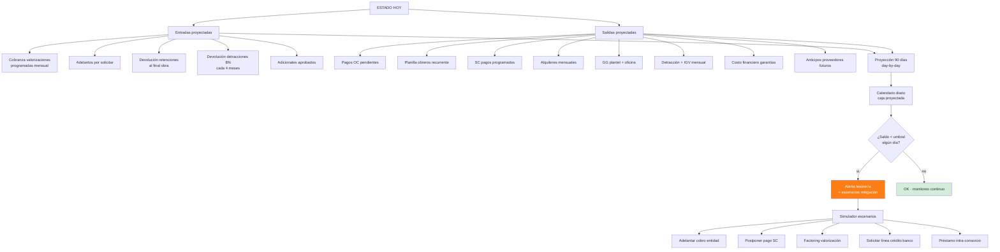
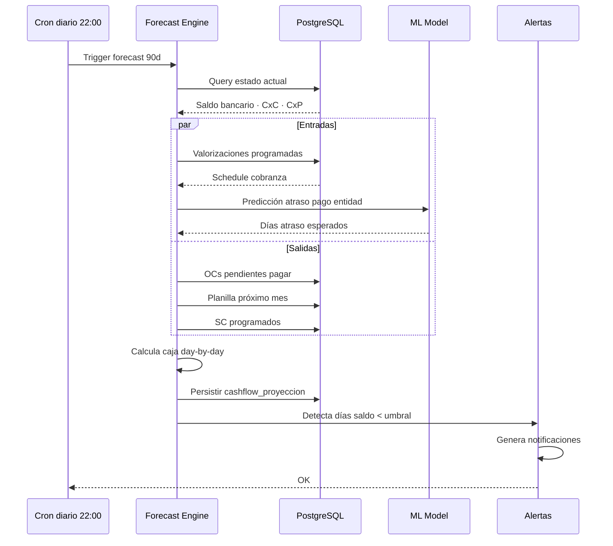
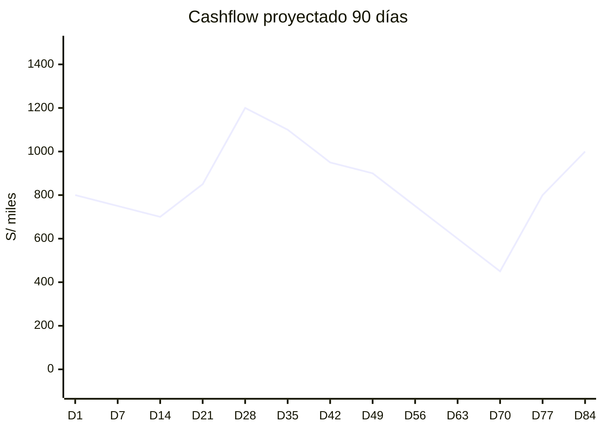
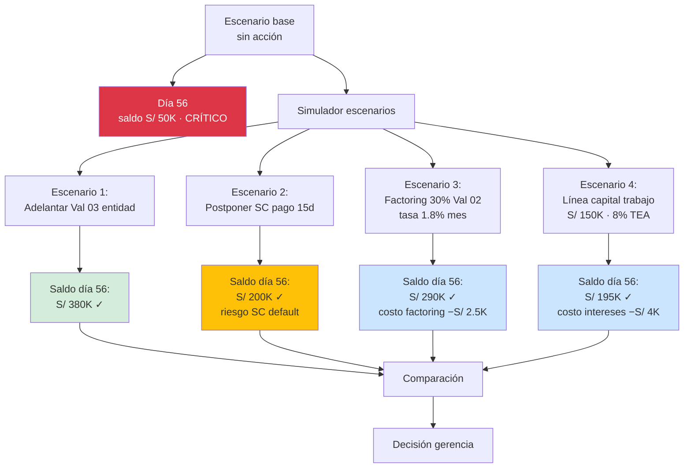
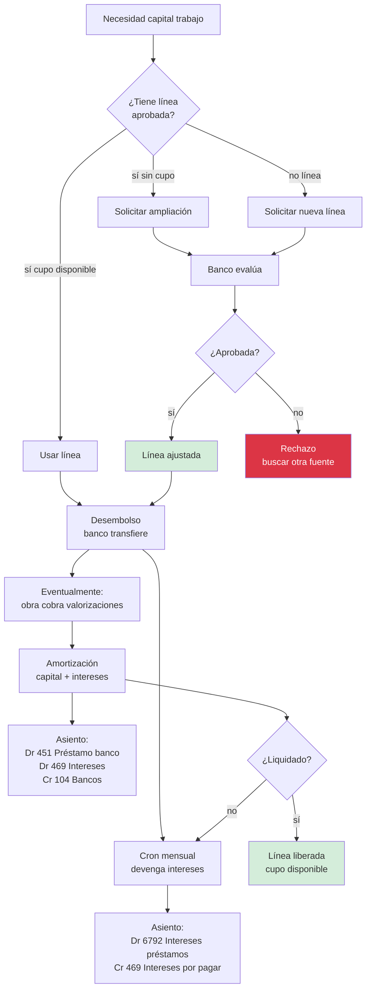

# 20 · Cashflow predictivo + Línea bancaria

Sin esto reventas caja antes de darte cuenta.

## Modelo cash flow 360°



## Flujo cálculo cashflow



## Schema

```sql
-- Forecast cash flow
cashflow_proyecciones (
  id uuid PRIMARY KEY,
  proyecto_id uuid,                              -- NULL = consolidado empresa
  fecha_proyeccion date,                         -- día específico
  fecha_calculo timestamp,

  -- Entradas
  cobranza_valorizaciones decimal(14,2),
  cobranza_adelantos decimal(14,2),
  cobranza_otros decimal(14,2),
  total_entradas decimal(14,2),

  -- Salidas
  pago_oc decimal(14,2),
  pago_planilla decimal(14,2),
  pago_sc decimal(14,2),
  pago_alquileres decimal(14,2),
  pago_gg decimal(14,2),
  pago_tributos decimal(14,2),
  pago_costo_financiero decimal(14,2),
  total_salidas decimal(14,2),

  -- Saldo
  saldo_apertura decimal(14,2),
  flujo_neto decimal(14,2),
  saldo_cierre decimal(14,2),

  -- Detalle items
  detalle_entradas jsonb,                        -- lista items
  detalle_salidas jsonb,

  -- Confianza
  nivel_confianza decimal(3,2),                  -- 0..1 (más cercano más alto)

  -- Alertas
  alerta_saldo_negativo boolean,
  alerta_proximidad_umbral boolean
)

cashflow_eventos_programados (
  id uuid PRIMARY KEY,
  proyecto_id uuid,
  tipo ENUM ('cobro_valorizacion','pago_oc','pago_sc','pago_planilla',
             'pago_alquiler','pago_tributo','pago_costo_financiero',
             'cobro_adelanto','cobro_devolucion','prestamo_intercompany'),
  monto decimal(14,2),
  fecha_programada date,
  fecha_real date,
  origen_tabla varchar,
  origen_id uuid,
  estado ENUM ('proyectado','confirmado','realizado','cancelado','postpuesto'),
  observaciones text
)

-- Umbrales alertas
cashflow_umbrales (
  empresa_id uuid,
  umbral_alerta decimal(14,2),                   -- saldo mínimo
  umbral_critico decimal(14,2),                  -- saldo emergencia
  dias_horizonte integer DEFAULT 90,
  notificar_emails text[]
)
```

## Visualización dashboard



Línea verde = saldo proyectado · línea roja = umbral mínimo · línea amarilla = umbral alerta

## Escenarios simulación



## Línea bancaria capital trabajo



## Schema línea bancaria capital

```sql
-- (Extensión a lineas_bancarias del flujo 15)
prestamos_capital_trabajo (
  id uuid PRIMARY KEY,
  linea_id uuid REFERENCES lineas_bancarias,
  empresa_id uuid,
  proyecto_id uuid,                              -- NULL si general empresa

  monto_solicitado decimal(14,2),
  monto_desembolsado decimal(14,2),
  monto_amortizado decimal(14,2),
  saldo_capital decimal(14,2)
    GENERATED AS (monto_desembolsado - monto_amortizado) STORED,

  tasa_anual decimal(5,4),                       -- 0.08 = 8% TEA
  plazo_meses integer,
  cuota_mensual decimal(14,2),

  fecha_desembolso date,
  fecha_vencimiento date,

  estado ENUM ('solicitado','aprobado','desembolsado','en_pago','liquidado','default'),

  proposito text,                                 -- "Adelantar pagos SC HORNO mes 3"
  contrato_pdf_nas text,

  intereses_devengados_acumulado decimal(14,2),
  intereses_pagados_acumulado decimal(14,2)
)

prestamo_pagos (
  id uuid PRIMARY KEY,
  prestamo_id uuid REFERENCES prestamos_capital_trabajo,
  fecha_pago date,
  monto_capital decimal(14,2),
  monto_intereses decimal(14,2),
  monto_total decimal(14,2),
  saldo_post decimal(14,2),
  asiento_id uuid
)
```

## ML forecasting · predicción atraso pago entidad

```python
# Pseudo-código modelo

features = [
    'tipo_entidad',          # municipalidad / regional / ministerio
    'monto_valorizacion',
    'numero_valorizacion',   # primera, segunda, etc
    'mes_calendario',        # diciembre tarda más
    'dias_obra_total',
    'dias_atraso_val_anterior',
    'avance_fisico_pct',
    'observaciones_supervisor',  # boolean
    'reajuste_aplicado',
    'historial_atraso_entidad',  # promedio
]

target = 'dias_atraso_pago'

# Modelo: Random Forest o XGBoost
# Features importance esperada:
#   1. historial_atraso_entidad (0.35)
#   2. mes_calendario (0.20)
#   3. observaciones_supervisor (0.15)
#   4. monto_valorizacion (0.12)
#   ...
```

## Reportes cashflow

```
1. Calendario 90 días
   Vista day-by-day · saldo proyectado
   Color zonas · alertas

2. Heatmap riesgos
   Días críticos resaltados
   Eventos disparadores

3. Sensibilidad escenarios
   Slider parámetros (atraso pago entidad ±10 días, etc)
   Recálculo en vivo

4. Detalle entradas/salidas día específico
   Click día → drilldown items

5. Comparativo proyectado vs real
   Histórico precisión forecast
   Mejora modelo ML
```

## KPIs

| KPI | Fórmula | Target |
|---|---|---|
| Días caja positiva próx 90d | count días saldo > 0 | 90 ideal |
| Precisión forecast 30d | |proyectado − real| / real | < 10% |
| Saldo mínimo proyectado | min(saldo 90d) | > umbral_alerta |
| Línea bancaria utilizada | consumido / aprobado | < 70% saludable |
| Capital atrapado anticipos | Σ anticipos sin canje | < 5% caja |
| Costo financiero / utility | costo_fin / utility | < 5% |

## Prioridad: **ALTA**
