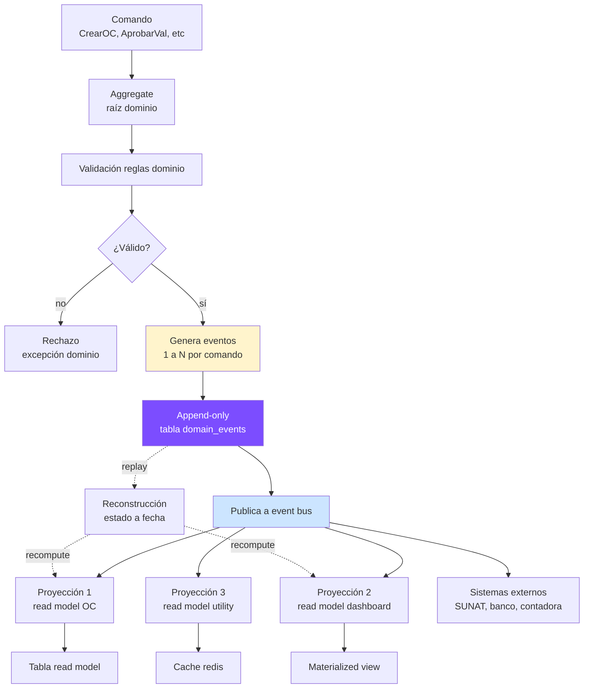
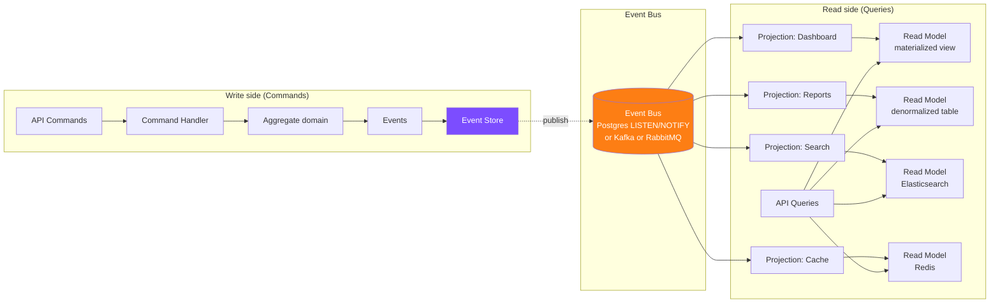

# 21 · Event Sourcing + CQRS + Audit inmutable

Arquitectura enterprise para auditoría regulatoria, performance y evolución del sistema.

## Por qué event sourcing en obras públicas

```
Razones:
  1. Auditoría SUNAT puede requerir reconstruir estado a fecha pasada
  2. OCI (Órgano Control Interno) audita obras post-cierre
  3. Arbitraje requiere demostrar timeline exacto eventos
  4. Cambios contractuales múltiples · linaje completo
  5. Recompute valorizaciones tras correcciones retroactivas
```

## Modelo event store



## Schema event store

```sql
-- Tabla append-only · NUNCA UPDATE/DELETE
CREATE TABLE domain_events (
  id uuid PRIMARY KEY DEFAULT gen_random_uuid(),
  sequence_number bigserial UNIQUE,            -- orden global · monotónico
  aggregate_type varchar NOT NULL,              -- 'Proyecto','Valorizacion','OC','Subcontrato'
  aggregate_id uuid NOT NULL,
  aggregate_version integer NOT NULL,           -- version del aggregate post-evento
  event_type varchar NOT NULL,                  -- 'ProyectoCreated','ValAprobada'
  event_version integer DEFAULT 1,              -- schema version del evento
  payload jsonb NOT NULL,                       -- datos del evento
  metadata jsonb NOT NULL,                      -- user_id, ip, request_id, correlation_id
  occurred_at timestamp with time zone DEFAULT now(),  -- cuando ocurrió en negocio
  recorded_at timestamp with time zone DEFAULT now()   -- cuando se registró
);

-- Índices críticos
CREATE INDEX ix_de_aggregate ON domain_events (aggregate_type, aggregate_id, sequence_number);
CREATE INDEX ix_de_event_type ON domain_events (event_type);
CREATE INDEX ix_de_occurred_at ON domain_events (occurred_at);
CREATE INDEX ix_de_correlation ON domain_events ((metadata->>'correlation_id'));

-- INMUTABILIDAD: revoke UPDATE y DELETE
REVOKE UPDATE, DELETE, TRUNCATE ON domain_events FROM PUBLIC;
ALTER TABLE domain_events ADD CONSTRAINT no_update CHECK (true);

-- Trigger preventivo
CREATE OR REPLACE FUNCTION prevent_event_modification()
RETURNS trigger AS $$
BEGIN
  RAISE EXCEPTION 'Domain events are immutable';
  RETURN NULL;
END $$ LANGUAGE plpgsql;

CREATE TRIGGER tr_no_update_events
  BEFORE UPDATE OR DELETE ON domain_events
  FOR EACH ROW EXECUTE FUNCTION prevent_event_modification();

-- Snapshot opcional para performance
CREATE TABLE aggregate_snapshots (
  aggregate_type varchar NOT NULL,
  aggregate_id uuid NOT NULL,
  aggregate_version integer NOT NULL,
  snapshot jsonb NOT NULL,
  created_at timestamp DEFAULT now(),
  PRIMARY KEY (aggregate_type, aggregate_id)
);
```

## Catálogo eventos dominio

```typescript
// Bounded context: Contractual
type ProyectoCreated = {
  proyectoId: string;
  codigo: string;
  cui?: string;
  montoReferencial: number;
  managerId: string;
};

type ContratoFirmado = {
  proyectoId: string;
  numeroContrato: string;
  fechaFirma: Date;
  montoContractual: number;
  factorOferta: number;
  diasPlazo: number;
};

type ActaInicioFirmada = {
  proyectoId: string;
  fechaActaInicio: Date;
};

type ModificacionContractualAprobada = {
  proyectoId: string;
  modificacionId: string;
  tipo: 'adicional' | 'reduccion' | 'ampliacion_plazo' | 'paralizacion';
  numeroResolucion: string;
  montoDelta: number;
  diasDelta: number;
};

// Bounded context: Procurement
type OCAprobada = {
  ocId: string;
  proyectoId: string;
  proveedorRuc: string;
  monto: number;
  lineas: Array<{recursoId: string, cantidad: number, pu: number}>;
};

type FacturaRecibida = {
  facturaId: string;
  ocId?: string;
  proveedorRuc: string;
  serie: string;
  numero: string;
  total: number;
  detraccionAplica: boolean;
  detraccionMonto?: number;
};

type IngresoAlmacen = {
  movimientoId: string;
  proyectoId: string;
  recursoId: string;
  cantidad: number;
  costoUnitario: number;
  estadoDocumental: 'definitivo' | 'provisional_guia' | 'provisional_urgencia';
  ocId?: string;
};

type SalidaAlmacen = {
  movimientoId: string;
  proyectoId: string;
  recursoId: string;
  cantidad: number;
  costoUnitarioPromedio: number;
  partidaDestinoId: string;
  responsableUserId: string;
};

// Bounded context: Operación
type AvanceRegistrado = {
  partidaId: string;
  fecha: Date;
  avanceAcumuladoPct: number;
  metradoEjecutado: number;
  fotosNas: string[];
};

type ParteDiarioRegistrado = {
  parteDiarioId: string;
  proyectoId: string;
  fecha: Date;
  partidaId: string;
  metradoEjecutado: number;
  hhInvertidas: number;
};

// Bounded context: Finanzas
type ValorizacionEmitida = {
  valorizacionId: string;
  proyectoId: string;
  numero: number;
  fechaDesde: Date;
  fechaHasta: Date;
  montoBruto: number;
  amortizaciones: object;
  retencion: number;
  monto Neto: number;
};

type ValorizacionAprobada = {
  valorizacionId: string;
  fechaAprobacion: Date;
  observacionesSupervisor?: string;
};

type ValorizacionCobrada = {
  valorizacionId: string;
  fechaCobranza: Date;
  montoCobrado: number;
  detraccionRetenida: number;
};

type AdelantoSolicitado = {
  adelantoId: string;
  proyectoId: string;
  tipo: 'directo' | 'materiales' | 'avance';
  montoSolicitado: number;
};

type AdelantoPagado = {
  adelantoId: string;
  fechaPago: Date;
  cartaFianzaGarantiaId: string;
  montoPagado: number;
};

type AmortizacionAplicada = {
  adelantoId: string;
  valorizacionId: string;
  montoAmortizado: number;
};

type PenalidadAplicada = {
  penalidadId: string;
  proyectoId: string;
  catalogoId: string;
  valorizacionId?: string;
  monto: number;
  diasRetraso?: number;
};

// Bounded context: Contabilidad
type AsientoRegistrado = {
  asientoId: string;
  fecha: Date;
  glosa: string;
  lineas: Array<{cuenta: string, debe: number, haber: number}>;
};

type PeriodoCerrado = {
  periodoId: string;
  proyectoId: string;
  anio: number;
  mes: number;
  cerradoPor: string;
};

// Bounded context: RRHH
type TareoRegistrado = {
  tareoId: string;
  trabajadorId: string;
  fecha: Date;
  partidaId: string;
  horasNormales: number;
  horasExtras: number;
};

type PlanillaCerrada = {
  periodoId: string;
  proyectoId: string;
  totalBruto: number;
  totalLeyesSociales: number;
};
```

## CQRS · separación read/write



## Implementación lite con Postgres

```sql
-- LISTEN/NOTIFY built-in para casos < 10K events/sec
-- No necesita Kafka/RabbitMQ

CREATE FUNCTION notify_event()
RETURNS trigger AS $$
BEGIN
  PERFORM pg_notify(
    'domain_events',
    jsonb_build_object(
      'id', NEW.id,
      'aggregate_type', NEW.aggregate_type,
      'event_type', NEW.event_type,
      'sequence', NEW.sequence_number
    )::text
  );
  RETURN NEW;
END $$ LANGUAGE plpgsql;

CREATE TRIGGER tr_notify_event
  AFTER INSERT ON domain_events
  FOR EACH ROW EXECUTE FUNCTION notify_event();

-- Listener Node.js
-- pg.connect.query('LISTEN domain_events')
-- pg.on('notification', msg => dispatchToProjections(msg))
```

## Replay para auditoría

```typescript
// Reconstruir estado proyecto a fecha pasada
async function getProyectoStateAt(proyectoId: string, atDate: Date) {
  const events = await db.query(`
    SELECT * FROM domain_events
    WHERE aggregate_type = 'Proyecto'
      AND aggregate_id = $1
      AND occurred_at <= $2
    ORDER BY sequence_number ASC
  `, [proyectoId, atDate]);

  let state = initialProyectoState();
  for (const event of events) {
    state = applyEvent(state, event);
  }
  return state;
}

// Útil para:
// - Auditoría OCI ("estado del proyecto al 31/12/2025")
// - Recompute valorización con corrección retroactiva
// - Análisis arbitral
```

## Materialized views como read models

```sql
-- View: Dashboard proyecto
CREATE MATERIALIZED VIEW mv_proyecto_dashboard AS
SELECT
  p.id, p.codigo, p.nombre, p.status,
  p.monto_vigente,

  -- Avance físico
  (SELECT AVG(percent_complete)
   FROM partidas WHERE proyecto_id = p.id) AS avance_fisico_pct,

  -- Avance financiero
  (SELECT SUM(monto_total) FROM valorizaciones
   WHERE proyecto_id = p.id AND status = 'cobrada') AS cobrado,

  -- Costo real
  costo_real_proyecto(p.id) AS costo_real_acumulado,

  -- Utility
  cobrado - costo_real_acumulado AS utility_a_la_fecha,

  -- KPIs
  (SELECT spi FROM evm_snapshots
   WHERE proyecto_id = p.id ORDER BY fecha_corte DESC LIMIT 1) AS spi,
  (SELECT cpi FROM evm_snapshots
   WHERE proyecto_id = p.id ORDER BY fecha_corte DESC LIMIT 1) AS cpi,

  -- Riesgos
  (SELECT COUNT(*) FROM garantias
   WHERE proyecto_id = p.id AND estado = 'por_vencer_30d') AS garantias_por_vencer,

  -- Última actualización
  now() AS ultima_actualizacion

FROM proyectos p
WHERE p.deleted_at IS NULL;

-- Refresh
CREATE INDEX ON mv_proyecto_dashboard (id);
REFRESH MATERIALIZED VIEW CONCURRENTLY mv_proyecto_dashboard;

-- Cron cada 5 min en horario operativo, cada hora fuera
```

## Audit inmutable

```sql
-- Audit log alternativo más estricto
CREATE TABLE audit_log_immutable (
  id uuid PRIMARY KEY,
  user_id uuid NOT NULL,
  user_email varchar NOT NULL,                  -- snapshot
  user_role varchar NOT NULL,                   -- snapshot
  action varchar NOT NULL,
  entity_type varchar,
  entity_id uuid,
  payload_before jsonb,
  payload_after jsonb,
  payload_diff jsonb,                           -- computed diff
  ip varchar,
  user_agent text,
  request_id uuid,
  correlation_id uuid,
  occurred_at timestamp with time zone DEFAULT now(),

  -- Hash chain (blockchain-like) · garantía no manipulación
  previous_hash varchar(64),                    -- SHA-256 del registro anterior
  current_hash varchar(64) GENERATED ALWAYS AS (
    encode(sha256(
      (id::text || user_id::text || action || coalesce(entity_id::text,'') ||
       coalesce(payload_diff::text,'') || occurred_at::text || coalesce(previous_hash,''))::bytea
    ), 'hex')
  ) STORED
);

-- Solo INSERT permitido
REVOKE UPDATE, DELETE ON audit_log_immutable FROM PUBLIC;

-- Verificar integridad chain
CREATE FUNCTION verify_audit_chain()
RETURNS TABLE (broken_at uuid) AS $$
WITH ordered AS (
  SELECT *, LAG(current_hash) OVER (ORDER BY occurred_at) AS expected_previous
  FROM audit_log_immutable
)
SELECT id FROM ordered
WHERE previous_hash IS DISTINCT FROM expected_previous
  AND occurred_at > (SELECT MIN(occurred_at) FROM audit_log_immutable);
$$ LANGUAGE sql;
```

## Beneficios concretos

```
1. Auditoría OCI a 5 años:
   "Necesitamos reconstruir cómo se aprobó la modificación X el 23/04/2026"
   → SELECT events WHERE entity = X ORDER BY sequence
   → Reproducible al 100%

2. Bug retrospectivo:
   "Nos dimos cuenta que cálculo amortización tuvo error en valorización V03"
   → Replay events V01..V05 con código corregido
   → Genera correcting events
   → Read models se rebuilden

3. Compliance SUNAT:
   "Mostrar todas las modificaciones a la factura X"
   → SELECT events WHERE aggregate=Factura, id=X
   → Timeline completo

4. Arbitraje:
   "Demostrar que la entidad observó tarde la valorización"
   → Eventos con timestamps inmutables
   → Hash chain garantiza no manipulación
```

## Trade-offs

```
PROS:
  ✓ Auditoría perfecta
  ✓ Replay para correcciones
  ✓ Time-travel queries
  ✓ Decoupling write/read
  ✓ Performance lectura (materialized views)

CONS:
  ✗ Curva aprendizaje equipo
  ✗ Más infraestructura (event bus)
  ✗ Storage crece append-only
  ✗ Eventual consistency
  ✗ Testing más complejo

RECOMENDACIÓN:
  - Empezar con event sourcing en agregados críticos:
    Valorizaciones, OC, Subcontratos, Modificaciones
  - Resto con CRUD tradicional + audit log
  - Migrar incrementalmente
```

## Prioridad: **ALTA · Tier 3**
