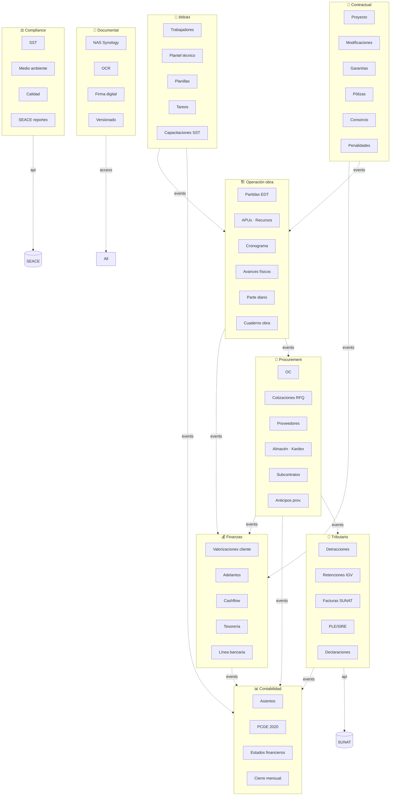
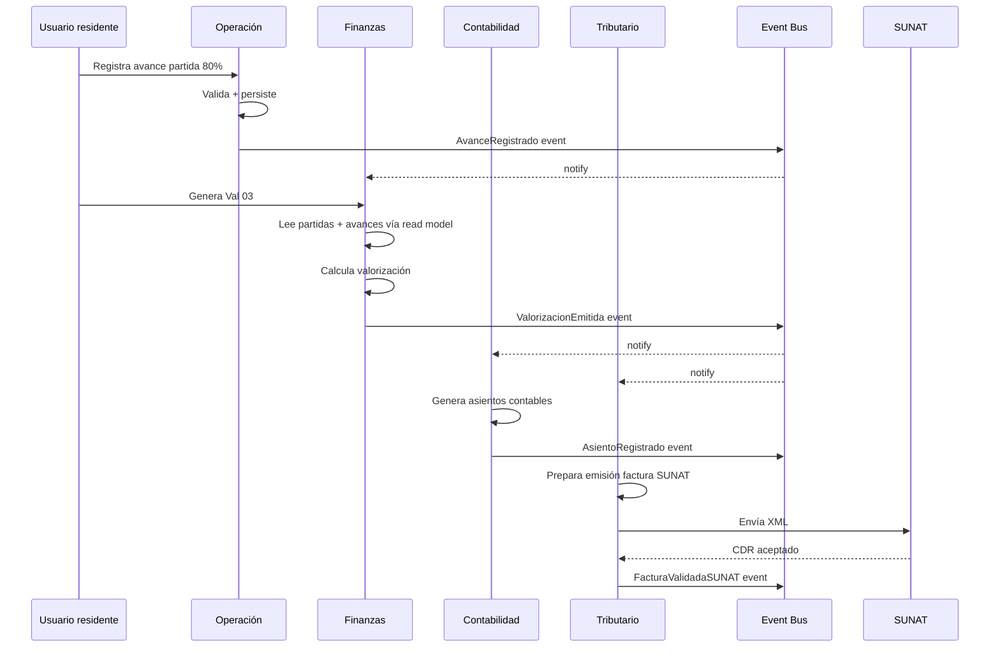

# 22 · Bounded Contexts DDD

División dominio para escalar arquitectura. Cada contexto = microservicio potencial.

## Mapa contextos



## Detalle por contexto

### Contractual

```
Aggregate roots:
  Proyecto         (root, anidado: Modificaciones, Penalidades catálogo)
  Garantia
  Poliza
  Consorcio        (root, anidado: Integrantes, Cuentas bancarias, Resoluciones)

Servicios dominio:
  CalculadorMontoVigente
  ValidadorTopeReducciones
  ValidadorTopeAdicionales
  AplicadorPenalidad

Eventos publicados:
  ProyectoCreado
  ContratoFirmado
  ActaInicioFirmada
  ModificacionAprobada
  GarantiaEmitida / Renovada / Vencida / Ejecutada
  PenalidadAplicada
  ConsorcioConstituido / Disuelto

Eventos consumidos:
  ValorizacionCobrada (para amortizar adelantos)
  OCAprobada (validar tope adicional)

Lenguaje ubicuo:
  CUI, Etapa, Buena Pro, Consentimiento, Suma alzada, Precios unitarios,
  Adicional, Deductivo, Reducción, Ampliación plazo, Paralización
```

### Operación obra

```
Aggregate roots:
  Partida          (root, anidado: APU, Avances)
  Cronograma       (root, anidado: Baseline, snapshots)
  ParteDiario
  CuadernoObra

Servicios dominio:
  CalculadorAvanceAcumulado
  GeneradorCurvaS
  CalculadorEVM
  ProductividadAnalyzer

Eventos publicados:
  PartidaCreada (importación S10)
  AvanceRegistrado
  ParteDiarioRegistrado
  CronogramaReprogramado
  HitoAlcanzado

Eventos consumidos:
  ModificacionAprobada (afecta partidas)
  ContratoFirmado (set baseline original)

Lenguaje:
  EDT, Metrado, APU, Rendimiento, Hito, Curva S, Línea base,
  SPI, CPI, Predecesor
```

### Procurement

```
Aggregate roots:
  OrdenCompra     (root, anidado: Líneas, Aprobaciones)
  Subcontrato     (root, anidado: Valorizaciones SC, Suministros)
  Almacen         (root, anidado: Movimientos, Stock)
  Proveedor

Servicios dominio:
  ValuadorKardexPromedioPonderado
  ClasificadorIU
  ValidadorBackToBack
  ProrrateadorOC

Eventos publicados:
  OCAprobada
  IngresoAlmacen
  SalidaAlmacen
  FacturaRecibida
  AnticipoProveedorPagado / Canjeado
  SubcontratoFirmado
  ValorizacionSCAprobada
  FondoGarantiaSCLiberado

Eventos consumidos:
  ValorizacionAprobada (para back-to-back SC)
  PartidaActualizada (ajustar OC)

Lenguaje:
  RFQ, Cotización, Guía remisión, NIA, Vale salida, Kardex,
  Promedio ponderado, IU, Monomio, Reajuste, Anticipo, Canje
```

### Finanzas

```
Aggregate roots:
  Valorizacion     (root, anidado: Partidas valorizadas, Checklist)
  Adelanto
  Penalidad        (aplicada)
  Reajuste

Servicios dominio:
  CalculadorValorizacion
  AmortizadorAdelantos
  CalculadorReajusteFP
  CalculadorPenalidadMora

Eventos publicados:
  ValorizacionEmitida / Aprobada / Cobrada
  AdelantoSolicitado / Aprobado / Pagado / Amortizado
  ReajusteFPCalculado
  PenalidadCalculada

Eventos consumidos:
  AvanceRegistrado (alimenta valorización)
  ModificacionAprobada (recalcula valorización futura)

Lenguaje:
  Factor oferta, Bruto, Neto, Amortización, Retención, Detracción,
  Reajuste FP, K, Monomio
```

### RRHH

```
Aggregate roots:
  Trabajador
  Planilla         (período)
  Tareo

Servicios dominio:
  CalculadorPlanillaCAPECO
  ProrrateadorMOPartida
  CalculadorProductividad

Eventos publicados:
  TrabajadorIngresado / Cesado
  TareoRegistrado
  PlanillaCerrada

Eventos consumidos:
  ProyectoCreado (asignación equipo)

Lenguaje:
  CAPECO, Operario, Oficial, Peón, Capataz, Jornal, BUC,
  CONAFOVISER, SENCICO, SCTR, Plantel técnico
```

### Tributario

```
Aggregate roots:
  FacturaEmitida
  FacturaRecibida
  DetraccionPago
  RetencionEmitida
  Declaracion (PDT/SIRE)

Servicios dominio:
  ClasificadorTributario
  ValidadorSUNAT (RUC habido, XML CDR)
  GeneradorPLE
  DeclaradorSIRE

Eventos publicados:
  FacturaValidadaSUNAT
  DetraccionPagada
  PLEEnviado
  DeclaracionSubida

Eventos consumidos:
  FacturaRecibida (clasifica)
  ValorizacionCobrada (factura emitida + detracción)

Integración externa:
  API SUNAT consulta RUC
  API SUNAT validación facturas (CDR)
  PLE upload portal SUNAT
```

### Contabilidad

```
Aggregate roots:
  Asiento          (root, anidado: Líneas)
  Periodo
  EstadoFinanciero

Servicios dominio:
  GeneradorAsientoAuto (recibe eventos otros contextos)
  ValidadorPartidaDoble
  CerradorMensual
  GeneradorEEFF

Eventos publicados:
  AsientoRegistrado
  PeriodoCerrado
  EEFFGenerado

Eventos consumidos:
  TODOS los eventos otros contextos (genera asientos correspondientes)
```

### Compliance

```
Aggregate roots:
  ProtocoloCalidad
  IPER (matriz seguridad)
  ProgramaAmbiental
  ReporteSEACE

Eventos publicados:
  ProtocoloFirmado
  IncidenteSST
  ReporteSEACEEnviado

Eventos consumidos:
  ParteDiarioRegistrado (firma protocolo)
  ValorizacionEmitida (genera reporte SEACE)
```

### Documental

```
Aggregate roots:
  Documento       (cada PDF/imagen)
  Carpeta NAS

Servicios dominio:
  IndexadorNAS
  OCRProcessor
  FirmadorDigital
  VersionadorDocumento

Eventos publicados:
  DocumentoIndexado
  OCRCompletado
  DocumentoFirmado

API externa:
  Synology NAS WebDAV
  AWS Textract / Google Doc AI
```

## Comunicación entre contextos



## Anti-corruption layer

```typescript
// Cada contexto traduce eventos externos a su propio modelo
// Aisla del cambio externo

class FinanzasACL {
  // Recibe AvanceRegistrado de Operación
  // Lo traduce a su propio EventoAvanceParaValorizacion
  fromOperacion(event: AvanceRegistrado): EventoAvanceParaValorizacion {
    return {
      partidaId: event.partidaId,
      pctNuevo: event.avanceAcumuladoPct,
      timestamp: event.occurredAt
    };
  }
}

class TributarioACL {
  // Recibe FacturaRecibida de Procurement
  // Aplica reglas SUNAT propias
  fromProcurement(event: FacturaRecibida): EventoFacturaParaClasificar {
    return {
      facturaId: event.facturaId,
      base: event.subtotal,
      proveedorRuc: event.proveedorRuc,
      // Determina tributos aplicables
      detraccionAplica: this.calcularDetraccion(event),
      retencionAplica: this.calcularRetencion(event)
    };
  }
}
```

## Microservicios potenciales

```
Servicio                Stack típico
─────────────────────────────────────
contractual-service     Node.js + Express + PG
operacion-service       Node.js + Express + PG
procurement-service     Node.js + Express + PG
finanzas-service        Node.js + Express + PG
rrhh-service            Node.js + Express + PG
tributario-service      Node.js + Express + PG + SUNAT SDK
contabilidad-service    Node.js + Express + PG
compliance-service      Node.js + Express + PG
documental-service      Node.js + S3/NAS adapter
auth-service            Node.js + JWT + sessions

Event bus               Postgres LISTEN/NOTIFY (lite)
                        Kafka / RabbitMQ (escala)

API Gateway             Kong / Nginx
Frontend                React + tRPC/REST
```

Para arrancar: **monolito modular** dentro de un solo proceso, separando bounded contexts por carpeta.

```
apps/backend/src/
  contexts/
    contractual/
      domain/
      application/
      infrastructure/
    operacion/
      domain/
      application/
      infrastructure/
    procurement/
      ...
  shared/
    event-bus/
    audit/
    pcge/
```

Cuando escalas → split a microservicios sin rewriting dominio.

## Reglas

```
1. Comunicación entre contextos = SOLO vía eventos
2. NO compartir tablas DB entre contextos
3. Cada contexto puede tener su propio schema/database
4. Eventos llevan datos completos (no solo IDs)
5. Versionado eventos: nunca rompe contratos · agrega
6. Idempotencia: handlers tolerantes a re-entrega
7. Saga pattern para transacciones cross-context
```

## Prioridad: **ALTA · Tier 3**
