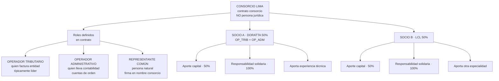
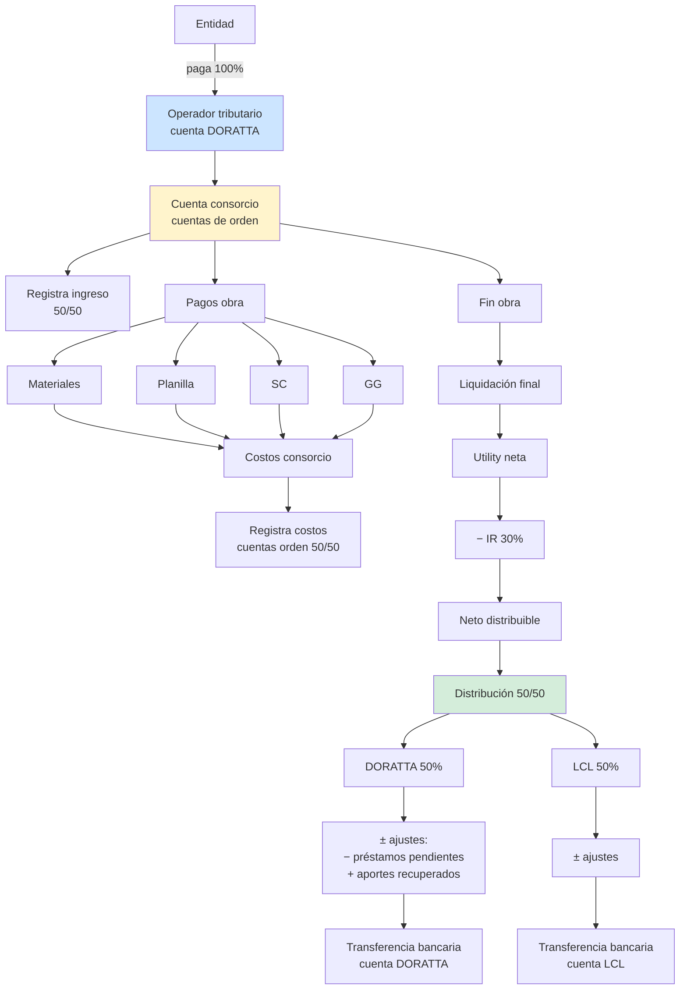
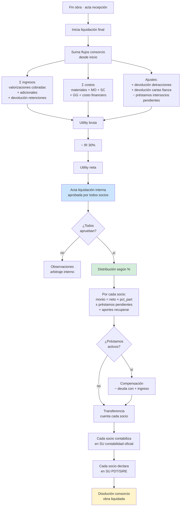
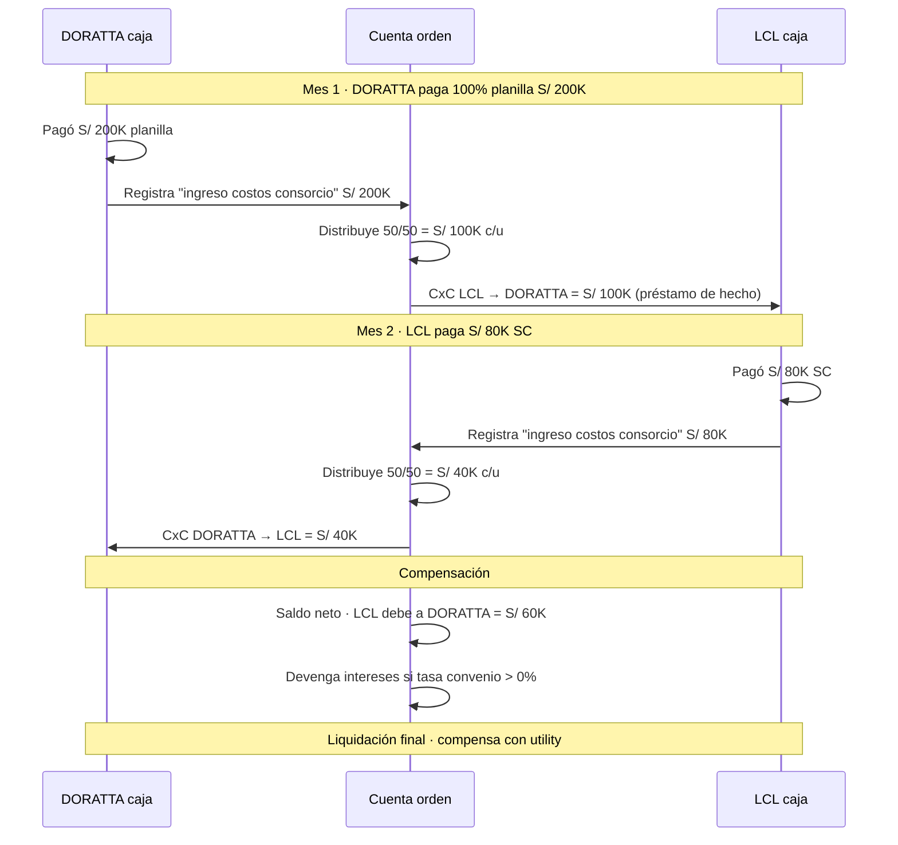

# 23 · Consorcio · Completo

Reemplaza diseño consorcio anterior. Cubre operador tributario, cuentas orden, distribución utility, préstamos socios, garantías compartidas.

## Estructura organizacional consorcio



## Flujo dinero consorcio



## Cuentas de orden · principio contable

```
Consorcio NO es persona jurídica → no lleva contabilidad propia formalmente
PERO cada socio debe llevar cuentas de orden de su participación

Cuentas orden socio operador (DORATTA):
  Cuenta orden 010 · Ingresos consorcio (registra 100% facturado a entidad)
  Cuenta orden 020 · Distribución a socio LCL (50%)
  Cuenta orden 030 · Costos consorcio
  Cuenta orden 040 · Aportes capital socios
  Cuenta orden 050 · Préstamos intersocios
  Cuenta orden 060 · Utility consorcio (resultado)

DORATTA factura entidad → 100% va a su contabilidad oficial (cuenta 70)
PERO de esa 100%, el 50% es "para el otro socio" → cuenta orden 020

Mensual:
  - Reporta a LCL su 50% de ingresos y costos
  - LCL contabiliza su 50% en SU contabilidad
  - LCL declara su % en SUNAT propio

Liquidación:
  - DORATTA transfiere a LCL el 50% utility neta
  - LCL emite factura "honorarios consorcio" o factura participación
  - DORATTA reconoce gasto / LCL reconoce ingreso
  - O alternativa: distribuye sin facturación (ATR)
```

## Schema enterprise

```sql
consorcios (
  id uuid PRIMARY KEY,
  proyecto_id uuid REFERENCES proyectos,
  nombre varchar,
  ruc_consorcio varchar(11),                   -- si tiene RUC propio (poco común)

  domicilio_legal text,
  email_notificaciones varchar,
  telefono varchar,

  representante_comun_dni varchar,
  representante_comun_nombre varchar,
  representante_comun_email varchar,

  fecha_constitucion date,
  fecha_inicio_vigencia date,
  fecha_fin_vigencia date,

  archivo_contrato_consorcio_nas text,
  archivo_modificaciones_nas text,

  estado ENUM ('borrador','vigente','en_liquidacion','liquidado','disuelto','sancionado'),

  created_at, updated_at
)

consorcios_integrantes (
  id uuid PRIMARY KEY,
  consorcio_id uuid REFERENCES consorcios,
  empresa_id uuid REFERENCES empresas,         -- internal empresa MM
  ruc varchar(11),
  razon_social varchar,
  pct_participacion decimal(5,4),              -- 0.5000 = 50%

  -- Roles
  es_operador_tributario boolean DEFAULT false,
  es_operador_administrativo boolean DEFAULT false,
  es_lider boolean DEFAULT false,

  -- Datos
  cci_aporte varchar(20),                      -- cuenta interbancaria
  email_principal varchar,
  telefono_principal varchar,
  representante_legal_dni varchar,
  representante_legal_nombre varchar,
  domicilio text,

  -- Aportes
  capital_aportado decimal(14,2),
  experiencia_acreditada jsonb,                -- obras previas
  rnp_codigo varchar,
  rnp_vigencia date,

  -- CCLC
  cclc_monto decimal(14,2),                    -- Constancia Capacidad Libre Contratación
  cclc_vigencia date,

  fecha_alta date,
  fecha_baja date,
  estado ENUM ('activo','retirado','sustituido')
)

-- Cuentas bancarias del consorcio
consorcio_cuentas_bancarias (
  id uuid PRIMARY KEY,
  consorcio_id uuid,
  banco varchar,
  numero_cuenta varchar,
  cci varchar(20),
  moneda char(3) DEFAULT 'PEN',
  proposito ENUM ('cobranzas_entidad','pagos_obra','garantias','adelantos','tesoreria'),
  titular_ruc varchar(11),                      -- típicamente operador tributario
  estado varchar
)

-- Movimientos cuentas de orden
consorcio_cuentas_orden (
  id uuid PRIMARY KEY,
  consorcio_id uuid,
  fecha date,
  numero_orden varchar,                         -- correlativo CO-0001
  tipo ENUM (
    'ingreso_facturado',           -- entidad pagó · 100% al consorcio
    'distribucion_ingreso',        -- 50% a cada socio
    'pago_costo_obra',             -- consorcio paga a proveedor/SC
    'distribucion_costo',          -- 50% costo a cada socio
    'aporte_capital',              -- socio aporta dinero
    'devolucion_capital',          -- socio recupera aporte
    'prestamo_socio',              -- un socio presta a otro
    'devolucion_prestamo',
    'pago_intereses_prestamo',
    'distribucion_utility',        -- liquidación final
    'reparto_costos_extra'         -- adicional asumido por uno
  ),
  socio_origen_id uuid REFERENCES consorcios_integrantes,
  socio_destino_id uuid REFERENCES consorcios_integrantes,
  monto decimal(14,2),
  glosa text,
  origen_evento_tabla varchar,
  origen_evento_id uuid,
  asiento_orden_id uuid,
  user_id uuid,
  created_at timestamp
)

-- Préstamos intersocios
consorcio_prestamos (
  id uuid PRIMARY KEY,
  consorcio_id uuid,
  socio_acreedor_id uuid,
  socio_deudor_id uuid,
  monto decimal(14,2),
  tasa_anual decimal(5,4),                      -- típico 0% o costo oportunidad
  fecha_otorgamiento date,
  fecha_vencimiento date,
  monto_pagado decimal(14,2) DEFAULT 0,
  saldo decimal(14,2)
    GENERATED AS (monto - monto_pagado) STORED,
  intereses_devengados decimal(14,2) DEFAULT 0,
  estado ENUM ('vigente','pagado_parcial','liquidado','default'),
  contrato_pdf_nas text
)

-- Distribución utility
consorcio_distribucion_utility (
  id uuid PRIMARY KEY,
  consorcio_id uuid,
  fecha_corte date,
  fecha_distribucion date,

  -- Cálculos
  ingreso_total decimal(14,2),
  costos_total decimal(14,2),
  utility_bruta decimal(14,2),
  ir_30pct decimal(14,2),
  utility_neta decimal(14,2),

  -- Detalle por socio
  detalle jsonb,                                -- [{socio, %, monto, ajustes, neto_transferir}]

  -- Status
  estado ENUM ('proyectada','aprobada','transferida','observada'),
  acta_distribucion_pdf_nas text,

  created_at, updated_at
)

-- Resoluciones internas
consorcio_resoluciones_internas (
  id uuid PRIMARY KEY,
  consorcio_id uuid,
  numero varchar,
  fecha date,
  tipo ENUM (
    'acuerdo_general',
    'modificacion_contrato_consorcio',
    'sustitucion_representante',
    'autorizacion_prestamo',
    'aprobacion_distribucion',
    'disolucion'
  ),
  descripcion text,
  votos_favor int,
  votos_contra int,
  acta_pdf_nas text,
  vinculante boolean DEFAULT true
)

-- Garantías compartidas (vincula garantia con socio aportante)
garantias_aportantes (
  id uuid PRIMARY KEY,
  garantia_id uuid REFERENCES garantias,
  socio_id uuid REFERENCES consorcios_integrantes,
  monto_aportado decimal(14,2),
  pct_aporte decimal(5,4)                       -- algunos socios aportan más fianza
)
```

## Flujo distribución utility · liquidación



## Préstamos intersocios

Caso real: si un socio adelanta más caja que el otro durante la obra.



## Validaciones

```sql
-- Σ % participación = 100%
CREATE FUNCTION validar_consorcio_pct()
RETURNS trigger AS $$
DECLARE total decimal(10,8);
BEGIN
  SELECT SUM(pct_participacion) INTO total
  FROM consorcios_integrantes
  WHERE consorcio_id = NEW.consorcio_id AND estado = 'activo';

  IF ABS(total - 1.0) > 0.0001 THEN
    RAISE EXCEPTION 'Σ % participación = % (debe ser 1.0000)', total;
  END IF;
  RETURN NEW;
END $$;

-- Solo un operador tributario activo
CREATE FUNCTION validar_un_operador_trib()
RETURNS trigger AS $$
DECLARE count_op int;
BEGIN
  IF NEW.es_operador_tributario THEN
    SELECT COUNT(*) INTO count_op
    FROM consorcios_integrantes
    WHERE consorcio_id = NEW.consorcio_id
      AND es_operador_tributario = true
      AND estado = 'activo'
      AND id != NEW.id;
    IF count_op > 0 THEN
      RAISE EXCEPTION 'Solo un operador tributario permitido';
    END IF;
  END IF;
  RETURN NEW;
END $$;
```

## Reportes

```
1. Estado caja consorcio
   Por mes: ingresos vs costos vs saldo
   Saldo distribuible si liquidaran hoy

2. Cuentas de orden por socio
   Movimientos · saldos pendientes
   Préstamos abiertos

3. Distribución utility proyectada
   Forecast utility final × % participación
   Por socio: ingreso esperado

4. Aportes vs participación
   Quien aportó más capital del que le toca
   Quien aportó menos
   Compensaciones pendientes

5. Cumplimiento contractual
   Obligaciones cláusula consorcio
   Plazos · sanciones internas
```

## KPIs

| KPI | Fórmula | Target |
|---|---|---|
| Σ % participación | sum(pct_participacion) | = 1.0 exacto |
| Préstamos activos | count préstamos no liquidados | minimizar |
| Aporte vs participación | aporte_socio / (aporte_total × pct_socio) | = 1.0 |
| Días transferencia distribución | desde acta hasta TRX banco | < 7 días |

## Prioridad: **ALTA**
