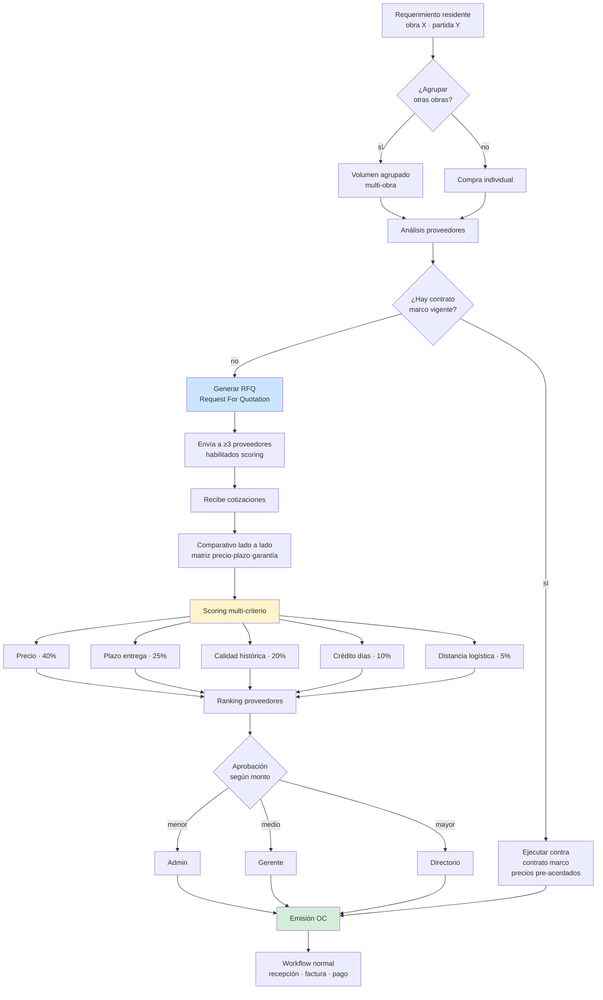
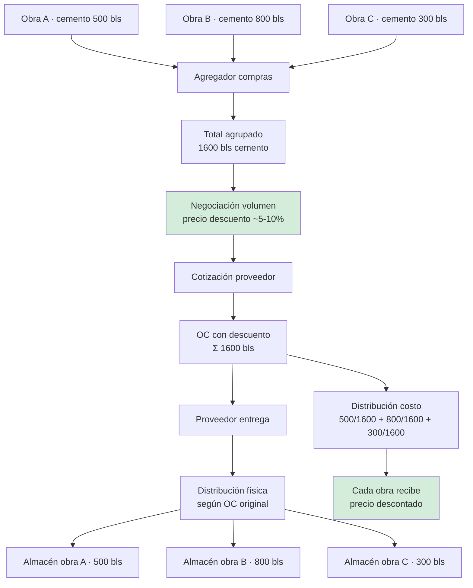
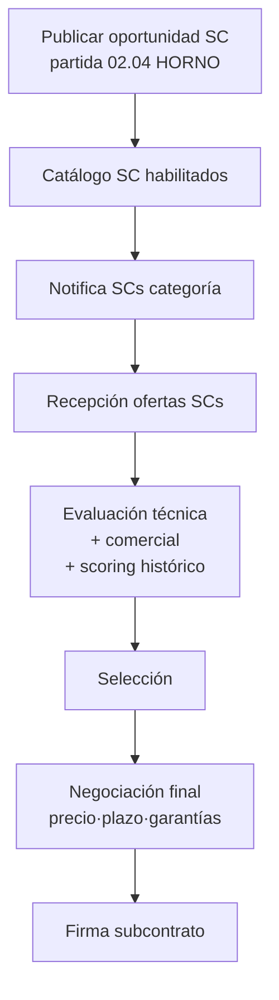

# 24 · Procurement Avanzado

RFQ + cotizaciones + scoring proveedores + contratos marco + compras agrupadas multi-obra.

## Flujo procurement enterprise



## Schema RFQ

```sql
rfqs (
  id uuid PRIMARY KEY,
  numero varchar UNIQUE,                        -- RFQ-2026-0023
  proyecto_id uuid,
  partida_id uuid,
  multi_proyecto boolean DEFAULT false,
  proyectos_relacionados uuid[],

  recurso_id uuid,
  cantidad_requerida decimal(14,4),
  unidad varchar,
  especificaciones text,
  archivo_specs_pdf_nas text,

  fecha_requerida date,
  fecha_emision_rfq date,
  fecha_limite_cotizar date,

  estado ENUM (
    'borrador',
    'enviado',
    'recibiendo_cotizaciones',
    'cerrado',
    'evaluando',
    'adjudicado',
    'cancelado'
  ),

  presupuesto_estimado decimal(14,2),

  proveedor_ganador_id uuid,
  oc_emitida_id uuid,

  created_by uuid,
  created_at timestamp
)

rfq_invitaciones (
  id uuid PRIMARY KEY,
  rfq_id uuid,
  proveedor_ruc varchar(11),
  email_enviado_a varchar,
  fecha_envio timestamp,
  fecha_respuesta timestamp,
  cotizacion_id uuid                            -- si respondió
)

cotizaciones (
  id uuid PRIMARY KEY,
  rfq_id uuid,
  proveedor_ruc varchar(11),
  proveedor_razon varchar,

  fecha_emision date,
  validez_dias integer,
  fecha_validez date,

  -- Precios
  precio_unitario decimal(14,4),
  precio_total decimal(14,2),
  moneda char(3),

  -- Condiciones
  plazo_entrega_dias integer,
  forma_pago text,                              -- "30 días contra factura"
  pct_anticipo decimal(5,4),
  garantia_meses integer,                       -- garantía producto/servicio
  lugar_entrega text,
  requiere_carta_fianza boolean,

  archivo_cotizacion_pdf_nas text,

  -- Scoring
  score_precio decimal(5,2),
  score_plazo decimal(5,2),
  score_calidad decimal(5,2),
  score_credito decimal(5,2),
  score_distancia decimal(5,2),
  score_total decimal(5,2),
  ranking integer,

  estado ENUM ('recibida','evaluada','seleccionada','descartada')
)

-- Contratos marco con proveedores recurrentes
contratos_marco (
  id uuid PRIMARY KEY,
  proveedor_ruc varchar(11),
  proveedor_razon varchar,

  numero_contrato varchar,
  fecha_firma date,
  vigencia_desde date,
  vigencia_hasta date,

  -- Productos cubiertos + precios pre-acordados
  productos jsonb,                              -- [{recurso_id, pu, cantidad_min, cantidad_max}]

  monto_total_compromiso decimal(14,2),
  monto_consumido decimal(14,2) DEFAULT 0,

  condiciones_generales text,
  archivo_contrato_pdf_nas text,

  estado ENUM ('vigente','por_vencer','vencido','renovado','cancelado')
)

-- Scoring proveedores · evolución histórica
proveedor_scoring (
  id uuid PRIMARY KEY,
  proveedor_ruc varchar(11),
  fecha_calculo date,

  -- KPIs base scoring
  num_oc_total integer,
  num_oc_entregadas_a_tiempo integer,
  num_oc_observadas integer,
  pct_entregas_tiempo decimal(5,2),
  pct_observaciones decimal(5,2),
  monto_total_compras decimal(14,2),

  -- Calidad
  num_devoluciones integer,
  pct_devoluciones decimal(5,2),

  -- Tributario
  ruc_habido boolean,
  multas_sunat boolean,

  -- Crédito
  dias_credito_promedio integer,

  -- Score final
  score_total decimal(5,2),                     -- 0..100
  ranking integer,

  -- Recomendación
  recomendado boolean,
  observaciones text
)

-- Proveedores blacklist
proveedores_blacklist (
  id uuid PRIMARY KEY,
  ruc varchar(11) UNIQUE,
  razon_social varchar,
  motivo text,
  fecha_inclusion date,
  fecha_revision date,
  activo boolean
)
```

## Compras agrupadas multi-obra



## Marketplace SC interno



## KPIs procurement

| KPI | Fórmula | Target |
|---|---|---|
| Tiempo desde requerimiento a OC | avg días | < 5 días |
| % compras con ≥3 cotizaciones | % | > 90% |
| Ahorro vs presupuesto | (presup − real) / presup | > 3% |
| % compras agrupadas | volumen agrupado / total | > 30% |
| Top 5 proveedores · concentración | Σ top5 / Σ total | < 60% (no dependencia) |
| Days payable outstanding | avg días pagar | optimizar caja |

## Prioridad: **MEDIA**
