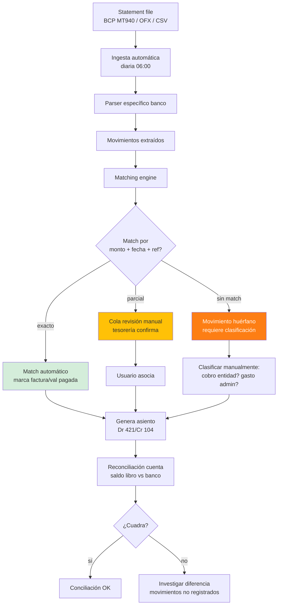
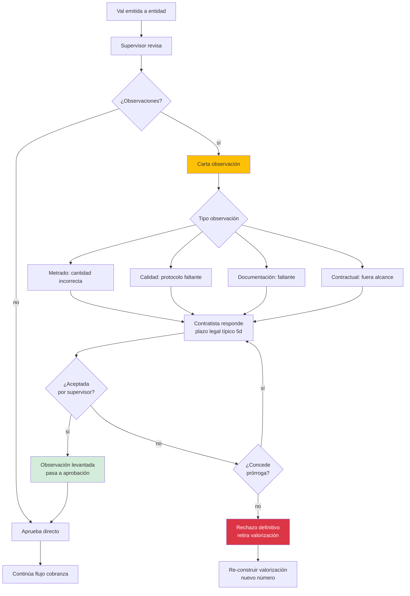
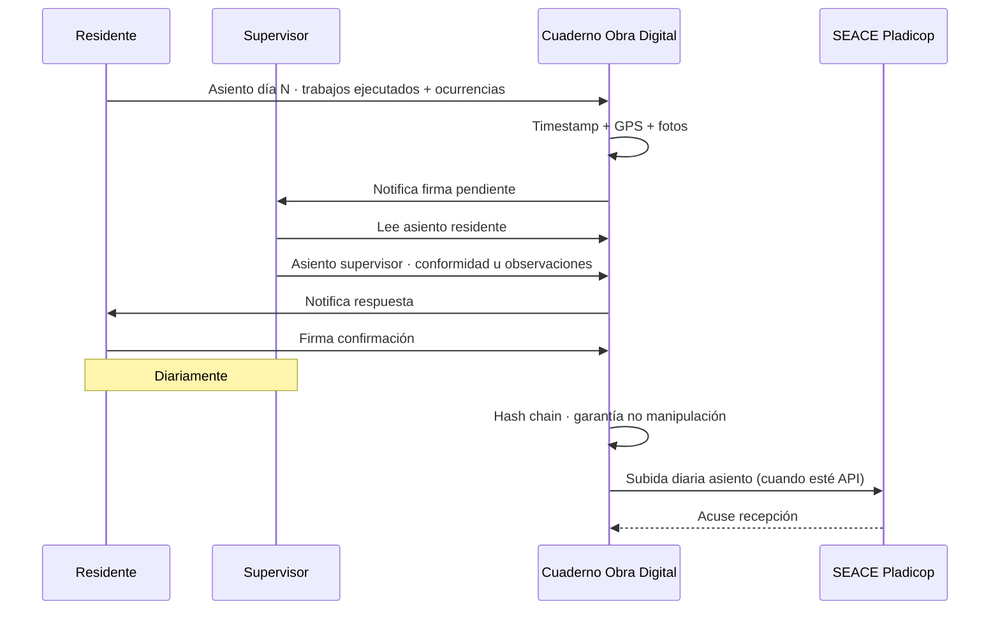
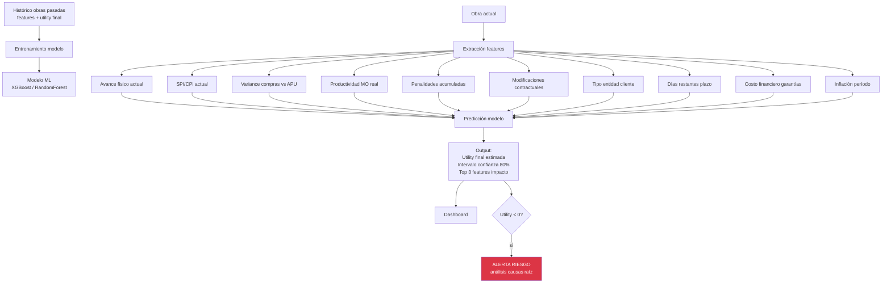
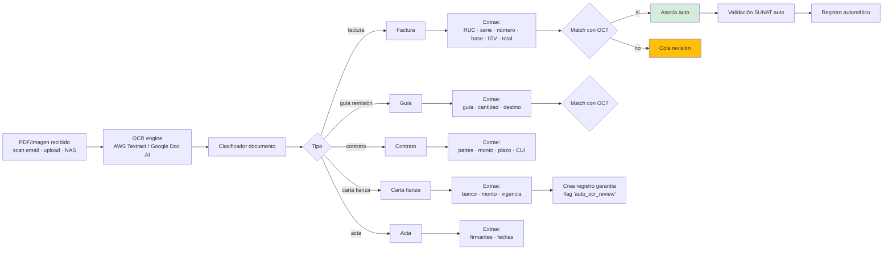
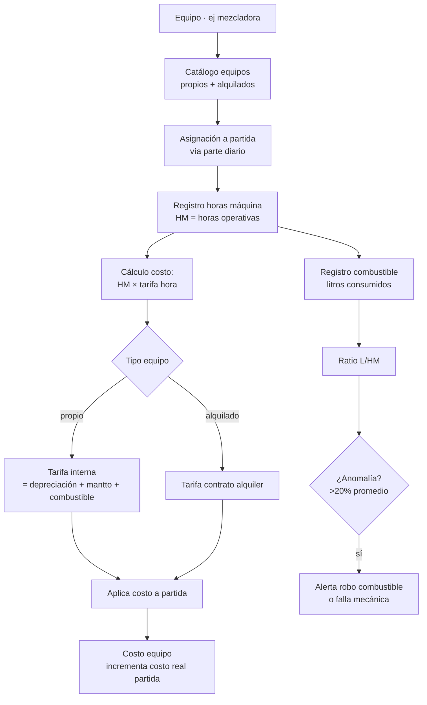
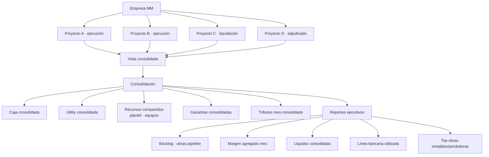

# 25 · Flujos Extras Enterprise

Flujos complementarios que cubren aspectos críticos restantes detectados en auditoría.

## A · Conciliación bancaria automática



## B · Penalidades · cálculo + aplicación

```mermaid
flowchart TB
    EVT[Evento disparador penalidad] --> TIPO{Tipo}

    TIPO --> MORA[Penalidad por mora<br/>retraso vs plazo]
    TIPO --> SUP[Otras 10 supuestos<br/>contrato cláusula 15]

    MORA --> CALC_M[Calc: 0.10 × monto / (F × plazo)<br/>F = 0.25 plazo 61-120d]
    SUP --> CALC_S[Calc según fórmula<br/>específica supuesto]

    CALC_M --> APLIC[Aplicar a valorización<br/>siguiente]
    CALC_S --> APLIC

    APLIC --> CHK_TOPE{¿Acumulado<br/>< 10% monto vigente?}
    CHK_TOPE -->|sí| OK[Descuenta valorización]
    CHK_TOPE -->|no tope alcanzado| ALERT[ALERTA crítica<br/>posible resolución contrato<br/>por incumplimiento]

    OK --> NOTIF[Notifica supervisor + entidad]
    NOTIF --> DESCARGO{¿Contratista<br/>presenta descargo<br/>justificado?}
    DESCARGO -->|sí| EVAL[Entidad evalúa]
    DESCARGO -->|no| FIRM[Penalidad firme]

    EVAL --> Q_JUST{¿Justifica?}
    Q_JUST -->|sí| ANUL[Anular penalidad<br/>asiento reverso]
    Q_JUST -->|no| FIRM

    FIRM --> ASI_FIRM[Asiento contable:<br/>Dr 654 Penalidades<br/>Cr 121 CxC entidad]
    ANUL --> ASI_REV[Asiento reverso]

    style ALERT fill:#dc3545,color:#fff
    style ANUL fill:#d4edda
    style FIRM fill:#fd7e14,color:#fff
```

```sql
-- Penalidades aplicadas
ALTER TABLE penalidades_aplicadas ADD COLUMN
  asiento_aplicacion_id uuid,
  asiento_anulacion_id uuid,
  notif_supervisor_at timestamp,
  fecha_descargo date,
  documento_descargo_nas text,
  fecha_resolucion_descargo date,
  resolucion_descargo varchar;

-- Catálogo penalidades estandarizado
INSERT INTO penalidades_catalogo (proyecto_id, numero, supuesto, formula, procedimiento)
VALUES
  (..., 1, 'Sustitución plantel técnico', '5.5 UIT', '...'),
  (..., 2, 'Materiales fuera estándar', '0.5% valorización mes', '...'),
  (..., 3, 'EPPS no entregados', '0.5% valorización mes', '...'),
  (..., 4, 'Seguridad colectiva', '0.5% valorización mes', '...'),
  (..., 5, 'Cronograma plan trabajo', '5% UIT/día', '...'),
  (..., 6, 'Plazo levantamiento observ', '5% UIT/día', '...'),
  (..., 7, 'Ausencia personal', '5% UIT/ocurrencia', '...'),
  (..., 8, 'Dispositivos seguridad', '0.5% valorización mes', '...'),
  (..., 9, 'Cuaderno incidencias digital', '0.5% valorización mes', '...'),
  (..., 10, 'Plazos prestaciones adicionales', '0.5% valorización mes', '...');
```

## C · Observaciones supervisor entidad



```sql
val_observaciones (
  id uuid PRIMARY KEY,
  valorizacion_id uuid,
  numero varchar,                              -- correlativo OBS-V03-001
  origen ENUM ('supervisor','entidad','sgo','olc'),
  tipo ENUM ('metrado','calidad','documentacion','contractual','tecnico'),

  partida_id uuid,
  monto_observado decimal(14,2),
  metrado_observado decimal(14,4),

  descripcion text,
  fundamento_legal text,

  fecha_apertura date,
  plazo_respuesta_dias integer DEFAULT 5,
  fecha_limite_respuesta date,

  status ENUM (
    'pendiente_respuesta',
    'respondida',
    'levantada',
    'rechazada_definitiva',
    'prorrogada'
  ),

  archivo_carta_pdf_nas text,
  archivo_respuesta_pdf_nas text,
  archivo_resolucion_pdf_nas text,

  fecha_levantamiento date,
  fecha_rechazo date,
  observaciones_internas text
)
```

## D · Cuaderno de obra digital



```sql
cuaderno_obra (
  id uuid PRIMARY KEY,
  proyecto_id uuid,
  numero_asiento integer,                       -- correlativo
  fecha date,

  -- Asiento residente
  asiento_residente text,
  trabajos_ejecutados text,
  ocurrencias text,
  condiciones_climatologicas varchar,
  personal_dia_count integer,
  equipos_dia jsonb,

  fotos_nas text[],                             -- panel fotográfico
  gps_coords point,                             -- coordenadas obra
  firma_residente_at timestamp,
  firma_residente_user_id uuid,

  -- Asiento supervisor
  asiento_supervisor text,
  conformidad_supervisor boolean,
  observaciones_supervisor text,
  firma_supervisor_at timestamp,
  firma_supervisor_user_id uuid,

  -- Hash chain inmutabilidad
  previous_hash varchar(64),
  current_hash varchar(64) GENERATED AS (...) STORED,

  -- SEACE
  enviado_seace_at timestamp,
  cdr_seace varchar,

  created_at, updated_at
)

CREATE UNIQUE INDEX ON cuaderno_obra (proyecto_id, numero_asiento);
```

## E · Forecast utility ML



## F · OCR documentos



## G · SEACE / Pladicop integración

```
Cuando API SEACE esté disponible:

Endpoints sugeridos:
  GET /procesos              · listar procesos selección activos
  GET /procesos/{id}         · detalle proceso
  POST /procesos/{id}/oferta · enviar oferta
  GET /contratos/{id}        · detalle contrato

  POST /contratos/{id}/valorizaciones  · subir Val mensual
  POST /contratos/{id}/cuaderno        · subir asiento cuaderno obra
  POST /contratos/{id}/modificaciones  · subir modif

Eventos consumir:
  ProcesoBuenaProAprobada  → mover proyecto a 'adjudicado'
  ContratoFirmado         → mover a 'ejecucion'
  ResolucionEmitida       → crear modificacion_contractual
  AmpliacionPlazoAprobada → trigger reprogramación
```

## H · Flotas equipos · horas máquina



```sql
equipos (
  id uuid PRIMARY KEY,
  empresa_id uuid,
  codigo varchar UNIQUE,
  descripcion text,
  tipo varchar,
  marca, modelo, serie,
  ano_fabricacion integer,
  tipo_propiedad ENUM ('propio','alquilado','leasing'),

  -- Tarifa
  tarifa_hora decimal(10,2),
  costo_combustible_lt decimal(7,2),

  -- Mantto
  horas_acumuladas decimal(10,2),
  km_acumulados decimal(10,2),
  proximo_mantto_h decimal(10,2),

  -- SCTR si transporta personal
  poliza_id uuid REFERENCES polizas
)

equipo_asignaciones (
  id uuid PRIMARY KEY,
  equipo_id uuid,
  proyecto_id uuid,
  partida_id uuid,
  parte_diario_id uuid,
  fecha date,
  hora_inicio time,
  hora_fin time,
  hm_operativas decimal(5,2),
  combustible_lt decimal(8,2),
  observaciones text,
  operador_id uuid REFERENCES trabajadores
)
```

## I · Multi-proyecto consolidado



## J · App móvil residente · PWA

```
Capacidades obligatorias móvil:
  - Registro avance partida (% + foto)
  - Cuaderno obra (texto + foto + GPS)
  - Tareo obreros (asistencia + horas + partida)
  - Aprobación OC menor (residente)
  - Recepción material (foto + firma)
  - Vale salida almacén
  - Subida documentos NAS
  - Notificaciones push

Tech stack sugerido:
  PWA (Progressive Web App)
  React + Vite + Workbox
  Service Worker offline-first
  IndexedDB para cache
  Background sync cuando recupera red

Razón: instalar app store es fricción
       PWA = misma URL = se instala con un click
       Funciona offline en obra (sin internet)
```

## Prioridad: Variable según item

| Item | Prioridad |
|---|---|
| A Conciliación bancaria | Alta |
| B Penalidades flujo | Alta |
| C Observaciones supervisor | Crítica |
| D Cuaderno obra digital | Crítica |
| E Forecast utility ML | Media |
| F OCR documentos | Media |
| G SEACE integración | Baja (depende API) |
| H Flotas equipos HM | Alta |
| I Multi-proyecto consolidado | Alta |
| J App móvil residente PWA | Crítica |
