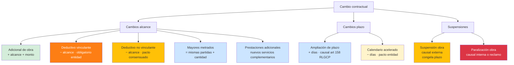
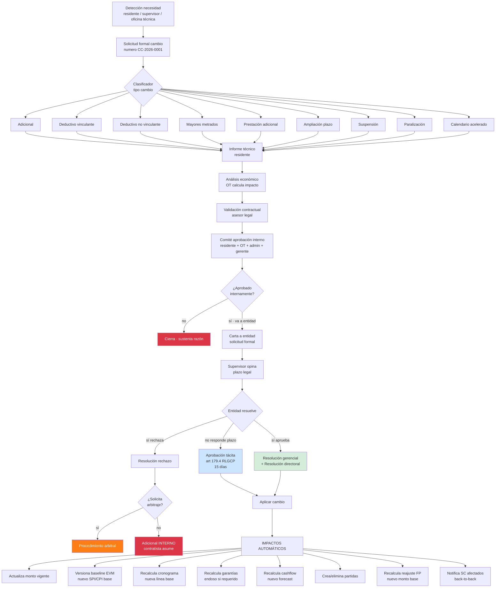
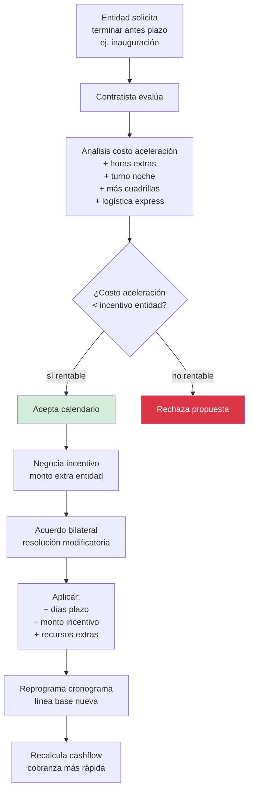

# 26 · Cambios contractuales · Tipología completa

Expansión flujo 08. Motor formal de cambios con todos los tipos de obra pública peruana.

## Tipología completa



## Definiciones precisas Ley 32069 + RLGCP

| Tipo | Base legal | Característica clave |
|---|---|---|
| **Adicional obra** | Art 64 Ley · Art 109.4 RLGCP | + alcance no previsto · obligatorio si entidad lo pide hasta 50% |
| **Deductivo vinculante** | Art 63.3 b · Art 109.1 | − alcance impuesto entidad · hasta 25% · contratista debe acatar |
| **Deductivo no vinculante** | Pacto consensuado | − alcance acordado bilateralmente · sin tope legal |
| **Mayores metrados** | Art 109.5 RLGCP | mismas partidas más cantidad real medida en obra |
| **Prestación adicional** | Art 109.4 | nuevo servicio complementario · APUs nuevos |
| **Ampliación plazo** | Art 158-159 RLGCP | + días por causal · puede traer GG |
| **Calendario acelerado** | Pacto bilateral | − días con incentivo monetario |
| **Suspensión** | Art 160 | causal externa caso fortuito/fuerza mayor · paraliza plazo |
| **Paralización** | reclamo contratista | causal imputable a entidad · paraliza plazo |

## Motor formal · flujo cambios



## Schema motor cambios

```sql
-- ENUM extendido tipos
CREATE TYPE cambio_tipo AS ENUM (
  'adicional_obra',
  'deductivo_vinculante',
  'deductivo_no_vinculante',
  'mayores_metrados',
  'prestacion_adicional',
  'ampliacion_plazo',
  'calendario_acelerado',
  'suspension_obra',
  'paralizacion_obra',
  'adicional_interno'                  -- contratista asume
);

CREATE TYPE cambio_estado AS ENUM (
  'borrador',
  'solicitado',
  'evaluacion_interna',
  'aprobado_interno',
  'enviado_entidad',
  'opinion_supervisor',
  'evaluacion_entidad',
  'aprobado_entidad',
  'aprobado_tacita',
  'rechazado_entidad',
  'arbitraje',
  'aplicado',
  'cerrado'
);

cambios_contractuales (
  id uuid PRIMARY KEY,
  proyecto_id uuid,
  numero varchar UNIQUE,                          -- CC-2026-0001
  tipo cambio_tipo,
  estado cambio_estado,

  -- Solicitud
  fecha_solicitud date,
  solicitante_user_id uuid,
  motivo text,
  causal_legal text,                              -- art 64, art 158, etc

  -- Documentos sustento
  informe_tecnico_pdf_nas text,
  analisis_economico_pdf_nas text,
  evidencia_fotos_nas text[],

  -- Impacto económico
  monto_delta decimal(14,2),                      -- + adicional, − deductivo, 0 amp.plazo
  monto_base_calculo decimal(14,2),
  pct_monto_contrato decimal(7,4),                -- % vs contrato vigente
  excede_25_reduccion boolean,                    -- alerta tope ley
  excede_50_adicional boolean,                    -- alerta tope ley

  -- Impacto plazo
  dias_delta integer,                             -- + amp, − calendario, 0 otros
  dias_paralizados integer,                       -- suspensión/paralización

  -- Aprobación entidad
  numero_resolucion varchar,
  fecha_resolucion date,
  resolucion_pdf_nas text,
  fecha_envio_entidad date,
  fecha_opinion_supervisor date,

  -- Causal art 158 (ampliaciones plazo)
  causal_art_158 varchar,                         -- 'fuerza_mayor','demora_entidad','adicional','reclamo_inerte'
  ajuste_gg_aplica boolean,
  monto_gg_ampliacion decimal(14,2),

  -- Suspensión / paralización
  fecha_inicio_suspension date,
  fecha_fin_suspension date,
  acta_paralizacion_pdf_nas text,
  acta_reinicio_pdf_nas text,
  imputable_entidad boolean,                       -- si imputable, GG cobrable

  -- Adicional / mayores metrados
  partidas_afectadas jsonb,                        -- [{partida_id, accion, metrado_delta, pu_delta}]

  -- Audit
  created_at, updated_at,
  created_by uuid,
  observaciones text
)

cambio_partidas (
  id uuid PRIMARY KEY,
  cambio_id uuid REFERENCES cambios_contractuales,
  partida_id uuid,                                 -- existente si modificación
  accion ENUM ('agregar','eliminar','modificar_metrado','modificar_pu','modificar_descripcion'),

  metrado_anterior decimal(14,4),
  metrado_nuevo decimal(14,4),
  pu_anterior decimal(14,4),
  pu_nuevo decimal(14,4),
  monto_delta decimal(14,2),

  apu_referencia_id uuid,                          -- si nuevo APU
  unidad_medida varchar
)

cambio_impactos_automaticos (                      -- log triggers ejecutados
  id uuid PRIMARY KEY,
  cambio_id uuid,
  tipo_impacto ENUM (
    'monto_vigente_actualizado',
    'baseline_versionado',
    'cronograma_recalculado',
    'garantias_endoso_solicitado',
    'cashflow_recalculado',
    'partidas_modificadas',
    'reajuste_fp_recalculado',
    'sc_back_to_back_notificado'
  ),
  ejecutado_at timestamp,
  resultado jsonb
)
```

## Validaciones tope legal

```sql
CREATE FUNCTION validar_tope_cambio(p_cambio_id uuid)
RETURNS TABLE (puede boolean, motivos text[]) AS $$
DECLARE
  v_motivos text[] := '{}';
  v_cambio record;
  v_acumulado decimal(14,2);
  v_monto_contrato decimal(14,2);
BEGIN
  SELECT * INTO v_cambio FROM cambios_contractuales WHERE id = p_cambio_id;
  SELECT monto_contractual INTO v_monto_contrato FROM proyectos
    WHERE id = v_cambio.proyecto_id;

  -- Adicionales acumulados ≤ 50%
  IF v_cambio.tipo IN ('adicional_obra','prestacion_adicional','mayores_metrados') THEN
    SELECT COALESCE(SUM(monto_delta),0) + v_cambio.monto_delta INTO v_acumulado
    FROM cambios_contractuales
    WHERE proyecto_id = v_cambio.proyecto_id
      AND estado IN ('aprobado_entidad','aprobado_tacita','aplicado')
      AND tipo IN ('adicional_obra','prestacion_adicional','mayores_metrados');

    IF v_acumulado > (v_monto_contrato * 0.50) THEN
      v_motivos := array_append(v_motivos,
        format('Σ adicionales (%s) excede 50%% contrato (%s)',
          v_acumulado, v_monto_contrato * 0.50));
    END IF;
  END IF;

  -- Deductivos acumulados ≤ 25%
  IF v_cambio.tipo = 'deductivo_vinculante' THEN
    SELECT COALESCE(SUM(ABS(monto_delta)),0) + ABS(v_cambio.monto_delta) INTO v_acumulado
    FROM cambios_contractuales
    WHERE proyecto_id = v_cambio.proyecto_id
      AND estado IN ('aprobado_entidad','aprobado_tacita','aplicado')
      AND tipo = 'deductivo_vinculante';

    IF v_acumulado > (v_monto_contrato * 0.25) THEN
      v_motivos := array_append(v_motivos,
        format('Σ deductivos vinculantes excede 25%% contrato'));
    END IF;
  END IF;

  RETURN QUERY SELECT array_length(v_motivos,1) IS NULL, v_motivos;
END $$;
```

## Suspensión vs Paralización · diferencia crítica

```
SUSPENSIÓN:
  Causa: caso fortuito · fuerza mayor · COVID · sismo · huelga
  Plazo: se congela durante suspensión
  GG: solo si causal imputable a entidad
  Acta: bilateral residente + supervisor

PARALIZACIÓN:
  Causa: incumplimiento entidad · falta predio · sin pago oportuno
  Plazo: se congela
  GG: cobrable obligatorio
  Acta: contratista la solicita · entidad debe responder
  Reclamo: si entidad niega → arbitraje

Ambos generan AMPLIACIÓN PLAZO automática.
```

```sql
-- Reglas suspensión vs paralización
CREATE FUNCTION procesar_suspension_paralizacion()
RETURNS trigger AS $$
BEGIN
  -- Pausa cronograma
  UPDATE cronograma_baseline
    SET status = 'congelado_por_suspension',
        fecha_congelado = NEW.fecha_inicio_suspension
    WHERE proyecto_id = NEW.proyecto_id AND status = 'vigente';

  -- Bloquea nuevas valorizaciones durante suspensión
  -- (excepto si SC sigue trabajando bajo subcontrato propio)

  -- Si imputable entidad · genera CxC GG
  IF NEW.imputable_entidad THEN
    INSERT INTO cuentas_por_cobrar_extra (
      proyecto_id, concepto, monto, fecha_devengado
    ) VALUES (
      NEW.proyecto_id,
      'GG por paralización imputable entidad',
      NEW.dias_paralizados * gg_diario_proyecto(NEW.proyecto_id),
      NEW.fecha_inicio_suspension
    );
  END IF;

  -- Notifica SC afectados
  PERFORM notificar_sc_paralizacion(NEW.proyecto_id, NEW.fecha_inicio_suspension);

  RETURN NEW;
END $$;
```

## Calendario acelerado



## KPIs cambios contractuales

| KPI | Fórmula | Target |
|---|---|---|
| Adicionales acumulados | Σ adicionales / monto_contrato | < 30% saludable |
| Deductivos vinculantes acum | Σ ded_vinc / monto_contrato | < 15% (entidad responsable) |
| Días ampliación acumulados | Σ días | dependiente proyecto |
| Tiempo respuesta entidad | desde envío a resolución | < 15 días (límite tácita) |
| % cambios aprobados | aprobados / solicitados | > 80% (calidad sustento) |
| Adicionales internos asumidos | count | minimizar |

## Prioridad: **CRÍTICA**
