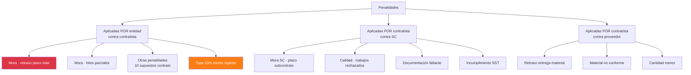
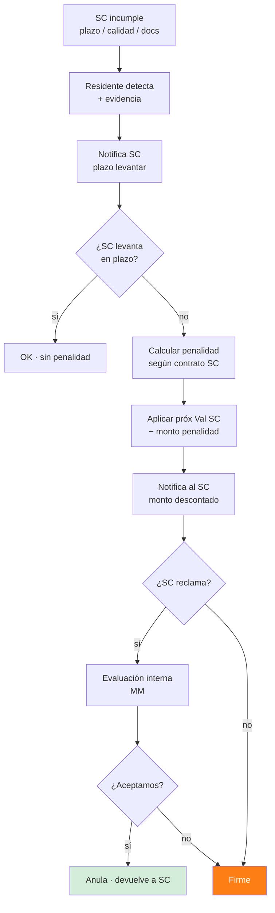

# 27 · Penalidades · Sistema completo

Consolidación motor robusto. Penalidades a contratista (entidad → MM) + a SC (MM → SC) + a proveedor (MM → proveedor).

## Tipología penalidades



## Cálculo penalidad por mora · contratista

```mermaid
flowchart TB
    EVT[Evento: día tras día retraso] --> CHK_CRON[Compara cronograma vigente<br/>vs avance real]
    CHK_CRON --> Q_PLAZO{¿Excedió plazo<br/>contractual vigente?}
    Q_PLAZO -->|no| OK[OK · sin penalidad]
    Q_PLAZO -->|sí| Q_AMP{¿Hay solicitud<br/>ampliación plazo<br/>aprobada o tácita?}

    Q_AMP -->|sí| AMP_VIG[Plazo vigente extendido<br/>recalcula]
    Q_AMP -->|no, pendiente| FREN[Penalidad frenada<br/>hasta resolución]
    Q_AMP -->|no, rechazada| APL[Aplica penalidad mora]

    APL --> CALC[Cálculo:<br/>P/día = 0.10 × monto_vigente / (F × plazo)<br/>F = 0.25 (61-120d)<br/>F = 0.40 (≤60d)<br/>F = 0.15 (>120d)]

    CALC --> EJ[Ejemplo PG0005:<br/>0.10 × 1,675,933 / (0.25 × 120)<br/>= 5,586.44 S/día]

    EJ --> ACUM[Acumular penalidad<br/>desde día 1 retraso]
    ACUM --> CHK_TOPE{¿Σ acum<br/>< 10% monto vigente?}
    CHK_TOPE -->|sí| APLICA_VAL[Descuenta de val mes]
    CHK_TOPE -->|no tope| CRIT[CRÍTICO<br/>posible resolución contrato]

    APLICA_VAL --> NOTIF[Notifica supervisor<br/>+ contratista]
    NOTIF --> DESC{¿Contratista<br/>presenta descargo?}
    DESC -->|sí| EVAL[Entidad evalúa]
    DESC -->|no plazo| FIRM[Penalidad firme]

    EVAL --> Q_JUST{¿Justifica?}
    Q_JUST -->|sí| ANUL[Anula · asiento reverso]
    Q_JUST -->|parcial| AJUST[Ajuste parcial]
    Q_JUST -->|no| FIRM

    style CRIT fill:#dc3545,color:#fff
    style ANUL fill:#d4edda
    style FIRM fill:#fd7e14,color:#fff
```

## Otras penalidades · 10 supuestos contrato

```sql
-- Catálogo estándar Ley 32069 + contrato 037
INSERT INTO penalidades_catalogo (proyecto_id, numero, supuesto, formula_descriptiva, formula_calculo, procedimiento_verificacion)
VALUES
  (..., 1, 'Sustitución plantel técnico clave',
       '5.5 UIT por cada sustitución segunda vez',
       '5.5 * uit_vigente()',
       'Autorización entidad acorde art 189.3'),

  (..., 2, 'Materiales fuera estándar calidad',
       '0.5% del monto valorización mes ocurrencia',
       '0.005 * monto_valorizacion',
       'Informe supervisor + descargo contratista'),

  (..., 3, 'EPPS y uniformes no entregados',
       '0.5% del monto valorización',
       '0.005 * monto_valorizacion',
       'Informe supervisor'),

  (..., 4, 'Medidas seguridad colectiva',
       '0.5% del monto valorización',
       '0.005 * monto_valorizacion',
       'Informe supervisor'),

  (..., 5, 'Incumplimiento cronograma plan trabajo',
       '5% UIT por cada día incumplimiento',
       '0.05 * uit_vigente() * dias_incumplidos',
       'Informe supervisor con cronograma'),

  (..., 6, 'Plazo entrega levantamiento observaciones',
       '5% UIT por cada día incumplimiento',
       '0.05 * uit_vigente() * dias_incumplidos',
       'Informe supervisor'),

  (..., 7, 'Ausencia personal propuesto',
       '5% UIT por ocurrencia',
       '0.05 * uit_vigente()',
       'Informe supervisor con tareo'),

  (..., 8, 'Dispositivos seguridad obra',
       '0.5% valorización mes',
       '0.005 * monto_valorizacion',
       'Informe supervisor'),

  (..., 9, 'Cuaderno incidencias digital no actualizado',
       '0.5% valorización mes',
       '0.005 * monto_valorizacion',
       'Informe supervisor'),

  (..., 10, 'Plazos prestaciones adicionales',
       '0.5% valorización mes',
       '0.005 * monto_valorizacion',
       'Informe supervisor');
```

## Schema penalidades robusto

```sql
CREATE TYPE penalidad_origen AS ENUM (
  'entidad_a_contratista',
  'contratista_a_sc',
  'contratista_a_proveedor'
);

CREATE TYPE penalidad_estado AS ENUM (
  'detectada',
  'notificada',
  'descargo_pendiente',
  'descargo_recibido',
  'firme',
  'parcialmente_aceptada',
  'anulada',
  'aplicada_valorizacion',
  'arbitraje'
);

penalidades_aplicadas (
  ... existente
  + origen penalidad_origen,
  + relacionada_subcontrato_id uuid,
  + relacionada_oc_id uuid,

  + tope_aplicable_pct decimal(5,4),         -- 0.10
  + monto_acumulado_a_la_fecha decimal(14,2),
  + monto_tope_total decimal(14,2),

  + estado penalidad_estado,
  + asiento_aplicacion_id uuid,
  + asiento_anulacion_id uuid,

  + notif_emitida_at timestamp,
  + notif_pdf_nas text,
  + plazo_descargo_dias integer DEFAULT 5,
  + fecha_limite_descargo date,
  + fecha_descargo date,
  + descargo_pdf_nas text,
  + resolucion_descargo_pdf_nas text,
  + resolucion_descargo_decision varchar    -- 'aceptado','parcial','rechazado'
)

-- Vista penalidades acumuladas
CREATE VIEW v_penalidades_acumuladas AS
SELECT
  p.id, p.proyecto_id,
  COUNT(pa.id) FILTER (WHERE pa.estado = 'firme') AS num_firmes,
  SUM(pa.monto) FILTER (WHERE pa.estado = 'firme') AS monto_acumulado_firme,
  SUM(pa.monto) FILTER (WHERE pa.estado IN ('detectada','notificada','descargo_pendiente')) AS monto_pendiente,
  p.monto_vigente * 0.10 AS tope_legal,
  (SUM(pa.monto) FILTER (WHERE pa.estado = 'firme')) / NULLIF(p.monto_vigente, 0) AS pct_consumido_tope,
  p.monto_vigente * 0.10 - SUM(pa.monto) FILTER (WHERE pa.estado = 'firme') AS margen_disponible
FROM proyectos p
LEFT JOIN penalidades_aplicadas pa ON pa.proyecto_id = p.id AND pa.origen = 'entidad_a_contratista'
GROUP BY p.id;
```

## Penalidades a SC · backflow



## Triggers automáticos detección

```sql
-- Cron diario · detecta supuestos automáticos

-- 1. Mora plazo contractual
CREATE FUNCTION detectar_mora_plazo()
RETURNS void AS $$
BEGIN
  INSERT INTO penalidades_aplicadas (
    proyecto_id, origen, tipo, fecha_aplicacion,
    monto_base, monto, dias_retraso, justificacion
  )
  SELECT
    p.id,
    'entidad_a_contratista',
    'mora',
    CURRENT_DATE,
    p.monto_vigente,
    -- Cálculo
    (0.10 * p.monto_vigente / (p.factor_f_penalidad * dias_plazo_vigente(p.id)))
      * (CURRENT_DATE - fecha_fin_vigente(p.id)),
    CURRENT_DATE - fecha_fin_vigente(p.id),
    format('Mora detección automática · %s días', CURRENT_DATE - fecha_fin_vigente(p.id))
  FROM proyectos p
  WHERE p.status = 'ejecucion'
    AND CURRENT_DATE > fecha_fin_vigente(p.id)
    AND NOT EXISTS (
      SELECT 1 FROM penalidades_aplicadas pa
      WHERE pa.proyecto_id = p.id
        AND pa.tipo = 'mora'
        AND pa.fecha_aplicacion = CURRENT_DATE
    );
END $$;

-- 2. Cuaderno obra no actualizado
CREATE FUNCTION detectar_cuaderno_no_actualizado()
RETURNS void AS $$
BEGIN
  INSERT INTO penalidades_aplicadas (...)
  SELECT
    p.id, 'entidad_a_contratista', 'cuaderno_no_actualizado',
    CURRENT_DATE,
    monto_valorizacion_mes_actual(p.id),
    monto_valorizacion_mes_actual(p.id) * 0.005,
    NULL,
    'Cuaderno obra digital sin actualizar día anterior'
  FROM proyectos p
  WHERE p.status = 'ejecucion'
    AND NOT EXISTS (
      SELECT 1 FROM cuaderno_obra co
      WHERE co.proyecto_id = p.id
        AND co.fecha = CURRENT_DATE - 1
        AND co.firma_residente_at IS NOT NULL
    );
END $$;

-- 3. Plantel ausente
CREATE FUNCTION detectar_plantel_ausente()
RETURNS void AS $$
DECLARE r record;
BEGIN
  FOR r IN
    SELECT p.id AS proyecto_id, eq.user_id, eq.rol
    FROM proyectos p
    JOIN equipo_proyecto eq ON eq.proyecto_id = p.id
    WHERE p.status = 'ejecucion'
      AND eq.rol IN ('Residente','Asistente Residente','Especialista')
  LOOP
    -- Verifica si tiene asistencia día anterior
    IF NOT EXISTS (
      SELECT 1 FROM tareos t
      WHERE t.user_id = r.user_id  -- asume tareo plantel también
        AND t.fecha = CURRENT_DATE - 1
    ) THEN
      INSERT INTO penalidades_aplicadas (...) VALUES (...);
    END IF;
  END LOOP;
END $$;
```

## Provisión penalidades · contable

```sql
-- Provisión mensual cierre
CREATE FUNCTION provisionar_penalidades_mes(p_periodo char(7))
RETURNS void AS $$
BEGIN
  -- Penalidades pendientes (no firmes) → provisión
  INSERT INTO asientos (correlativo, fecha, glosa, ...)
  SELECT
    'PROV-' || p_periodo,
    last_day(p_periodo::date),
    'Provisión penalidades pendientes ' || p_periodo,
    ...

  INSERT INTO asientos_lineas (asiento_id, correlativo, cuenta, descripcion, debe, haber)
  SELECT
    asiento_id, 1, '654', 'Penalidad provisión', monto_pendiente, 0
  FROM penalidades_aplicadas
  WHERE estado IN ('detectada','notificada','descargo_pendiente');

  INSERT INTO asientos_lineas (...)
  SELECT (..., '469', 'Penalidad por aplicar', 0, monto_pendiente);
END $$;
```

## Reportes

```
1. Penalidades acumuladas por proyecto
   Tope legal vs consumido
   Ranking proyectos riesgo
   Forecast: si trend continúa, llega tope?

2. Análisis causa raíz penalidades
   Top supuestos aplicados
   ¿Cuál evento más caro?
   Acciones preventivas

3. Penalidades SC
   Por SC, por proyecto
   ¿Qué SCs penalizan más?
   Decisión: continuar/blacklist

4. Variance penalidades vs presupuesto
   Si presupuestaste 0% penalidades, real %
   Impacto utility
```

## KPIs

| KPI | Target |
|---|---|
| Σ penalidades / monto_vigente | < 5% (alerta · tope 10%) |
| Tiempo respuesta descargo | < 5 días |
| % penalidades anuladas vía descargo | > 30% (sustento sólido) |
| Days en alerta tope | 0 |
| Penalidades automáticas detectadas | maximizar (no perder ninguna) |

## Prioridad: **CRÍTICA**
