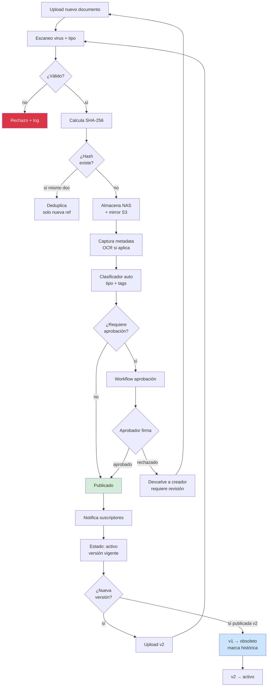
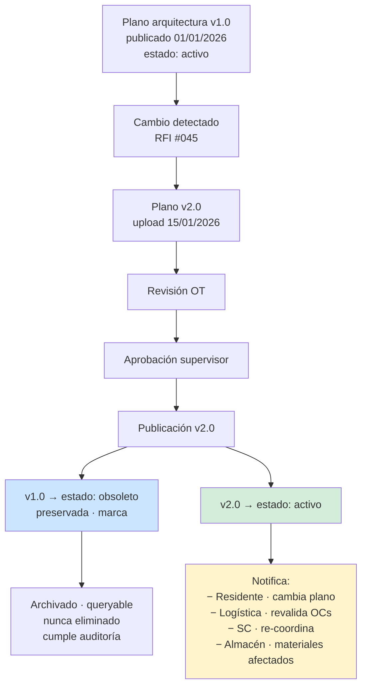
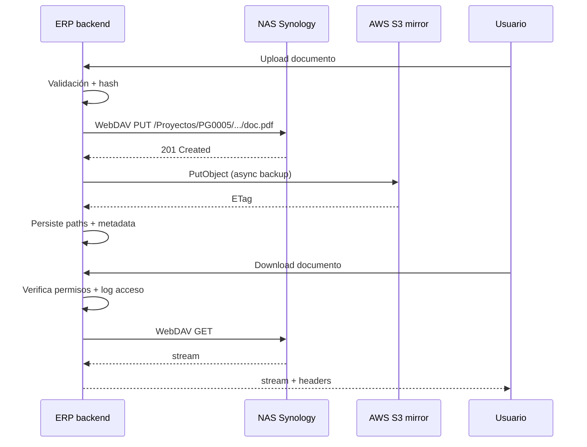
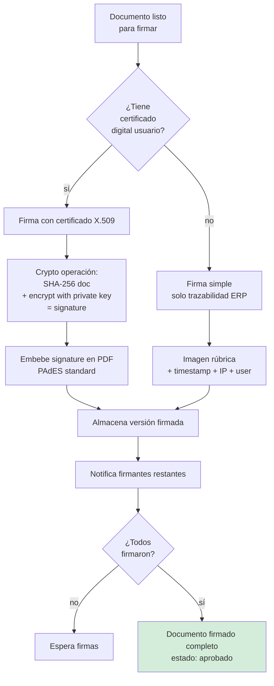

# 28 · ECM/DMS · Gestión documental + Versionado

Sistema documental enterprise. Planos · RFIs · especificaciones · contratos · valorizaciones · cuaderno · todo versionado, firmado, hash.

## Por qué crítico construcción

```
Realidad construcción:
  Plano arquitectura v1 → v2 → v3 → v7 (durante obra)
  RFI #045 cambia metrado partida 03.01.01.05
  Especificación cemento f'c=210 → f'c=280 mid-obra
  Memoria cálculo se actualiza por adicional
  Cuaderno obra firmado diariamente

Sin versionado:
  Residente trabaja con plano viejo
  Recompra material que no aplica
  Construye fuera spec → demolición
  Reclamo al supervisor sin sustento
  Pérdida arbitraje por documentos perdidos

Con DMS:
  Single source of truth
  Vigencia clara
  Audit trail
  Notificación cambios
  Hash verificable
```

## Modelo entidad documental

```mermaid
flowchart TB
    DOC[Documento] --> META[Metadata]
    DOC --> CONT[Contenido binario]
    DOC --> VER[Versiones]
    DOC --> FIRM[Firmas]
    DOC --> ACC[Control acceso]
    DOC --> HIST[Historial]

    META --> TIPO[Tipo · plano · RFI · spec · contrato · valorización · cuaderno]
    META --> CLAS[Clasificación · público · privado · confidencial]
    META --> TAGS[Tags · disciplina · partida · OC · proveedor]
    META --> REL[Relaciones · partida_id · oc_id · valorizacion_id]

    CONT --> NAS[Storage NAS Synology]
    CONT --> S3[Mirror S3 cloud]
    CONT --> HASH[SHA-256 hash]

    VER --> V1[Version 1.0]
    VER --> V2[Version 2.0]
    VER --> VAC[Version activa]
    VER --> VOBS[Versiones obsoletas]

    FIRM --> RES[Firma residente]
    FIRM --> SUP[Firma supervisor]
    FIRM --> GER[Firma gerente]

    ACC --> ROLES[Por rol]
    ACC --> EMP[Por empresa]
    ACC --> PRY[Por proyecto]
```



## Flujo lifecycle documento



## Schema completo

```sql
-- Documentos · entidad genérica
documentos (
  id uuid PRIMARY KEY,
  empresa_id uuid,
  proyecto_id uuid,                              -- NULL si transversal empresa

  -- Identificación
  codigo varchar UNIQUE,                         -- DOC-2026-0023
  tipo varchar,                                   -- plano,rfi,spec,contrato,valoriz,cuaderno,carta,acta,etc
  subtipo varchar,                                -- arquitectura,estructuras,IISS,IIEE
  titulo text,
  descripcion text,

  -- Clasificación
  clasificacion ENUM ('publico','interno','privado','confidencial'),
  disciplina varchar,                             -- arquitectura,estructuras,etc
  fase varchar,                                   -- bases,perfeccionamiento,ejecucion,liquidacion
  tags text[],

  -- Estado
  estado ENUM ('borrador','en_revision','aprobado','publicado','obsoleto','archivado'),
  version_actual_id uuid,                         -- pointer a documentos_versiones

  -- Relaciones
  proyecto_id uuid,
  partida_id uuid,
  oc_id uuid,
  valorizacion_id uuid,
  modificacion_id uuid,
  generic_relation_type varchar,
  generic_relation_id uuid,

  -- Permisos
  visibility_roles varchar[],                     -- ['admin','gerente','residente']

  -- Audit
  created_at, updated_at, deleted_at,
  created_by, updated_by
)

documentos_versiones (
  id uuid PRIMARY KEY,
  documento_id uuid REFERENCES documentos,
  version_numero varchar,                         -- "1.0","1.1","2.0"
  version_orden integer,                          -- 1, 2, 3...

  -- Storage
  archivo_nas_path text,                          -- /Proyectos/PG0005/CONTRATO/...
  archivo_s3_url text,                            -- mirror cloud
  mime_type varchar,
  size_bytes bigint,
  hash_sha256 varchar(64),                        -- integridad
  hash_md5 varchar(32),                           -- compatibilidad

  -- OCR
  texto_extraido text,                            -- searchable
  ocr_completado_at timestamp,

  -- Cambio
  cambio_resumen text,                            -- "Actualizado planta primer piso"
  diff_descripcion text,

  -- Estado versión
  estado ENUM ('borrador','revision','aprobado','publicado','obsoleto'),
  fecha_publicacion timestamp,
  fecha_obsolescencia timestamp,

  -- Audit
  created_at, created_by uuid
)

-- Firmas digitales
documento_firmas (
  id uuid PRIMARY KEY,
  documento_version_id uuid REFERENCES documentos_versiones,
  user_id uuid,
  rol varchar,                                    -- 'residente','supervisor','gerente'
  fecha_firma timestamp,
  ip_firma varchar,
  hash_firma varchar(128),                        -- firma digital criptográfica
  certificado_x509 text,                          -- si firma digital legal
  imagen_firma_nas text,                          -- imagen rúbrica
  observaciones text
)

-- Workflow aprobación documento
documento_aprobaciones (
  id uuid PRIMARY KEY,
  documento_version_id uuid,
  paso integer,
  rol_requerido varchar,
  user_id uuid,
  decision ENUM ('aprobado','observado','rechazado'),
  comentario text,
  fecha timestamp
)

-- Suscripciones notificación
documento_suscripciones (
  documento_id uuid,
  user_id uuid,
  notif_email boolean DEFAULT true,
  notif_push boolean DEFAULT true,
  PRIMARY KEY (documento_id, user_id)
)

-- Histórico vistas (audit)
documento_accesos (
  id uuid PRIMARY KEY,
  documento_version_id uuid,
  user_id uuid,
  tipo ENUM ('view','download','print','share'),
  ip varchar,
  user_agent text,
  fecha timestamp
)

-- RFI · Request For Information
rfis (
  id uuid PRIMARY KEY,
  proyecto_id uuid,
  numero varchar UNIQUE,                          -- RFI-2026-0045
  fecha_emision date,
  partida_relacionada_id uuid,
  documento_relacionado_id uuid,                  -- plano consultado

  pregunta text,
  contexto text,
  emisor_user_id uuid,

  fecha_limite_respuesta date,
  fecha_respuesta date,
  respuesta text,
  respondedor_user_id uuid,

  impacta_alcance boolean,
  impacta_metrado boolean,
  impacta_costo boolean,
  cambio_contractual_id uuid,                     -- si genera adicional

  estado ENUM ('abierto','respondido','cerrado','escalado'),
  archivo_pdf_nas text
)
```

## Versionado · principios



## Política inmutabilidad

```sql
-- Versiones publicadas no se editan, solo se obsoletizan
CREATE FUNCTION proteger_version_publicada()
RETURNS trigger AS $$
BEGIN
  IF OLD.estado = 'publicado' AND NEW.estado != 'obsoleto' THEN
    -- Solo permite cambio de publicado → obsoleto
    IF TG_OP = 'UPDATE' AND OLD.archivo_nas_path != NEW.archivo_nas_path THEN
      RAISE EXCEPTION 'No se puede modificar documento publicado · crear nueva versión';
    END IF;
  END IF;
  RETURN NEW;
END $$;

CREATE TRIGGER tr_proteger_version
  BEFORE UPDATE ON documentos_versiones
  FOR EACH ROW EXECUTE FUNCTION proteger_version_publicada();

-- Eliminación = soft delete + flag archivado
CREATE FUNCTION soft_delete_documento()
RETURNS trigger AS $$
BEGIN
  -- DELETE → marcar archivado, NO eliminar
  RAISE NOTICE 'Use UPDATE estado = archivado en lugar de DELETE';
  NEW.deleted_at := now();
  NEW.estado := 'archivado';
  RETURN NEW;
END $$;
```

## Search full-text + facetas

```sql
-- Habilitar full-text search PG
ALTER TABLE documentos_versiones
  ADD COLUMN ts_searchable tsvector
  GENERATED ALWAYS AS (
    to_tsvector('spanish',
      coalesce(texto_extraido, '') || ' ' ||
      coalesce(cambio_resumen, '') || ' '
    )
  ) STORED;

CREATE INDEX ix_dv_search ON documentos_versiones USING GIN (ts_searchable);

-- Query
SELECT d.codigo, d.titulo, dv.version_numero
FROM documentos d
JOIN documentos_versiones dv ON dv.id = d.version_actual_id
WHERE dv.ts_searchable @@ plainto_tsquery('spanish', 'cemento f''c 210')
  AND d.proyecto_id = ?
ORDER BY ts_rank(dv.ts_searchable, plainto_tsquery('spanish', 'cemento f''c 210')) DESC;
```

## Integración NAS Synology



## Firma digital legal



## Reportes DMS

```
1. Documentos por proyecto
   Total, por tipo, por estado
   Volumen mes a mes

2. Documentos sin firma
   Pendientes acción
   Días abiertos

3. Versiones obsoletas alta rotación
   Documentos con > 5 versiones
   Posible inestabilidad alcance

4. RFIs abiertos
   Por proyecto, por días abiertos
   Impacto monetario potencial

5. Auditoría accesos
   Quién vio qué documento sensible
   Análisis comportamiento

6. Storage utilizado
   Por proyecto, por tipo
   NAS vs S3 sync status
```

## KPIs

| KPI | Target |
|---|---|
| % documentos versionados (no Excel suelto) | > 95% |
| Tiempo promedio aprobación | < 2 días |
| RFIs abiertos > 7 días | minimizar |
| Documentos perdidos / inaccesibles | 0 |
| Firmas digitales válidas | 100% |
| Storage redundancia NAS+S3 | 100% |

## Prioridad: **CRÍTICA**
