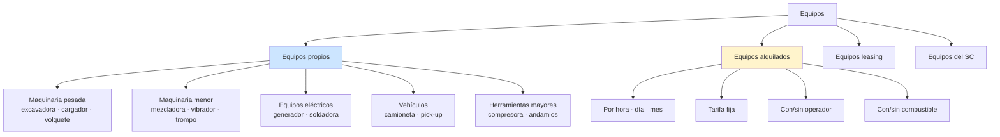
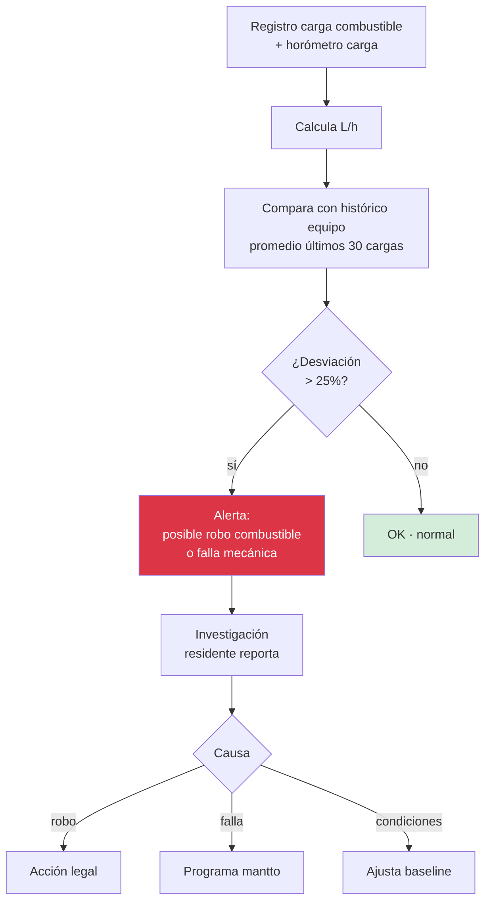

# 29 · Equipos y Maquinaria · Control completo

Crítico construcción pesada. Horómetro · combustible · mantenimiento · disponibilidad · costo HM real.

## Universo equipos



## Schema completo

```sql
equipos (
  id uuid PRIMARY KEY,
  empresa_id uuid,
  codigo varchar UNIQUE,                          -- EQ-2026-001
  descripcion text,

  -- Identificación
  tipo varchar,                                    -- 'excavadora','volquete','mezcladora'
  categoria varchar,                               -- 'maquinaria_pesada','vehiculo','menor','herramienta'
  marca varchar,
  modelo varchar,
  serie varchar,
  ano_fabricacion integer,
  placa varchar,                                   -- vehículos
  motor_serie varchar,

  -- Propiedad
  tipo_propiedad ENUM ('propio','alquilado','leasing','sc'),
  propietario_ruc varchar(11),
  propietario_razon varchar,
  contrato_alquiler_id uuid,                       -- si alquilado

  -- Tarifa
  tarifa_hora_propia decimal(10,2),               -- calculada · depreciación + mantto + combustible + operador
  tarifa_hora_alquiler decimal(10,2),             -- contrato alquiler
  tarifa_dia decimal(10,2),
  tarifa_mes decimal(10,2),

  -- Estado actual
  ubicacion_actual_proyecto_id uuid,
  ubicacion_almacen_id uuid,
  estado_operativo ENUM ('operativo','mantenimiento','averiado','inactivo','vendido','baja'),

  -- Acumulados
  horometro_actual decimal(10,2),                  -- horas operación
  km_acumulados decimal(10,2),
  fecha_ultimo_mantto date,
  proximo_mantto_horas decimal(10,2),

  -- Documentos
  tarjeta_propiedad_pdf_nas text,
  poliza_seguro_id uuid REFERENCES polizas,
  soat_vigencia date,
  revision_tecnica_vigencia date,

  -- Operador habitual
  operador_habitual_id uuid REFERENCES trabajadores,
  requiere_operador boolean DEFAULT true,
  certificacion_operador_requerida varchar,        -- 'AIIIB','etc'

  created_at, updated_at
)

contratos_alquiler_equipo (
  id uuid PRIMARY KEY,
  proyecto_id uuid,
  equipo_id uuid REFERENCES equipos,
  proveedor_ruc varchar(11),

  fecha_inicio date,
  fecha_fin_estimada date,
  fecha_fin_real date,

  modalidad ENUM ('por_hora','por_dia','por_mes','por_obra'),
  tarifa decimal(10,2),
  unidad_tarifa varchar,                           -- 'h','d','m','glb'

  incluye_operador boolean,
  incluye_combustible boolean,
  incluye_mantenimiento boolean,

  monto_estimado_total decimal(14,2),
  monto_facturado_acumulado decimal(14,2),
  monto_pagado_acumulado decimal(14,2),

  contrato_pdf_nas text,
  estado ENUM ('vigente','renovado','terminado','cancelado')
)

-- Asignación equipo a partida vía parte diario
equipo_uso_diario (
  id uuid PRIMARY KEY,
  equipo_id uuid REFERENCES equipos,
  proyecto_id uuid,
  partida_id uuid,
  parte_diario_id uuid,

  fecha date,
  hora_inicio time,
  hora_fin time,

  -- Horometro
  horometro_inicio decimal(10,2),
  horometro_fin decimal(10,2),
  hm_operativas decimal(5,2)
    GENERATED AS (horometro_fin - horometro_inicio) STORED,

  -- Combustible
  combustible_lt decimal(8,2),
  combustible_costo decimal(14,2),

  -- Operador
  operador_id uuid REFERENCES trabajadores,
  hh_operador decimal(5,2),

  -- Costo aplicado partida
  tarifa_aplicada decimal(10,2),
  costo_total_aplicado decimal(14,2)
    GENERATED AS (hm_operativas * tarifa_aplicada) STORED,

  observaciones text,
  registrado_por_user_id uuid,
  created_at timestamp
)

-- Mantenimiento
equipo_mantenimientos (
  id uuid PRIMARY KEY,
  equipo_id uuid,
  fecha date,
  tipo ENUM ('preventivo','correctivo','overhaul','inspeccion'),

  horometro_al_servicio decimal(10,2),
  km_al_servicio decimal(10,2),

  proveedor_ruc varchar(11),
  tipo_servicio varchar,                           -- 'aceite','filtros','frenos','motor'

  monto decimal(14,2),
  factura_id uuid REFERENCES facturas_recibidas,

  proximo_servicio_horas decimal(10,2),
  proximo_servicio_fecha date,

  observaciones text,
  archivo_orden_trabajo_pdf_nas text,

  estado ENUM ('programado','en_proceso','completado','postpuesto')
)

-- Combustible
equipo_combustible_movimientos (
  id uuid PRIMARY KEY,
  equipo_id uuid,
  fecha date,
  tipo ENUM ('carga','descarga','medicion','perdida'),

  litros decimal(8,2),
  costo_unitario decimal(7,4),
  costo_total decimal(14,2),

  oc_id uuid,
  factura_id uuid,
  proveedor_grifero varchar,
  numero_voucher varchar,

  horometro_al_carga decimal(10,2),
  km_al_carga decimal(10,2),

  responsable_user_id uuid,
  archivo_voucher_pdf_nas text
)
```

## Cálculo costo HM propio

```sql
-- Cálculo tarifa hora propia (recálculo periódico)
CREATE FUNCTION calcular_tarifa_hora_propia(p_equipo_id uuid)
RETURNS decimal AS $$
DECLARE
  v_depreciacion decimal;
  v_mantto_anual decimal;
  v_combustible_promedio_h decimal;
  v_operador_h decimal;
  v_seguros_anual decimal;
  v_horas_anuales_uso decimal;
  v_tarifa decimal;
BEGIN
  -- Depreciación lineal · 5-10 años
  SELECT (valor_compra - valor_residual) / vida_util_anos INTO v_depreciacion
    FROM equipos WHERE id = p_equipo_id;

  -- Mantto promedio último año
  SELECT COALESCE(SUM(monto), 0) INTO v_mantto_anual
    FROM equipo_mantenimientos
    WHERE equipo_id = p_equipo_id
      AND fecha >= CURRENT_DATE - INTERVAL '1 year';

  -- Combustible promedio L/h × precio
  SELECT AVG(combustible_lt / hm_operativas) * precio_actual_combustible
    INTO v_combustible_promedio_h
    FROM equipo_uso_diario
    WHERE equipo_id = p_equipo_id;

  -- Operador habitual
  SELECT (jornal_dia / 8) * 1.62 INTO v_operador_h     -- factor leyes sociales
    FROM trabajadores t
    WHERE t.id = (SELECT operador_habitual_id FROM equipos WHERE id = p_equipo_id);

  -- Seguros + impuestos
  SELECT prima_anual INTO v_seguros_anual FROM polizas
    WHERE id = (SELECT poliza_seguro_id FROM equipos WHERE id = p_equipo_id);

  -- Horas anuales típicas operación
  SELECT SUM(hm_operativas) INTO v_horas_anuales_uso
    FROM equipo_uso_diario
    WHERE equipo_id = p_equipo_id
      AND fecha >= CURRENT_DATE - INTERVAL '1 year';

  v_tarifa := (v_depreciacion + v_mantto_anual + v_seguros_anual) / v_horas_anuales_uso
            + v_combustible_promedio_h
            + v_operador_h;

  RETURN v_tarifa;
END $$;
```

## Disponibilidad mecánica

```mermaid
flowchart TB
    DIAS[Días período · ej 30] --> CAT[Categorización]

    CAT --> OP[Días operativo]
    CAT --> MTTO[Días mantenimiento]
    CAT --> AVE[Días averiado]
    CAT --> INA[Días inactivo<br/>sin asignación]

    OP --> CALC[Disponibilidad mecánica<br/>= operativo / (operativo + averiado + mantto)]
    MTTO --> CALC
    AVE --> CALC

    OP --> UTIL[Utilización<br/>= operativo / total]
    INA --> UTIL

    CALC --> KPI[Disponibilidad %<br/>target > 90%]
    UTIL --> KPI2[Utilización %<br/>target > 70%]
```

## Detección anomalía combustible



## Reportes equipos

```
1. Disponibilidad y utilización
   Por equipo · período
   Comparación equipos similares

2. Costo HM real vs presupuestado
   Variance APU vs real
   Top equipos sobre presupuesto

3. Consumo combustible
   L/h por equipo
   Tendencias · anomalías
   Costo total mes

4. Mantenimiento programado
   Próximos servicios
   Días/horas restantes
   Backlog mantto

5. Equipos en obra
   Lista actual por proyecto
   Días en sitio · costo acumulado
   Subutilizados (transferir?)

6. Análisis ROI propios vs alquilados
   Decisión: comprar o alquilar?
   Punto de equilibrio
```

## KPIs

| KPI | Fórmula | Target |
|---|---|---|
| Disponibilidad mecánica | op / (op+mtto+ave) | > 90% |
| Utilización | op / total días | > 70% |
| Costo HM real vs APU | real / APU | < 110% |
| Cumplimiento mantto preventivo | hechos / programados | > 95% |
| Variance combustible L/h | desviación promedio | < 15% |
| Equipos sin asignar > 7d | count | minimizar |

## Prioridad: **ALTA**
