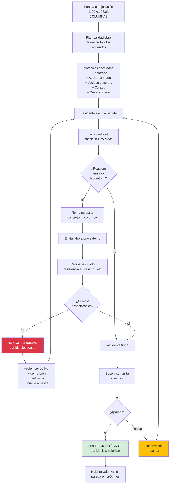
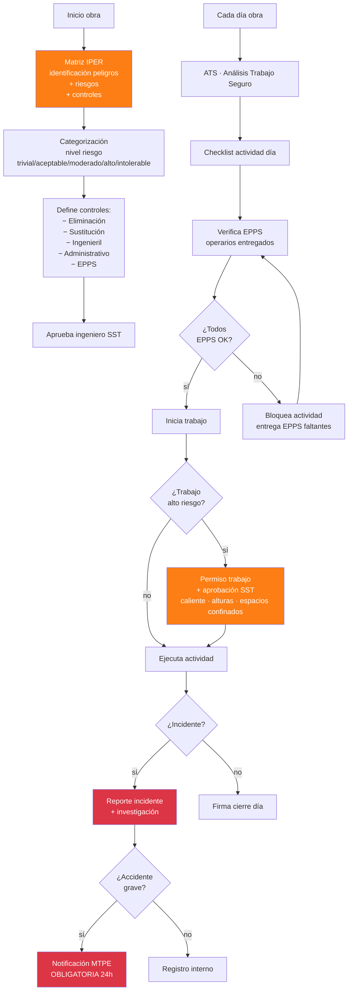

# 30 · Calidad + SST · Protocolos · No conformidades · Liberaciones

Crítico. Sin esto no hay valorización aprobada · multiplica penalidades · expone empresa a sanciones MTC.

## Universo control

```mermaid
flowchart TB
    QSST[Calidad + SST] --> Q[Calidad]
    QSST --> S[Seguridad]
    QSST --> M[Medio ambiente]

    Q --> Q1[Protocolos calidad partida]
    Q --> Q2[Ensayos laboratorio]
    Q --> Q3[Liberaciones técnicas]
    Q --> Q4[No conformidades]
    Q --> Q5[Plan de calidad obra]

    S --> S1[IPER · matriz peligros]
    S --> S2[ATS diario]
    S --> S3[Permisos trabajo riesgoso]
    S --> S4[Capacitaciones]
    S --> S5[Incidentes / accidentes]
    S --> S6[EPPS · entregas]
    S --> S7[SCTR vigencia]
    S --> S8[Inspecciones SST]

    M --> M1[Plan manejo ambiental]
    M --> M2[Monitoreo aire/ruido/agua]
    M --> M3[Residuos sólidos · MAPRO]
    M --> M4[Programa monitoreo]

    style Q1 fill:#cce5ff
    style S1 fill:#fd7e14,color:#fff
    style M1 fill:#d4edda
```



## Flujo protocolo calidad por partida



## Schema protocolos

```sql
plan_calidad (
  id uuid PRIMARY KEY,
  proyecto_id uuid,
  archivo_pdf_nas text,
  fecha_aprobacion date,
  aprobado_por uuid,
  vigencia_desde date,
  estado varchar
)

protocolos_catalogo (                              -- catálogo plantillas
  id uuid PRIMARY KEY,
  codigo varchar UNIQUE,                            -- "PCC-01"
  descripcion text,                                  -- "Vaciado concreto"
  categoria varchar,                                -- 'estructuras','arquitectura','IISS','IIEE'
  campos jsonb,                                      -- definición checklist + measurements
  requiere_ensayo_laboratorio boolean,
  norma_referencia text                              -- "NTE E.060 Concreto Armado"
)

protocolos_partida (                               -- mapeo partida → protocolos requeridos
  id uuid PRIMARY KEY,
  proyecto_id uuid,
  partida_id uuid,
  protocolo_catalogo_id uuid,
  obligatorio boolean DEFAULT true
)

protocolos_ejecutados (
  id uuid PRIMARY KEY,
  proyecto_id uuid,
  partida_id uuid,
  protocolo_catalogo_id uuid,
  numero varchar,                                    -- "PCC-01-2026-0023"

  fecha_ejecucion date,
  ubicacion_obra text,                               -- "ej1 · 1er piso"
  responsable_ejecucion_id uuid,

  campos_completados jsonb,                          -- valores checklist
  fotos_nas text[],

  ensayo_requerido boolean,
  ensayo_resultado_id uuid,                          -- vincula laboratorio

  estado ENUM ('borrador','completado','en_revision_supervisor','aprobado','observado','rechazado'),

  firma_residente_at timestamp,
  firma_residente_id uuid,
  firma_supervisor_at timestamp,
  firma_supervisor_id uuid,
  observaciones_supervisor text,

  archivo_pdf_nas text,
  hash_sha256 varchar(64)
)

ensayos_laboratorio (
  id uuid PRIMARY KEY,
  proyecto_id uuid,
  protocolo_ejecutado_id uuid,
  numero_muestra varchar,
  laboratorio_externo varchar,

  tipo_ensayo varchar,                               -- 'compresion_concreto','resistencia_acero','slump'
  fecha_toma_muestra date,
  fecha_resultado date,

  especificacion text,                                -- "f'c=210 kg/cm²"
  resultado_valor decimal(10,2),
  resultado_unidad varchar,
  cumple boolean,
  margen_seguridad decimal(7,2),

  archivo_certificado_pdf_nas text,
  estado varchar
)

-- No conformidades
no_conformidades (
  id uuid PRIMARY KEY,
  proyecto_id uuid,
  numero varchar UNIQUE,                             -- NC-2026-0012

  fecha_deteccion date,
  detector_user_id uuid,

  tipo ENUM ('calidad','sst','ambiental','documental','contractual'),
  severidad ENUM ('critica','alta','media','baja'),

  partida_id uuid,
  protocolo_id uuid,
  ensayo_id uuid,

  descripcion text,
  causa_raiz text,
  fotos_nas text[],

  -- Acción correctiva
  accion_correctiva text,
  responsable_solucion_id uuid,
  fecha_limite_solucion date,
  fecha_solucion date,
  evidencia_solucion_nas text,

  -- Acción preventiva (evita repetición)
  accion_preventiva text,

  -- Costo
  costo_solucion decimal(14,2),
  partida_costo_imputada uuid,

  estado ENUM ('abierta','en_proceso','solucionada','cerrada','rechazada')
)
```

## Flujo SST · IPER + ATS



## Schema SST

```sql
iper (
  id uuid PRIMARY KEY,
  proyecto_id uuid,
  fecha_elaboracion date,
  archivo_pdf_nas text,
  vigencia_desde date,
  estado varchar
)

iper_riesgos (
  id uuid PRIMARY KEY,
  iper_id uuid,
  actividad varchar,
  peligro text,
  riesgo text,
  evaluacion_inicial varchar,                        -- 'trivial','aceptable','moderado','alto','intolerable'
  controles jsonb,                                    -- jerarquía controles
  evaluacion_residual varchar
)

ats_diarios (
  id uuid PRIMARY KEY,
  proyecto_id uuid,
  fecha date,
  cuadrilla varchar,
  partida_id uuid,
  actividad text,

  iper_aplicado_id uuid,
  controles_implementados jsonb,
  epps_verificados jsonb,                             -- {"casco": ok, "lentes": ok, ...}

  trabajadores_participantes uuid[],
  charla_minutos integer,

  firma_capataz_id uuid,
  firma_supervisor_id uuid,

  archivo_pdf_nas text,
  fotos_nas text[]
)

permisos_trabajo (
  id uuid PRIMARY KEY,
  proyecto_id uuid,
  tipo ENUM ('trabajo_caliente','altura','espacios_confinados','electrico','excavacion','izaje'),
  fecha date,
  hora_inicio time,
  hora_fin time,

  ubicacion text,
  descripcion text,
  responsable_id uuid,
  trabajadores_autorizados uuid[],

  riesgos_identificados jsonb,
  controles_aplicados jsonb,
  equipos_requeridos jsonb,

  estado ENUM ('solicitado','aprobado','en_ejecucion','completado','cancelado'),
  aprobado_por_sst_id uuid,
  archivo_pdf_nas text
)

incidentes_sst (
  id uuid PRIMARY KEY,
  proyecto_id uuid,
  numero varchar UNIQUE,

  fecha_hora timestamp,
  ubicacion text,

  tipo ENUM ('cuasi_accidente','accidente_leve','accidente_grave','accidente_fatal','enfermedad_ocupacional'),

  trabajadores_afectados uuid[],
  descripcion text,
  causas_raiz jsonb,

  -- Acciones
  acciones_correctivas text,
  acciones_preventivas text,
  responsable_seguimiento_id uuid,

  -- Reportes
  reporte_mtps_emitido boolean,
  reporte_mtps_fecha date,
  reporte_essalud_emitido boolean,
  reporte_aseguradora_emitido boolean,

  -- Costo
  costo_directo decimal(14,2),
  costo_indirecto_estimado decimal(14,2),
  dias_perdidos_obra integer,

  estado varchar,
  archivos_nas text[]
)

epps_entregas (
  id uuid PRIMARY KEY,
  trabajador_id uuid,
  fecha_entrega date,
  items jsonb,                                        -- [{tipo:'casco', cantidad:1, talla:''}]
  firma_recibo_id uuid,
  archivo_acta_pdf_nas text
)

capacitaciones_sst (
  id uuid PRIMARY KEY,
  proyecto_id uuid,
  tema varchar,
  fecha date,
  duracion_horas decimal(4,2),
  capacitador varchar,
  participantes uuid[],
  evaluacion jsonb,
  certificados_emitidos boolean,
  archivo_evidencia_pdf_nas text
)

-- Programa monitoreo ambiental
monitoreo_ambiental (
  id uuid PRIMARY KEY,
  proyecto_id uuid,
  fecha date,
  parametro varchar,                                  -- 'aire_PM10','ruido_dB','agua_pH'
  ubicacion text,
  valor decimal(10,2),
  unidad varchar,
  limite_normativo decimal(10,2),
  cumple boolean,
  laboratorio_externo varchar,
  certificado_pdf_nas text
)
```

## Vinculación con valorización

```sql
-- Para que valorización apruebe, partidas deben tener:
-- 1. Protocolos calidad firmados
-- 2. NCs cerradas
-- 3. ATS día completos
-- 4. SCTR vigente trabajadores

CREATE FUNCTION partida_lista_valorizar(p_partida_id uuid)
RETURNS boolean AS $$
DECLARE
  v_protocolos_pendientes int;
  v_ncs_abiertas int;
BEGIN
  SELECT COUNT(*) INTO v_protocolos_pendientes
  FROM protocolos_partida pp
  WHERE pp.partida_id = p_partida_id
    AND pp.obligatorio = true
    AND NOT EXISTS (
      SELECT 1 FROM protocolos_ejecutados pe
      WHERE pe.partida_id = p_partida_id
        AND pe.protocolo_catalogo_id = pp.protocolo_catalogo_id
        AND pe.estado = 'aprobado'
    );

  SELECT COUNT(*) INTO v_ncs_abiertas
  FROM no_conformidades
  WHERE partida_id = p_partida_id
    AND severidad IN ('critica','alta')
    AND estado IN ('abierta','en_proceso');

  RETURN v_protocolos_pendientes = 0 AND v_ncs_abiertas = 0;
END $$;
```

## KPIs SST/Calidad

| KPI | Fórmula | Target |
|---|---|---|
| Protocolos completados | aprobados / requeridos | 100% antes valorización |
| NCs abiertas | count abiertas | minimizar |
| Tiempo cierre NC | avg días | < 7 días |
| Índice frecuencia accidentes | (#accidentes × 1M) / hh trabajadas | < 1 |
| Índice severidad | (días perdidos × 1M) / hh | < 50 |
| Cumplimiento ATS | days_with_ats / días obra | 100% |
| EPPS vigentes | trabajadores con EPPS / total | 100% |
| SCTR vigente | trabajadores cubiertos / total | 100% |
| Capacitaciones / mes | hrs · meta CAPECO | > target |

## Prioridad: **CRÍTICA**
