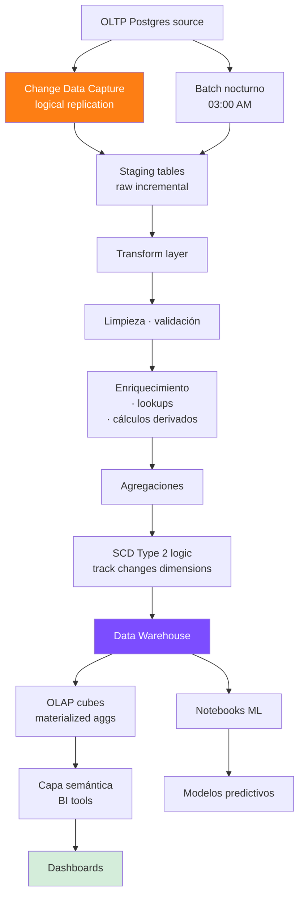

# 31 · Data Warehouse + BI · Modelo dimensional

Arquitectura analítica separada del transaccional. Sin esto no compite con SAP/Primavera.

## Arquitectura · OLTP vs OLAP

```mermaid
flowchart LR
    subgraph OLTP["OLTP · Transaccional"]
        T1[(Postgres<br/>operacional)]
        T2[Tablas normalizadas]
        T3[CRUD diario]
    end

    subgraph ETL["ETL · Pipeline"]
        E1[Extract<br/>CDC + batch]
        E2[Transform<br/>denormalizar · agregar]
        E3[Load<br/>al DW]
    end

    subgraph OLAP["OLAP · Analítico"]
        O1[(Data Warehouse<br/>Postgres ad-hoc<br/>o BigQuery o Snowflake)]
        O2[Modelo estrella<br/>fact + dimensions]
        O3[Snapshots históricos]
    end

    subgraph BI["BI · Tools"]
        B1[Metabase / Superset]
        B2[Power BI / Tableau]
        B3[Custom dashboards]
        B4[ML notebooks]
    end

    OLTP --> ETL
    ETL --> OLAP
    OLAP --> BI

    style OLTP fill:#cce5ff
    style ETL fill:#fff4cc
    style OLAP fill:#7c4dff,color:#fff
    style BI fill:#d4edda
```



## Modelo estrella · Fact tables

```mermaid
flowchart TB
    subgraph DIMS["Dimensiones (slowly changing)"]
        D1[dim_proyecto<br/>SCD Type 2]
        D2[dim_partida<br/>SCD Type 2]
        D3[dim_recurso<br/>SCD Type 2]
        D4[dim_proveedor<br/>SCD Type 2]
        D5[dim_subcontratista<br/>SCD Type 2]
        D6[dim_trabajador<br/>SCD Type 2]
        D7[dim_tiempo<br/>fixed]
        D8[dim_empresa]
        D9[dim_baseline_cronograma]
    end

    subgraph FACTS["Fact tables"]
        F1[fact_compras<br/>granularidad: línea OC]
        F2[fact_consumos_almacen<br/>granularidad: salida material]
        F3[fact_costo_mo<br/>granularidad: tareo]
        F4[fact_valorizaciones<br/>granularidad: val × partida]
        F5[fact_avances_partidas<br/>granularidad: avance día]
        F6[fact_subcontratos<br/>granularidad: pago SC]
        F7[fact_garantias_devengo<br/>granularidad: mes × garantía]
        F8[fact_penalidades<br/>granularidad: penalidad aplicada]
        F9[fact_evm_snapshot<br/>granularidad: mes × proyecto]
        F10[fact_cashflow<br/>granularidad: día × evento]
    end

    D1 -.-> F1
    D1 -.-> F2
    D1 -.-> F3
    D1 -.-> F4
    D1 -.-> F5
    D2 -.-> F1
    D2 -.-> F2
    D2 -.-> F3
    D2 -.-> F4
    D2 -.-> F5
    D3 -.-> F1
    D3 -.-> F2
    D4 -.-> F1
    D5 -.-> F6
    D6 -.-> F3
    D7 -.-> F1
    D7 -.-> F2
    D7 -.-> F3
    D7 -.-> F4
    D7 -.-> F5

    style FACTS fill:#cce5ff
    style DIMS fill:#fff4cc
```



## Schema DW

```sql
-- Dimensiones · SCD Type 2 (track histórico cambios)
CREATE TABLE dim_proyecto (
  proyecto_sk bigserial PRIMARY KEY,             -- surrogate key
  proyecto_id uuid NOT NULL,                     -- natural key
  codigo varchar,
  nombre varchar,
  cui varchar,
  status varchar,
  modalidad varchar,
  monto_contractual decimal(14,2),
  monto_vigente decimal(14,2),
  cliente_id uuid,
  cliente_razon varchar,

  -- SCD2
  valid_from timestamp,
  valid_to timestamp,
  is_current boolean,

  -- Audit
  loaded_at timestamp DEFAULT now()
);
CREATE INDEX ON dim_proyecto (proyecto_id, is_current);

CREATE TABLE dim_partida (
  partida_sk bigserial PRIMARY KEY,
  partida_id uuid,
  proyecto_sk bigint REFERENCES dim_proyecto,
  codigo varchar,
  nombre text,
  nivel int,
  parent_codigo varchar,
  unidad varchar,
  cantidad decimal(14,4),
  pu_referencial decimal(14,4),
  pu_contractual decimal(14,4),
  presupuesto decimal(14,2),
  is_summary boolean,
  is_critical boolean,

  -- SCD2
  valid_from, valid_to, is_current,
  loaded_at
);

CREATE TABLE dim_tiempo (
  fecha_sk int PRIMARY KEY,                       -- 20251215
  fecha date,
  anio int,
  trimestre int,
  mes int,
  semana_anio int,
  dia int,
  dia_semana int,
  nombre_mes varchar,
  nombre_dia varchar,
  es_fin_de_semana boolean,
  es_feriado boolean,
  periodo_fiscal varchar
);

-- Fact: compras
CREATE TABLE fact_compras (
  fact_id bigserial PRIMARY KEY,
  fecha_sk int REFERENCES dim_tiempo,
  proyecto_sk bigint,
  partida_sk bigint,
  recurso_sk bigint,
  proveedor_sk bigint,
  empresa_sk bigint,

  -- Métricas
  cantidad decimal(14,4),
  precio_unitario decimal(14,4),
  monto_subtotal decimal(14,2),
  monto_igv decimal(14,2),
  monto_total decimal(14,2),
  monto_detraccion decimal(14,2),

  -- Atributos hechos
  oc_id uuid,
  factura_id uuid,
  iu_codigo varchar(3),
  monomio_letra char(1),

  loaded_at timestamp
);
CREATE INDEX ON fact_compras (fecha_sk);
CREATE INDEX ON fact_compras (proyecto_sk, fecha_sk);

-- Fact: consumos
CREATE TABLE fact_consumos_almacen (
  fact_id bigserial PRIMARY KEY,
  fecha_sk int,
  proyecto_sk bigint,
  partida_sk bigint,
  recurso_sk bigint,

  cantidad decimal(14,4),
  costo_unitario decimal(14,4),
  monto_total decimal(14,2),

  movimiento_id uuid,
  apu_consumo_estimado decimal(14,4),             -- consumo según APU
  apu_consumo_real decimal(14,4),                  -- consumo real
  variance_consumo decimal(14,4),

  loaded_at timestamp
);

-- Fact: costo MO
CREATE TABLE fact_costo_mo (
  fact_id bigserial PRIMARY KEY,
  fecha_sk int,
  proyecto_sk bigint,
  partida_sk bigint,
  trabajador_sk bigint,

  horas_normales decimal(5,2),
  horas_extras decimal(5,2),
  costo_jornal decimal(14,2),
  costo_buc decimal(14,2),
  costo_leyes_sociales decimal(14,2),
  costo_total_mo decimal(14,2),

  productividad decimal(7,4),                      -- m³/hh o m²/hh
  loaded_at timestamp
);

-- Fact: valorizaciones
CREATE TABLE fact_valorizaciones (
  fact_id bigserial PRIMARY KEY,
  fecha_sk int,
  proyecto_sk bigint,
  partida_sk bigint,

  numero_val int,
  avance_periodo_pct decimal(5,2),
  avance_acumulado_pct decimal(5,2),
  metrado_periodo decimal(14,4),
  monto_referencial decimal(14,2),
  monto_contractual decimal(14,2),
  monto_igv decimal(14,2),
  monto_reajuste decimal(14,2),
  monto_neto decimal(14,2),
  monto_cobrado decimal(14,2),

  fecha_emision date,
  fecha_aprobacion date,
  fecha_pago date,
  dias_atraso_pago int,
  loaded_at timestamp
);

-- Fact: EVM snapshots
CREATE TABLE fact_evm (
  fact_id bigserial PRIMARY KEY,
  fecha_sk int,
  proyecto_sk bigint,
  baseline_sk bigint,

  pv decimal(14,2),
  ev decimal(14,2),
  ac decimal(14,2),
  bac decimal(14,2),

  spi decimal(7,4),
  cpi decimal(7,4),
  tcpi decimal(7,4),
  eac decimal(14,2),
  vac decimal(14,2),

  loaded_at timestamp
);
```

## ETL pipeline



## Stack recomendado

```
Etapa MVP (lite):
  - Postgres mismo cluster · schema 'analytics'
  - Materialized views agregadas
  - Refresh nightly cron
  - Metabase (open source) para dashboards
  - Notebooks Jupyter para ML

Etapa enterprise:
  - Data Warehouse separado: BigQuery / Snowflake / Redshift
  - ETL: dbt (transform) + Airflow (orquestación)
  - CDC: Debezium para Postgres → Kafka → DW
  - BI: Power BI / Tableau / Looker
  - ML: Vertex AI / SageMaker
  - Real-time: Kafka Streams / ksqlDB
```

## Snapshots históricos · time-travel

```sql
-- Snapshot mensual estado proyecto
CREATE TABLE snapshot_proyecto_mensual (
  snapshot_id bigserial PRIMARY KEY,
  fecha_corte date,
  proyecto_id uuid,
  estado_completo jsonb,                          -- snapshot completo
  monto_vigente decimal(14,2),
  avance_fisico_pct decimal(5,2),
  avance_financiero_pct decimal(5,2),
  utility_a_la_fecha decimal(14,2),
  spi decimal(7,4),
  cpi decimal(7,4),
  -- ...
  PRIMARY KEY (proyecto_id, fecha_corte)
);

-- Cron mensual
INSERT INTO snapshot_proyecto_mensual
SELECT
  ...,
  last_day(now()) AS fecha_corte,
  ...
FROM proyectos;

-- Comparación M-1 vs M
SELECT
  s2.proyecto_id,
  s2.spi - s1.spi AS spi_delta,
  s2.cpi - s1.cpi AS cpi_delta
FROM snapshot_proyecto_mensual s1
JOIN snapshot_proyecto_mensual s2
  ON s1.proyecto_id = s2.proyecto_id
  AND s2.fecha_corte = s1.fecha_corte + INTERVAL '1 month'
WHERE s2.fecha_corte = '2026-12-31';
```

## Dashboards típicos

```
Nivel ejecutivo (CEO/Gerente):
  - Pipeline obras (licitación → ejecución → cerrado)
  - Backlog total y por etapa
  - Margen agregado mes
  - Cashflow consolidado
  - Top 5 obras rentables / perdedoras
  - Garantías vigentes total
  - Línea bancaria utilizada

Nivel proyecto (Residente / OT):
  - SPI/CPI proyecto
  - Curva S real vs programado
  - Avance físico por título
  - Utility a la fecha
  - OCs pendientes facturar
  - Penalidades acumuladas vs tope
  - Próximos hitos

Nivel financiero (Contadora):
  - Estados financieros mes
  - CxC / CxP aging
  - Detracciones · retenciones acumuladas
  - PLE / SIRE pendientes
  - Conciliación bancaria
  - Garantías por devengar costo

Nivel operativo (Logística):
  - Stock por almacén
  - OCs en proceso
  - Variance precio compras
  - Disponibilidad equipos
  - Top proveedores

Nivel SST/Calidad:
  - NCs abiertas
  - Índices accidentes
  - Protocolos pendientes
  - SCTR vigencia trabajadores
  - Capacitaciones cumplidas
```

## ML use cases

```
1. Predicción utility final (regresión)
   features: SPI, CPI, avance, modificaciones, etc
   output: utility final estimada + intervalo

2. Predicción atraso pago entidad (regresión)
   features: tipo entidad, mes, monto val, observaciones
   output: días atraso esperados

3. Detección anomalía precios compra (isolation forest)
   features: precio, recurso, proveedor, mes
   output: scoring anomalía

4. Clasificación auto IU (NLP)
   input: descripción recurso
   output: IU codigo + confianza

5. Optimización compras agrupadas (combinatorial)
   input: requerimientos multi-obra
   output: agrupaciones óptimas

6. Predicción riesgo SC default (clasificación)
   features: histórico SC, ratios, observaciones
   output: probabilidad default
```

## Prioridad: **MEDIA · Tier 3-4**
