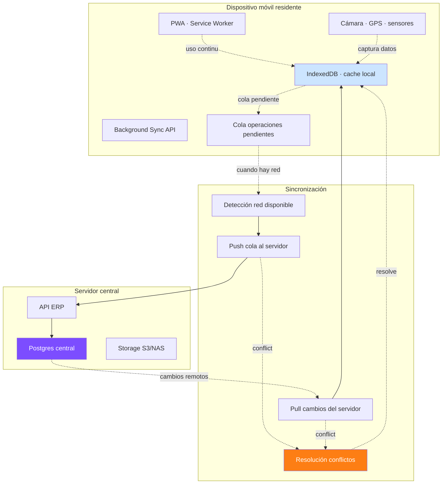
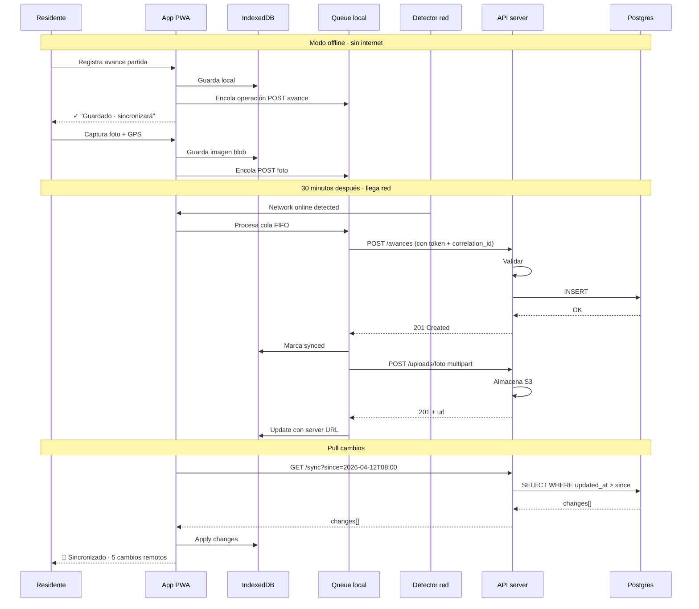
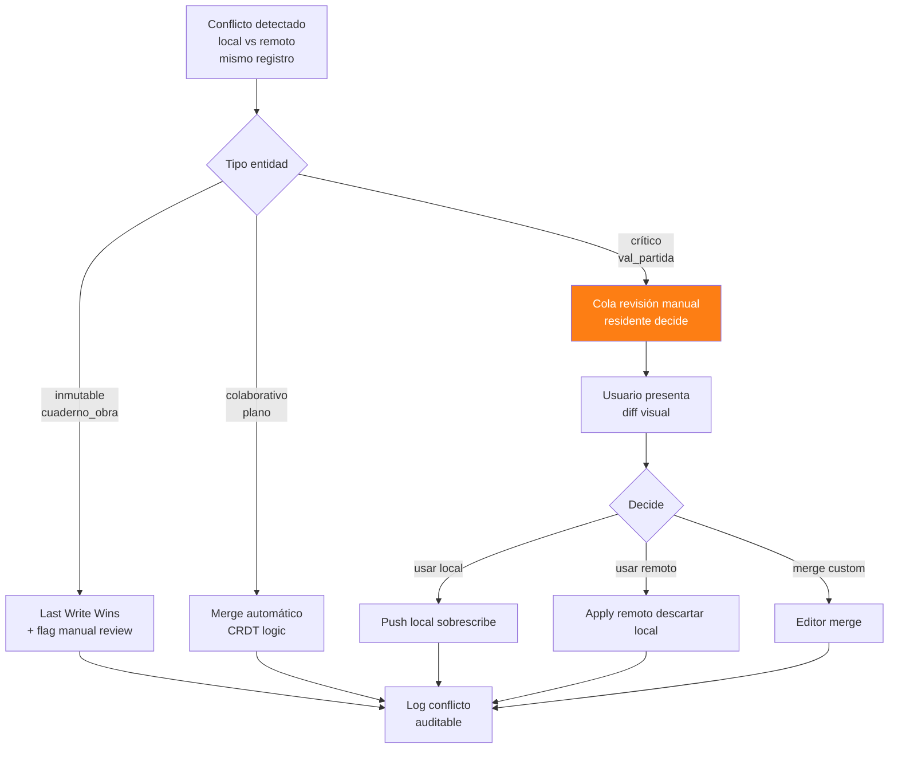
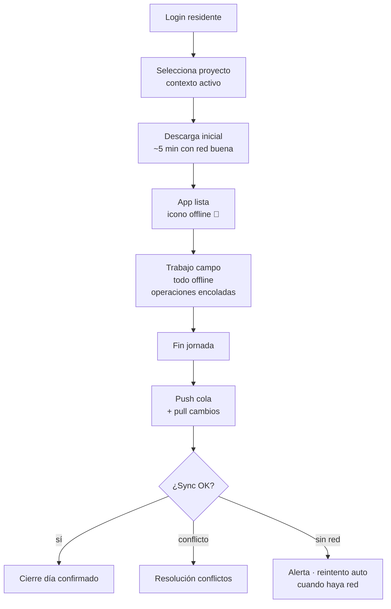

# 32 · Offline-first · Edge sync · Obra en provincia

Crítico Perú · obra fuera Lima sin internet estable. Sin esto residente vuelve a Excel.

## Realidad obra provincia

```
Casos típicos:
  Selva: Internet 0-2 horas/día · vía radio o satelital
  Sierra alta: 4G intermitente · sin red eléctrica estable
  Costa norte: 4G OK pero caídas frecuentes
  Lima/ciudad: 4G/fibra estable

Problema sin offline:
  Residente mide concreto a las 6 AM · sin internet
  Espera al hostel a las 8 PM para registrar
  16h de delay · datos imprecisos · fotos perdidas
```

## Arquitectura offline-first



## Stack PWA

```
Frontend:
  - React + Vite
  - Workbox (service worker)
  - IndexedDB · Dexie.js (wrapper)
  - Cache API
  - Background Sync API
  - Notification API

Sincronización:
  - REST con ETags + If-Modified-Since
  - O GraphQL con relay-style cursor
  - O CRDT-based (Yjs / Automerge) para casos colaborativos
  - WebSocket para notificaciones realtime cuando hay red

Storage local:
  - IndexedDB datos estructurados
  - Cache API · imágenes y assets
  - LocalStorage · preferencias usuario
```

## Capacidades offline obligatorias

```mermaid
flowchart TB
    OFF[Modo offline] --> READ[Lectura]
    OFF --> WRITE[Escritura]
    OFF --> MEDIA[Multimedia]

    READ --> R1[Lista proyectos asignados]
    READ --> R2[Lista partidas + cronograma]
    READ --> R3[Lista trabajadores cuadrilla]
    READ --> R4[Documentos descargados<br/>planos vigentes]
    READ --> R5[Catálogo recursos APUs]

    WRITE --> W1[Avance partida + foto]
    WRITE --> W2[Tareo diario obreros]
    WRITE --> W3[Cuaderno obra asiento]
    WRITE --> W4[Vale salida almacén]
    WRITE --> W5[Recepción material<br/>+ foto guía]
    WRITE --> W6[ATS diario]
    WRITE --> W7[Protocolo calidad]
    WRITE --> W8[Reporte incidente SST]

    MEDIA --> M1[Captura fotos · GPS]
    MEDIA --> M2[Audio observaciones]
    MEDIA --> M3[Video corto · 30s]
    MEDIA --> M4[Firma touch screen]
```



## Flujo sincronización



## Resolución conflictos



## Schema sincronización

```sql
-- Tabla sync_log para audit
sync_operations (
  id uuid PRIMARY KEY,
  device_id varchar,
  user_id uuid,
  correlation_id uuid,                         -- mismo en cliente y servidor
  operation_type varchar,                      -- 'POST','PUT','PATCH','DELETE'
  entity_type varchar,
  entity_id uuid,

  payload jsonb,
  client_timestamp timestamp,
  server_received_at timestamp,
  server_processed_at timestamp,

  status ENUM (
    'pending_local',
    'sent',
    'received',
    'processed_ok',
    'processed_conflict',
    'processed_error',
    'reverted'
  ),

  conflict_resolution varchar,
  error_message text,

  bytes_payload int,
  network_quality varchar                      -- 'excellent','good','poor','offline'
)

-- Last sync por usuario × dispositivo × entidad
sync_state (
  user_id uuid,
  device_id varchar,
  entity_type varchar,
  last_sync_at timestamp,
  last_sequence_seen bigint,
  PRIMARY KEY (user_id, device_id, entity_type)
)
```

## Optimizaciones data móvil

```typescript
// Compresión transferencia
// API endpoint: GET /sync?since=...&compact=true
// Returns minimal JSON · solo campos cambiados

// Diferencial sync
{
  "since": "2026-04-12T08:00:00Z",
  "changes": [
    {"type":"partida","id":"abc","fields":{"avance":80}},  // solo campos cambiados
    {"type":"oc","id":"xyz","fields":{"status":"aprobada"}},
  ],
  "deletions": ["uuid1","uuid2"],
  "next_cursor": "2026-04-12T09:00:00Z"
}

// Bloqueado por red lenta · tiered priorities
// Crítico: avances, tareos, ATS · upload prioridad 1
// Medio: fotos, protocolos · prioridad 2
// Bajo: documentos descargables · prioridad 3 (espera WiFi)

// Compresión imágenes pre-upload
async function compressPhoto(file) {
  // Resize a max 1920px
  // JPEG quality 75
  // Strip metadata exif (excepto GPS)
  // Resultado: 200KB típico vs 4MB original
}
```

## Sincronización selectiva por proyecto

```
Residente solo descarga datos de SU proyecto:
  - Partidas proyecto X
  - Trabajadores asignados a X
  - OCs del proyecto X
  - Documentos vigentes X
  - Recursos típicos X

Storage local:
  Proyecto pequeño 100MB
  Proyecto grande 500MB
  Liberar al cambiar de proyecto
```

## Modo "field worker"



## Stack recomendado código

```typescript
// PWA setup
import { Workbox } from 'workbox-window';

const wb = new Workbox('/sw.js');
wb.register();

// IndexedDB con Dexie
import Dexie from 'dexie';

class ERPDb extends Dexie {
  proyectos!: Table<Proyecto>;
  partidas!: Table<Partida>;
  avances!: Table<Avance>;
  pendingOps!: Table<PendingOp>;

  constructor() {
    super('ERPMobile');
    this.version(1).stores({
      proyectos: '&id, codigo, status',
      partidas: '&id, proyecto_id, codigo',
      avances: '&id, partida_id, fecha',
      pendingOps: '++id, status, created_at'
    });
  }
}

// Background sync
self.addEventListener('sync', async (event) => {
  if (event.tag === 'sync-pending-ops') {
    await processPendingQueue();
  }
});

// Encolar operación cuando offline
async function recordAvance(partidaId, avancePct, foto) {
  // Persiste local
  await db.avances.add({...});

  // Encola operación
  await db.pendingOps.add({
    type: 'POST',
    endpoint: '/api/avances',
    payload: {...},
    status: 'pending',
    created_at: new Date()
  });

  // Dispara background sync
  if ('SyncManager' in window) {
    const reg = await navigator.serviceWorker.ready;
    await reg.sync.register('sync-pending-ops');
  }
}
```

## KPIs

| KPI | Target |
|---|---|
| % operaciones registradas offline | > 60% (válido obra real) |
| Tiempo promedio sync queue | < 30s con red |
| Conflictos / mes | < 5 (mayoría LWW) |
| Storage local promedio | < 500MB |
| Crashes app | < 1% sesiones |
| Tiempo abrir app · cold start | < 3s |

## Prioridad: **CRÍTICA · MVP**
