# 33 · Motor de reglas + Parametrización

Sin esto cada cambio SUNAT/CAPECO/contractual rompe deploys. Enterprise = configurar, no recompilar.

## Por qué importante

```
Cambios típicos sin warning:
  - SUNAT cambia % detracción · vigencia 1ro mes
  - CAPECO actualiza jornales · vigencia 1ro junio
  - INEI publica IUs nuevos
  - UIT cambia anualmente
  - Reglamento publica modificaciones
  - Empresa redefine niveles aprobación
  - Nuevos códigos SUNAT operaciones

Sin motor reglas:
  Hardcoded en código
  Cada cambio = sprint de dev + deploy + downtime
  Errores recurrentes
  No auditable

Con motor reglas:
  Parámetros editables UI admin
  Vigencia desde / hasta
  Versionado · histórico
  Audit · quién cambió qué
  Sin downtime
```

## Categorías parámetros

```mermaid
flowchart TB
    PAR[Parámetros] --> TRIB[Tributarios]
    PAR --> CAPECO[Laborales CAPECO]
    PAR --> INDICES[Índices INEI]
    PAR --> CONTR[Contractuales]
    PAR --> WORK[Workflows]
    PAR --> KPI[KPIs / umbrales]
    PAR --> EMP[Por empresa]
    PAR --> SIST[Sistema]

    TRIB --> T1[% detracciones por código]
    TRIB --> T2[% retención IGV]
    TRIB --> T3[% percepción IGV]
    TRIB --> T4[Monto mínimo bancarización]
    TRIB --> T5[UIT vigente]
    TRIB --> T6[% IGV]
    TRIB --> T7[% renta]

    CAPECO --> C1[Jornal Operario · Oficial · Peón · Capataz]
    CAPECO --> C2[% BUC]
    CAPECO --> C3[% leyes sociales]
    CAPECO --> C4[% SCTR salud]
    CAPECO --> C5[% SCTR pensión]
    CAPECO --> C6[% CONAFOVISER · SENCICO]

    INDICES --> I1[Índices INEI mensuales por área]
    INDICES --> I2[Tipo cambio diario]
    INDICES --> I3[IPC mensual]

    CONTR --> CT1[Tope adicionales 50%]
    CONTR --> CT2[Tope reducciones 25%]
    CONTR --> CT3[Tope penalidades 10%]
    CONTR --> CT4[Factores F penalidad mora]
    CONTR --> CT5[Plazos legales recursos]

    WORK --> W1[Niveles aprobación por monto]
    WORK --> W2[Plazos workflow por tipo]
    WORK --> W3[Roles requeridos]

    KPI --> K1[Umbrales SPI · CPI alerta]
    KPI --> K2[Umbral cashflow alerta]
    KPI --> K3[% variance precio compra alerta]
    KPI --> K4[Días vencimiento garantía alerta]
```



## Schema motor reglas

```sql
-- Categorías
parametros_categorias (
  id varchar PRIMARY KEY,                     -- 'tributario','capeco','indices'
  descripcion text,
  orden int
)

-- Parámetros con vigencia + versionado
parametros (
  id uuid PRIMARY KEY,
  categoria_id varchar REFERENCES parametros_categorias,
  codigo varchar UNIQUE,                       -- 'detraccion_construccion_pct'
  descripcion text,
  tipo_dato ENUM ('decimal','integer','varchar','boolean','json','date'),

  -- Scope
  scope ENUM ('global','empresa','proyecto'),
  empresa_id uuid,                              -- si scope=empresa
  proyecto_id uuid,                             -- si scope=proyecto

  -- Valor
  valor_decimal decimal(15,6),
  valor_integer bigint,
  valor_varchar text,
  valor_boolean boolean,
  valor_json jsonb,
  valor_date date,

  -- Vigencia
  vigencia_desde date NOT NULL,
  vigencia_hasta date,                          -- NULL = sin fin

  -- Validación
  rango_min decimal(15,6),
  rango_max decimal(15,6),
  valores_permitidos text[],
  regex_validacion text,

  -- Audit
  base_legal text,                              -- "RS 183-2004/SUNAT"
  fuente_oficial_url text,
  observaciones text,

  -- Versioning
  version int DEFAULT 1,
  parametro_padre_id uuid,                      -- referencia versión anterior

  estado ENUM ('vigente','futuro','obsoleto','observado'),

  created_at, updated_at,
  created_by, updated_by,
  aprobado_at,
  aprobado_por
);

CREATE UNIQUE INDEX uq_param_codigo_vigencia
  ON parametros (codigo, vigencia_desde, COALESCE(empresa_id, '00000000-0000-0000-0000-000000000000'::uuid));

-- Histórico cambios
parametros_audit (
  id uuid PRIMARY KEY,
  parametro_id uuid,
  fecha_cambio timestamp,
  user_id uuid,
  valor_antes jsonb,
  valor_despues jsonb,
  motivo text
)
```

## Función obtener valor vigente

```sql
CREATE OR REPLACE FUNCTION param_get(
  p_codigo varchar,
  p_fecha date DEFAULT CURRENT_DATE,
  p_empresa_id uuid DEFAULT NULL,
  p_proyecto_id uuid DEFAULT NULL
)
RETURNS jsonb AS $$
DECLARE
  v_param record;
BEGIN
  -- Prioridad: proyecto > empresa > global
  SELECT * INTO v_param FROM parametros
  WHERE codigo = p_codigo
    AND p_fecha BETWEEN vigencia_desde AND COALESCE(vigencia_hasta, p_fecha)
    AND estado = 'vigente'
    AND (
      (scope = 'proyecto' AND proyecto_id = p_proyecto_id)
      OR (scope = 'empresa' AND empresa_id = p_empresa_id AND proyecto_id IS NULL)
      OR (scope = 'global' AND empresa_id IS NULL AND proyecto_id IS NULL)
    )
  ORDER BY
    CASE scope
      WHEN 'proyecto' THEN 1
      WHEN 'empresa' THEN 2
      WHEN 'global' THEN 3
    END
  LIMIT 1;

  IF v_param IS NULL THEN
    RAISE EXCEPTION 'Parámetro % no encontrado para fecha %', p_codigo, p_fecha;
  END IF;

  -- Retornar valor según tipo
  RETURN CASE v_param.tipo_dato
    WHEN 'decimal'  THEN to_jsonb(v_param.valor_decimal)
    WHEN 'integer'  THEN to_jsonb(v_param.valor_integer)
    WHEN 'varchar'  THEN to_jsonb(v_param.valor_varchar)
    WHEN 'boolean'  THEN to_jsonb(v_param.valor_boolean)
    WHEN 'json'     THEN v_param.valor_json
    WHEN 'date'     THEN to_jsonb(v_param.valor_date)
  END;
END $$ LANGUAGE plpgsql;

-- Uso
SELECT (param_get('detraccion_construccion_pct'))::decimal;
SELECT (param_get('uit_vigente', '2026-01-01'))::decimal;
SELECT param_get('niveles_aprobacion_oc', CURRENT_DATE, empresa_id);
```

## Seed inicial parámetros

```sql
-- Tributarios
INSERT INTO parametros (categoria_id, codigo, tipo_dato, valor_decimal, vigencia_desde, base_legal, scope) VALUES
  ('tributario','detraccion_construccion_pct','decimal',0.04,'2014-11-01','RS 183-2004/SUNAT','global'),
  ('tributario','detraccion_servicios_general_pct','decimal',0.12,'2014-11-01','RS 183-2004','global'),
  ('tributario','detraccion_cemento_pct','decimal',0.015,'2014-11-01','RS 183-2004','global'),
  ('tributario','detraccion_transporte_pct','decimal',0.10,'2014-11-01','RS 183-2004','global'),
  ('tributario','retencion_igv_pct','decimal',0.03,'2002-06-01','RS 037-2002','global'),
  ('tributario','igv_pct','decimal',0.18,'2011-03-01','D.Leg 1116','global'),
  ('tributario','renta_pct','decimal',0.30,'2017-01-01','LGT','global'),
  ('tributario','bancarizacion_minimo','decimal',3500.00,'2024-01-01','Ley 28194','global'),
  ('tributario','uit_vigente','decimal',5350.00,'2026-01-01','DS 309-2025-EF','global');

-- CAPECO 2026 (ejemplo)
INSERT INTO parametros (categoria_id, codigo, tipo_dato, valor_decimal, vigencia_desde, base_legal, scope) VALUES
  ('capeco','jornal_operario','decimal',88.10,'2025-06-01','Acta CAPECO 2025-2026','global'),
  ('capeco','jornal_oficial','decimal',74.50,'2025-06-01','Acta CAPECO 2025-2026','global'),
  ('capeco','jornal_peon','decimal',66.50,'2025-06-01','Acta CAPECO 2025-2026','global'),
  ('capeco','jornal_capataz','decimal',127.75,'2025-06-01','Acta CAPECO 2025-2026','global'),
  ('capeco','buc_operario_pct','decimal',0.32,'2010-01-01','Ley CC','global'),
  ('capeco','buc_oficial_pct','decimal',0.30,'2010-01-01','Ley CC','global'),
  ('capeco','buc_peon_pct','decimal',0.30,'2010-01-01','Ley CC','global'),
  ('capeco','sctr_pension_pct','decimal',0.0125,'2024-01-01','EsSalud','global'),
  ('capeco','sctr_salud_pct','decimal',0.0205,'2024-01-01','EsSalud','global'),
  ('capeco','conafoviser_pct','decimal',0.02,'1999-01-01','Ley 27000','global'),
  ('capeco','sencico_pct','decimal',0.002,'1989-01-01','D.Leg 147','global');

-- Contractuales (defaults · pueden override por proyecto)
INSERT INTO parametros (categoria_id, codigo, tipo_dato, valor_decimal, vigencia_desde, base_legal, scope) VALUES
  ('contractual','tope_adicionales_pct','decimal',0.50,'2024-04-01','Art 109.2 RLGCP','global'),
  ('contractual','tope_reducciones_pct','decimal',0.25,'2024-04-01','Art 109.1 RLGCP','global'),
  ('contractual','tope_penalidades_pct','decimal',0.10,'2024-04-01','Art 120 RLGCP','global'),
  ('contractual','factor_f_plazo_corto','decimal',0.40,'2024-04-01','Art 120 RLGCP · plazo ≤60d','global'),
  ('contractual','factor_f_plazo_medio','decimal',0.25,'2024-04-01','Art 120 RLGCP · plazo 61-120d','global'),
  ('contractual','factor_f_plazo_largo','decimal',0.15,'2024-04-01','Art 120 RLGCP · plazo >120d','global'),
  ('contractual','plazo_aprobacion_tacita_dias','integer',15,'2024-04-01','Art 179.4 RLGCP','global');

-- Workflows (JSON · estructura compleja)
INSERT INTO parametros (categoria_id, codigo, tipo_dato, valor_json, vigencia_desde, scope, empresa_id) VALUES
  ('workflow','niveles_aprobacion_oc','json', '
  [
    {"hasta": 5000,   "rol": "residente"},
    {"hasta": 50000,  "rol": "admin_obra"},
    {"hasta": 200000, "rol": "gerente"},
    {"hasta": null,   "rol": "directorio"}
  ]'::jsonb, '2026-01-01', 'empresa', '<MM_empresa_id>');

-- KPIs alertas
INSERT INTO parametros (categoria_id, codigo, tipo_dato, valor_decimal, vigencia_desde, scope) VALUES
  ('kpi','spi_alerta_min','decimal',0.95,'2026-01-01','global'),
  ('kpi','cpi_alerta_min','decimal',0.95,'2026-01-01','global'),
  ('kpi','dias_alerta_garantia','integer',30,'2026-01-01','global'),
  ('kpi','variance_precio_alerta_pct','decimal',0.05,'2026-01-01','global');
```

## Motor de reglas (rule engine)

Para reglas más complejas que parámetros simples · ej "si X y Y entonces Z":

```sql
-- Reglas configurables tipo decision tree / DSL simple
business_rules (
  id uuid PRIMARY KEY,
  codigo varchar UNIQUE,
  descripcion text,
  contexto varchar,                                -- 'oc_aprobacion','val_aprobacion','penalidad'

  prioridad int,                                    -- orden evaluación
  activa boolean DEFAULT true,

  -- DSL: JSON con árbol decisión
  condicion jsonb,
  /*
  {
    "and": [
      {"field": "monto", "op": ">", "value": 50000},
      {"field": "proveedor.es_buen_contribuyente", "op": "=", "value": false}
    ]
  }
  */

  accion jsonb,
  /*
  {
    "tipo": "requerir_aprobacion",
    "rol": "gerente",
    "mensaje": "Proveedor no buen contribuyente · monto > 50K"
  }
  */

  vigencia_desde, vigencia_hasta,
  empresa_id, proyecto_id
)

-- Evaluador
CREATE FUNCTION evaluar_reglas(p_contexto varchar, p_payload jsonb)
RETURNS jsonb AS $$
-- Implementación pseudo-código:
--   1. SELECT reglas WHERE contexto = p_contexto AND activa
--      AND vigencia_desde <= now() AND (vigencia_hasta IS NULL OR vigencia_hasta >= now())
--      ORDER BY prioridad
--   2. Por cada regla, evaluar condicion contra payload
--   3. Si match, agregar accion al resultado
--   4. Devolver array acciones
$$;
```

## UI admin parámetros

```mermaid
flowchart TB
    LOG[Login admin] --> TAB[Tab Configuración<br/>solo rol admin]
    TAB --> CAT[Selecciona categoría]
    CAT --> LIST[Lista parámetros vigentes]

    LIST --> ACT[Acciones]
    ACT --> A1[Ver histórico]
    ACT --> A2[Crear nueva versión]
    ACT --> A3[Anular vigencia futura]
    ACT --> A4[Importar batch · CSV INEI]

    A2 --> FORM[Formulario nueva versión]
    FORM --> VAL[Validación tipo + rango]
    VAL --> SAVE[Guarda con vigencia futura]
    SAVE --> CRON[Cron diario activa<br/>cuando vigencia llega]

    CRON --> NOTIF[Notifica usuarios afectados<br/>"Cambio % detracción a partir de mañana"]
```

## Casos uso reales

```
Caso 1: SUNAT modifica detracción cemento
  Admin recibe normativa
  Crea nuevo parámetro · vigencia desde 1ro próximo mes
  Sistema usa nuevo % automáticamente

Caso 2: CAPECO publica jornales 2027
  Admin importa CSV completo
  Vigencia desde 1ro junio 2027
  Cron activa · planillas calculan con nuevo jornal

Caso 3: INEI publica IUs mes diciembre
  Cron diario consulta API/scraper INEI
  Inserta nuevos índices
  Reajustes FP recalculan auto

Caso 4: Empresa cambia niveles aprobación OC
  Admin edita JSON niveles
  Vigencia inmediata
  Próximas OC siguen nuevos niveles

Caso 5: Cliente entidad solicita cambio % retención
  Admin crea parámetro scope=proyecto
  Solo afecta ese proyecto
  Resto continúa con global
```

## Validaciones

```sql
-- No solapar vigencias mismo código mismo scope
CREATE FUNCTION validar_vigencia_no_solape()
RETURNS trigger AS $$
BEGIN
  IF EXISTS (
    SELECT 1 FROM parametros
    WHERE codigo = NEW.codigo
      AND scope = NEW.scope
      AND COALESCE(empresa_id, '00000000'::uuid) = COALESCE(NEW.empresa_id, '00000000'::uuid)
      AND COALESCE(proyecto_id, '00000000'::uuid) = COALESCE(NEW.proyecto_id, '00000000'::uuid)
      AND id != NEW.id
      AND (
        NEW.vigencia_desde BETWEEN vigencia_desde AND COALESCE(vigencia_hasta, '9999-12-31'::date)
        OR vigencia_desde BETWEEN NEW.vigencia_desde AND COALESCE(NEW.vigencia_hasta, '9999-12-31'::date)
      )
  ) THEN
    RAISE EXCEPTION 'Vigencia se solapa con parámetro existente';
  END IF;
  RETURN NEW;
END $$;

-- Validar valor en rango
CREATE FUNCTION validar_rango_parametro()
RETURNS trigger AS $$
BEGIN
  IF NEW.tipo_dato = 'decimal' THEN
    IF NEW.rango_min IS NOT NULL AND NEW.valor_decimal < NEW.rango_min THEN
      RAISE EXCEPTION 'Valor % menor que mínimo %', NEW.valor_decimal, NEW.rango_min;
    END IF;
    IF NEW.rango_max IS NOT NULL AND NEW.valor_decimal > NEW.rango_max THEN
      RAISE EXCEPTION 'Valor % mayor que máximo %', NEW.valor_decimal, NEW.rango_max;
    END IF;
  END IF;
  RETURN NEW;
END $$;
```

## Beneficio · cero downtime cambios SUNAT

```
Antes (hardcoded):
  SUNAT publica cambio
  Backend dev codea
  QA prueba
  Deploy
  Posibles bugs
  → 1-2 semanas · ventana riesgo

Después (parametrizado):
  SUNAT publica cambio
  Admin updatea parámetro
  Vigencia futura
  Cron activa automático
  → 5 minutos · cero riesgo
```

## KPIs

| KPI | Target |
|---|---|
| % reglas en motor (vs hardcoded) | > 80% |
| Tiempo aplicar cambio normativo | < 1 hora |
| Audit completo cambios | 100% |
| Errores por valor desactualizado | 0 |

## Prioridad: **ALTA · Tier 2**
