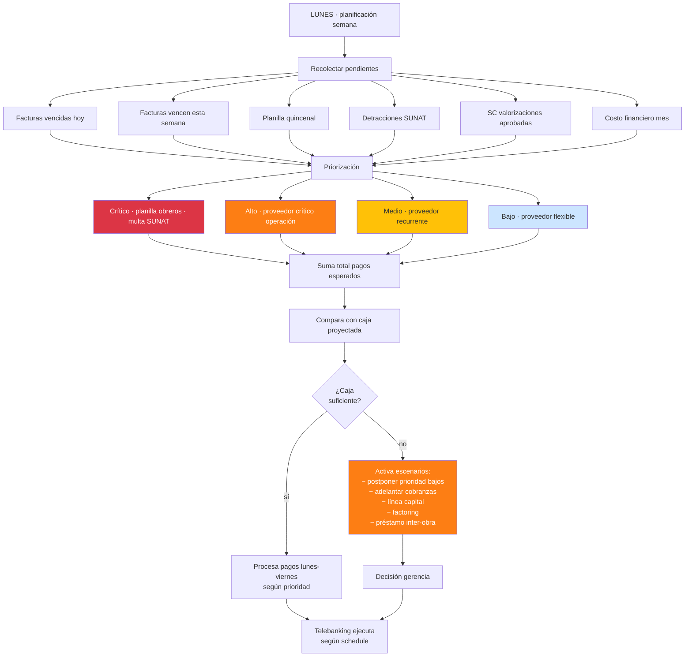
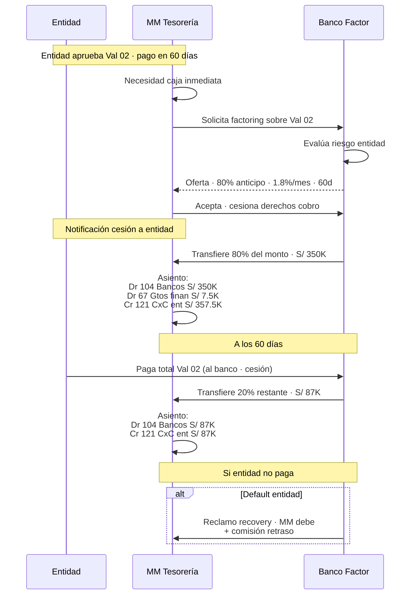
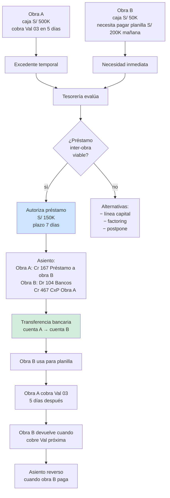

# 34 · Tesorería real avanzada

Programación pagos · prioridades · sobregiros · factoring · confirming · préstamos inter-obras.

## Universo tesorería

```mermaid
flowchart TB
    TES[Tesorería] --> ENT[Ingresos]
    TES --> SAL[Egresos]
    TES --> FIN[Instrumentos financieros]
    TES --> INTER[Movimientos internos]

    ENT --> E1[Cobranza valorizaciones]
    ENT --> E2[Adelantos entidad]
    ENT --> E3[Devolución retenciones · detracciones]
    ENT --> E4[Préstamos recibidos]
    ENT --> E5[Aportes socios consorcio]

    SAL --> S1[Pagos proveedores]
    SAL --> S2[Pagos SC]
    SAL --> S3[Planilla obreros]
    SAL --> S4[Detracción · IGV · renta SUNAT]
    SAL --> S5[Costo financiero]
    SAL --> S6[GG]

    FIN --> F1[Línea capital trabajo]
    FIN --> F2[Línea cartas fianza]
    FIN --> F3[Factoring valorizaciones]
    FIN --> F4[Confirming pago proveedores]
    FIN --> F5[Sobregiros bancarios]

    INTER --> I1[Préstamos entre obras<br/>misma empresa]
    INTER --> I2[Préstamos intercompany<br/>holding]
    INTER --> I3[Préstamos socios consorcio]
```



## Programación semanal pagos



## Schema tesorería

```sql
-- Cuentas bancarias
cuentas_bancarias (
  id uuid PRIMARY KEY,
  empresa_id uuid,
  banco varchar,
  numero_cuenta varchar,
  cci varchar(20),
  moneda char(3),
  tipo ENUM ('corriente','ahorros','detracciones','garantia','cci_consorcio'),
  proyecto_id uuid,                            -- si dedicada a 1 proyecto
  saldo_actual decimal(14,2),
  saldo_disponible decimal(14,2),              -- post sobregiros
  linea_sobregiro decimal(14,2) DEFAULT 0,
  tasa_sobregiro_anual decimal(5,4),
  estado ENUM ('activa','suspendida','cerrada')
)

-- Saldos diarios snapshot
saldos_diarios (
  id uuid PRIMARY KEY,
  cuenta_id uuid,
  fecha date,
  saldo_apertura decimal(14,2),
  total_ingresos decimal(14,2),
  total_egresos decimal(14,2),
  saldo_cierre decimal(14,2),
  conciliado boolean,
  PRIMARY KEY (cuenta_id, fecha)
)

-- Programación pagos
programacion_pagos (
  id uuid PRIMARY KEY,
  empresa_id uuid,
  semana_iso varchar,                          -- '2026-W12'

  factura_id uuid,
  sc_valorizacion_id uuid,
  planilla_id uuid,
  monto decimal(14,2),

  prioridad ENUM ('critico','alto','medio','bajo'),
  fecha_programada date,
  cuenta_origen_id uuid,
  cuenta_destino_cci varchar,

  estado ENUM (
    'programado',
    'aprobado',
    'enviado_telebanking',
    'pagado',
    'fallido',
    'postpuesto',
    'cancelado'
  ),

  postergaciones int DEFAULT 0,
  motivo_postergacion text,

  aprobado_por uuid,
  fecha_pago_real date,
  numero_operacion_banco varchar
)

-- Factoring
factoring_operaciones (
  id uuid PRIMARY KEY,
  proyecto_id uuid,
  valorizacion_id uuid REFERENCES valorizaciones,

  monto_factoring decimal(14,2),
  pct_anticipo decimal(5,4),                   -- 0.80 = 80% adelantado
  monto_recibido decimal(14,2),
  comision_factoring decimal(14,2),
  tasa_factoring decimal(5,4),

  banco_factor varchar,
  fecha_operacion date,
  fecha_vencimiento date,                      -- cuando entidad debería pagar
  fecha_recuperacion_real date,

  contrato_pdf_nas text,
  estado ENUM ('vigente','recuperado','impago','litigio')
)

-- Confirming (pago a proveedores vía banco)
confirming_operaciones (
  id uuid PRIMARY KEY,
  factura_id uuid REFERENCES facturas_recibidas,
  banco varchar,
  pct_anticipo_proveedor decimal(5,4),         -- proveedor cobra antes con descuento
  comision_banco decimal(14,2),
  fecha_operacion date,
  fecha_pago_mm_a_banco date,
  estado varchar
)

-- Préstamos inter-obras
prestamos_inter_obras (
  id uuid PRIMARY KEY,
  empresa_id uuid,
  obra_acreedora_id uuid,                      -- obra que presta
  obra_deudora_id uuid,                        -- obra que recibe
  monto decimal(14,2),
  fecha_otorgamiento date,
  fecha_devolucion_esperada date,
  fecha_devolucion_real date,
  tasa_interna decimal(5,4),                   -- típicamente 0% o costo capital
  motivo text,
  estado ENUM ('vigente','devuelto','default'),
  asiento_id uuid
)

-- Calendario bancario
calendario_bancario (
  fecha date PRIMARY KEY,
  dia_habil_bancario boolean,
  feriado_bancario boolean,
  observaciones text                            -- 'Día no laborable BCP', etc
)
```

## Flujo factoring valorización



## Préstamos inter-obras



## Validaciones

```sql
-- Préstamo inter-obra solo si hay capacidad
CREATE FUNCTION validar_prestamo_inter_obra()
RETURNS trigger AS $$
DECLARE
  v_caja_proyectada_obra_a decimal;
BEGIN
  -- Obra A debe tener caja proyectada > monto préstamo + buffer 20%
  SELECT MIN(saldo_cierre) INTO v_caja_proyectada_obra_a
  FROM cashflow_proyecciones
  WHERE proyecto_id = NEW.obra_acreedora_id
    AND fecha_proyeccion BETWEEN NEW.fecha_otorgamiento
                              AND NEW.fecha_devolucion_esperada;

  IF v_caja_proyectada_obra_a < (NEW.monto * 1.20) THEN
    RAISE EXCEPTION 'Obra acreedora caja proyectada insuficiente';
  END IF;

  RETURN NEW;
END $$;
```

## Reportes tesorería

```
1. Calendario pagos próx 4 semanas
   Por día · monto · prioridad
   Visualización Gantt

2. Caja consolidada multi-empresa
   Por empresa · por banco · saldo

3. Líneas crédito utilización
   Por banco · línea · usado · disponible

4. Factoring activo
   Operaciones vigentes · vencimientos · riesgo

5. Préstamos inter-obras
   Activos · histórico · ratios

6. Análisis liquidez
   Ratio corriente · prueba ácida · días cobranza
```

## Prioridad: **ALTA**
