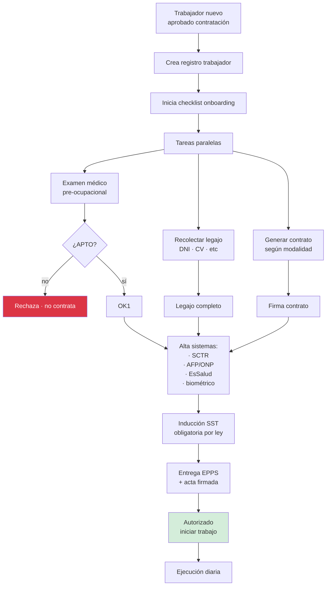
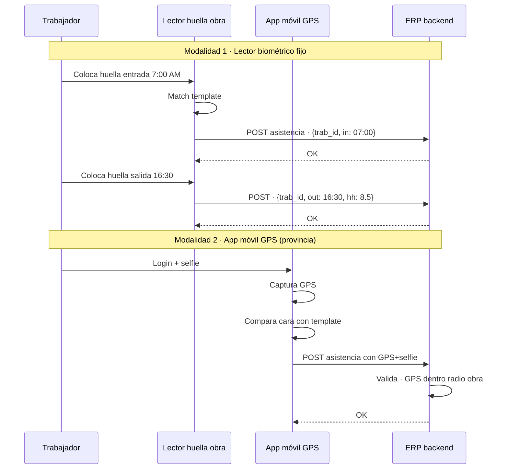
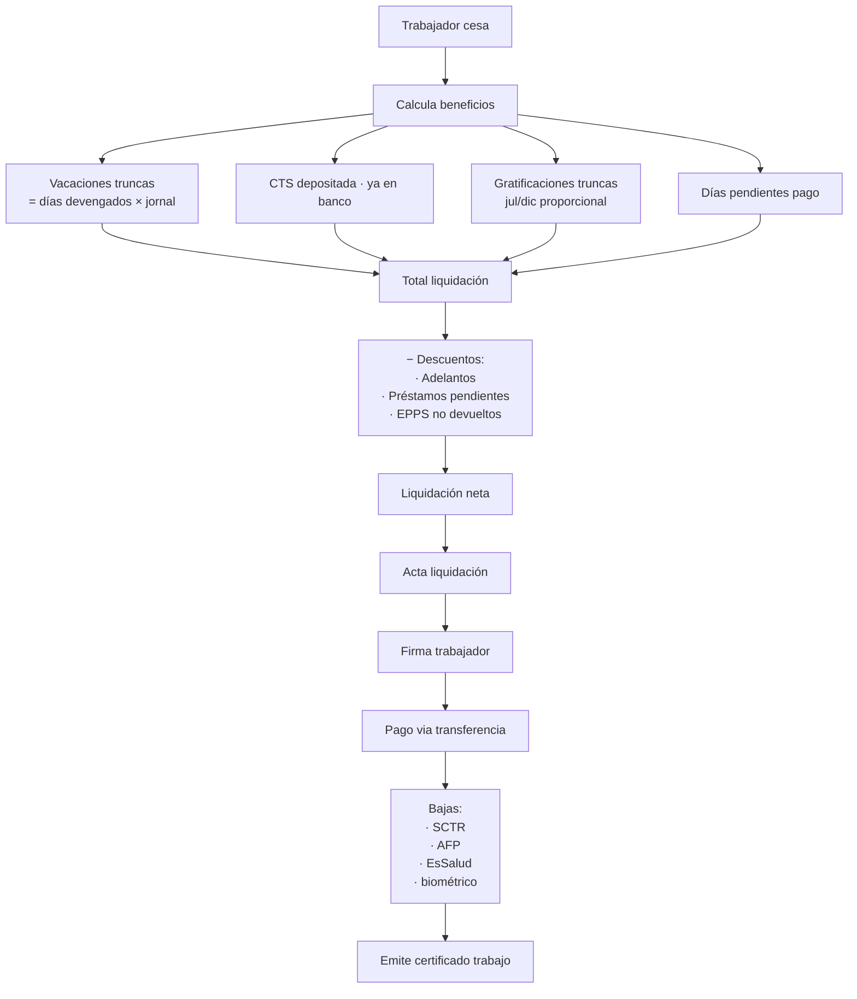

# 35 · RRHH Completo

Extensión flujo 09. Cubre contratos, legajos, vacaciones, sanciones, exámenes médicos, capacitaciones, biométrico, onboarding.

## Universo RRHH

```mermaid
flowchart TB
    RH[RRHH] --> CICLO[Ciclo de vida<br/>trabajador]
    RH --> ADMIN[Administración]
    RH --> COMP[Compliance laboral]

    CICLO --> ON[Onboarding]
    CICLO --> EJE[Ejecución]
    CICLO --> CESE[Cese]

    ON --> O1[Reclutamiento · selección]
    ON --> O2[Examen médico pre-ocupacional]
    ON --> O3[Firma contrato · legajo digital]
    ON --> O4[Inducción SST · obligatoria]
    ON --> O5[Entrega EPPS]
    ON --> O6[Alta SCTR · AFP/ONP · EsSalud]
    ON --> O7[Biometría enrollment]

    EJE --> E1[Asistencia · biométrico]
    EJE --> E2[Tareo diario · partidas]
    EJE --> E3[Planilla mensual · CAPECO]
    EJE --> E4[Vacaciones]
    EJE --> E5[Permisos · licencias]
    EJE --> E6[Capacitaciones recurrentes]
    EJE --> E7[Exámenes médicos periódicos]
    EJE --> E8[Sanciones · llamadas atención]
    EJE --> E9[Renovación contrato]

    CESE --> C1[Carta cese · renuncia]
    CESE --> C2[Liquidación beneficios sociales]
    CESE --> C3[Examen médico salida]
    CESE --> C4[Devolución EPPS]
    CESE --> C5[Certificado trabajo]
    CESE --> C6[Baja SCTR · AFP · EsSalud]

    style ON fill:#d4edda
    style EJE fill:#cce5ff
    style CESE fill:#fff4cc
```



## Schema RRHH completo

```sql
trabajadores (
  ... existente extendido +

  -- Datos personales completos
  numero_documento varchar,
  tipo_documento ENUM ('DNI','CE','PAS'),
  fecha_nacimiento date,
  genero varchar,
  estado_civil varchar,
  direccion text,
  telefono_emergencia varchar,
  contacto_emergencia_nombre varchar,
  contacto_emergencia_relacion varchar,
  grupo_sanguineo varchar,

  -- Régimen
  regimen_laboral ENUM ('construccion_civil','rl_general','servicios','locador'),
  modalidad_contrato ENUM ('eventual_obra','plazo_fijo','indefinido','locacion'),

  -- Sistema pensional
  sistema_pension ENUM ('AFP_PRIMA','AFP_HABITAT','AFP_INTEGRA','AFP_PROFUTURO','ONP'),
  cuspp varchar,

  -- Salud
  essalud_activo boolean,
  afiliacion_essalud_at date,
  eps_alternativa varchar,
  poliza_eps_numero varchar,

  -- Bancario
  banco varchar,
  cuenta_haberes varchar,
  cci_haberes varchar,

  -- Tributario
  inscripcion_renta_4ta boolean,             -- locadores

  -- Estado
  estado ENUM ('candidato','activo','permiso','vacaciones','licencia','cesado'),
  fecha_ingreso date,
  fecha_cese date,

  -- Plantel
  es_plantel_clave boolean,                   -- residente, asistente, especialista

  -- Foto + biometría
  foto_perfil_nas text,
  biometria_huella_template bytea,
  biometria_facial_template bytea,
  enrolled_dispositivo_id varchar
)

-- Contratos · histórico
contratos_trabajador (
  id uuid PRIMARY KEY,
  trabajador_id uuid,
  numero_contrato varchar,

  modalidad ENUM ('eventual_obra','plazo_fijo','indefinido','locacion'),
  proyecto_id uuid,

  fecha_inicio date,
  fecha_fin date,
  jornal_diario decimal(10,2),
  remuneracion_mensual decimal(10,2),

  cargo varchar,
  area varchar,
  reporta_a_id uuid,

  archivo_contrato_pdf_nas text,
  fecha_firma_at timestamp,
  firmado_por_trabajador boolean,
  firmado_por_empresa boolean,

  estado ENUM ('vigente','renovado','terminado','rescindido')
)

-- Renovaciones
contrato_renovaciones (
  id uuid PRIMARY KEY,
  contrato_padre_id uuid,
  contrato_nuevo_id uuid,
  fecha_renovacion date,
  motivo text
)

-- Legajos digitales
legajos_documentos (
  id uuid PRIMARY KEY,
  trabajador_id uuid,
  tipo ENUM (
    'dni',
    'cv',
    'titulo_profesional',
    'colegiatura',
    'certificado_habilidad',
    'antecedentes_penales',
    'antecedentes_policiales',
    'examen_medico',
    'capacitacion_certificado',
    'sanidad',
    'cuspp_documento',
    'foto_carnet'
  ),
  fecha_emision date,
  fecha_vencimiento date,
  emisor varchar,
  archivo_pdf_nas text,
  vigente boolean
)

-- Asistencia · biométrico
asistencias (
  id uuid PRIMARY KEY,
  trabajador_id uuid,
  proyecto_id uuid,
  fecha date,

  hora_entrada time,
  hora_salida time,
  hora_inicio_almuerzo time,
  hora_fin_almuerzo time,

  metodo ENUM ('biometria_huella','biometria_facial','tarjeta','manual','app_movil_gps'),
  dispositivo_id varchar,
  ubicacion_gps point,

  horas_trabajadas decimal(5,2),
  horas_extras decimal(5,2),
  tardanza_minutos int,
  ausente boolean,
  justificacion text,

  validado_supervisor boolean,
  observaciones text
)

-- Vacaciones
vacaciones (
  id uuid PRIMARY KEY,
  trabajador_id uuid,
  periodo_anio int,
  dias_devengados int DEFAULT 30,
  dias_gozados int DEFAULT 0,
  dias_pendientes int GENERATED AS (dias_devengados - dias_gozados) STORED,

  fecha_inicio date,
  fecha_fin date,
  estado ENUM ('programada','aprobada','en_goce','completada','truncada'),

  monto_pagado decimal(14,2),
  archivo_solicitud_pdf_nas text
)

-- Permisos · licencias
permisos_laborales (
  id uuid PRIMARY KEY,
  trabajador_id uuid,
  tipo ENUM (
    'medico',
    'maternidad',
    'paternidad',
    'fallecimiento_familiar',
    'matrimonio',
    'sindical',
    'capacitacion_externa',
    'sin_goce',
    'otro'
  ),
  fecha_inicio date,
  fecha_fin date,
  con_goce_haber boolean,
  documento_sustento_nas text,
  estado varchar
)

-- Sanciones
sanciones (
  id uuid PRIMARY KEY,
  trabajador_id uuid,
  fecha date,
  tipo ENUM (
    'llamada_atencion',
    'memorandum',
    'suspension_sin_goce',
    'descuento',
    'despido'
  ),
  motivo text,
  detalles text,
  duracion_dias int,
  archivo_pdf_nas text,
  firmado_por_trabajador boolean,
  observaciones text
)

-- Exámenes médicos
examenes_medicos (
  id uuid PRIMARY KEY,
  trabajador_id uuid,
  tipo ENUM ('pre_ocupacional','periodico','post_ocupacional','reincorporacion'),
  fecha_examen date,
  fecha_proximo date,
  centro_medico varchar,
  apto_para_trabajo boolean,
  observaciones text,
  restricciones text,
  archivo_pdf_nas text
)

-- Capacitaciones individuales
capacitaciones_trabajador (
  id uuid PRIMARY KEY,
  trabajador_id uuid,
  capacitacion_id uuid,                        -- referencia a sesión grupal
  asistio boolean,
  evaluacion_nota decimal(4,2),
  certificado_emitido boolean,
  certificado_pdf_nas text,
  vigencia_hasta date
)

-- Onboarding · checklist
onboardings (
  id uuid PRIMARY KEY,
  trabajador_id uuid,
  proyecto_id uuid,
  fecha_inicio date,
  estado ENUM ('en_proceso','completado','cancelado'),
  checklist jsonb,
  /*
    {
      "examen_medico": {"completado": true, "fecha": "2026-01-05"},
      "contrato_firmado": {"completado": true, ...},
      "induccion_sst": {"completado": true, ...},
      "epps_entregados": {"completado": true, ...},
      "sctr_alta": {"completado": true, ...},
      "biometria_enroll": {"completado": false, ...}
    }
  */
  fecha_completado date
)
```

## Flujo onboarding



## Asistencia biométrica + GPS



## Liquidación beneficios sociales (cese)



## KPIs RRHH

| KPI | Target |
|---|---|
| % contratos vigentes vs vencidos sin renovar | < 5% |
| Días promedio onboarding | < 7 días |
| % asistencia biométrica | > 95% |
| Vacaciones tomadas en plazo | > 80% |
| Exámenes médicos vigentes | 100% |
| Capacitaciones SST cumplidas | 100% |
| Rotación obra | < 15% mensual |

## Prioridad: **ALTA**
