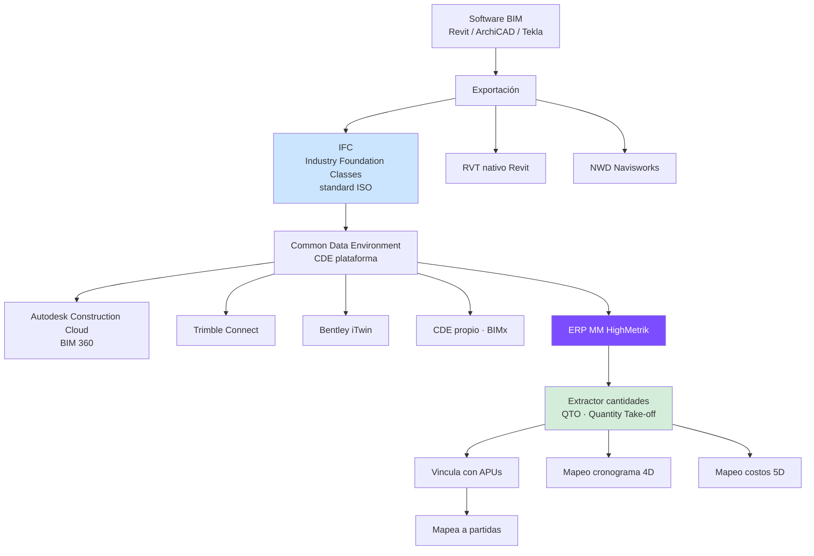
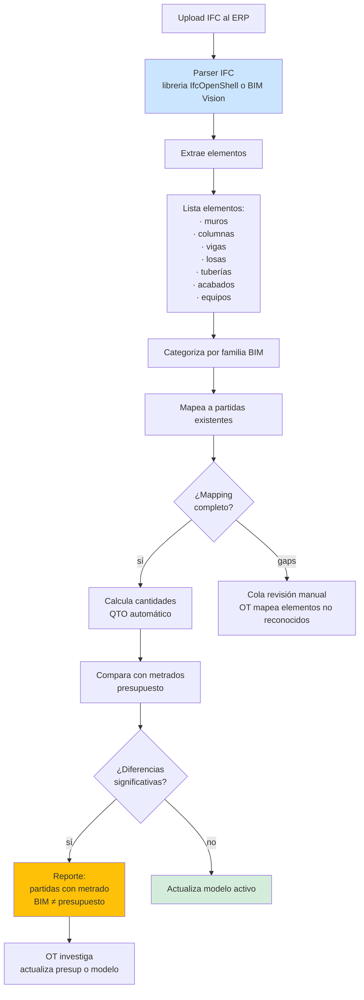
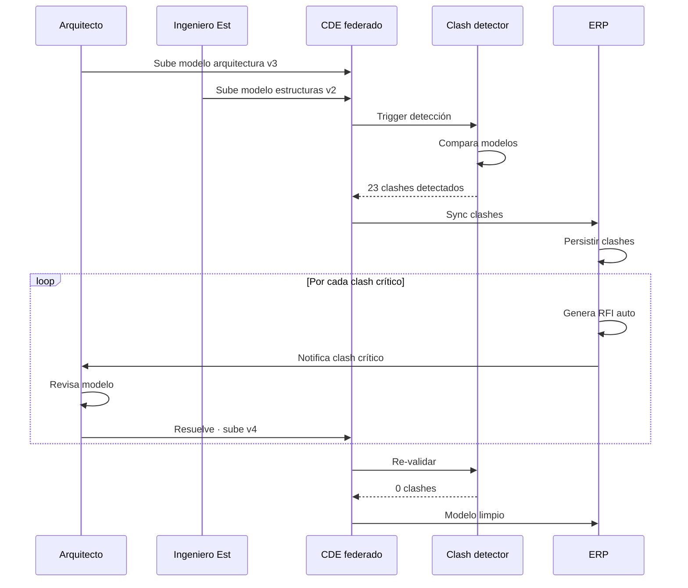

# 36 · Integración BIM · Building Information Modeling

Conexión modelo 3D con ERP. Diferencial competitivo · obra pública moderna lo exige.

## Por qué BIM en ERP

```
Estándares Perú obras públicas:
  - DS 237-2019-EF · Plan BIM Perú
  - Obras > S/ 5M deben usar BIM desde 2025
  - Norma técnica BIM Habilitaciones MVCS
  - Obras MTC, Vivienda, Sectores específicos

Beneficios ERP-BIM:
  - 4D · cronograma sobre modelo
  - 5D · costos sobre modelo
  - 6D · operación post-construcción
  - 7D · sostenibilidad

Caso real:
  Modelo Revit identifica clash detection (interferencia tuberías vs estructura)
  Genera RFI automático
  Estimado adicional auto vía cantidades modelo
  Aprobado · partidas se actualizan ERP
```

## Arquitectura integración



## Flujo importación modelo



## Schema BIM

```sql
modelos_bim (
  id uuid PRIMARY KEY,
  proyecto_id uuid,
  nombre varchar,                              -- 'Crematorio_Arquitectura_v3'
  disciplina varchar,                          -- 'arquitectura','estructuras','IISS','IIEE','federado'
  fase varchar,                                -- 'anteproyecto','proyecto','construccion','as_built'

  archivo_ifc_nas text,
  archivo_rvt_nas text,
  archivo_visualizacion_nas text,              -- glb / 3dtiles para web viewer

  version varchar,
  hash_sha256 varchar(64),
  size_bytes bigint,

  software_origen varchar,                     -- 'Revit 2024'
  fecha_modelo date,
  autor varchar,

  estado ENUM ('borrador','aprobado','vigente','obsoleto','as_built'),
  modelo_activo boolean,                       -- solo 1 activo por disciplina+proyecto

  created_at, updated_at
)

-- Elementos BIM (muros, columnas, etc)
elementos_bim (
  id uuid PRIMARY KEY,
  modelo_id uuid REFERENCES modelos_bim,
  guid_ifc varchar UNIQUE,                     -- ID único IFC
  tipo varchar,                                 -- 'IfcWall','IfcColumn','IfcBeam'
  familia varchar,                              -- 'Muro_drywall_15cm'
  nivel varchar,                                -- 'Nivel_1','Nivel_2'

  -- Geometría
  largo decimal(10,3),
  ancho decimal(10,3),
  alto decimal(10,3),
  area decimal(14,4),
  volumen decimal(14,4),
  peso decimal(14,4),

  -- Materiales
  material varchar,
  espesor decimal(10,3),

  -- Vinculación ERP
  partida_id uuid REFERENCES partidas,
  metrado_calculado_bim decimal(14,4),
  unidad_metrado varchar,

  -- Estado
  estado_construccion ENUM (
    'no_iniciado',
    'en_proceso',
    'instalado',
    'verificado',
    'demolido_modificado'
  ),
  pct_avance decimal(5,2),

  -- Multimedia
  miniatura_nas text,
  posicion_3d jsonb                            -- {x,y,z,rotation}
)

-- Quantity Take-Off (QTO)
qto_calculos (
  id uuid PRIMARY KEY,
  modelo_id uuid,
  partida_id uuid,
  cantidad_bim decimal(14,4),
  cantidad_presupuesto decimal(14,4),
  unidad varchar,
  variance decimal(14,4),
  variance_pct decimal(7,4),
  fecha_calculo date,
  estado ENUM ('coincide','variance_baja','variance_significativa','requiere_revision')
)

-- Clash detection
clashes (
  id uuid PRIMARY KEY,
  modelo_federado_id uuid,
  numero varchar UNIQUE,                        -- CL-2026-0023
  fecha_deteccion date,

  elemento_a_id uuid,
  elemento_b_id uuid,
  tipo_clash ENUM ('hard','soft','clearance','workflow'),
  severidad ENUM ('critica','alta','media','baja'),

  ubicacion text,
  imagen_3d_nas text,

  resolucion text,
  rfi_generado_id uuid,
  cambio_contractual_id uuid,

  estado ENUM ('pendiente','en_revision','resuelto','aceptado_no_critico'),
  asignado_a uuid,
  fecha_resolucion date
)

-- 4D · cronograma sobre modelo
bim_4d_asociaciones (
  id uuid PRIMARY KEY,
  elemento_bim_id uuid,
  partida_id uuid,
  baseline_id uuid,
  fecha_programada_inicio date,
  fecha_programada_fin date,
  fecha_real_inicio date,
  fecha_real_fin date,
  pct_avance decimal(5,2)
)
```

## Flujo clash detection · genera RFI



## Web viewer 3D embebido

```typescript
// Frontend ERP integra viewer
import { Viewer, Model } from '@autodesk/viewer-3d';
// O alternativa open: xeokit-sdk

// Tab proyecto > BIM
<BIMViewer
  modelUrl={`/api/proyectos/${id}/bim/active`}
  highlightedElements={selectedElements}
  onElementClick={(elementId) => {
    // Mostrar info partida vinculada
    showElementDetails(elementId);
  }}
  enableMeasure={true}
  enableSection={true}
  enable4D={true}
  enable5D={true}
/>

// Click en muro 3D → muestra en panel:
// - Material: Drywall 15cm
// - Partida vinculada: 03.01.01.01 Muros y tabiques
// - Avance: 65%
// - APU: ver detalle
// - Costo: S/ 1,234 ejecutado / S/ 2,500 presupuesto
// - Cronograma: programado 12/dic, real 14/dic
```

## QTO automático ahorro tiempo

```
Sin BIM:
  Metrar planos manual = 80-120 horas / proyecto
  Errores típicos: 5-10% omisión
  Replanteos requeridos en obra

Con BIM + QTO:
  Cantidades extraídas auto
  Tiempo: 2-4 horas
  Precisión: ~99%
  Error humano eliminado
```

## Casos uso ERP+BIM

```
1. Validación metrado · BIM vs presupuesto
2. Visualización avance físico · timeline 4D
3. Clash detection · pre-construcción
4. Generación auto adicionales · cantidad delta BIM
5. As-built · modelo final entregable
6. Mantenimiento post-obra · 6D
7. Inspección remota · viewer + foto cliente
8. Cuaderno obra · vincula asiento a elemento 3D
```

## Costos integración

```
Software BIM (Revit/Tekla)         S/ 30K-60K/año por licencia
Common Data Environment            S/ 5K-15K/año
Capacitación equipo                S/ 50K once
Licencia viewer ERP                S/ 0 (xeokit open) o S/ 500/mes (Autodesk)

Total año 1: ~S/ 100K-150K
ROI típico: ahorro 5-15% costo proyecto · paga en 1-2 obras
```

## Prioridad: **MEDIA** · diferencial Tier 4

Empezar con: import IFC + viewer + QTO. Resto progresivo.
