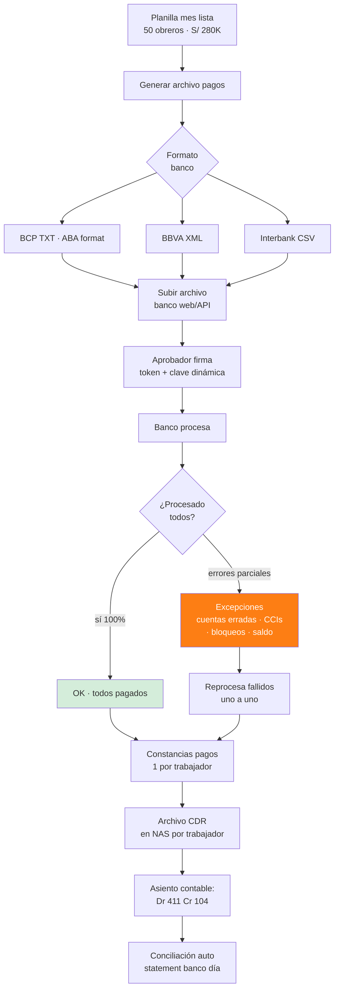
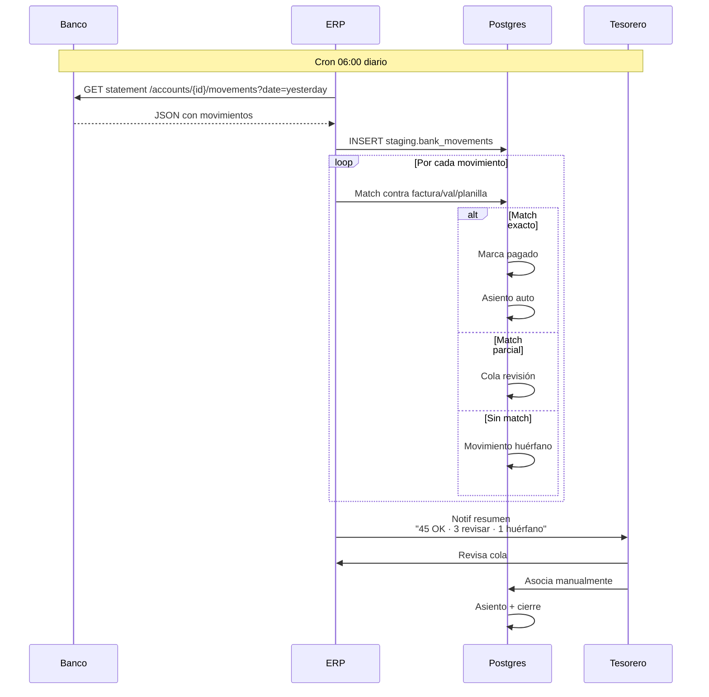
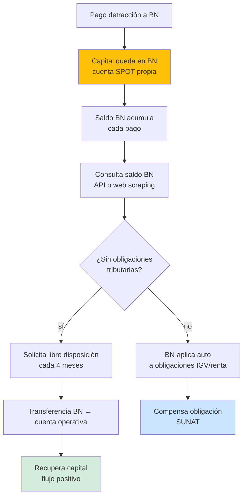

# 37 · Integración bancaria real

Conexión APIs bancos · pagos masivos · conciliación auto · validación CCI · tracking detracciones BN.

## Bancos peruanos · APIs disponibles

```
BCP             telecredit web · Cash Management API
BBVA            Net Cash · API Open Banking
Interbank       Telebanking · API
Scotiabank      Canal directo · ConectaPlus
Banco Nación    SIAF · interface XML
Pichincha       Cash Management
Bif             API Open
Mibanco         API recientes
```

## Universo integración

```mermaid
flowchart TB
    BANK_API[Bancos APIs] --> ERP[ERP MM]

    ERP --> SAL[Salidas]
    ERP --> ENT[Entradas]
    ERP --> VAL[Validaciones]
    ERP --> CONC[Conciliación]
    ERP --> ESPC[Especiales]

    SAL --> S1[Pagos masivos<br/>planilla obreros]
    SAL --> S2[Pagos proveedores<br/>uno a uno o batch]
    SAL --> S3[Pago detracciones BN<br/>SPOT]
    SAL --> S4[Pagos SUNAT IGV/renta]
    SAL --> S5[Transferencias intercompany]

    ENT --> E1[Lectura statements diarios<br/>MT940/OFX/CSV]
    ENT --> E2[Notificación cobros entidad]
    ENT --> E3[Adelantos recibidos]

    VAL --> V1[Validación CCI proveedor<br/>API banco]
    VAL --> V2[Validación RUC SUNAT<br/>habido]
    VAL --> V3[Detección duplicados]
    VAL --> V4[Verificación límites cuenta]

    CONC --> C1[Match factura vs movimiento]
    CONC --> C2[Match valorización vs cobro]
    CONC --> C3[Excepciones · cola revisión]

    ESPC --> ESP1[Confirming · pago a proveedores antes vencimiento]
    ESPC --> ESP2[Factoring · cobros adelantados]
    ESPC --> ESP3[Sobregiros · alerta uso]

    style SAL fill:#fd7e14,color:#fff
    style ENT fill:#cce5ff
    style VAL fill:#ffc107
    style CONC fill:#d4edda
```



## Flujo pago masivo planilla



## Conciliación bancaria automática



## Schema integración bancaria

```sql
-- Configuración integración
banco_integraciones (
  id uuid PRIMARY KEY,
  empresa_id uuid,
  banco varchar,
  ambiente ENUM ('sandbox','production'),

  metodo ENUM ('api','sftp_archivos','manual'),
  api_endpoint varchar,
  api_credentials_encrypted text,
  certificado_x509 text,

  formato_pagos varchar,                       -- 'BCP_TXT','BBVA_XML', etc
  formato_statements varchar,                  -- 'MT940','OFX','CSV'

  estado varchar
)

-- Archivos de pago generados
archivos_pagos_bancarios (
  id uuid PRIMARY KEY,
  banco varchar,
  numero_lote varchar,
  fecha_emision date,
  total_pagos int,
  monto_total decimal(14,2),
  archivo_generado_path text,
  archivo_subido_at timestamp,
  estado_banco varchar,                        -- 'pendiente','procesado','fallido','parcial'
  archivo_respuesta_banco_path text
)

-- Pagos individuales del lote
pagos_bancarios (
  id uuid PRIMARY KEY,
  archivo_id uuid REFERENCES archivos_pagos_bancarios,
  beneficiario_ruc varchar,
  beneficiario_razon varchar,
  cci_destino varchar(20),
  monto decimal(14,2),
  glosa varchar,

  -- Vinculación
  factura_id uuid,
  trabajador_id uuid,                          -- planilla
  sc_pago_id uuid,
  prestamo_pago_id uuid,

  estado ENUM ('pendiente','procesado','fallido','rechazado_cci','rechazado_saldo'),
  numero_operacion_banco varchar,
  cdr_constancia_path text,
  motivo_fallo text
)

-- Movimientos bancarios statement
bank_movements (
  id uuid PRIMARY KEY,
  cuenta_id uuid,
  fecha_movimiento date,
  tipo ENUM ('credito','debito','comision','intereses','impuesto'),
  monto decimal(14,2),
  saldo_post decimal(14,2),
  descripcion text,
  contraparte_ruc varchar,
  contraparte_razon varchar,
  numero_operacion varchar,
  referencia_externa varchar,

  -- Conciliación
  status ENUM ('pendiente_conciliar','conciliado','no_conciliable','duplicado'),
  factura_id uuid,
  valorizacion_id uuid,
  pago_bancario_id uuid,

  conciliado_at timestamp,
  conciliado_por uuid,
  observaciones text
)
```

## Validación CCI · API bancos

```typescript
// Pseudo-código validación CCI antes de pago
async function validateCCI(cci: string, ruc: string): Promise<ValidationResult> {
  // CCI formato: 002-1234-1-23-456789012345
  // 002 = código banco · BCP
  // resto = cuenta + dígitos verificación

  // Validación local
  if (!isValidCCIFormat(cci)) {
    return { valid: false, error: 'Formato CCI inválido' };
  }

  // Validación banco vía API
  const banco = identifyBank(cci);
  const result = await bankAPIs[banco].validateCCI({ cci, ruc });

  return {
    valid: result.exists,
    titular: result.holder_name,
    titular_ruc: result.holder_ruc,
    coincidencia_ruc: result.holder_ruc === ruc,
    estado_cuenta: result.account_status
  };
}

// Bloquea pago si:
// - CCI no existe
// - Titular RUC no coincide proveedor
// - Cuenta bloqueada
```

## Detección duplicados

```sql
-- Pre-pago: detectar si misma factura ya fue pagada
CREATE FUNCTION detectar_duplicado_pago(p_factura_id uuid)
RETURNS boolean AS $$
DECLARE pagos_existentes int;
BEGIN
  SELECT COUNT(*) INTO pagos_existentes
  FROM pagos_bancarios
  WHERE factura_id = p_factura_id
    AND estado IN ('procesado','pendiente');

  RETURN pagos_existentes > 0;
END $$;

-- Trigger pre-insert
CREATE FUNCTION prevent_duplicate_payment()
RETURNS trigger AS $$
BEGIN
  IF detectar_duplicado_pago(NEW.factura_id) THEN
    RAISE EXCEPTION 'Factura ya tiene pago vigente · evita duplicado';
  END IF;
  RETURN NEW;
END $$;
```

## Tracking detracciones BN



## KPIs

| KPI | Target |
|---|---|
| Conciliación auto vs manual | > 90% auto |
| Tiempo conciliación día | < 30 min |
| CCIs validados antes pago | 100% |
| Pagos duplicados detectados | 0 |
| Días pago vs vencimiento | en plazo |
| Saldo BN libre disposición | optimizar 4 meses |

## Prioridad: **ALTA**
