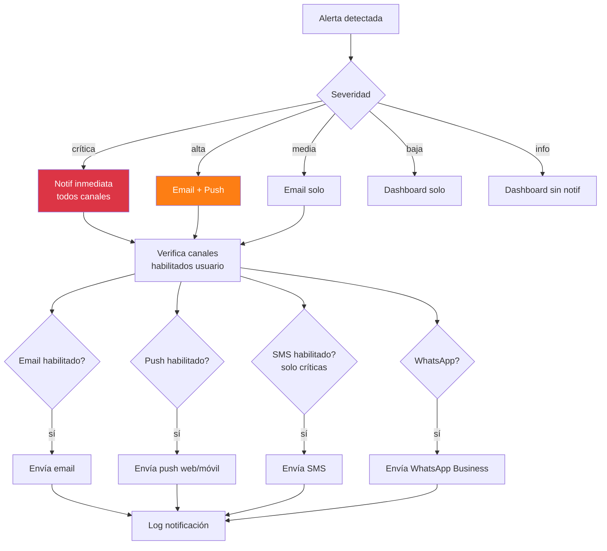
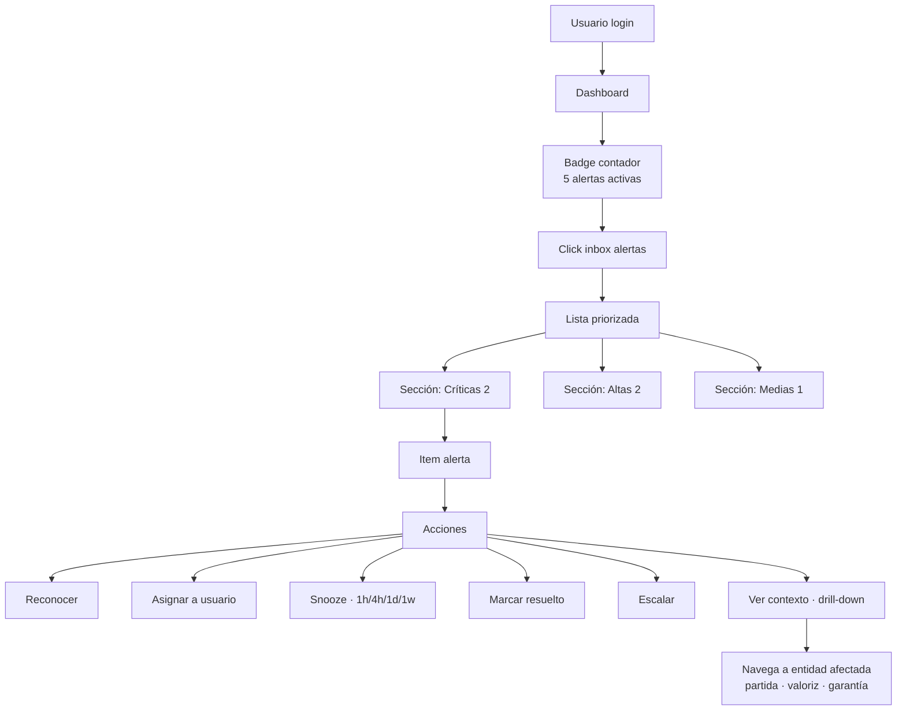

# 38 · Sistema de alertas inteligentes · Motor nervioso ERP

Centraliza todas las alertas en motor único. Sin esto = ERP es un cementerio de datos.

## Universo alertas

```mermaid
flowchart TB
    EVT[Eventos detectables] --> CAT[Categorías]

    CAT --> FIN[Financieras]
    CAT --> OPE[Operativas]
    CAT --> CONT[Contractuales]
    CAT --> TRIB[Tributarias]
    CAT --> SST[SST/Calidad]
    CAT --> RH[RRHH]

    FIN --> F1[Utility cayendo]
    FIN --> F2[Caja proyectada negativa]
    FIN --> F3[Sobreconsumo material]
    FIN --> F4[Variance precio compra]
    FIN --> F5[Margen partida negativo]
    FIN --> F6[Línea bancaria > 80%]

    OPE --> O1[Curva S desviada]
    OPE --> O2[Valorización retrasada]
    OPE --> O3[Stock crítico]
    OPE --> O4[Partida sobregirada]
    OPE --> O5[Productividad baja]
    OPE --> O6[Equipo subutilizado]

    CONT --> C1[Carta fianza vence]
    CONT --> C2[Plazo ejecución acercándose]
    CONT --> C3[Resolución entidad pendiente]
    CONT --> C4[Penalidad detectada]
    CONT --> C5[Tope adicional/deductivo cerca]
    CONT --> C6[Observación supervisor sin levantar]

    TRIB --> T1[Proveedor RUC no habido]
    TRIB --> T2[Detracción no pagada]
    TRIB --> T3[Factura SUNAT sin validar]
    TRIB --> T4[PLE/SIRE pendiente subir]
    TRIB --> T5[Vencimiento cronograma SUNAT]

    SST --> S1[SCTR vence]
    SST --> S2[Examen médico vence]
    SST --> S3[Capacitación SST vence]
    SST --> S4[NC abierta crítica]
    SST --> S5[Protocolo calidad pendiente]
    SST --> S6[Permiso trabajo riesgoso pendiente]

    RH --> RH1[Contrato vence sin renovar]
    RH --> RH2[Vacaciones acumuladas]
    RH --> RH3[Tardanzas frecuentes]
    RH --> RH4[Ausentismo elevado]
    RH --> RH5[Plantel ausente]

    style FIN fill:#dc3545,color:#fff
    style CONT fill:#fd7e14,color:#fff
    style TRIB fill:#7c4dff,color:#fff
```



## Schema motor alertas

```sql
-- Tipos alertas
alertas_tipos (
  codigo varchar PRIMARY KEY,                  -- 'utility_caida','sctr_vence'
  descripcion text,
  categoria varchar,                            -- 'financiero','operativo','contractual','tributario','sst','rrhh'
  severidad ENUM ('critica','alta','media','baja','informativa'),

  -- Detección
  query_deteccion text,                         -- SQL function name
  frecuencia_check varchar,                     -- 'realtime','5min','hourly','daily','weekly'

  -- Notificación
  canales_default text[],                       -- ['email','push','sms','dashboard']
  destinatarios_default jsonb,                  -- {roles:[],users:[]}

  -- Acciones
  acciones_disponibles jsonb,                   -- ['acknowledge','dismiss','escalate','snooze']

  activa boolean DEFAULT true
)

-- Alertas activas (instances)
alertas_activas (
  id uuid PRIMARY KEY,
  tipo_codigo varchar REFERENCES alertas_tipos,
  empresa_id uuid,
  proyecto_id uuid,

  -- Contexto
  entity_type varchar,                          -- 'partida','garantia','factura'
  entity_id uuid,
  detalles jsonb,

  -- Severidad calculada
  severidad varchar,
  score_riesgo decimal(5,2),                   -- 0..100

  -- Estado
  estado ENUM (
    'detectada',
    'notificada',
    'reconocida',                               -- usuario vio
    'en_proceso',                               -- alguien actuando
    'snoozed',                                  -- pospuesta
    'resuelta',
    'escalada',
    'descartada'
  ),

  -- Lifecycle
  detectada_at timestamp,
  notificada_at timestamp,
  reconocida_at timestamp,
  reconocida_por uuid,
  resuelta_at timestamp,
  resuelta_por uuid,
  resolucion text,

  -- Reincidencia
  veces_repetida int DEFAULT 1,
  ultima_repeticion_at timestamp,

  -- Snooze
  snooze_hasta timestamp,
  snooze_motivo text
)

-- Notificaciones enviadas
alertas_notificaciones (
  id uuid PRIMARY KEY,
  alerta_id uuid REFERENCES alertas_activas,
  user_id uuid,
  canal varchar,                                -- 'email','push','sms','whatsapp','dashboard'
  enviado_at timestamp,
  recibido_at timestamp,
  leido_at timestamp,
  cliqueado_at timestamp,
  estado varchar
)

-- Configuración usuario · qué alertas quiere recibir
alertas_preferencias (
  user_id uuid,
  tipo_codigo varchar,
  canal varchar,
  habilitada boolean DEFAULT true,
  horario_silencio_desde time,
  horario_silencio_hasta time,
  PRIMARY KEY (user_id, tipo_codigo, canal)
)
```

## Motor detección · cron jobs

```sql
-- Ejemplo función detección · utility cayendo
CREATE FUNCTION detectar_utility_cayendo()
RETURNS TABLE (proyecto_id uuid, severidad varchar, detalles jsonb) AS $$
SELECT
  p.id,
  CASE
    WHEN trend_pct < -0.10 THEN 'critica'
    WHEN trend_pct < -0.05 THEN 'alta'
    WHEN trend_pct < -0.02 THEN 'media'
  END,
  jsonb_build_object(
    'utility_actual', utility_actual,
    'utility_mes_anterior', utility_anterior,
    'trend_pct', trend_pct,
    'utility_presupuestada', presupuestada
  )
FROM (
  SELECT
    p.id,
    margen_actual_pct(p.id) AS utility_actual,
    margen_mes_anterior_pct(p.id) AS utility_anterior,
    (margen_actual_pct(p.id) - margen_mes_anterior_pct(p.id)) AS trend_pct,
    p.pct_utilidad AS presupuestada
  FROM proyectos p
  WHERE p.status = 'ejecucion'
) calc
WHERE trend_pct < -0.02;
$$ LANGUAGE sql;

-- Cron diario que ejecuta todas las detecciones
CREATE FUNCTION ejecutar_detecciones_alertas()
RETURNS void AS $$
DECLARE
  tipo record;
  resultado record;
BEGIN
  FOR tipo IN SELECT * FROM alertas_tipos WHERE activa AND frecuencia_check = 'daily' LOOP
    -- Llamar función detección dinámicamente
    EXECUTE format('SELECT * FROM %I()', tipo.query_deteccion)
    INTO resultado;

    -- Insertar alerta si no existe ya activa
    INSERT INTO alertas_activas (tipo_codigo, ...)
    SELECT tipo.codigo, ...
    FROM resultado
    WHERE NOT EXISTS (
      SELECT 1 FROM alertas_activas
      WHERE tipo_codigo = tipo.codigo
        AND entity_id = resultado.entity_id
        AND estado IN ('detectada','notificada','reconocida','en_proceso')
    );

    -- Si ya existe, incrementa veces_repetida
    UPDATE alertas_activas
    SET veces_repetida = veces_repetida + 1,
        ultima_repeticion_at = now()
    WHERE tipo_codigo = tipo.codigo
      AND entity_id = resultado.entity_id
      AND estado IN ('detectada','notificada','reconocida','en_proceso');
  END LOOP;
END $$ LANGUAGE plpgsql;
```

## Routing notificaciones



## Catálogo alertas · seed

```sql
INSERT INTO alertas_tipos VALUES
  -- FINANCIERAS
  ('utility_caida','Utility proyecto cayendo trend 30d','financiero','alta','detectar_utility_cayendo','daily',ARRAY['email','push'],'{}','{}',true),
  ('caja_negativa_proyectada','Saldo caja < 0 próx 90d','financiero','critica','detectar_caja_negativa','daily',ARRAY['email','push','sms'],'{}','{}',true),
  ('sobreconsumo_material','Material > 110% APU','financiero','media','detectar_sobreconsumo','daily',ARRAY['email','dashboard'],'{}','{}',true),
  ('partida_sobregirada','Partida ejecutado > presupuesto','financiero','alta','detectar_partida_sobregirada','daily',ARRAY['email','push'],'{}','{}',true),
  ('linea_bancaria_alta','Línea bancaria > 80% utilizada','financiero','alta','detectar_linea_alta','daily',ARRAY['email'],'{}','{}',true),

  -- OPERATIVAS
  ('curva_s_desviada','Avance real 10% bajo programado','operativo','alta','detectar_curva_s_desviada','daily',ARRAY['email','push'],'{}','{}',true),
  ('val_retrasada','Val cliente sin pago > 30d','operativo','critica','detectar_val_atrasada','daily',ARRAY['email','sms'],'{}','{}',true),
  ('stock_critico','Stock < 10% APU partidas activas','operativo','alta','detectar_stock_critico','hourly',ARRAY['email','push'],'{}','{}',true),
  ('productividad_baja','HH/m³ > 130% APU partida','operativo','media','detectar_productividad','daily',ARRAY['email'],'{}','{}',true),

  -- CONTRACTUALES
  ('garantia_vence_30d','Carta fianza vence 30 días','contractual','alta','detectar_garantia_vence','daily',ARRAY['email','push'],'{}','{}',true),
  ('garantia_vence_7d','Carta fianza vence 7 días','contractual','critica','detectar_garantia_critica','daily',ARRAY['email','push','sms'],'{}','{}',true),
  ('plazo_obra_acercandose','30 días para fin plazo','contractual','alta','detectar_plazo_acercandose','daily',ARRAY['email'],'{}','{}',true),
  ('penalidad_detectada','Supuesto penalidad activado','contractual','alta','detectar_penalidad','realtime',ARRAY['email','push'],'{}','{}',true),
  ('observacion_supervisor_pendiente','Observ sin levantar > 5d','contractual','media','detectar_obs_pendiente','daily',ARRAY['email'],'{}','{}',true),

  -- TRIBUTARIAS
  ('proveedor_no_habido','Proveedor RUC no habido SUNAT','tributario','critica','detectar_ruc_no_habido','daily',ARRAY['email','push'],'{}','{}',true),
  ('detraccion_pendiente','Detracción no pagada > 7d','tributario','alta','detectar_detraccion_pendiente','daily',ARRAY['email'],'{}','{}',true),
  ('factura_sin_validar','Factura XML CDR pendiente','tributario','media','detectar_factura_pendiente','hourly',ARRAY['email'],'{}','{}',true),
  ('vencimiento_sunat','Cronograma SUNAT < 3d','tributario','alta','detectar_venc_sunat','daily',ARRAY['email','sms'],'{}','{}',true),

  -- SST
  ('sctr_vence','SCTR trabajador vence','sst','critica','detectar_sctr_vence','daily',ARRAY['email','push','sms'],'{}','{}',true),
  ('examen_medico_vence','Examen médico vence 30d','sst','media','detectar_examen_vence','weekly',ARRAY['email'],'{}','{}',true),
  ('nc_critica_abierta','NC severidad alta > 7d','sst','alta','detectar_nc_pendiente','daily',ARRAY['email','push'],'{}','{}',true),

  -- RRHH
  ('contrato_vence_sin_renovar','Contrato vence 15d sin renovación','rrhh','alta','detectar_contrato_vence','daily',ARRAY['email'],'{}','{}',true),
  ('plantel_ausente','Plantel clave ausente día','rrhh','critica','detectar_plantel_ausente','daily',ARRAY['email','push'],'{}','{}',true);
```

## Inbox alertas UI



## ML · scoring riesgo combinado

```python
# Alerta compuesta · combina señales
def calcular_score_riesgo_proyecto(proyecto_id):
    señales = {
        'utility_caida': peso_alerta('utility_cayendo', proyecto_id),
        'caja_riesgo': peso_alerta('caja_negativa', proyecto_id),
        'curva_s_atraso': peso_alerta('curva_s_desviada', proyecto_id),
        'penalidad_acumulada': peso_alerta('penalidad', proyecto_id),
        'rotacion_personal': peso_kpi('rotacion', proyecto_id),
        'observ_supervisor': peso_alerta('obs_pendiente', proyecto_id),
    }

    # Modelo entrenado con histórico obras
    score = ml_model.predict_proba(señales)
    # Output: probabilidad obra termine en pérdida

    if score > 0.70:
        crear_alerta_critica('proyecto_alto_riesgo_perdida', proyecto_id, score)
```

## KPIs sistema alertas

| KPI | Target |
|---|---|
| Alertas críticas reconocidas < 1h | 100% |
| Tiempo medio resolución crítica | < 4h |
| Falsos positivos | < 10% |
| Alertas snooze repetidamente | minimizar |
| % alertas con acción tomada | > 80% |

## Prioridad: **CRÍTICA**
