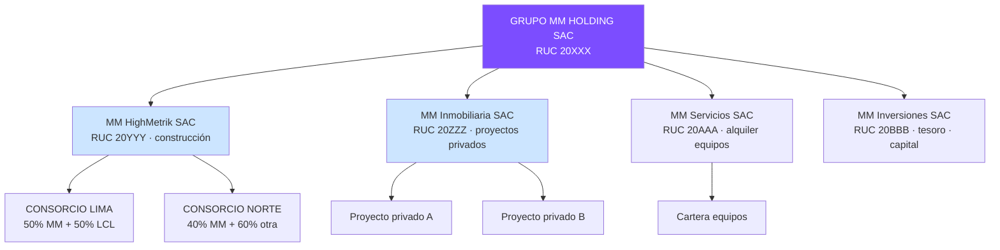
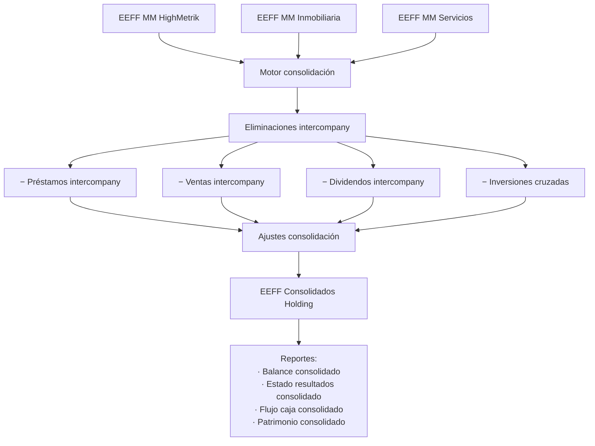
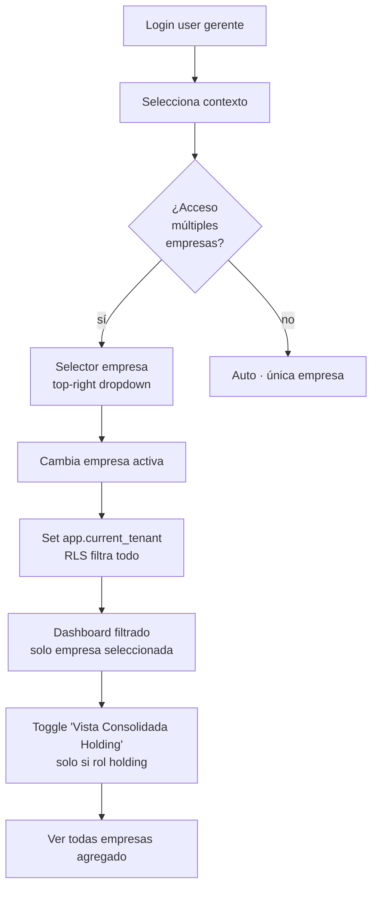

# 39 · Multiempresa · Holding

Soporta múltiples razones sociales · múltiples consorcios · consolidación financiera · préstamos intercompany.

## Estructura típica holding peruano



## Schema multiempresa

```sql
holdings (
  id uuid PRIMARY KEY,
  nombre varchar,
  ruc_holding varchar(11),
  pais varchar DEFAULT 'PE',
  moneda_funcional char(3) DEFAULT 'PEN'
)

empresas (
  ... existente
  + holding_id uuid REFERENCES holdings,
  + tipo_empresa ENUM ('matriz','subsidiaria','asociada','vehiculo'),
  + pct_propiedad_holding decimal(5,4),
  + razon_social varchar,
  + ruc varchar(11) UNIQUE,
  + tipo_societario varchar,
  + actividad_principal varchar
)

-- TODAS las tablas principales agregan empresa_id
proyectos       (... empresa_id uuid)
consorcios      (... empresa_lider_id uuid)
recursos        (... empresa_id uuid)
trabajadores    (... empresa_id uuid)
ordenes_compra  (... empresa_id uuid)
facturas        (... empresa_id uuid)
asientos        (... empresa_id uuid)

-- RLS · Row Level Security
ALTER TABLE proyectos ENABLE ROW LEVEL SECURITY;
CREATE POLICY tenant_isolation ON proyectos
  USING (empresa_id = ANY(current_user_empresas()));

CREATE FUNCTION current_user_empresas()
RETURNS uuid[] AS $$
  SELECT empresas FROM user_empresas_access
  WHERE user_id = current_setting('app.current_user_id')::uuid;
$$ LANGUAGE SQL STABLE;

-- Acceso usuarios por empresa
user_empresas_access (
  user_id uuid,
  empresa_id uuid,
  roles text[],                                  -- ['admin','gerente']
  scope ENUM ('todas_obras','obras_asignadas'),
  PRIMARY KEY (user_id, empresa_id)
)
```

## Préstamos intercompany

```mermaid
sequenceDiagram
    participant SUB1 as MM HighMetrik SAC
    participant HOLD as Holding tesorería
    participant SUB3 as MM Servicios SAC

    Note over SUB1,SUB3: Necesidad caja temporal

    SUB1->>HOLD: Solicita préstamo S/ 200K · 30d
    HOLD->>HOLD: Evalúa · capacidad SUB3
    HOLD->>SUB3: Origina préstamo desde SUB3 → SUB1
    SUB3->>SUB1: Transferencia bancaria

    Note over SUB1,SUB3: Asientos cada empresa

    SUB1->>SUB1: Dr 104 Bancos · Cr 467 Préstamo intercompany
    SUB3->>SUB3: Dr 167 Cuentas cobrar intercompany · Cr 104 Bancos

    Note over SUB1,SUB3: Vencimiento 30 días

    SUB1->>SUB3: Devuelve principal + intereses
    SUB1->>SUB1: Dr 467 Préstamo · Dr 67 Intereses · Cr 104
    SUB3->>SUB3: Dr 104 · Cr 167 · Cr 77 Intereses ganados

    Note over SUB1,HOLD,SUB3: Consolidación holding · eliminar intercompany
    HOLD->>HOLD: Eliminación intercompany · estados consolidados
```

```sql
prestamos_intercompany (
  id uuid PRIMARY KEY,
  empresa_acreedora_id uuid,
  empresa_deudora_id uuid,
  monto decimal(14,2),
  tasa_anual decimal(5,4),                       -- valor de mercado · arm's length
  fecha_otorgamiento date,
  fecha_vencimiento date,
  fecha_devolucion_real date,
  intereses_devengados decimal(14,2),
  intereses_pagados decimal(14,2),
  contrato_pdf_nas text,
  estado ENUM ('vigente','liquidado','default'),

  -- Compliance precios transferencia (SUNAT)
  pt_estudio_realizado boolean,
  pt_documentacion_pdf_nas text
)
```

## Consolidación financiera



## Reportes consolidados

```sql
-- Vista consolidada utility holding
CREATE VIEW v_holding_utility AS
SELECT
  h.id AS holding_id,
  h.nombre,
  COUNT(DISTINCT e.id) AS empresas_activas,
  COUNT(DISTINCT p.id) AS proyectos_activos,
  SUM(p.monto_vigente) AS portfolio_contractual,

  SUM(utility_proyecto(p.id)) AS utility_consolidada,
  AVG(margen_proyecto(p.id)) AS margen_promedio,

  SUM(caja_actual_empresa(e.id)) AS caja_consolidada,
  SUM(linea_consumida_empresa(e.id)) AS lineas_consumidas,

  -- Eliminaciones intercompany
  COALESCE(SUM(prestamo_intercompany_pendiente(e.id)), 0) AS intercompany_eliminar

FROM holdings h
JOIN empresas e ON e.holding_id = h.id
LEFT JOIN proyectos p ON p.empresa_id = e.id AND p.status = 'ejecucion'
GROUP BY h.id, h.nombre;
```

## Usuario multi-empresa



## KPIs holding

| KPI | Target |
|---|---|
| Margen consolidado holding | > 8% |
| Préstamos intercompany activos | minimizar |
| Tiempo cierre consolidado | < 15 días |
| Cumplimiento precios transferencia | 100% |

## Prioridad: **ALTA · Tier 3**
