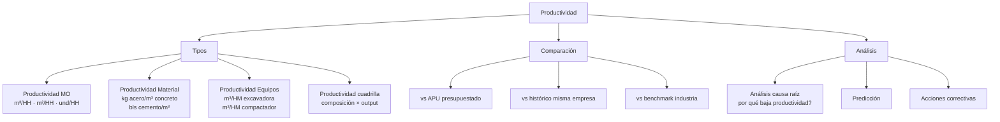
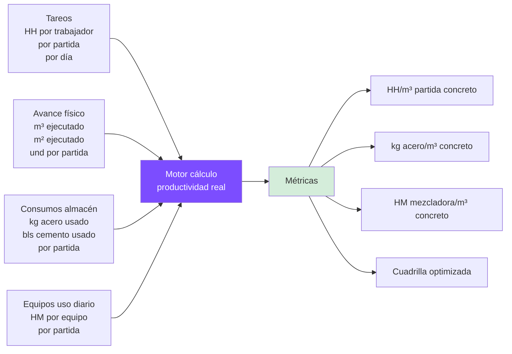
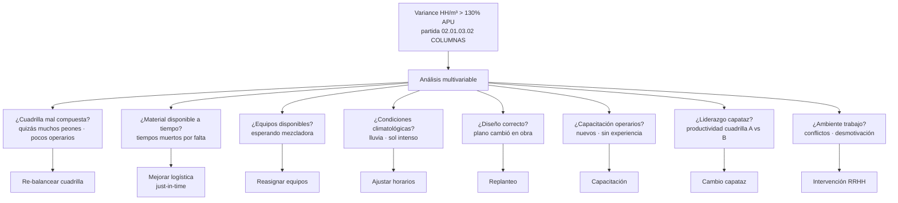

# 40 · Productividad y rendimiento real

★ Casi nadie lo hace bien. Diferencial competitivo. Conecta tareo · APUs · consumo · avance físico para detectar dónde estás perdiendo plata.

## Métricas core



## Datos requeridos

Para calcular productividad real necesitas conectar 4 fuentes:



## Schema productividad

```sql
-- Métricas calculadas (vista materializada)
CREATE MATERIALIZED VIEW productividad_partidas AS
SELECT
  p.id AS partida_id,
  p.proyecto_id,
  p.codigo,
  p.nombre,

  -- HH
  COALESCE(SUM(t.horas_normales + t.horas_extras), 0) AS hh_totales,
  COALESCE(SUM(t.horas_normales + t.horas_extras) FILTER (WHERE w.categoria = 'Operario'), 0) AS hh_operario,
  COALESCE(SUM(t.horas_normales + t.horas_extras) FILTER (WHERE w.categoria = 'Oficial'), 0) AS hh_oficial,
  COALESCE(SUM(t.horas_normales + t.horas_extras) FILTER (WHERE w.categoria = 'Peon'), 0) AS hh_peon,
  COALESCE(SUM(t.horas_normales + t.horas_extras) FILTER (WHERE w.categoria = 'Capataz'), 0) AS hh_capataz,

  -- Material
  COALESCE(SUM(c.cantidad) FILTER (WHERE r.codigo LIKE 'CEM%'), 0) AS bls_cemento,
  COALESCE(SUM(c.cantidad) FILTER (WHERE r.codigo LIKE 'AC%'), 0) AS kg_acero,
  COALESCE(SUM(c.cantidad) FILTER (WHERE r.codigo LIKE 'AGR%'), 0) AS m3_agregado,

  -- Equipos
  COALESCE(SUM(eu.hm_operativas), 0) AS hm_equipos,

  -- Avance físico
  p.cantidad AS metrado_planeado,
  COALESCE((SELECT SUM(metrado_periodo) FROM partes_diarios WHERE partida_id = p.id), 0) AS metrado_real_ejecutado,
  p.percent_complete AS pct_avance,

  -- Cálculos productividad
  CASE WHEN metrado_real > 0 THEN hh_totales / metrado_real ELSE 0 END AS hh_por_unidad,
  CASE WHEN metrado_real > 0 THEN bls_cemento / metrado_real ELSE 0 END AS cemento_por_unidad,
  CASE WHEN bls_cemento > 0 THEN kg_acero / bls_cemento ELSE 0 END AS acero_por_cemento,

  -- vs APU
  apu.hh_apu,
  apu.cemento_apu,
  apu.acero_apu,

  -- Variances
  ((hh_por_unidad - apu.hh_apu) / NULLIF(apu.hh_apu,0)) AS variance_hh_pct,
  ((cemento_por_unidad - apu.cemento_apu) / NULLIF(apu.cemento_apu,0)) AS variance_cemento_pct,
  ((acero_por_cemento - apu.acero_apu) / NULLIF(apu.acero_apu,0)) AS variance_acero_pct,

  -- Ratios financieros
  costo_real_partida(p.id) AS costo_real,
  p.presupuesto AS costo_presupuestado,
  (costo_real_partida(p.id) - p.presupuesto * p.percent_complete) AS desviacion_costo,

  ultima_actualizacion timestamp
FROM partidas p
LEFT JOIN tareos t ON t.partida_id = p.id
LEFT JOIN trabajadores w ON w.id = t.trabajador_id
LEFT JOIN consumos_obra c ON c.partida_id = p.id
LEFT JOIN recursos r ON r.id = c.recurso_id
LEFT JOIN equipo_uso_diario eu ON eu.partida_id = p.id
LEFT JOIN apus apu ON apu.partida_id = p.id
GROUP BY p.id, apu.id;

CREATE INDEX ON productividad_partidas (proyecto_id);
CREATE INDEX ON productividad_partidas (variance_hh_pct DESC);
```

## Cálculo productividad cuadrilla

```sql
-- Composición cuadrilla óptima
CREATE FUNCTION calcular_productividad_cuadrilla(p_partida_id uuid)
RETURNS TABLE (
  composicion text,
  output_dia decimal,
  costo_dia decimal,
  productividad_economica decimal
) AS $$
SELECT
  format('%s Op + %s Of + %s Peón',
         hh_op / 8, hh_of / 8, hh_pe / 8) AS composicion,

  metrado_real / dias_trabajados AS output_dia,

  (hh_op * jornal_op + hh_of * jornal_of + hh_pe * jornal_pe) / dias_trabajados AS costo_dia,

  (metrado_real * pu_partida) / (hh_op * jornal_op + hh_of * jornal_of + hh_pe * jornal_pe) AS productividad_economica
FROM productividad_partidas pp
WHERE pp.partida_id = p_partida_id;
$$ LANGUAGE sql;
```

## Análisis causa raíz baja productividad



## Reportes productividad

```
1. Variance APU por partida
   Top 10 partidas con peor variance
   Ranking proyectos

2. Productividad MO por categoría
   Operario · Oficial · Peón
   Por partida · por proyecto

3. Cuadrilla óptima
   Histórico composiciones
   ROI por composición
   Recomendaciones

4. Capataz performance
   Productividad cuadrillas
   Variación entre capataces

5. Día de la semana
   Lunes vs viernes
   Detección patrones

6. Curva aprendizaje
   Productividad vs días en obra
   Cuándo se estabiliza

7. Benchmark industria
   Comparar con datos públicos
   CAPECO promedios
   Empresas similares
```

## ML · optimización cuadrillas

```python
# Features: composición cuadrilla, partida tipo, condiciones
# Target: m³/HH

from sklearn.ensemble import RandomForestRegressor

X = df[['op_count','of_count','pe_count','partida_tipo',
        'temp_C','lluvia','dia_semana','mes_obra']]
y = df['m3_por_hh_real']

model = RandomForestRegressor()
model.fit(X, y)

# Predicción cuadrilla óptima para nueva partida
def cuadrilla_optima(partida_tipo, restricciones):
    # Genera combinaciones posibles
    # Predice productividad cada una
    # Devuelve top 3
    pass
```

## KPIs productividad

| KPI | Target |
|---|---|
| Variance HH/m³ vs APU | < 110% |
| Variance material vs APU | < 105% |
| HM equipos efectivos vs total | > 85% |
| Productividad económica | > 1.0 (gana plata) |
| Variance entre cuadrillas | minimizar |
| Capataces sobre promedio | identificar · replicar |

## Prioridad: **ALTA · diferencial competitivo**
