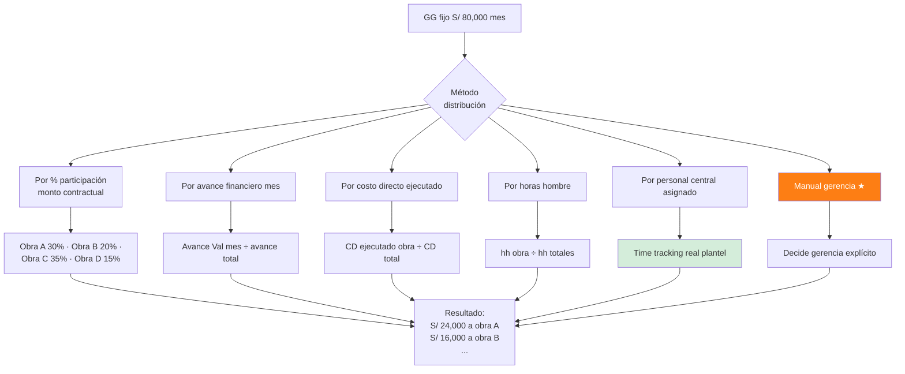
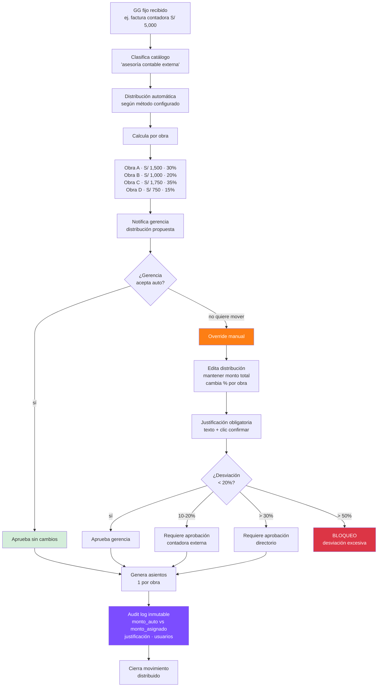

# 41 · Distribución de Gastos Generales entre obras

★ Flujo crítico solicitado por gerencia. Tema sensible: combina necesidad operativa con riesgos contables/tributarios.

## El problema real

```
Caso típico:
  MM tiene 4 obras simultáneas
  Oficina central · gerencia · contadora · planilla central · alquiler oficina
  → S/ 80,000/mes GG fijos NO ATRIBUIBLES a obra específica

¿A quién le cargas?
  Opción A · Distribución automática matemática (por presupuesto · CD · avance · etc)
  Opción B · Selección manual gerencia (lo que pide)
  Opción C · Híbrido · auto + override gerencia

Realidad:
  Gerencia quiere flexibilidad porque:
    - Obra A está al borde · no aguanta más GG
    - Obra B tiene mucho margen · puede absorber
    - Obra C presentar mejor utility a socios
    - Decisión estratégica · negociación entidad
    - Tax planning legítimo

  Pero ERP debe controlar porque:
    - Manipulación utility entre obras
    - Análisis rentabilidad distorsionado
    - SUNAT puede observar (disposición arbitraria gastos)
    - Socios consorcio pueden objetar
    - Compliance auditoría OCI
```

## Veredicto técnico

**Permitir selección manual SÍ · pero con barandillas duras:**

```
✓ Permitir override gerencia
✓ Audit log inmutable cada cambio
✓ Justificación obligatoria texto
✗ NO permitir mover GG ya cerrados (período)
✗ NO permitir asimetrías ilegales (ej. obra cliente público con GG inflado)
✓ Límite máximo desviación vs auto (ej. ±20%)
✓ Aprobación contadora externa requerida si > umbral
✓ Reporte mensual a directorio
✓ Reporte separado "GG real auto" vs "GG asignado manual"
```

## Tipos de Gastos Generales

```mermaid
flowchart TB
    GG[Gastos Generales] --> FIJ[GG FIJOS empresa]
    GG --> VAR[GG VARIABLES obra]

    FIJ --> F1[Sueldos plantel central]
    FIJ --> F2[Alquiler oficina central]
    FIJ --> F3[Servicios públicos central]
    FIJ --> F4[Contadora externa]
    FIJ --> F5[Asesoría legal]
    FIJ --> F6[Software · ERP · subscriptions]
    FIJ --> F7[Auditoría externa]
    FIJ --> F8[Licencias profesionales colegiados]
    FIJ --> F9[Costo financiero · capital trabajo]
    FIJ --> F10[Marketing · comercial]

    VAR --> V1[Residente · plantel obra]
    VAR --> V2[Caja chica obra]
    VAR --> V3[Almacenero · vigilancia]
    VAR --> V4[Movilidad obra-Lima]
    VAR --> V5[Comunicaciones obra]
    VAR --> V6[Servicios sanitarios obra]
    VAR --> V7[EPPS plantel]
    VAR --> V8[Costo SCTR · CAR · seguros obra]

    style FIJ fill:#fd7e14,color:#fff
    style VAR fill:#cce5ff
```



| Categoría | Atribuible obra | Método distribución |
|---|---|---|
| GG VARIABLES | Sí · directo | Asiento directo a obra |
| GG FIJOS | No · prorrateado | Auto por método + override gerencia |

**Solo los GG FIJOS son los que requieren distribución.** Los variables ya van directos.

## Métodos automáticos distribución GG fijos



## Recomendación · método híbrido

**Time tracking real plantel central (M5) + override gerencia controlado**

```
Razón M5:
  - Cada empleado central registra tiempo dedicado por obra
  - Distribución = horas reales × costo hora empleado
  - Audit defendible ante SUNAT
  - Transparente para socios consorcio
  - Refleja realidad operativa

Override gerencia:
  - Solo movimientos pequeños · justificados
  - Audit obligatorio
  - Aprobación dual (gerente + contadora)
```

## Schema completo

```sql
-- Tipos GG
CREATE TYPE gg_tipo AS ENUM (
  'fijo_central',          -- GG fijo empresa · requiere distribución
  'variable_obra'          -- GG directo obra · sin distribución
);

CREATE TYPE gg_metodo_distribucion AS ENUM (
  'porcentaje_contratos',
  'avance_financiero',
  'costo_directo_ejecutado',
  'horas_hombre',
  'time_tracking_plantel',
  'manual_gerencia',
  'mixto'                  -- auto + override
);

-- Catálogo GG fijos
gastos_generales_catalogo (
  id uuid PRIMARY KEY,
  empresa_id uuid,
  codigo varchar UNIQUE,                       -- 'GG-001 SUELDOS_GERENCIA'
  descripcion text,
  tipo gg_tipo,
  cuenta_pcge varchar(10),                      -- '627','632',etc
  centro_costo_default varchar,                 -- 'oficina_central','obra_directa'
  metodo_distribucion_default gg_metodo_distribucion,
  recurrente boolean DEFAULT true,
  monto_estimado_mensual decimal(14,2)
)

-- Movimientos GG fijos · POR DISTRIBUIR
gastos_generales_movimientos (
  id uuid PRIMARY KEY,
  empresa_id uuid,
  catalogo_id uuid REFERENCES gastos_generales_catalogo,
  fecha date,
  glosa text,

  monto_total decimal(14,2),
  factura_id uuid,                              -- si vino de factura

  -- Distribución
  metodo_aplicado gg_metodo_distribucion,
  config_distribucion jsonb,                    -- snapshot config método

  estado ENUM (
    'pendiente_distribuir',
    'auto_distribuido',
    'override_gerencia',
    'distribuido_aprobado',
    'cerrado_periodo'
  ),

  -- Aprobaciones
  distribuido_auto_at timestamp,
  override_gerencia_at timestamp,
  override_gerencia_user_id uuid,
  override_justificacion text,                  -- ★ obligatorio
  aprobado_contadora_at timestamp,
  aprobado_contadora_user_id uuid,

  asiento_id uuid,
  created_at, updated_at
)

-- Distribución por obra
gastos_generales_distribucion (
  id uuid PRIMARY KEY,
  movimiento_gg_id uuid REFERENCES gastos_generales_movimientos,
  proyecto_id uuid,

  -- Cálculo automático
  monto_auto decimal(14,2),
  pct_auto decimal(7,4),
  base_calculo varchar,                         -- 'monto_contractual=1730120 / total=5000000 = 0.346'

  -- Override gerencia
  monto_asignado decimal(14,2),                 -- el que finalmente se usa
  pct_asignado decimal(7,4),
  desviacion_vs_auto decimal(14,2),             -- monto_asignado − monto_auto
  desviacion_pct decimal(7,4),

  asiento_linea_id uuid,
  created_at
)

-- Time tracking plantel central
plantel_central_horas (
  id uuid PRIMARY KEY,
  empresa_id uuid,
  user_id uuid,                                 -- empleado plantel central
  proyecto_id uuid,                             -- obra a la que se imputa
  fecha date,
  horas decimal(5,2),
  actividad varchar,                            -- 'reuniones','revision','licitacion'
  observaciones text,
  registrado_at timestamp
)

-- Política empresa override
gg_politica_override (
  empresa_id uuid PRIMARY KEY,
  permite_override boolean DEFAULT true,
  desviacion_max_pct decimal(5,4) DEFAULT 0.20,  -- ±20% vs auto
  requiere_aprobacion_contadora_si_excede decimal(5,4) DEFAULT 0.10,
  requiere_aprobacion_directorio_si_excede decimal(5,4) DEFAULT 0.30,
  bloqueo_post_cierre_mes boolean DEFAULT true,
  documento_politica_pdf_nas text                -- política firmada empresa
)
```

## Flujo completo distribución GG



## Validaciones críticas

```sql
-- Σ distribuido = monto total (siempre)
CREATE FUNCTION validar_distribucion_completa()
RETURNS trigger AS $$
DECLARE
  v_movimiento record;
  v_suma decimal(14,2);
BEGIN
  SELECT * INTO v_movimiento FROM gastos_generales_movimientos
    WHERE id = NEW.movimiento_gg_id;

  SELECT COALESCE(SUM(monto_asignado), 0) INTO v_suma
    FROM gastos_generales_distribucion
    WHERE movimiento_gg_id = NEW.movimiento_gg_id;

  IF ABS(v_suma - v_movimiento.monto_total) > 0.01 THEN
    RAISE EXCEPTION 'Σ distribución (%) ≠ monto total (%) · debe cuadrar exacto',
      v_suma, v_movimiento.monto_total;
  END IF;
  RETURN NEW;
END $$;

-- No mover GG de período cerrado
CREATE FUNCTION proteger_gg_periodo_cerrado()
RETURNS trigger AS $$
DECLARE v_periodo_estado varchar;
BEGIN
  SELECT pc.estado INTO v_periodo_estado
  FROM gastos_generales_movimientos gm
  JOIN periodos_contables pc ON pc.fecha_inicio <= gm.fecha
                             AND pc.fecha_fin >= gm.fecha
                             AND pc.proyecto_id IS NULL
  WHERE gm.id = NEW.movimiento_gg_id;

  IF v_periodo_estado IN ('cerrado','bloqueado') THEN
    RAISE EXCEPTION 'No se puede modificar distribución GG · período cerrado';
  END IF;
  RETURN NEW;
END $$;

-- Validación desviación máxima
CREATE FUNCTION validar_desviacion_override()
RETURNS trigger AS $$
DECLARE
  v_politica record;
  v_pct_desviacion decimal;
BEGIN
  SELECT * INTO v_politica FROM gg_politica_override
    WHERE empresa_id = (SELECT empresa_id FROM gastos_generales_movimientos WHERE id = NEW.movimiento_gg_id);

  IF v_politica.permite_override = false AND NEW.desviacion_pct != 0 THEN
    RAISE EXCEPTION 'Override no permitido por política empresa';
  END IF;

  IF ABS(NEW.desviacion_pct) > v_politica.desviacion_max_pct THEN
    RAISE EXCEPTION 'Desviación %% excede tope %% política',
      NEW.desviacion_pct, v_politica.desviacion_max_pct;
  END IF;

  -- Marcar requiere aprobaciones según escala
  IF ABS(NEW.desviacion_pct) > v_politica.requiere_aprobacion_contadora_si_excede THEN
    NEW.requiere_aprobacion_contadora := true;
  END IF;
  IF ABS(NEW.desviacion_pct) > v_politica.requiere_aprobacion_directorio_si_excede THEN
    NEW.requiere_aprobacion_directorio := true;
  END IF;

  RETURN NEW;
END $$;
```

## Reportes obligatorios

```mermaid
flowchart TB
    R1[Reporte 1:<br/>GG real auto vs asignado]
    R2[Reporte 2:<br/>Histórico overrides gerencia]
    R3[Reporte 3:<br/>Utility por obra · GG auto]
    R4[Reporte 4:<br/>Utility por obra · GG asignado]
    R5[Reporte 5:<br/>Tendencia overrides mes a mes]

    R1 --> Q1[Tabla:<br/>Obra · GG auto · GG asignado · Δ]
    R2 --> Q2[Lista cambios:<br/>quién · cuándo · cuánto · justificación]
    R3 --> Q3[Utility "objetiva"<br/>ranking obras realista]
    R4 --> Q4[Utility "presentación"<br/>versión gerencia]
    R5 --> Q5[Análisis tendencia<br/>obras siempre favorecidas/perjudicadas]

    Q3 --> COMP{¿Diff Q3 vs Q4<br/>significativa?}
    COMP -->|sí > 5%| ALERT[Alerta directorio<br/>posible manipulación]
    COMP -->|no| OK[Normal]

    style ALERT fill:#dc3545,color:#fff
```

## Ejemplo numérico real

```
GG fijo mes diciembre 2026: S/ 80,000

OBRAS ACTIVAS:
  Obra A · CREMATORIO SURCO     · monto contractual  1,730,120  (24%)
  Obra B · COLEGIO COMAS        · monto contractual  3,200,000  (44%)
  Obra C · PARQUE LIMA          · monto contractual  1,500,000  (21%)
  Obra D · POSTA SALUD          · monto contractual    830,000  (11%)
  Total                                              7,260,120  (100%)

DISTRIBUCIÓN AUTO (método: % monto contractual):
  Obra A: 80,000 × 24% = S/ 19,200
  Obra B: 80,000 × 44% = S/ 35,200
  Obra C: 80,000 × 21% = S/ 16,800
  Obra D: 80,000 × 11% = S/  8,800
  Σ                    = S/ 80,000  ✓

DISTRIBUCIÓN OVERRIDE GERENCIA:
  Razón: "Obra A en cierre liquidación · alivio caja"
         "Obra B con buen margen absorbe extra"
  Obra A: 19,200 → 12,000  (Δ -7,200, -37.5%)  ⚠️ excede 20%
  Obra B: 35,200 → 42,400  (Δ +7,200, +20.5%)  ⚠️ excede 20%
  Obra C: 16,800 → 16,800  (sin cambio)
  Obra D: 8,800  → 8,800   (sin cambio)
  Σ                = 80,000  ✓

ALERTAS DISPARADAS:
  ⚠️ Obra A desviación -37.5% > tope 20%
  → Requiere aprobación contadora + directorio
  ⚠️ Obra B desviación +20.5% > tope 20%
  → Requiere aprobación contadora

JUSTIFICACIÓN OBLIGATORIA:
  "Obra A finaliza este mes · próxima liquidación.
   Cargar GG completo afectaría utility presentada a entidad.
   Decisión gerencia: aliviar Obra A · trasladar a Obra B
   con mayor margen ejecutado."

AUDIT LOG:
  fecha       user    obra_id   monto_auto  monto_asignado  justif
  2026-12-31  jperez  obraA     19,200      12,000          "..."
  2026-12-31  jperez  obraB     35,200      42,400          "..."
```

## Riesgos y mitigaciones

| Riesgo | Mitigación implementada |
|---|---|
| Manipulación utility entre obras | Audit log inmutable + reporte directorio mensual |
| SUNAT observa distribución arbitraria | Política empresa documentada · método consistente |
| Socios consorcio reclaman | Reporte separado GG auto vs asignado por consorcio |
| Cambios retroactivos | Bloqueo post-cierre período |
| Overrides excesivos repetidos | Reporte "obras favorecidas" + alerta tendencia |
| Olvido distribuir | Cron diario flag movimientos pendientes |

## Política empresa documentada

ERP debe permitir adjuntar PDF firmado por gerencia con:
```
- Métodos distribución autorizados
- Topes desviación
- Niveles aprobación
- Frecuencia revisión
- Casos uso aceptables override
- Casos uso prohibidos
- Auditoría externa anual
```

## Recomendación final · responder al gerente

> **"Sí podemos hacer que selecciones manualmente, pero con un sistema de control que te proteja a ti, a la empresa y a los socios:"**
>
> 1. **Distribución automática propuesta primero** (transparente, defendible)
> 2. **Botón "Override manual"** disponible siempre
> 3. **Justificación texto obligatoria** cada cambio
> 4. **Tope desviación 20%** → si excede, contadora aprueba
> 5. **Tope desviación 30%** → si excede, directorio aprueba
> 6. **Audit inmutable** quién cambió qué cuándo
> 7. **Reporte mensual al directorio** GG auto vs GG asignado por obra
> 8. **Política firmada** que documenta el procedimiento
>
> "Esto te da flexibilidad operativa pero te protege ante:
> - Auditoría SUNAT (disposición no arbitraria)
> - Reclamo socios consorcio (transparencia)
> - Acusaciones manipulación (audit defendible)
> - OCI obras públicas (procedimiento documentado)"

## KPIs

| KPI | Target |
|---|---|
| % GG auto sin override | > 70% (override solo cuando justifica) |
| Desviación promedio overrides | < 15% |
| Overrides aprobados directorio | < 5 al año |
| Distribución pendiente fin mes | 0 |
| Reporte directorio enviado | 100% mensual |

## Prioridad: **CRÍTICA**
