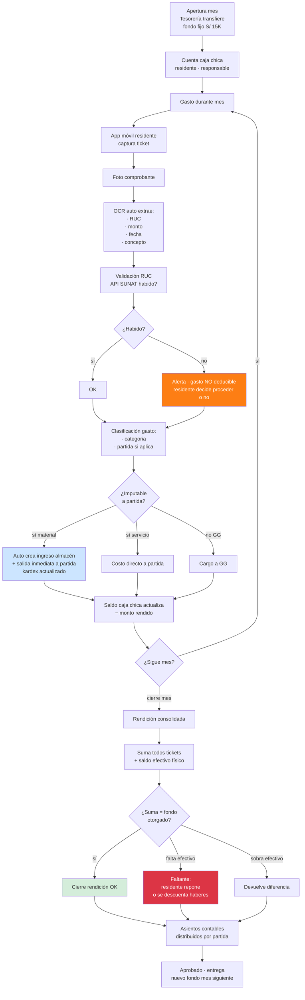
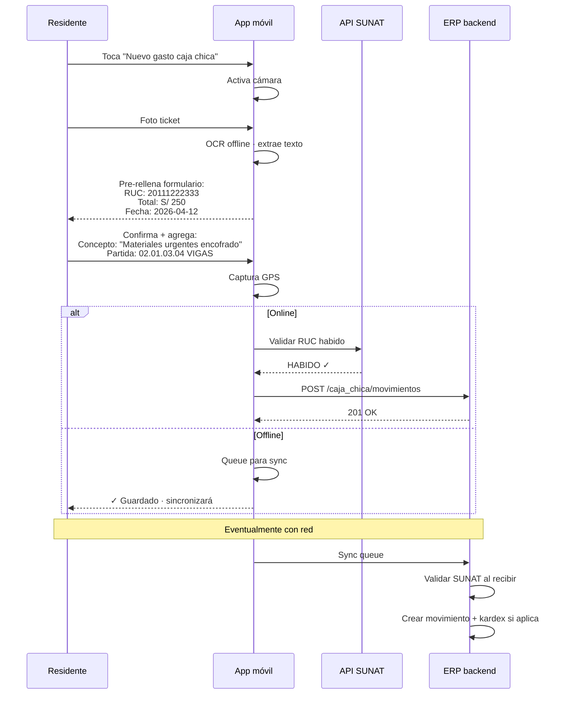
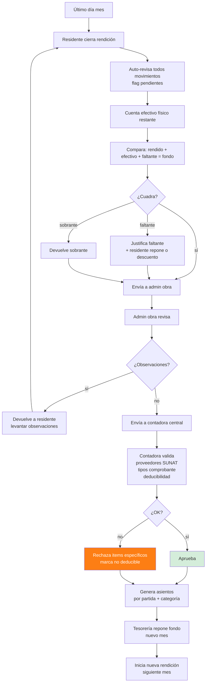

# 42 · Caja Chica + Rendiciones en obra

★ Crítico provincia. Cada obra fuera Lima maneja S/ 5K-30K/mes en efectivo · sin control · 1-3% utility se pierde aquí.

## El problema real

```
Caso típico obra Selva Central:
  Residente recibe S/ 15,000 fondo fijo mensual
  Gasta en: movilidad, comidas peones, taxi materiales urgentes,
            ferreteros locales, gasolina vehículos, peajes,
            propinas estibadores, pequeñas reparaciones, etc

  Fin de mes:
    Tickets/boletas en bolsa plástica
    Excel hecho a mano · sin validación
    Conceptos vagos · "varios obra"
    Sin foto · sin sustento real
    SUNAT no acepta sin RUC
    Pérdida crédito fiscal · pérdida deducción gasto

  Realidad caos:
    25-30% rendiciones rechazadas por contadora
    Faltantes de S/ 800-1500/mes (no se rinden)
    Boletas ilegibles · truchas · dobles
    Dinero que entra al residente · no se registra · "regalos"
```

## Flujo Caja Chica integrado ERP



## Schema caja chica

```sql
caja_chica_fondos (
  id uuid PRIMARY KEY,
  proyecto_id uuid,
  responsable_user_id uuid,                     -- residente típicamente
  monto_fondo_fijo decimal(14,2),               -- S/ 15,000
  moneda char(3) DEFAULT 'PEN',
  fecha_apertura date,
  fecha_ultima_reposicion date,
  saldo_actual decimal(14,2),
  saldo_pendiente_rendir decimal(14,2),
  estado ENUM ('vigente','en_rendicion','cerrado','suspendido')
)

caja_chica_movimientos (
  id uuid PRIMARY KEY,
  fondo_id uuid REFERENCES caja_chica_fondos,
  fecha date,
  hora time,

  tipo ENUM ('apertura','gasto','reposicion','devolucion','ajuste','cierre'),

  -- Para gastos
  monto decimal(14,2),
  proveedor_ruc varchar(11),
  proveedor_razon varchar,
  proveedor_habido_sunat boolean,                -- snapshot validación al momento

  serie_comprobante varchar,
  numero_comprobante varchar,
  tipo_comprobante ENUM ('boleta','factura','ticket','recibo_honorarios','sin_comprobante'),

  concepto text,
  categoria_gasto varchar,                       -- 'movilidad','comida','reparacion'

  -- Imputación
  partida_id uuid,                               -- si aplica directo a partida
  cuenta_pcge varchar(10),                       -- '655','632',etc
  centro_costo varchar,
  es_gasto_general boolean,
  es_deducible boolean,                          -- false si proveedor no habido

  -- Multimedia
  foto_comprobante_nas text,                     -- ★ obligatorio
  foto_lectura_ocr jsonb,                        -- output OCR

  -- Material vinculado kardex (si aplica)
  recurso_id uuid,
  cantidad decimal(14,4),
  unidad varchar,
  movimiento_almacen_id uuid,                    -- si creó ingreso/salida

  -- Estado validación
  estado ENUM ('borrador','validado','observado','rechazado','aprobado'),
  observado_por uuid,
  observacion text,
  aprobado_por uuid,
  aprobado_at timestamp,

  registrado_por_user_id uuid,                   -- típicamente residente
  registrado_via varchar,                        -- 'app_movil','web_admin'
  gps_coords point,                              -- ubicación captura

  created_at timestamp DEFAULT now()
)

caja_chica_rendiciones (
  id uuid PRIMARY KEY,
  fondo_id uuid,
  numero_rendicion varchar UNIQUE,               -- 'RD-2026-001'
  periodo_mes char(7),

  fecha_apertura date,
  fecha_cierre date,

  monto_fondo_inicial decimal(14,2),
  monto_total_rendido decimal(14,2),
  monto_efectivo_devuelto decimal(14,2),
  monto_faltante decimal(14,2),
  monto_no_deducible decimal(14,2),              -- gastos sin RUC habido

  num_movimientos int,

  estado ENUM (
    'en_curso',
    'cerrada_pendiente_revision',
    'observada_residente',
    'aprobada_admin',
    'aprobada_contadora',
    'pagada_reposicion',
    'rechazada'
  ),

  archivo_acta_pdf_nas text,
  asiento_consolidacion_id uuid,

  observaciones_admin text,
  observaciones_contadora text
)
```

## Reglas críticas

```sql
-- Fondo no excede límite empresa
CREATE FUNCTION validar_monto_fondo()
RETURNS trigger AS $$
DECLARE
  v_limite_empresa decimal;
BEGIN
  SELECT (param_get('caja_chica_limite_fondo'))::decimal INTO v_limite_empresa;
  IF NEW.monto_fondo_fijo > v_limite_empresa THEN
    RAISE EXCEPTION 'Monto fondo excede límite empresa S/ %', v_limite_empresa;
  END IF;
  RETURN NEW;
END $$;

-- Bancarización · gastos > S/ 3,500 NO se pueden pagar caja chica
CREATE FUNCTION validar_bancarizacion()
RETURNS trigger AS $$
BEGIN
  IF NEW.tipo = 'gasto' AND NEW.monto > 3500 THEN
    RAISE EXCEPTION 'Gasto > S/3,500 requiere bancarización · usar OC + transferencia';
  END IF;
  RETURN NEW;
END $$;

-- Foto obligatoria si > umbral
CREATE FUNCTION validar_foto_obligatoria()
RETURNS trigger AS $$
DECLARE v_umbral decimal;
BEGIN
  SELECT (param_get('caja_chica_foto_obligatoria_desde'))::decimal INTO v_umbral;
  IF NEW.tipo = 'gasto' AND NEW.monto > v_umbral
     AND NEW.foto_comprobante_nas IS NULL THEN
    RAISE EXCEPTION 'Gasto > S/% requiere foto comprobante', v_umbral;
  END IF;
  RETURN NEW;
END $$;

-- Cierre rendición: cuadre obligatorio
CREATE FUNCTION validar_cuadre_rendicion()
RETURNS trigger AS $$
DECLARE v_suma decimal;
BEGIN
  SELECT SUM(monto) INTO v_suma
  FROM caja_chica_movimientos
  WHERE fondo_id = NEW.fondo_id
    AND fecha BETWEEN NEW.fecha_apertura AND NEW.fecha_cierre
    AND tipo = 'gasto'
    AND estado = 'aprobado';

  -- Suma rendido + efectivo devuelto + faltante = fondo inicial
  IF ABS(v_suma + NEW.monto_efectivo_devuelto + NEW.monto_faltante - NEW.monto_fondo_inicial) > 0.01 THEN
    RAISE EXCEPTION 'Rendición no cuadra · revisar movimientos';
  END IF;
  RETURN NEW;
END $$;
```

## Integración Kardex automática

```mermaid
flowchart TB
    GAST[Gasto caja chica<br/>S/ 250 ferreteria<br/>compra clavos · bisagras] --> CLAS[Clasifica · material]

    CLAS --> EXTRAE[Extrae detalle ticket<br/>OCR + manual residente]
    EXTRAE --> DETAIL[Items:<br/>− 5kg clavos · S/ 100<br/>− 20 bisagras · S/ 80<br/>− 1 candado · S/ 70]

    DETAIL --> ALM[Auto crea movimientos<br/>kardex SIMULTÁNEO]

    ALM --> ING[Ingreso provisional almacén<br/>tipo: provisional_caja_chica<br/>estado: definitivo<br/>(ya tiene boleta)]

    ING --> SAL[Si destino partida específica:<br/>salida inmediata frente]

    SAL --> COSTO[Costo aplicado a partida]

    ALM --> ASI[Asiento contable:<br/>Dr 25 Suministros<br/>Dr 401 IGV (si factura)<br/>Cr 469 Caja chica rendir]

    COSTO --> RPT[Reporte costo real<br/>partida actualizado]

    style ING fill:#cce5ff
    style COSTO fill:#d4edda
```

## App móvil residente · captura



## Cierre mensual rendición



## Reportes caja chica

```
1. Estado fondos por proyecto
   Saldo actual · pendiente rendir · días sin rendir

2. Histórico rendiciones
   Cumplimiento mensual
   Avg días cierre

3. Gastos no deducibles
   Por proveedor · por residente
   Análisis tendencia · capacitación

4. Top categorías gasto
   Por proyecto · por mes
   Detección anomalías

5. Faltantes acumulados
   Por residente · por proyecto
   Patrón sospechoso

6. Cumplimiento foto
   % gastos con sustento
   Por residente

7. Análisis SUNAT
   Proveedores recurrentes habido
   Riesgo deducibilidad
```

## KPIs

| KPI | Target |
|---|---|
| % rendiciones cerradas plazo | > 90% |
| % gastos con foto | 100% |
| % proveedores habido SUNAT | > 95% |
| Faltantes / fondo total | < 0.5% |
| Tiempo cierre rendición | < 7 días |
| Gastos imputados a partida | > 80% (no GG vago) |

## Prioridad: **CRÍTICA · MVP**
