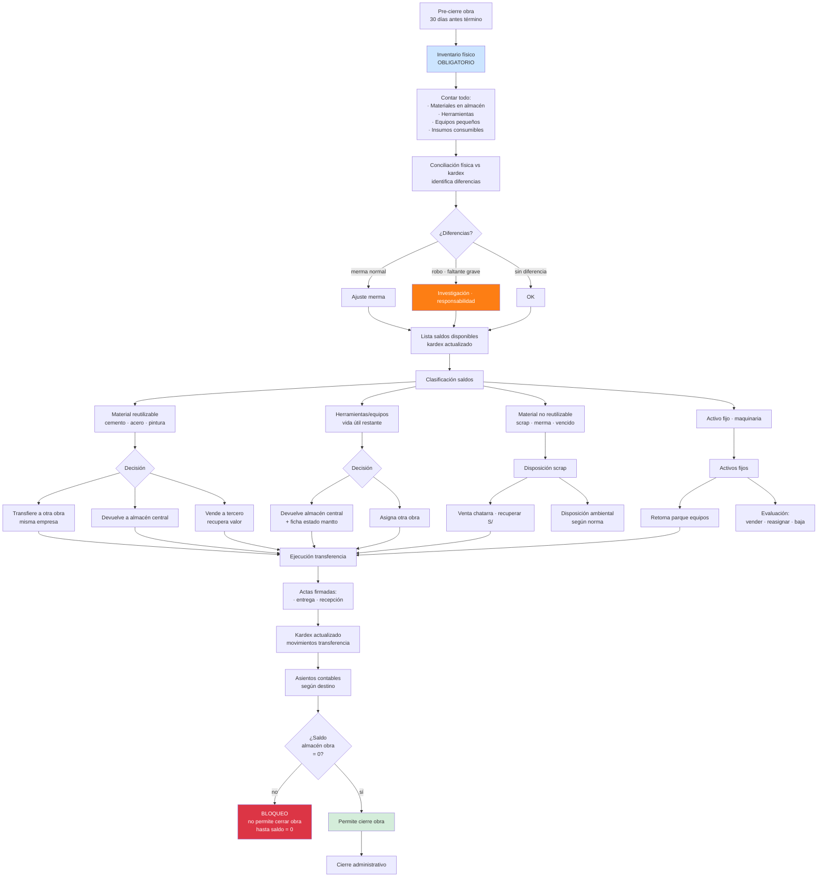
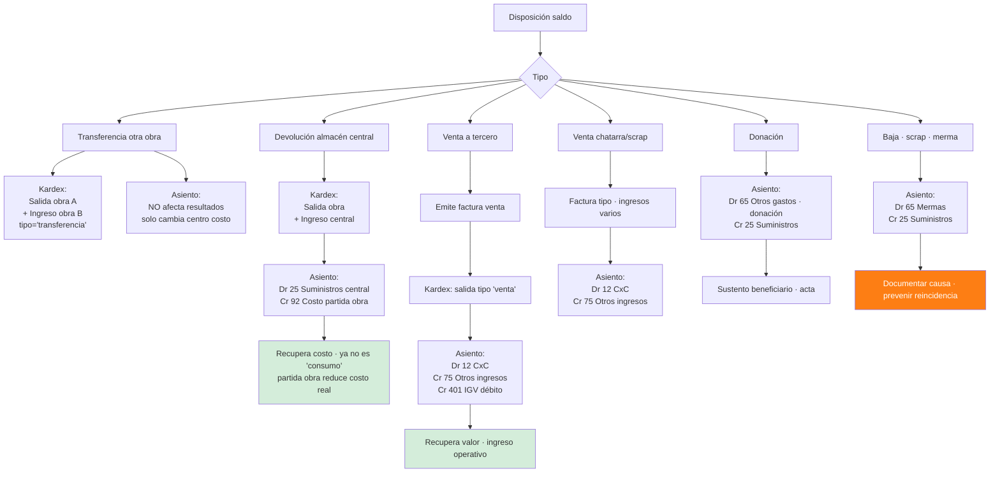
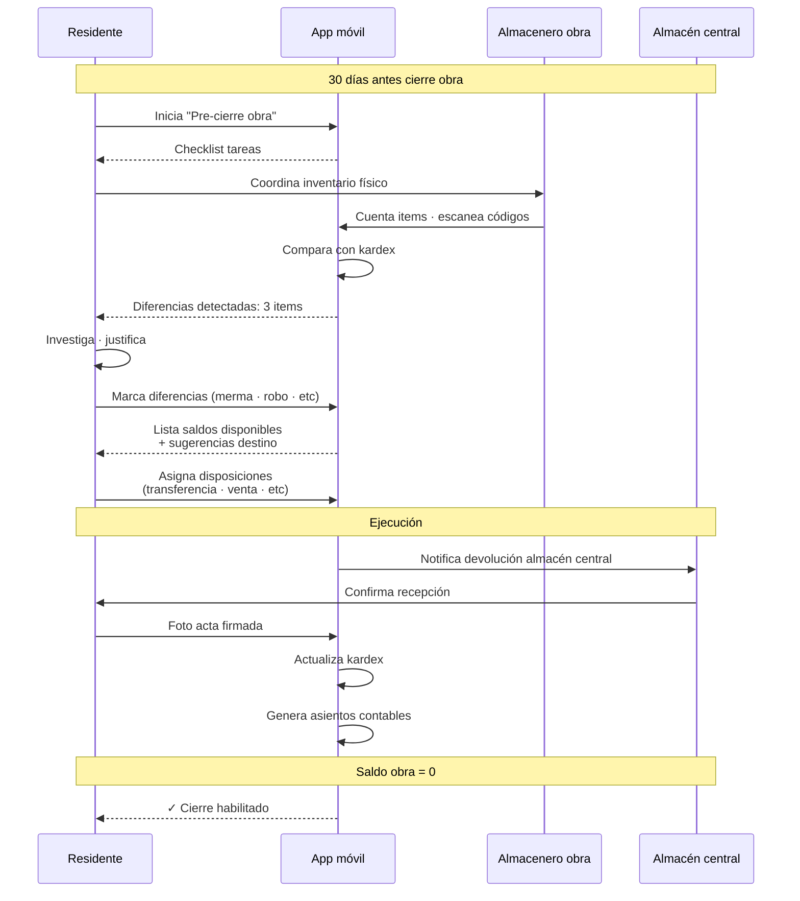

# 43 · Logística inversa · Saldos de obra · Cierre limpio

★ Gap crítico. Cada obra termina con S/ 20K-200K en materiales/herramientas que "desaparecen". Pérdida silenciosa.

## El problema real

```
Caso típico fin de obra:
  Concreto sobrante: 30 bls cemento × S/ 30 = S/ 900
  Acero sobrante: 200 kg × S/ 4.50 = S/ 900
  Pintura sobrante: 8 baldes × S/ 200 = S/ 1,600
  Herramientas: amoladoras · taladros · escaleras · andamios · S/ 12,000
  Equipos pequeños: vibradores · niveles · S/ 8,000
  Materiales menores · ferretería · cables · S/ 5,500

  Total típico: S/ 28,900 obra mediana

¿Qué pasa hoy en MM (sin sistema)?
  - Residente "regala" a operarios al cerrar
  - Capataz "lleva" equipos a su empresa propia
  - Material queda abandonado · roban
  - Se vende informal en mercado · plata no entra a empresa
  - Se da de baja contable · costo asumido por obra
  - Nunca llega al almacén central

Impacto:
  - 1-3% pérdida utility por obra
  - Robo · descontrol activos
  - Costo "fantasma" en contabilidad
  - Sin trazabilidad propietario empresa
  - Tributariamente: gasto no recuperado
```

## Flujo logística inversa



## Schema logística inversa

```sql
-- Pre-cierre · proceso formal
pre_cierres_obra (
  id uuid PRIMARY KEY,
  proyecto_id uuid,
  fecha_inicio_pre_cierre date,
  fecha_objetivo_cierre date,
  responsable_id uuid,                          -- residente o admin

  -- Inventario físico
  inventario_realizado boolean,
  fecha_inventario date,
  archivo_acta_inventario_pdf_nas text,

  -- Saldos
  monto_saldos_recuperables decimal(14,2),
  monto_saldos_scrap decimal(14,2),
  num_items_pendientes_disposicion int,

  estado ENUM (
    'iniciado',
    'inventario_completado',
    'disposicion_en_proceso',
    'todos_saldos_dispuestos',
    'aprobado_cierre',
    'cerrado'
  )
)

-- Inventario físico · línea por recurso
inventario_fisico_obras (
  id uuid PRIMARY KEY,
  pre_cierre_id uuid,
  recurso_id uuid,
  unidad varchar,

  cantidad_kardex decimal(14,4),
  cantidad_fisica decimal(14,4),
  diferencia decimal(14,4),
  diferencia_pct decimal(7,4),

  motivo_diferencia ENUM (
    'merma_normal',
    'merma_excesiva',
    'robo',
    'error_registro',
    'no_aplica'
  ),

  costo_unitario_kardex decimal(14,4),
  monto_diferencia decimal(14,2),

  estado_recurso ENUM (
    'reutilizable',
    'reutilizable_con_mantto',
    'scrap',
    'desechable',
    'activo_fijo'
  ),

  observaciones text,
  fotos_nas text[]
)

-- Disposiciones · qué se hizo con cada saldo
saldos_disposiciones (
  id uuid PRIMARY KEY,
  pre_cierre_id uuid,
  recurso_id uuid,
  cantidad decimal(14,4),
  costo_unitario decimal(14,4),
  monto_total decimal(14,2),

  tipo_disposicion ENUM (
    'transferencia_otra_obra',
    'devolucion_almacen_central',
    'venta_tercero',
    'venta_chatarra',
    'donacion',
    'baja_scrap',
    'baja_merma',
    'reincorporado_parque_equipos'
  ),

  -- Detalle según tipo
  obra_destino_id uuid,                         -- transferencia
  almacen_destino_id uuid,                      -- devolución
  comprador_ruc varchar(11),                    -- venta
  comprador_razon varchar,
  monto_venta decimal(14,2),
  factura_emitida_id uuid,                      -- venta
  receptor_ruc varchar(11),                     -- donación
  motivo text,

  -- Control
  fecha_disposicion date,
  responsable_disposicion_id uuid,
  acta_pdf_nas text,
  fotos_nas text[],

  -- Contable
  movimiento_almacen_id uuid,                   -- kardex correspondiente
  asiento_id uuid,

  estado ENUM ('borrador','en_proceso','ejecutado','observado'),
  validado_por uuid,
  validado_at timestamp
)

-- Activos fijos retornados
activos_fijos_retorno (
  id uuid PRIMARY KEY,
  proyecto_origen_id uuid,
  equipo_id uuid REFERENCES equipos,

  -- Estado equipo
  horometro_al_retorno decimal(10,2),
  km_al_retorno decimal(10,2),
  estado_fisico ENUM ('excelente','bueno','regular','malo','para_baja'),
  requiere_mantto boolean,
  costo_mantto_estimado decimal(14,2),

  -- Disposición futura
  destino_decidido ENUM ('parque_central','otra_obra','venta','baja_definitiva','reparacion'),
  proyecto_destino_id uuid,

  fecha_retorno date,
  acta_devolucion_pdf_nas text,
  fotos_estado_nas text[],
  responsable_id uuid
)
```

## Bloqueo cierre administrativo

```sql
-- Función validación pre-cierre obra
CREATE FUNCTION puede_cerrar_obra(p_proyecto_id uuid)
RETURNS TABLE (puede boolean, bloqueos jsonb) AS $$
DECLARE bloqueos jsonb := '[]';
BEGIN
  -- 1. Inventario físico realizado
  IF NOT EXISTS (
    SELECT 1 FROM pre_cierres_obra
    WHERE proyecto_id = p_proyecto_id
      AND inventario_realizado = true
  ) THEN
    bloqueos := bloqueos || jsonb_build_object('codigo','INV_FALTA',
      'mensaje','Inventario físico no realizado');
  END IF;

  -- 2. Saldo kardex obra = 0 (todo dispuesto)
  IF EXISTS (
    SELECT 1 FROM almacen_movimientos m
    WHERE m.proyecto_id = p_proyecto_id
    GROUP BY m.recurso_id
    HAVING SUM(CASE WHEN m.tipo = 'ingreso' THEN m.cantidad ELSE -m.cantidad END) > 0.001
  ) THEN
    bloqueos := bloqueos || jsonb_build_object('codigo','SALDO_NO_CERO',
      'mensaje','Saldos almacén obra > 0 · disponer antes cerrar');
  END IF;

  -- 3. Activos fijos · todos retornados o vendidos/baja
  IF EXISTS (
    SELECT 1 FROM equipo_asignaciones ea
    WHERE ea.proyecto_id = p_proyecto_id
      AND ea.fecha_fin IS NULL                  -- todavía asignado
  ) THEN
    bloqueos := bloqueos || jsonb_build_object('codigo','ACTIVOS_PENDIENTES',
      'mensaje','Activos fijos sin retornar');
  END IF;

  -- 4. Disposiciones aprobadas
  IF EXISTS (
    SELECT 1 FROM saldos_disposiciones
    WHERE pre_cierre_id IN (SELECT id FROM pre_cierres_obra WHERE proyecto_id = p_proyecto_id)
      AND estado != 'ejecutado'
  ) THEN
    bloqueos := bloqueos || jsonb_build_object('codigo','DISPOSICIONES_PENDIENTES',
      'mensaje','Disposiciones no completadas');
  END IF;

  RETURN QUERY SELECT jsonb_array_length(bloqueos) = 0, bloqueos;
END $$;

-- Trigger en cambio status proyecto a 'cerrado'
CREATE FUNCTION trigger_validar_cierre()
RETURNS trigger AS $$
DECLARE v_validacion record;
BEGIN
  IF NEW.status = 'cerrado' AND OLD.status != 'cerrado' THEN
    SELECT * INTO v_validacion FROM puede_cerrar_obra(NEW.id);
    IF NOT v_validacion.puede THEN
      RAISE EXCEPTION 'No se puede cerrar obra · %', v_validacion.bloqueos;
    END IF;
  END IF;
  RETURN NEW;
END $$;
```

## Tipos disposición · tratamiento contable



## Caso ejemplo numérico

```
PG0005 CREMATORIO SURCO · cierre obra

INVENTARIO FÍSICO:
  20 bls cemento × S/ 30      = S/    600
  150 kg acero × S/ 4.50      = S/    675
  3 baldes pintura × S/ 200   = S/    600
  1 amoladora · usada bueno   = S/  1,200
  1 vibrador hormigón         = S/  3,500
  2 escaleras                 = S/    400
  Material menor varios       = S/  1,200
  ─────────────────────────────────────────
  TOTAL DISPONIBLE            = S/  8,175

DISPOSICIONES:
  Cemento + acero + pintura → Obra próxima COMAS
    Transferencia: S/ 1,875
    Asiento: cambio centro costo (sin impacto utility)

  Amoladora + vibrador + escaleras → Almacén central
    Devolución: S/ 5,100
    Asiento: Dr 25 Central · Cr 92 Costo PG0005
    → recupera S/ 5,100 a utility de PG0005

  Material menor (cables · ferretería sueltos) → Venta chatarra
    Recupera: S/ 800 (vs S/ 1,200 valor)
    Asiento: ingreso operativo S/ 800

  Diferencia: S/ 1,200 − S/ 800 = S/ 400 baja como merma
    Asiento: Dr 65 Mermas · Cr 25

RESULTADO:
  Sin proceso (status quo): S/ 8,175 perdidos
  Con logística inversa: S/ 7,775 recuperados (95%)
                          + S/ 400 documentado merma
                          → utility +S/ 7,775
```

## App residente · check-out final



## Reportes logística inversa

```
1. Saldos pendientes disposición
   Por obra · monto · días pendiente
   Alerta si > 30 días post-cierre

2. Recuperación valor histórico
   Por obra: % recuperado vs perdido
   Ranking residentes

3. Análisis mermas
   Top items con mayor merma
   Detección patrones · corrupción

4. Activos fijos circulación
   Tracking equipos · obras pasadas
   Mantenimiento acumulado

5. Auditoría disposiciones
   Por tipo · cumplimiento normas
   Sustento documental

6. Ahorro recuperación
   S/ recuperado total año
   Vs proyectado sin proceso
```

## KPIs

| KPI | Target |
|---|---|
| % saldos recuperados al cierre | > 90% |
| % obras con inventario físico | 100% |
| Tiempo cierre administrativo | < 30 días post-recepción |
| Variance kardex vs físico cierre | < 1% |
| Items perdidos (sin trazabilidad) | 0 |
| Recuperación valor / obra | > 1% utility incremental |

## Política empresa documentada

```
Antes cierre obra:
  1. Inventario físico OBLIGATORIO con almacenero + residente
  2. Conciliación kardex físico · investigar diferencias
  3. Plan disposición saldos firmado
  4. Ejecución disposiciones < 30 días
  5. Solo entonces se libera cierre administrativo

Sanciones:
  Residente: descuento haberes si saldo perdido > umbral
  Almacenero: responsable solidario faltantes
  Capataces: reportan herramientas asignadas
```

## Prioridad: **CRÍTICA**
