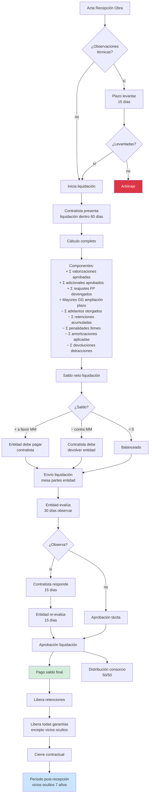

# 44 · Liquidación final con entidad

★ Cierre formal contrato. Art 211 RLGCP · 60 días post-recepción. Sin esto no devuelven retenciones · no liberan fianzas · no se cobra saldo final.

## Flujo completo liquidación



## Schema liquidación

```sql
liquidaciones_finales (
  id uuid PRIMARY KEY,
  proyecto_id uuid UNIQUE,

  -- Fechas críticas
  fecha_recepcion_obra date,
  fecha_inicio_liquidacion date,
  fecha_envio_entidad date,
  fecha_aprobacion date,
  fecha_pago_saldo date,

  -- Estado
  estado ENUM (
    'borrador',
    'en_calculo',
    'enviada',
    'observada',
    'respondiendo_observ',
    'aprobada',
    'tacitamente_aprobada',
    'pagada',
    'arbitraje',
    'cerrada'
  ),

  -- Componentes
  total_valorizaciones decimal(14,2),
  total_adicionales decimal(14,2),
  total_reajustes decimal(14,2),
  mayores_gg_ampliacion decimal(14,2),
  total_adelantos_recibidos decimal(14,2),
  total_retenciones decimal(14,2),
  total_penalidades decimal(14,2),
  total_amortizaciones decimal(14,2),
  total_detracciones_pendientes decimal(14,2),

  saldo_neto decimal(14,2),
  saldo_a_favor_contratista boolean,

  -- Documentos
  archivo_liquidacion_pdf_nas text,
  archivo_resolucion_aprobacion_pdf_nas text,
  observaciones_entidad text,

  -- Audit
  numero_resolucion_aprobacion varchar,
  monto_aprobado_final decimal(14,2),
  diferencia_propuesta_aprobada decimal(14,2),

  created_at, updated_at
)

liquidacion_detalle_partidas (
  id uuid PRIMARY KEY,
  liquidacion_id uuid,
  partida_id uuid,
  metrado_total_ejecutado decimal(14,4),
  monto_total decimal(14,2),
  observado_por_entidad boolean,
  monto_aprobado decimal(14,2)
)

distribucion_utility_final (
  id uuid PRIMARY KEY,
  liquidacion_id uuid,
  consorciado_id uuid,
  pct_participacion decimal(5,4),
  monto_correspondiente decimal(14,2),
  ajustes jsonb,                                -- préstamos pendientes etc
  monto_neto_transferir decimal(14,2),
  fecha_transferencia date
)
```

## Plazos críticos

| Plazo | Quién | Días | Base legal |
|---|---|---|---|
| Presentar liquidación | Contratista | 60 días post-recepción | Art 211.1 RLGCP |
| Observar liquidación | Entidad | 30 días desde recepción | Art 211.2 |
| Responder observaciones | Contratista | 15 días | Art 211.3 |
| Aprobar liquidación | Entidad | 15 días post-respuesta | Art 211.4 |
| Pagar saldo | Entidad | 30 días post-aprobación | Art 67 LGC |
| Aprobación tácita | — | si entidad no responde | Art 211.5 |

## Prioridad: **CRÍTICA**
