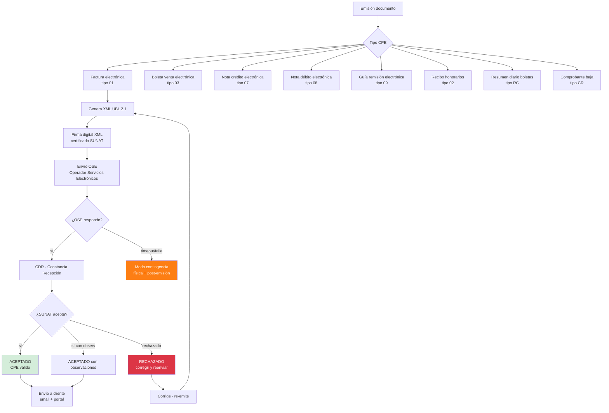
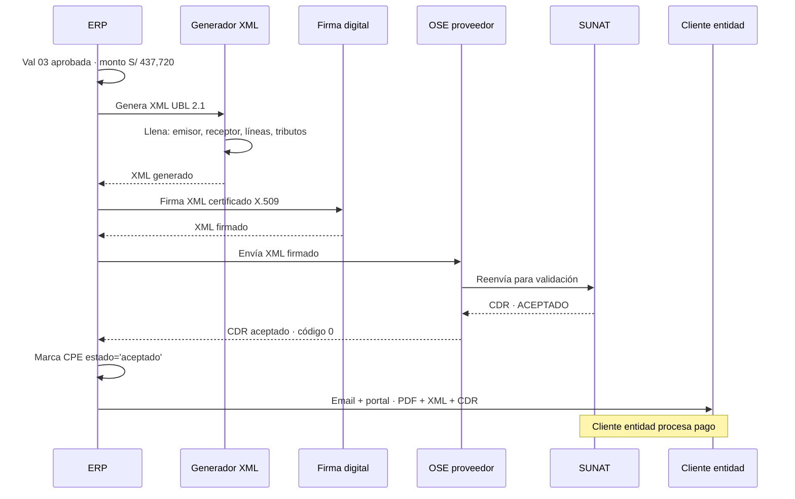
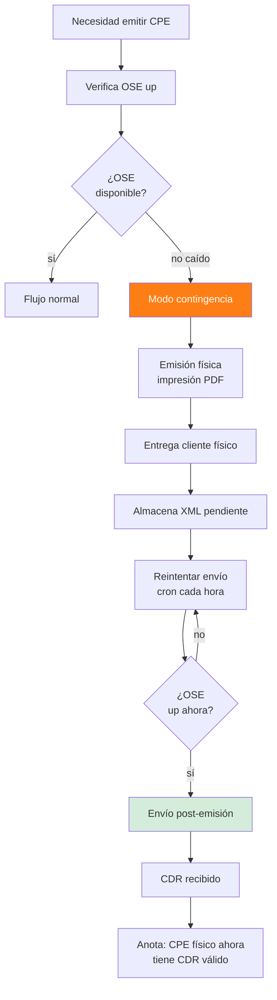

# 45 · Facturación electrónica · OSE · CDR · Contingencia

★ Compliance crítico SUNAT. CPE obligatorio · sin OSE no se puede facturar a entidad pública.

## Universo CPE Perú



## Schema CPE

```sql
cpe_documentos (
  id uuid PRIMARY KEY,
  empresa_id uuid,
  tipo ENUM ('01_factura','03_boleta','07_nc','08_nd','09_guia','02_rh','RC_resumen','CR_baja'),

  serie varchar(4),                             -- F001, B001, FF01, etc
  numero integer,                                -- correlativo
  numero_completo varchar GENERATED AS (serie || '-' || lpad(numero::text, 8, '0')) STORED,

  fecha_emision date,
  fecha_vencimiento date,

  -- Emisor (siempre nuestra empresa)
  emisor_ruc varchar(11),
  emisor_razon varchar,

  -- Receptor (cliente)
  receptor_tipo_doc varchar,                    -- '6'=RUC, '1'=DNI
  receptor_numero_doc varchar,
  receptor_razon varchar,
  receptor_direccion text,
  receptor_email varchar,

  -- Montos
  moneda char(3),
  tipo_cambio decimal(7,4),
  subtotal decimal(14,2),
  igv decimal(14,2),
  isc decimal(14,2),
  otros_tributos decimal(14,2),
  total decimal(14,2),

  -- Descuentos / cargos globales
  descuento_global decimal(14,2),
  cargo_global decimal(14,2),

  -- Detracción / retención (informativo)
  detraccion_codigo varchar(3),
  detraccion_pct decimal(5,4),
  detraccion_monto decimal(14,2),
  retencion_aplica boolean,

  -- Documentos relacionados
  documento_relacionado_id uuid,                -- NC/ND apunta a factura

  -- Vinculación obra
  proyecto_id uuid,
  valorizacion_id uuid,                         -- si factura por valorización
  oc_emitida_id uuid,                           -- si por OC

  -- XML / OSE
  xml_path text,
  xml_hash varchar(64),
  ose_proveedor varchar,                        -- 'efact','sunat','etc'
  ose_id_envio varchar,
  cdr_path text,
  cdr_codigo_respuesta varchar,
  cdr_descripcion text,
  cdr_observaciones text[],

  -- Estado
  estado_sunat ENUM (
    'borrador',
    'firmado',
    'enviado',
    'aceptado',
    'aceptado_con_observaciones',
    'rechazado',
    'anulado',
    'baja_solicitada',
    'baja_aceptada'
  ),

  -- Contingencia
  modo_contingencia boolean DEFAULT false,
  fecha_emision_real date,                       -- si físico primero
  fecha_envio_post date,

  -- Anulación / baja
  motivo_baja text,
  fecha_baja date,

  created_at, updated_at,
  emitido_por uuid
)

cpe_lineas (
  id uuid PRIMARY KEY,
  cpe_id uuid REFERENCES cpe_documentos,
  numero_orden int,

  codigo_item varchar,
  descripcion text,
  unidad_medida varchar,
  cantidad decimal(14,4),

  valor_unitario decimal(14,4),                  -- sin IGV
  precio_unitario decimal(14,4),                 -- con IGV

  descuento decimal(14,2),
  valor_venta decimal(14,2),
  igv decimal(14,2),
  total_linea decimal(14,2),

  -- Tributos línea
  tipo_afectacion_igv varchar,                  -- '10' gravado, '20' exonerado, etc
  codigo_tributo varchar
)

-- Resumen diario boletas
cpe_resumenes_diarios (
  id uuid PRIMARY KEY,
  empresa_id uuid,
  fecha_referencia date,
  numero_resumen integer,
  serie varchar DEFAULT 'RC',

  total_boletas int,
  total_monto decimal(14,2),
  total_igv decimal(14,2),

  xml_path text,
  ose_id_envio varchar,
  estado varchar
)

-- Comunicaciones de baja
cpe_comunicaciones_baja (
  id uuid PRIMARY KEY,
  empresa_id uuid,
  fecha_emision date,
  numero_comunicacion integer,
  serie varchar DEFAULT 'CR',

  cpes_a_dar_baja uuid[],
  motivos jsonb,                                -- [{cpe_id, motivo, codigo}]

  xml_path text,
  ose_id_envio varchar,
  estado varchar
)
```

## Flujo emisión factura por valorización



## Modo contingencia · OSE caído



## Validaciones críticas

```sql
-- Correlativo único por serie
CREATE UNIQUE INDEX uq_cpe_correlativo
  ON cpe_documentos (empresa_id, tipo, serie, numero);

-- Sin huecos en numeración
CREATE FUNCTION validar_correlativo_secuencial()
RETURNS trigger AS $$
DECLARE v_max int;
BEGIN
  SELECT COALESCE(MAX(numero), 0) INTO v_max
  FROM cpe_documentos
  WHERE empresa_id = NEW.empresa_id
    AND tipo = NEW.tipo
    AND serie = NEW.serie;

  IF NEW.numero != (v_max + 1) THEN
    RAISE EXCEPTION 'Correlativo % no consecutivo · esperado %', NEW.numero, v_max + 1;
  END IF;
  RETURN NEW;
END $$;

-- IGV cuadre
CREATE FUNCTION validar_igv_cuadre()
RETURNS trigger AS $$
DECLARE v_igv_calc decimal;
BEGIN
  SELECT SUM(igv) INTO v_igv_calc FROM cpe_lineas WHERE cpe_id = NEW.id;
  IF ABS(v_igv_calc - NEW.igv) > 0.01 THEN
    RAISE EXCEPTION 'IGV cabecera % ≠ Σ líneas %', NEW.igv, v_igv_calc;
  END IF;
  RETURN NEW;
END $$;
```

## OSE proveedores Perú

```
Recomendados:
  - eFact / eFactPRO
  - Nubefact
  - Pagofact
  - Bizlinks
  - SUNAT Operador (gratis básico)

Costo: S/ 0.30-0.80 por CPE emitido

Integración:
  - REST API
  - SOAP (legacy)
  - SFTP batch
```

## Prioridad: **CRÍTICA**
