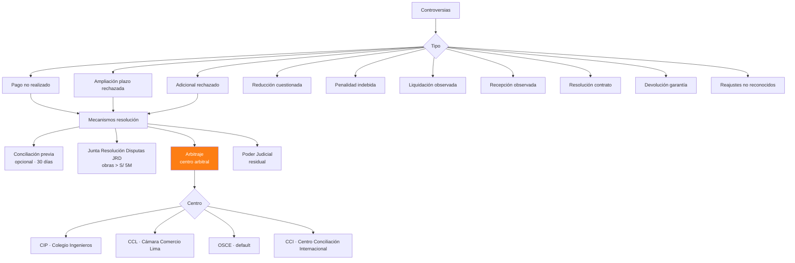

# 46 · Arbitraje + Controversias + Plazos caducidad

★ Crítico. Perder plazo = perder plata para siempre. Caducidad legal sin reversa.

## Tipología controversias obras públicas



## Plazos caducidad CRÍTICOS (Ley 32069)

| Evento controvertible | Plazo solicitar arbitraje | Base legal |
|---|---|---|
| Resolución modificación contractual | 30 días desde notificación | Art 84.5 LGC |
| Pago reclamado | 30 días desde reclamo desestimado | Art 84.6 |
| Liquidación observada | 30 días desde observación | Art 84.7 |
| Aplicación penalidad | 30 días desde notif | Art 84.8 |
| Resolución contrato | 30 días desde notif | Art 84.9 |
| Recepción observaciones | 30 días | Art 84.10 |
| Devolución garantías | 30 días desde rechazo | Art 84.11 |

**Si pierdes plazo: pretensión caduca · NO se puede reclamar nunca más.**

## Schema controversias

```sql
controversias (
  id uuid PRIMARY KEY,
  proyecto_id uuid,
  numero_caso varchar UNIQUE,                   -- 'CTRL-2026-001'

  -- Tipo
  tipo ENUM (
    'pago_no_realizado',
    'ampliacion_plazo_rechazada',
    'adicional_rechazado',
    'reduccion_cuestionada',
    'penalidad_indebida',
    'liquidacion_observada',
    'recepcion_observada',
    'resolucion_contrato',
    'devolucion_garantia',
    'reajustes_no_reconocidos',
    'otra'
  ),

  -- Origen
  fecha_evento_origen date,
  evento_disparador text,
  resolucion_origen varchar,                    -- "Res 045-2026 GAF-MSS"
  archivo_resolucion_pdf_nas text,

  -- Plazos críticos
  fecha_notificacion date,                      -- ★ inicio cómputo plazo
  fecha_caducidad_solicitud_arbitraje date,    -- ★ deadline absoluto
  dias_restantes integer GENERATED AS
    (fecha_caducidad_solicitud_arbitraje - CURRENT_DATE) STORED,

  alerta_caducidad_activa boolean,

  -- Monto disputa
  monto_pretendido decimal(14,2),
  monto_aceptado decimal(14,2),
  monto_diferencia decimal(14,2),

  -- Mecanismo
  mecanismo_elegido ENUM (
    'reclamo_administrativo',
    'conciliacion',
    'jrd',
    'arbitraje_cip',
    'arbitraje_ccl',
    'arbitraje_osce',
    'poder_judicial'
  ),

  -- Centro arbitral
  centro_arbitral varchar,
  arbitros jsonb,                               -- [{nombre, rol, etc}]

  -- Estado
  estado ENUM (
    'identificada',
    'evaluando_acciones',
    'reclamo_administrativo_enviado',
    'conciliacion_en_curso',
    'arbitraje_solicitado',
    'arbitraje_admitido',
    'instalacion_tribunal',
    'fase_postulatoria',
    'fase_probatoria',
    'fase_alegatos',
    'laudo_emitido',
    'recurso_anulacion',
    'ejecutado_favor',
    'ejecutado_contra',
    'transada',
    'caducada_por_omision'                      -- ⚠️ pérdida total
  ),

  -- Documentos
  archivos_proceso_nas text[],
  laudo_pdf_nas text,
  fecha_laudo date,
  decision_laudo text,
  monto_laudo decimal(14,2),

  -- Costos
  costo_arbitraje_estimado decimal(14,2),
  costo_arbitraje_real decimal(14,2),
  abogado_externo varchar,
  honorarios_abogado decimal(14,2),

  -- Provisión contable
  provision_contable decimal(14,2),
  asiento_provision_id uuid,

  responsable_legal_id uuid,
  created_at, updated_at
)

controversias_eventos (
  id uuid PRIMARY KEY,
  controversia_id uuid,
  fecha date,
  tipo_evento varchar,                          -- 'reclamo_enviado','laudo_recibido', etc
  descripcion text,
  documento_nas text,
  user_id uuid
)
```

## Auto-detección caducidades

```sql
-- Cron diario · alertas caducidad
CREATE FUNCTION detectar_proximas_caducidades()
RETURNS void AS $$
BEGIN
  -- 30 días para caducar
  INSERT INTO alertas_activas (tipo_codigo, entity_type, entity_id, severidad, detalles)
  SELECT
    'controversia_caduca_30d',
    'controversia',
    c.id,
    'alta',
    jsonb_build_object('dias_restantes', c.dias_restantes,
                       'monto_disputa', c.monto_pretendido)
  FROM controversias c
  WHERE c.dias_restantes BETWEEN 25 AND 30
    AND c.estado IN ('identificada','evaluando_acciones');

  -- 7 días para caducar
  INSERT INTO alertas_activas (tipo_codigo, entity_type, entity_id, severidad, detalles)
  SELECT
    'controversia_caduca_7d',
    'controversia',
    c.id,
    'critica',
    jsonb_build_object('dias_restantes', c.dias_restantes)
  FROM controversias c
  WHERE c.dias_restantes BETWEEN 1 AND 7
    AND c.estado IN ('identificada','evaluando_acciones');

  -- Caducó · pérdida total
  UPDATE controversias
  SET estado = 'caducada_por_omision'
  WHERE dias_restantes < 0
    AND estado IN ('identificada','evaluando_acciones');
END $$;
```

## Provisión contable

```sql
-- Provisión según probabilidad ganar
CREATE FUNCTION provisionar_controversia(p_id uuid, p_probabilidad_perder decimal)
RETURNS void AS $$
BEGIN
  -- Si probabilidad perder > 50% · provisionar
  IF p_probabilidad_perder > 0.50 THEN
    INSERT INTO asientos (...)
    VALUES (
      'PROV-CONTR-' || p_id,
      now(), 'Provisión controversia · contingencia perder',
      'controversia', p_id
    );
    INSERT INTO asientos_lineas (asiento_id, cuenta, debe, haber)
    VALUES
      (..., '654', monto_disputa * p_probabilidad_perder, 0),  -- gasto
      (..., '486', 0, monto_disputa * p_probabilidad_perder);  -- pasivo contingente
  END IF;
END $$;
```

## Prioridad: **CRÍTICA**
