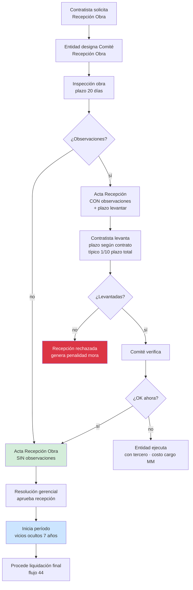
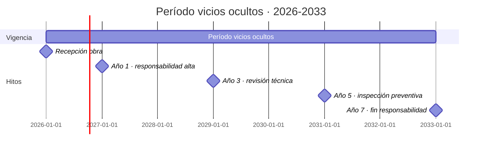

# 47 · Recepción obra + Vicios ocultos 7 años

★ Cláusula 14 contrato + Art 69 LGC + Art 216 RLGCP. Garantía vicios ocultos 7 años post-recepción · obligación post-cierre.

## Flujo recepción obra



## Período vicios ocultos · 7 años



```
Cobertura legal:
  Art 69 Ley 32069
  Art 216 RLGCP
  Art 1497 Código Civil

Plazo: 7 años post-recepción

Vicios ocultos = defectos NO visibles al recibir
  Ejemplos:
    - Estructuras agrietan al año
    - Filtraciones aparecen lluvia siguiente
    - Asentamientos diferenciales
    - Instalaciones eléctricas falla años después
    - Acabados se desprenden con tiempo

Responsabilidad:
  Contratista responde por defectos imputables a su trabajo
  NO responde por uso indebido o falta mantenimiento
```

## Schema vicios ocultos

```sql
recepcion_obras (
  id uuid PRIMARY KEY,
  proyecto_id uuid UNIQUE,

  -- Solicitud
  fecha_solicitud_recepcion date,
  fecha_designacion_comite date,
  comite_miembros jsonb,

  -- Inspección
  fecha_inspeccion date,
  tiene_observaciones boolean,

  -- Acta
  fecha_acta_recepcion date,
  archivo_acta_pdf_nas text,
  numero_resolucion_aprobacion varchar,

  -- Vicios ocultos
  fecha_inicio_vicios_ocultos date,
  fecha_fin_vicios_ocultos date GENERATED AS
    (fecha_inicio_vicios_ocultos + INTERVAL '7 years') STORED,

  garantia_vicios_id uuid REFERENCES garantias,

  estado ENUM (
    'solicitada',
    'comite_designado',
    'inspeccion_realizada',
    'observada',
    'levantando_observaciones',
    'recepcionada',
    'periodo_vicios_ocultos',
    'periodo_vicios_terminado'
  )
)

recepcion_observaciones (
  id uuid PRIMARY KEY,
  recepcion_id uuid REFERENCES recepcion_obras,
  numero varchar,
  partida_id uuid,
  descripcion text,
  fecha_observacion date,
  fecha_limite_levantar date,
  fecha_levantamiento date,
  estado ENUM ('abierta','levantada','no_levantada','en_disputa'),
  evidencia_levantamiento_nas text,
  monto_costo_levantar decimal(14,2)
)

-- Reclamos vicios ocultos · post-recepción
vicios_ocultos_reclamos (
  id uuid PRIMARY KEY,
  proyecto_id uuid,
  numero varchar UNIQUE,                        -- VO-2027-001

  fecha_reclamo date,
  fecha_aparicion_defecto date,
  reportado_por varchar,                        -- usualmente entidad

  ubicacion_obra text,
  partida_relacionada_id uuid,
  descripcion_defecto text,
  fotos_nas text[],

  -- Evaluación
  inspeccion_tecnica_realizada boolean,
  fecha_inspeccion date,
  causa_probable text,
  imputable_contratista boolean,                -- key decisión
  motivo_evaluacion text,

  -- Reparación
  monto_reparacion_estimado decimal(14,2),
  monto_reparacion_real decimal(14,2),
  fecha_reparacion date,
  archivo_reparacion_pdf_nas text,

  -- Estado
  estado ENUM (
    'reclamado',
    'en_evaluacion',
    'aceptado',
    'rechazado_no_imputable',
    'reparado',
    'arbitraje',
    'cerrado'
  ),

  -- Si genera controversia
  controversia_id uuid REFERENCES controversias,

  responsable_atencion_id uuid,
  fecha_cierre date
)

-- Mantenimientos preventivos sugeridos
vicios_mantenimientos_preventivos (
  id uuid PRIMARY KEY,
  proyecto_id uuid,
  fecha_programada date,
  tipo varchar,                                  -- 'inspeccion_anual','revision_3_anos'
  alcance text,
  costo_estimado decimal(14,2),
  realizado boolean,
  fecha_realizado date,
  hallazgos text
)
```

## Alertas durante período vicios

```sql
-- Cron diario
INSERT INTO alertas_activas (tipo_codigo, entity_type, entity_id)
SELECT 'inspeccion_preventiva_vencida', 'recepcion_obra', r.id
FROM recepcion_obras r
WHERE r.estado = 'periodo_vicios_ocultos'
  AND CURRENT_DATE > (r.fecha_inicio_vicios_ocultos + INTERVAL '1 year')
  AND NOT EXISTS (
    SELECT 1 FROM vicios_mantenimientos_preventivos
    WHERE proyecto_id = r.proyecto_id
      AND realizado = true
      AND fecha_realizado >= r.fecha_inicio_vicios_ocultos + INTERVAL '11 months'
  );
```

## Reportes

```
1. Obras en período vicios
   Lista · año del período · próxima inspección

2. Reclamos vicios activos
   Estado · monto · imputabilidad

3. Costo histórico vicios
   Por proyecto · provisión vs real

4. Próximas terminaciones período
   Liberación final responsabilidad
```

## KPIs

| KPI | Target |
|---|---|
| Recepciones sin observaciones | > 70% |
| Reclamos vicios anuales | < 2 por obra |
| Imputabilidad reclamos | < 50% |
| Costo reparación / monto obra | < 0.5% |

## Prioridad: **CRÍTICA · post-cierre**
