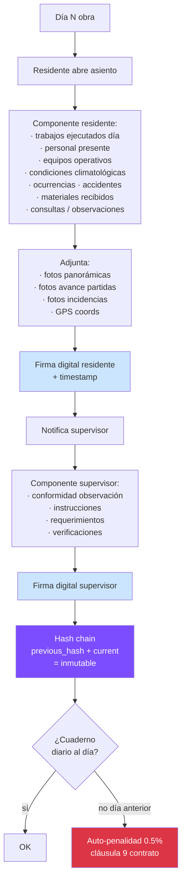

# 48 · Cuaderno de obra digital · Robusto

★ Cláusula 5 contrato + penalidad 0.5% si no actualizado. Source of truth legal para arbitraje.

## Estructura asiento diario



## Schema cuaderno

```sql
cuaderno_obra (
  id uuid PRIMARY KEY,
  proyecto_id uuid,
  numero_asiento integer,                       -- correlativo
  fecha date,

  -- ASIENTO RESIDENTE
  trabajos_ejecutados text,
  personal_dia jsonb,                           -- [{categoria, count}]
  personal_total int,
  equipos_operativos jsonb,
  condiciones_climatologicas varchar,
  temperatura_max decimal(4,1),
  temperatura_min decimal(4,1),

  ocurrencias text,
  accidentes_incidentes text,
  materiales_recibidos jsonb,
  consultas_supervisor text,
  observaciones_residente text,

  fotos_panoramicas_nas text[],
  fotos_partidas_nas text[],
  fotos_incidencias_nas text[],
  videos_nas text[],

  gps_coords point,

  firma_residente_at timestamp,
  firma_residente_user_id uuid,
  firma_residente_signature_hash varchar(64),

  -- ASIENTO SUPERVISOR
  conformidad_supervisor text,
  observaciones_supervisor text,
  instrucciones_supervisor text,
  requerimientos_supervisor text,
  verificaciones_realizadas jsonb,

  firma_supervisor_at timestamp,
  firma_supervisor_user_id uuid,
  firma_supervisor_signature_hash varchar(64),

  -- HASH CHAIN · inmutabilidad
  previous_hash varchar(64),                     -- hash asiento anterior
  current_hash varchar(64) GENERATED ALWAYS AS (
    encode(sha256(
      (id::text || numero_asiento::text || fecha::text ||
       coalesce(trabajos_ejecutados,'') ||
       coalesce(firma_residente_signature_hash,'') ||
       coalesce(firma_supervisor_signature_hash,'') ||
       coalesce(previous_hash,''))::bytea
    ), 'hex')
  ) STORED,

  -- SEACE Pladicop
  enviado_seace boolean DEFAULT false,
  fecha_envio_seace timestamp,
  cdr_seace varchar,

  -- Estado
  estado ENUM (
    'borrador_residente',
    'firmado_residente',
    'pendiente_supervisor',
    'observado_supervisor',
    'firmado_supervisor',
    'cerrado',
    'observado_post_cierre'
  ),

  created_at, updated_at
)

CREATE UNIQUE INDEX uq_cuaderno_proyecto_dia
  ON cuaderno_obra (proyecto_id, fecha);

CREATE UNIQUE INDEX uq_cuaderno_proyecto_numero
  ON cuaderno_obra (proyecto_id, numero_asiento);
```

## Inmutabilidad post-firma

```sql
-- Trigger · no modificar post-firma supervisor
CREATE FUNCTION proteger_asiento_firmado()
RETURNS trigger AS $$
BEGIN
  IF OLD.firma_supervisor_at IS NOT NULL
     AND OLD.estado = 'firmado_supervisor'
     AND TG_OP = 'UPDATE' THEN

    -- Solo permite cambio estado a 'cerrado' u 'observado_post_cierre'
    IF NEW.estado NOT IN ('cerrado','observado_post_cierre') THEN
      RAISE EXCEPTION 'Asiento firmado por supervisor · inmutable';
    END IF;

    -- Y solo cambian campos de estado, no datos
    IF NEW.trabajos_ejecutados != OLD.trabajos_ejecutados OR
       NEW.firma_residente_signature_hash != OLD.firma_residente_signature_hash THEN
      RAISE EXCEPTION 'Datos asiento firmado · inmutable';
    END IF;
  END IF;

  RETURN NEW;
END $$;

-- Verificación chain
CREATE FUNCTION verificar_chain_cuaderno(p_proyecto_id uuid)
RETURNS TABLE (broken_at_asiento int) AS $$
  WITH ordered AS (
    SELECT *, LAG(current_hash) OVER (ORDER BY numero_asiento) AS expected_prev
    FROM cuaderno_obra
    WHERE proyecto_id = p_proyecto_id
  )
  SELECT numero_asiento FROM ordered
  WHERE numero_asiento > 1
    AND previous_hash IS DISTINCT FROM expected_prev;
$$ LANGUAGE sql;
```

## Penalidad automática · día sin asiento

```sql
-- Cron diario detección
INSERT INTO penalidades_aplicadas (proyecto_id, tipo, monto, justificacion)
SELECT
  p.id,
  'cuaderno_obra_no_actualizado',
  monto_valorizacion_mes(p.id) * 0.005,         -- 0.5%
  format('Cuaderno obra día % sin firmar residente', CURRENT_DATE - 1)
FROM proyectos p
WHERE p.status = 'ejecucion'
  AND NOT EXISTS (
    SELECT 1 FROM cuaderno_obra
    WHERE proyecto_id = p.id
      AND fecha = CURRENT_DATE - 1
      AND firma_residente_at IS NOT NULL
  );
```

## App móvil cuaderno

```typescript
// Captura completa día
async function asentarCuadernoDia() {
  const asiento = {
    fecha: new Date(),
    trabajos: await capturarTexto(),
    personal: await contarTareo(),
    equipos: await listarEquipos(),
    fotos_panoramicas: await capturarFotos(2, 'panoramica'),
    fotos_partidas: await capturarFotos(8, 'partida'),
    gps: await getGPS(),
    clima: await consultarClimaAPI()
  };

  // Genera hash signature residente
  asiento.firma_residente_signature = await firmarLocal(asiento);

  // Push (offline-friendly · queue si sin red)
  await api.cuaderno.crear(asiento);
}
```

## KPIs

| KPI | Target |
|---|---|
| Asientos diarios firmados | 100% días obra |
| Tiempo promedio firma supervisor | < 24h post-residente |
| Asientos con fotos completas | 100% |
| Días penalidad aplicada | 0 |
| Verificación chain íntegra | 100% |

## Prioridad: **CRÍTICA**
