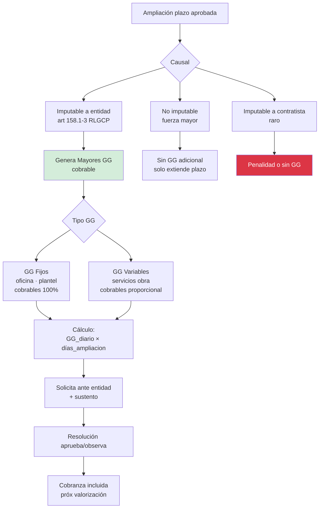

# 49 · Mayores Gastos Generales por ampliación de plazo

★ Cobranza adicional cuando ampliación es imputable a entidad. Art 168 RLGCP. Sin esto pierdes plata real.

## Concepto

```
Cuando entidad otorga ampliación plazo POR CAUSAL IMPUTABLE A ELLA
(falta predio · pago tardío · adicional aprobado tarde · etc):

Contratista TIENE DERECHO a cobrar GG por días extra
porque mantiene oficina · plantel · equipos durante esos días extra
sin generar producción adicional

Cálculo:
  Mayores GG = GG diario contractual × días ampliación

donde GG diario = (CD × pct_GG) / plazo_contractual_original
```

## Tipos ampliación según GG



## Ejemplo numérico PG0005

```
Datos contrato:
  Costo Directo:                       S/ 1,319,122.00
  GG (10%):                            S/   131,912.20
  Plazo contractual:                   120 días
  GG diario teórico = 131,912 / 120 =  S/    1,099.27

Caso: Ampliación plazo 30 días aprobada
      Causal: Demora entidad en entrega predio (imputable)

Mayores GG cobrables:
  = 30 días × S/ 1,099.27
  = S/ 32,978.05

Resolución entidad:
  Aprueba mayores GG por S/ 32,978.05
  + IGV 18%:                            S/  5,936.05
  Total cobrable:                       S/ 38,914.10

Se incluye en valorización siguiente como concepto adicional
```

## Schema mayores GG

```sql
mayores_gg_solicitudes (
  id uuid PRIMARY KEY,
  proyecto_id uuid,
  numero varchar UNIQUE,                        -- 'MGG-2026-001'

  -- Vinculación
  ampliacion_plazo_id uuid REFERENCES cambios_contractuales,
  causal_legal varchar,                          -- art 158.1, 158.2, 158.3
  imputable_entidad boolean,

  -- Cálculo
  dias_ampliacion integer,
  costo_directo_referencial decimal(14,2),
  pct_gg_contractual decimal(5,4),
  plazo_contractual_original integer,
  gg_diario_calculado decimal(14,4),
  monto_mayores_gg_solicitado decimal(14,2),

  -- Distribución GG fijos / variables
  monto_gg_fijo decimal(14,2),
  monto_gg_variable decimal(14,2),

  -- Sustento
  fecha_solicitud date,
  archivo_solicitud_pdf_nas text,
  archivo_sustento_pdf_nas text,                -- detalle gastos reales período

  -- Aprobación
  fecha_envio_entidad date,
  fecha_resolucion date,
  numero_resolucion varchar,
  monto_aprobado decimal(14,2),
  motivo_observacion text,

  estado ENUM (
    'borrador',
    'enviado_entidad',
    'observado',
    'aprobado',
    'aprobado_parcial',
    'rechazado',
    'arbitraje',
    'cobrado'
  ),

  -- Cobranza
  valorizacion_cobro_id uuid,
  fecha_cobro date,

  created_at, updated_at
)
```

## Sustento técnico requerido

```
Para que entidad apruebe Mayores GG · sustento OBLIGATORIO:

1. Detalle gastos reales período ampliación:
   - Planilla plantel central proporcional
   - Alquileres oficina · luz · agua · internet
   - Servicios contratados durante período
   - Transporte · combustible administrativo
   - Comunicaciones
   - Útiles oficina

2. Comparativo:
   - GG mensual normal vs mes ampliación

3. Justificación que esos gastos fueron INDISPENSABLES
   - No pudo prescindir aunque obra parada
   - Compromisos contractuales con personal/proveedores
```

## Validaciones

```sql
-- Solo si ampliación imputable entidad
CREATE FUNCTION validar_mayores_gg_procedente()
RETURNS trigger AS $$
DECLARE v_amp record;
BEGIN
  SELECT * INTO v_amp FROM cambios_contractuales
    WHERE id = NEW.ampliacion_plazo_id;

  IF v_amp.tipo != 'ampliacion_plazo' THEN
    RAISE EXCEPTION 'Mayores GG solo aplica a ampliación plazo';
  END IF;

  IF NOT v_amp.causal_art_158 IN ('demora_entidad','adicional_demora','reclamo_inerte') THEN
    RAISE EXCEPTION 'Causal % no genera derecho mayores GG', v_amp.causal_art_158;
  END IF;

  IF v_amp.estado NOT IN ('aprobado_entidad','aprobado_tacita') THEN
    RAISE EXCEPTION 'Ampliación debe estar aprobada antes solicitar mayores GG';
  END IF;

  RETURN NEW;
END $$;

-- Tope · no excede % razonable
CREATE FUNCTION validar_tope_mayores_gg()
RETURNS trigger AS $$
DECLARE v_pct decimal;
BEGIN
  v_pct := NEW.monto_mayores_gg_solicitado / (
    SELECT monto_contractual FROM proyectos WHERE id = NEW.proyecto_id
  );

  IF v_pct > 0.05 THEN  -- 5% del contrato es alerta
    NEW.requiere_aprobacion_directorio := true;
  END IF;
  RETURN NEW;
END $$;
```

## KPIs

| KPI | Target |
|---|---|
| % ampliaciones con mayores GG cobrados | 100% imputables entidad |
| Tiempo entre ampliación y cobro | < 60 días |
| % aprobado vs solicitado | > 80% |
| Mayores GG cobrados / utility | > 5% si hubo ampliaciones |

## Prioridad: **ALTA**
