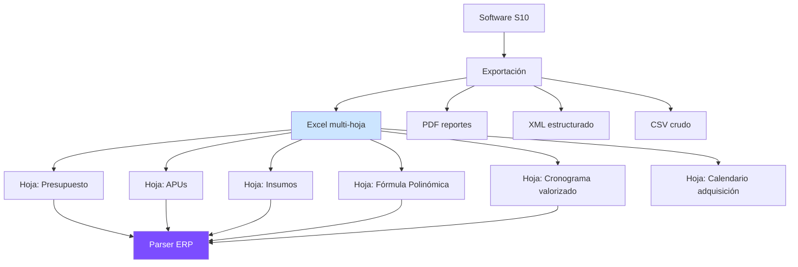
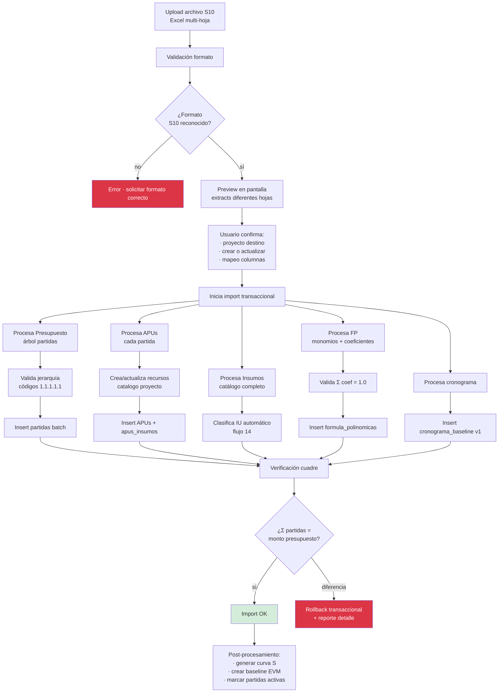

# 50 · Importador masivo S10

★ Sin esto MVP no arranca. 80% presupuestos en Perú salen de S10. Cargar 549 partidas a mano = inviable.

## Software S10 · contexto

```
S10 = Software estándar Perú obras
  - 95% obras públicas
  - Genera presupuestos · APUs · cronograma · curva S
  - Output: archivo .S10 (propietario) o exportación Excel/PDF
  - Estructura: hoja Presupuesto + APUs + Insumos + Fórmula Polinómica

ERP debe importar:
  - Presupuesto desagregado completo (árbol partidas)
  - APUs (análisis costos unitarios)
  - Insumos (catálogo materiales/MO/equipos del proyecto)
  - Fórmula polinómica
  - Resumen presupuesto (CD, GG, Util, IGV)
  - Cronograma valorizado
  - Calendario adquisiciones
```

## Formatos típicos S10 export



## Flujo importación



## Estructura típica Excel S10

### Hoja Presupuesto

```
Item        Descripción                 Und  Metrado  Precio    Parcial    Subtotal  Total
01          OBRAS PROVISIONALES                                                       81,795.78
01.01       OBRAS PROVISIONALES                                              27,586.71
01.01.01    CONSTRUCCIONES PROVISIONALES                                     17,386.71
01.01.01.01 CARTEL IDENTIFICACIÓN OBRA  und  1.00     735.46    735.46
01.01.01.02 CERCO PERIMETRICO MALLA      m    48.86   8.23      402.12
...
```

### Hoja APU (uno por partida hoja)

```
APU 01.01.01.02  CERCO PERIMETRICO MALLA  Und: m  Rendimiento: 25.00 m/dia

Cuadrilla     1.00 Capataz · 1.00 Peón
              hh: 0.32 + 0.32 = 0.64

Insumos:
  Mat 01      Malla raschell           m²    1.05  3.50    3.68
  Mat 02      Listón madera            und   0.80  4.50    3.60
  MO 01       Capataz                  hh    0.32  18.50   5.92
  MO 02       Peón                     hh    0.32  14.20   4.54
  Equip 01    Herramientas manuales    %     5.00  ...     0.50
              Total                                        18.24
```

### Hoja Fórmula Polinómica

```
K = 0.45·a + 0.35·b + 0.05·c + 0.10·d + 0.05·e

Monomio   Coef     Composición IU                   Peso
a 0.4500  Materiales:
                   IU 21 Cemento                    0.30
                   IU 02 Acero                      0.25
                   IU 04 Ladrillo                   0.15
                   IU 38 Hormigón                   0.30
b 0.3500  Mano obra:
                   IU 47 Mano obra                  1.00
c 0.0500  Combustibles:
                   IU 77 Diesel                     1.00
d 0.1000  Equipos:
                   IU 48 Maquinaria                 1.00
e 0.0500  Otros:
                   IU 39 Índice general             1.00
```

## Parser código (TypeScript)

```typescript
import * as XLSX from 'xlsx';

interface S10ImportResult {
  proyecto: ProyectoData;
  partidas: PartidaData[];
  apus: APUData[];
  insumos: InsumoData[];
  formulaPolinomica: FormulaPolinomicaData;
  cronograma: CronogramaData[];
  errors: string[];
}

async function importarS10(file: Buffer): Promise<S10ImportResult> {
  const workbook = XLSX.read(file);
  const result: S10ImportResult = { ...initial, errors: [] };

  // Hoja Presupuesto
  const sheetPres = workbook.Sheets['Presupuesto'] || workbook.Sheets['SP1'];
  const partidas = parsePartidasFromS10(sheetPres);
  result.partidas = construirJerarquia(partidas);

  // Hojas APU (múltiples · una por partida)
  for (const sheetName of workbook.SheetNames) {
    if (sheetName.startsWith('APU') || sheetName.match(/^\d+\.\d+/)) {
      const apu = parseAPU(workbook.Sheets[sheetName]);
      result.apus.push(apu);
    }
  }

  // Hoja Insumos
  const sheetIns = workbook.Sheets['Insumos'] || workbook.Sheets['Recursos'];
  result.insumos = parseInsumos(sheetIns);

  // Hoja FP
  const sheetFP = workbook.Sheets['Formula Polinomica'] || workbook.Sheets['FP'];
  result.formulaPolinomica = parseFP(sheetFP);

  // Validaciones
  result.errors = validateImport(result);

  return result;
}

function parsePartidasFromS10(sheet: XLSX.WorkSheet): RawPartida[] {
  const rows = XLSX.utils.sheet_to_json(sheet, { header: 1 }) as any[][];
  const partidas: RawPartida[] = [];

  for (const row of rows) {
    const codigo = String(row[0] || '').trim();
    if (!codigo.match(/^\d+(\.\d+)*$/)) continue;

    partidas.push({
      codigo,
      nivel: codigo.split('.').length,
      descripcion: String(row[1] || '').trim(),
      unidad: String(row[3] || '').trim(),
      metrado: parseFloat(row[4]) || 0,
      precio_unitario: parseFloat(row[5]) || 0,
      parcial: parseFloat(row[6]) || 0,
      es_titulo: !row[3] || !row[4]  // sin unidad ni metrado = título
    });
  }

  return partidas;
}

function construirJerarquia(raw: RawPartida[]): PartidaData[] {
  return raw.map(p => ({
    ...p,
    parent_codigo: p.codigo.includes('.')
      ? p.codigo.substring(0, p.codigo.lastIndexOf('.'))
      : null,
    is_summary: p.es_titulo
  }));
}
```

## Schema importación

```sql
imports_s10 (
  id uuid PRIMARY KEY,
  proyecto_id uuid,
  archivo_path text,
  archivo_hash varchar(64),

  fecha_import timestamp,
  user_id uuid,

  estado ENUM ('procesando','exitoso','fallido','revertido'),

  partidas_importadas int,
  apus_importadas int,
  insumos_importados int,
  errors_log jsonb,
  warnings_log jsonb,

  monto_total_calculado decimal(14,2),
  monto_referencia_excel decimal(14,2),
  diferencia decimal(14,2),

  duracion_ms int
)

-- Mapeo recursos S10 → catálogo ERP
mapeo_recursos_s10 (
  id uuid PRIMARY KEY,
  codigo_s10 varchar,                            -- 'CEM-001'
  descripcion_s10 text,
  recurso_id uuid REFERENCES recursos,           -- mapeo confirmado
  iu_codigo varchar(3),
  confianza decimal(3,2),
  origen varchar                                  -- 'auto','manual','ml'
)
```

## Validaciones

```sql
CREATE FUNCTION validar_import_s10(p_import_id uuid)
RETURNS TABLE (es_valido boolean, errores text[]) AS $$
DECLARE v_errores text[] := '{}';
BEGIN
  -- 1. Σ partidas hoja = monto referencia Excel
  IF (SELECT diferencia FROM imports_s10 WHERE id = p_import_id) > 1.0 THEN
    v_errores := array_append(v_errores, 'Σ partidas no cuadra con presupuesto Excel');
  END IF;

  -- 2. Coeficientes FP suman 1.0
  IF (SELECT SUM(coeficiente) FROM formula_monomios
      WHERE formula_id IN (SELECT id FROM formulas_polinomicas WHERE proyecto_id = ...))
     != 1.0 THEN
    v_errores := array_append(v_errores, 'Σ coeficientes FP ≠ 1.0');
  END IF;

  -- 3. Toda partida hoja tiene APU si no es título
  IF EXISTS (
    SELECT 1 FROM partidas p
    LEFT JOIN apus a ON a.partida_id = p.id
    WHERE p.proyecto_id = ... AND NOT p.is_summary AND a.id IS NULL
  ) THEN
    v_errores := array_append(v_errores, 'Partidas sin APU asignado');
  END IF;

  RETURN QUERY SELECT array_length(v_errores,1) IS NULL, v_errores;
END $$;
```

## UI import

```
Pantalla import S10:
  1. Drag & drop archivo .xlsx
  2. Preview · muestra qué hojas detectó
  3. Mapeo columnas si nombres no estándar
  4. Selección proyecto destino · nuevo o actualizar
  5. Botón "Importar"
  6. Progreso · spinner + log
  7. Resultado · OK con conteos · o errores
  8. Si errores · permitir descargar reporte detallado
```

## Prioridad: **CRÍTICA · MVP**
